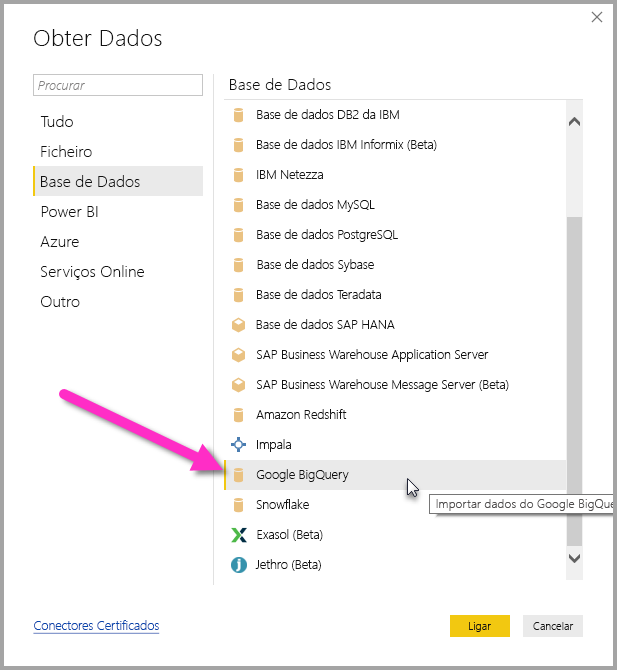
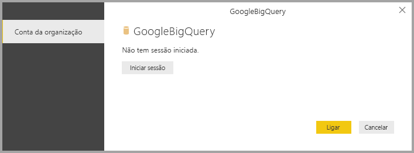
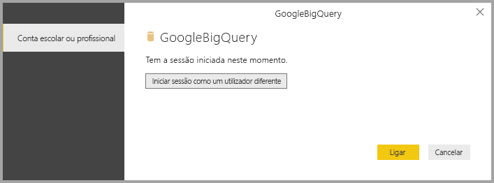
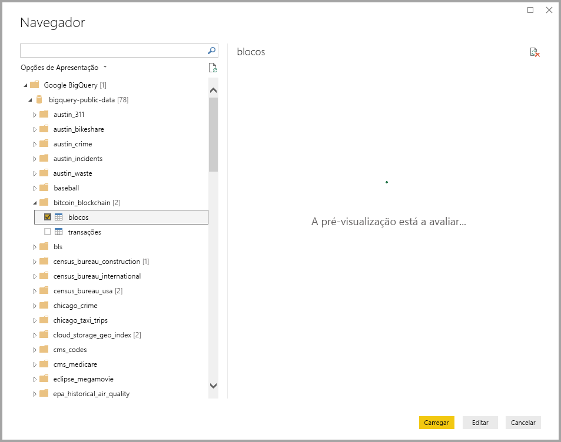

# <a name="connect-to-a-google-bigquery-database-in-power-bi-desktop"></a>Ligar a uma base de dados Google BigQuery no Power BI Desktop
No Power BI Desktop, pode ligar a uma base de dados Google **BigQuery** e utilizar os dados subjacentes, tal como faria com outra origem de dados no Power BI Desktop.

## <a name="connect-to-google-bigquery"></a>Ligar ao Google BigQuery
Para ligar a uma base de dados **Google BigQuery**, selecione **Obter Dados** no friso **Base** do Power BI Desktop. Selecione **Base de Dados** nas categorias no lado esquerdo e verá **Google BigQuery**.



Na janela do **Google BigQuery** que aparece, inicie sessão na sua conta do Google BigQuery e selecione **Ligar**.



Quando iniciar sessão, verá a seguinte janela a indicar que foi autenticado. 



Depois de a ligação ser concluída com êxito, é apresentada uma janela **Navegador**, que apresenta os dados disponíveis no servidor, dos quais pode selecionar um ou vários elementos para importar e utilizar no **Power BI Desktop**.



## <a name="considerations-and-limitations"></a>Considerações e Limitações
Existem alguns limites e aspetos a ter em conta com o conector do **Google BigQuery**:

* O conector do Google BigQuery está disponível no Power BI Desktop e no serviço Power BI. No serviço Power BI, é possível aceder ao conector através da ligação entre clouds do Power BI ao Google BigQuery.

Pode utilizar o Power BI com o **Billing Project** (Projeto de Faturação) do Google BigQuery. Por predefinição, o Power BI utiliza o primeiro projeto da lista devolvido ao utilizador. Para personalizar o comportamento do Billing Project (Projeto de Faturação) quando o utilizar com o Power BI, siga os passos que se seguem:

 * Especificar a seguinte opção no M subjacente no passo Origem de Dados, que pode ser personalizada com o **Editor do Power Query** no Power BI Desktop:

    ```Source = GoogleBigQuery.Database([BillingProject="Include-Billing-Project-Id-Here"])```

## <a name="next-steps"></a>Próximos passos
Existem diversos tipos de dados aos quais se pode ligar através do Power BI Desktop. Para obter mais informações sobre origens de dados, consulte os seguintes recursos:

* [O que é o Power BI Desktop?](desktop-what-is-desktop.md)
* [Origens de Dados no Power BI Desktop](desktop-data-sources.md)
* [Formatar e Combinar Dados com o Power BI Desktop](desktop-shape-and-combine-data.md)
* [Ligar a livros do Excel no Power BI Desktop](desktop-connect-excel.md)   
* [Introduzir dados diretamente no Power BI Desktop](desktop-enter-data-directly-into-desktop.md)   

