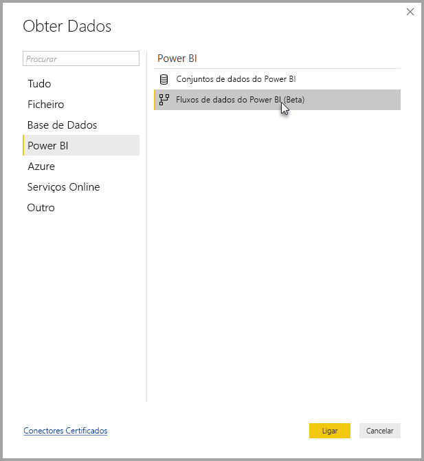
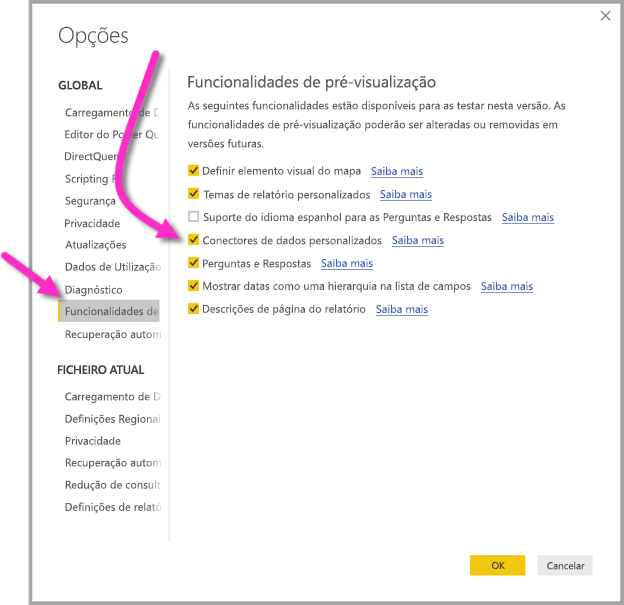

# Ligar a dados criados por fluxos de dados do Power BI no Power BI Desktop (Pré-visualização)
No **Power BI Desktop**, pode ligar a dados criados por **fluxos de dados do Power BI** tal como faria com outra origem de dados no Power BI Desktop.

O conector de **fluxos de dados do Power BI (pré-visualização)** permite-lhe ligar às entidades criadas por fluxos de dados no serviço Power BI. Como os fluxos de dados estão em pré-visualização, tem de seguir alguns passos para que o conector de fluxos de dados no seu sistema fique disponível. 

## Transferir e ativar o conector de fluxos de dados do Power BI (pré-visualização)

Tem de transferir uma cópia do conector de **fluxos de dados do Power BI** e, em seguida, copiá-lo para uma localização específica do seu computador. Numa futura atualização mensal ao Power BI Desktop, o conector será automaticamente incluído na lista de conectores de dados, o que dispensará a realização destes passos.

Pode transferir o **conector de fluxos de dados do Power BI** nesta localização: [conector de fluxos de dados do Power BI](https://visuals.azureedge.net/cds-analytics/PublicPreview/CDSA.mez)

Siga os passos abaixo para que o conector de **fluxos de dados do Power BI** (pré-visualização) fique disponível no seu computador:

1. Transfira uma cópia do ficheiro .MEZ (o ficheiro do conector de dados). Os clientes de pré-visualização privada irão receber informações sobre a transferência do ficheiro .MEZ diretamente da Microsoft.

2. Coloque o ficheiro do conector de dados transferido na seguinte pasta do seu computador: **Documentos > Power BI Desktop > pasta Custom connectors** (Conectores personalizados)

3. No Power BI Desktop, selecione **Ficheiro > Opções e definições > Opções** e, em seguida, selecione **Funcionalidades de pré-visualização** no painel esquerdo.

    

4. Selecione a caixa **Conectores de dados personalizados** se não estiver selecionada. 

5. Reinicie o **Power BI Desktop** para o conector ser apresentado.

## Utilizar o conector de fluxos de dados do Power BI (pré-visualização)
Depois de o **Power BI Desktop** ser reiniciado, o conector será apresentado como uma origem de dados disponível. Para ligar a um conjunto de dados, selecione **Obter Dados > Serviços Online > Fluxos de dados do Power BI (beta)** conforme mostrado na imagem seguinte:

## Considerações e limitações

Para utilizar esta versão de pré-visualização do **conector de fluxos de dados do Power BI**, tem de executar a versão mais recente do **Power BI Desktop**. Pode sempre [transferir o Power BI Desktop](desktop-get-the-desktop.md) e instalá-lo no seu computador para se certificar de que tem a versão mais recente.  

Nota: quando o conector de fluxos de dados do Power BI aparecer numa futura atualização mensal ao **Power BI Desktop**, *tem* de eliminar este ficheiro .MEZ transferido da sua pasta **Documentos > Power BI Desktop > Custom connectors** (Conectores personalizados) para evitar conflitos. 

## Próximos passos
Existem inúmeras coisas interessantes que pode fazer com as ligações de dados do Power BI, bem como artigos sobre o **Power BI Desktop** que poderão ser úteis:

* [Origens de Dados no Power BI Desktop](desktop-data-sources.md)
* [Formatar e Combinar Dados com o Power BI Desktop](desktop-shape-and-combine-data.md)
* [Introduzir dados diretamente no Power BI Desktop](desktop-enter-data-directly-into-desktop.md)   

