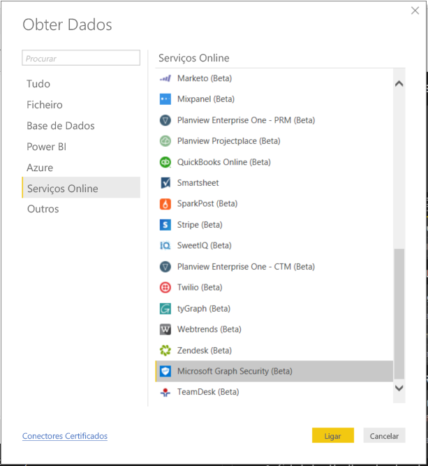
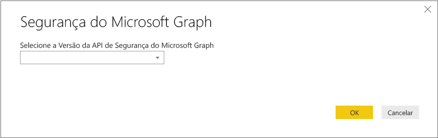
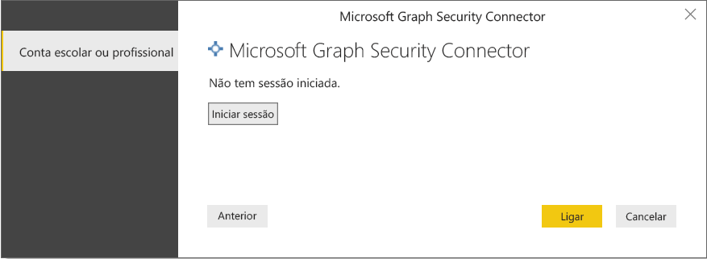
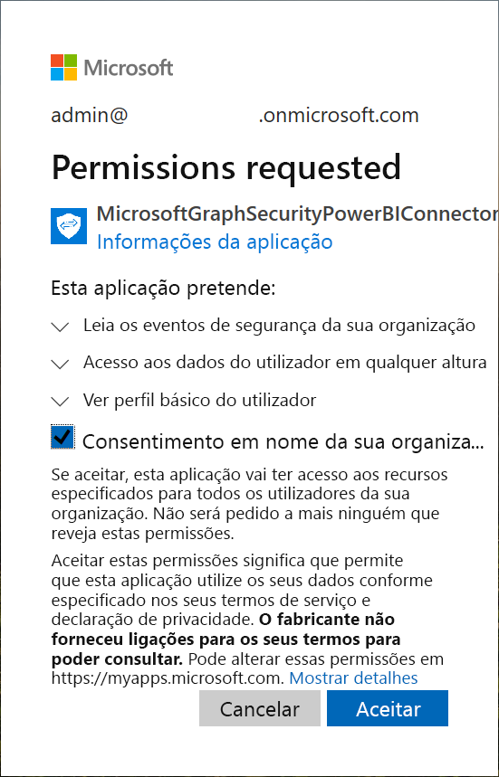
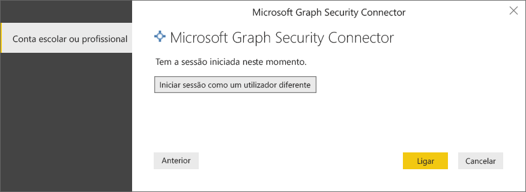
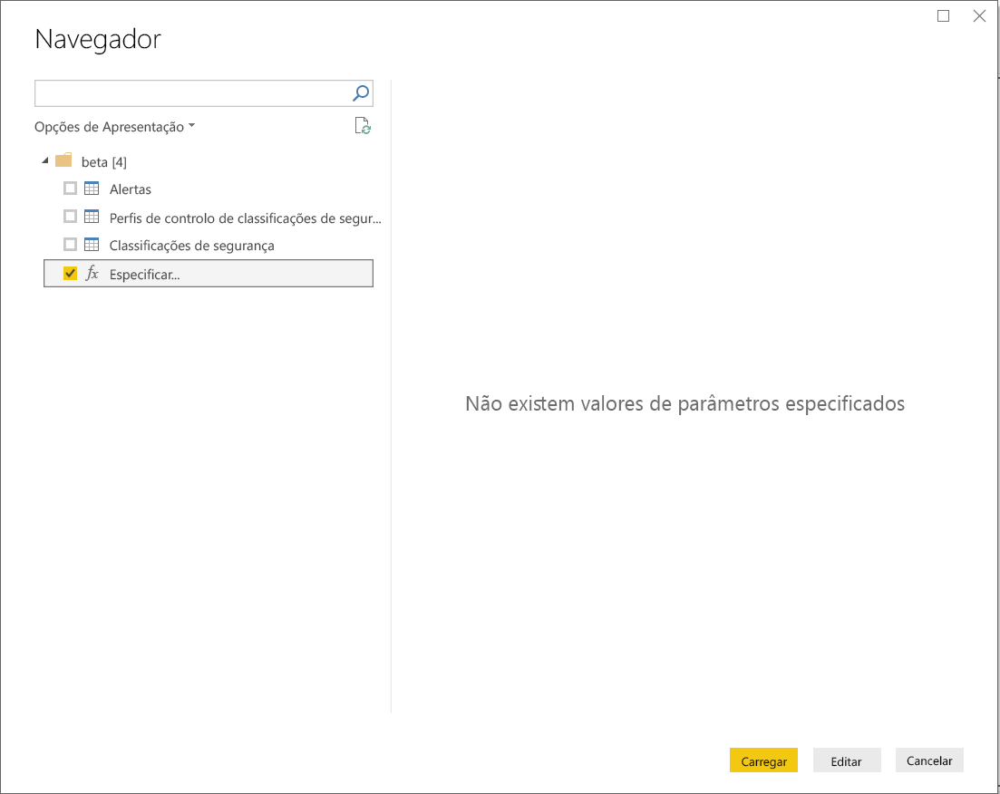
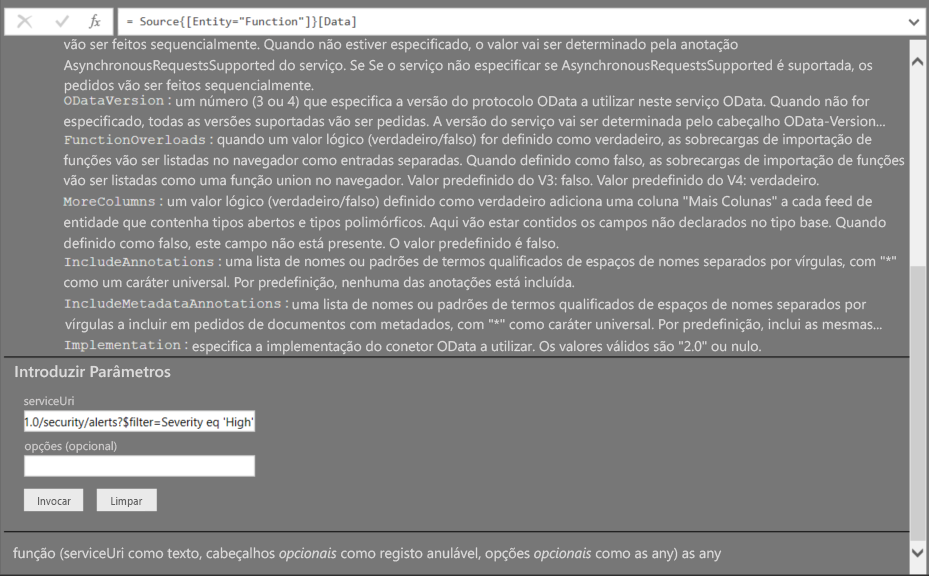
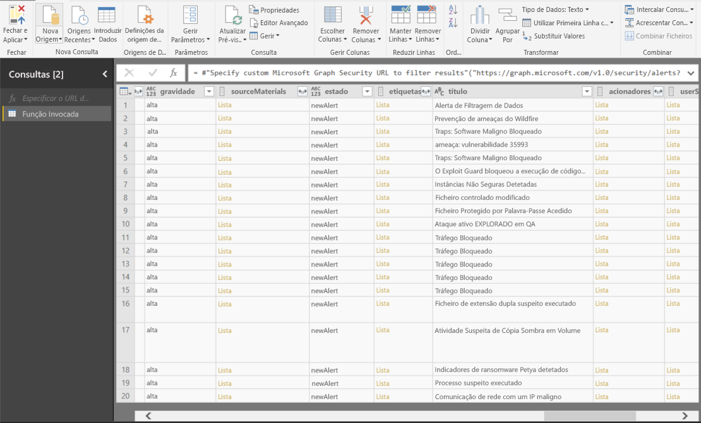

# Ligar-se à Segurança do Microsoft Graph no Power BI Desktop

Pode utilizar o Power BI Desktop para se ligar à API de Segurança do Microsoft Graph através do conector de Segurança do Microsoft Graph do Power BI. Isto irá permitir-lhe criar dashboards e relatórios para obter informações sobre os seus [alertas](https://docs.microsoft.com/graph/api/resources/alert?view=graph-rest-1.0) de segurança e a [Classificação de Segurança](https://docs.microsoft.com/graph/api/resources/securescores?view=graph-rest-beta). A [API de Segurança do Microsoft Graph](https://aka.ms/graphsecuritydocs) liga [múltiplas soluções de segurança](https://aka.ms/graphsecurityalerts) da Microsoft e de parceiros de ecossistema para permitir uma correlação de alertas mais fácil, fornecer acesso a informações contextualmente ricas e simplificar a automatização. Isto permite que as organizações obtenham rapidamente informações e tomem medidas nos respetivos produtos de segurança, reduzindo também o custo e a complexidade da criação e manutenção de múltiplas integrações.

## Pré-requisitos para se ligar ao conector de Segurança do Microsoft Graph

* Para utilizar o conector de Segurança do Microsoft Graph, tem de lhe ser *dado explicitamente* o consentimento de um administrador de inquilinos do Azure Active Directory (AD), o que faz parte dos [requisitos da Autenticação de Segurança do Microsoft Graph](https://aka.ms/graphsecurityauth). Este consentimento requer o nome e ID da aplicação do conector de Segurança do Microsoft Graph do Power BI, que também pode encontrar no [portal do Azure](https://portal.azure.com):

   | Propriedade | Valor |
   |----------|-------|
   | **Nome da Aplicação** | `MicrosoftGraphSecurityPowerBIConnector` |
   | **ID da Aplicação** | `cab163b7-247d-4cb9-be32-39b6056d4189` |
   |||

   Para dar consentimento para o conector, o seu administrador de inquilinos do Azure AD pode seguir qualquer um destes passos:

   * [Dar consentimento ao administrador de inquilinos para as aplicações do Azure AD](https://docs.microsoft.com/azure/active-directory/develop/v2-permissions-and-consent).

   * Durante a primeira execução da sua aplicação lógica, a mesma poderá pedir o consentimento do seu administrador de inquilinos do Azure AD através da [experiência de consentimento da aplicação](https://docs.microsoft.com/azure/active-directory/develop/application-consent-experience).
   
* A conta do utilizador utilizada para iniciar sessão para ligar ao conector de Segurança do Microsoft Graph do Power BI tem de ser um membro da função Administrador Limitado do Leitor de Segurança no Azure AD (Leitor de Segurança ou Administrador de Segurança). Siga os passos na secção [Assign Azure AD roles to users](https://docs.microsoft.com/graph/security-authorization#assign-azure-ad-roles-to-users) (Atribuir funções do Azure AD a utilizadores). 

## Utilizar o conector de Segurança do Microsoft Graph

Siga estes passos para utilizar o conector de **Segurança do Microsoft Graph**:

1. Selecione **Obter Dados -> Mais…** no friso **Base** no Power BI Desktop.
2. Selecione **Serviços Online** nas categorias à esquerda
3. Clique em **Segurança do Microsoft Graph (Beta)**.

    
    
4. Na janela **Segurança do Microsoft Graph** apresentada, selecione a versão da API de Segurança do Microsoft Graph para consulta. As opções são v1.0 e beta.

    
    
5. Inicie sessão na sua conta do Azure Active Directory quando lhe for pedido. Esta conta tem de ter a função **Leitor de Segurança** conforme mencionado na secção de pré-requisitos acima.

    
    
6. Se for um administrador de inquilinos **e** se ainda não tiver concedido acesso ao conector de Segurança do Microsoft Graph do Power BI (aplicação) conforme os pré-requisitos, ser-lhe-á apresentada a seguinte janela de diálogo. Certifique-se de que seleciona "**Consentimento em nome da sua organização**".

    
    
7. Quando iniciar sessão, verá a seguinte janela a indicar que foi autenticado. Selecione **Ligar**.

    
    
8. Assim que se ligar com êxito, será apresentada uma janela **Navegador** da seguinte forma e mostrará as entidades como alertas, etc. disponíveis na [API de Segurança do Microsoft Graph](https://aka.ms/graphsecuritydocs) da versão que selecionou nos passos anteriores. Selecione uma ou múltiplas entidades para importar e utilizar no **Power BI Desktop**. Clique em **Carregar** para obter a vista de resultados descrita no passo 10.

   
    
9. Se quiser fazer uma consulta avançada à API de Segurança do Microsoft Graph, selecione a função **Especificar o URL de Segurança do Microsoft Graph para filtrar resultados**. Isto irá permitir-lhe fazer uma consulta [OData.Feed](https://docs.microsoft.com/power-bi/desktop-connect-odata) à API de Segurança do Microsoft Graph com as permissões necessárias para aceder à API.

   > [!NOTE]
   > O exemplo serviceUri utilizado abaixo é `https://graph.microsoft.com/v1.0/security/alerts?$filter=Severity eq 'High'`. Consulte os [Graph supported ODATA query parameters](https://docs.microsoft.com/graph/query-parameters) (Parâmetros de consulta ODATA suportados pelo Graph) de forma a criar consultas para filtrar, ordenar ou obter os resultados mais recentes.

   
    
   Ao selecionar **Invocar**, a função OData.Feed chama a API que abre o Editor de Consultas para poder filtrar e refinar o conjunto de dados que pretende utilizar e, em seguida, carregar esse conjunto refinado de dados para o Power BI Desktop.

10. A seguinte imagem ilustra a janela de resultados da(s) entidade(s) da Segurança do Microsoft Graph para as quais fez uma consulta.

   
    

Está pronto para utilizar os dados importados do conector de Segurança do Microsoft Graph no Power BI Desktop para criar elementos visuais, relatórios ou interagir com outros dados aos quais se possa querer ligar e importar, como outros livros do Excel, bases de dados ou outra origem de dados.

## Próximos Passos
* Consulte exemplos e modelos do Power BI através deste conector no [Microsoft Graph Security GitHub Power BI sample repo](https://aka.ms/graphsecuritypowerbiconnectorsamples) (repositório de exemplos de Segurança do Microsoft Graph do Power BI no GitHub).

* Consulte alguns cenários de utilizador e informações adicionais na [Microsoft Graph Security Power BI Connector blogpost](https://aka.ms/graphsecuritypowerbiconnectorblogpost) (publicação de blogue do Conector de Segurança do Microsoft Graph do Power BI).

* Existem diversos tipos de dados aos quais se pode ligar através do Power BI Desktop. Para obter mais informações sobre origens de dados, consulte os seguintes recursos:

    * [O que é o Power BI Desktop?](desktop-what-is-desktop.md)
    * [Origens de Dados no Power BI Desktop](desktop-data-sources.md)
    * [Formatar e Combinar Dados com o Power BI Desktop](desktop-shape-and-combine-data.md)
    * [Ligar a livros do Excel no Power BI Desktop](desktop-connect-excel.md)
    * [Introduzir dados diretamente no Power BI Desktop](desktop-enter-data-directly-into-desktop.md)
