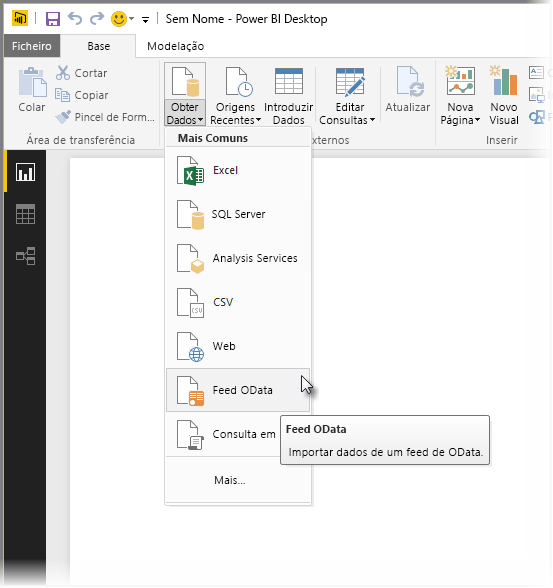
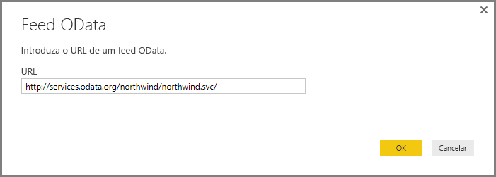
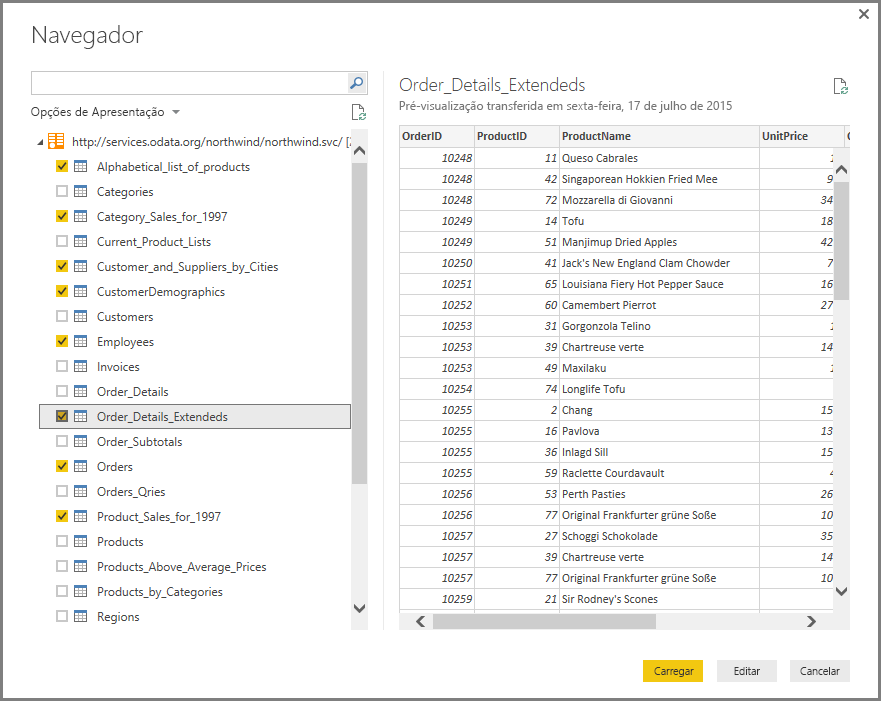
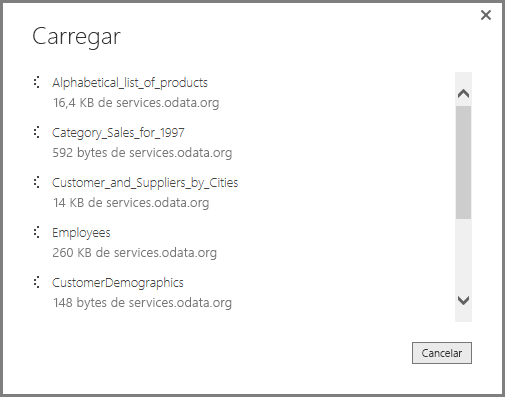
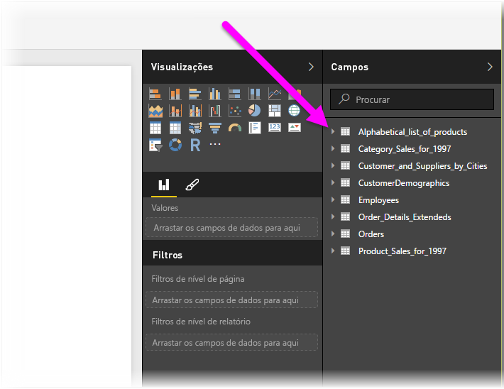

# Ligar a feeds OData no Power BI Desktop
No Power BI Desktop, pode ligar-se a um **feed OData** e utilizar os dados subjacentes, tal como faria com outra origem de dados no Power BI Desktop.

Para se ligar a um feed OData, selecione **Obter Dados > Feed OData** no friso **Base** no Power BI Desktop.

Na janela **Feed OData** que for apresentada, escreva ou cole o seu URL do feed OData na caixa e selecione **OK**.

O Power BI Desktop liga-se ao feed OData e mostra as tabelas e outros elementos de dados disponíveis na janela do **Navegador**. Quando selecionar um elemento, o painel direito da janela do **Navegador** mostra uma pré-visualização dos dados. Pode selecionar todas as tabelas que pretender importar. A janela do **Navegador** mostra uma pré-visualização da tabela atualmente selecionada.

Pode selecionar o botão **Editar** que faz abrir o **Editor de Consultas**, onde pode formatar e transformar os dados do feed OData antes de importá-los para o Power BI Desktop. Pode também selecionar o botão **Carregar** e importar todos os elementos de dados que selecionou no painel à esquerda.

Quando selecionarmos **Carregar**, o Power BI Desktop importa os itens selecionados e mostra uma janela **Carregar** do progresso de importação.

Após a conclusão, o Power BI Desktop disponibiliza as tabelas e outros elementos de dados selecionados no painel **Campos**, que se encontra no lado direito da vista de *Relatórios* no Power BI Desktop.

E já está!

Está pronto para utilizar os dados importados do feed OData no Power BI Desktop para criar visuais, relatórios ou interagir com outros dados aos quais se possa querer ligar e importar, como outros livros do Excel, bases de dados ou outra origem de dados.

## Próximos passos
Existem diversos tipos de dados aos quais se pode ligar através do Power BI Desktop. Para obter mais informações sobre origens de dados, consulte os seguintes recursos:

* [O que é o Power BI Desktop?](desktop-what-is-desktop.md)
* [Origens de Dados no Power BI Desktop](desktop-data-sources.md)
* [Formatar e Combinar Dados com o Power BI Desktop](desktop-shape-and-combine-data.md)
* [Ligar a livros do Excel no Power BI Desktop](desktop-connect-excel.md)   
* [Introduzir dados diretamente no Power BI Desktop](desktop-enter-data-directly-into-desktop.md)   

