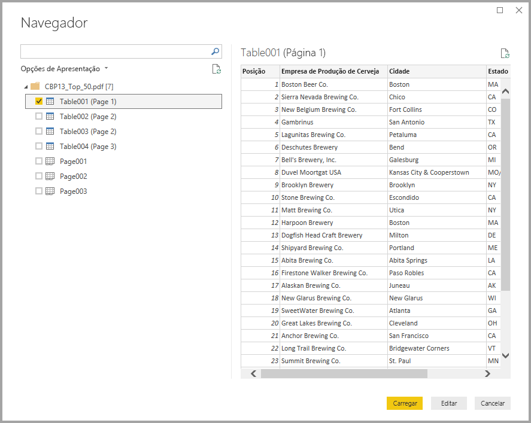
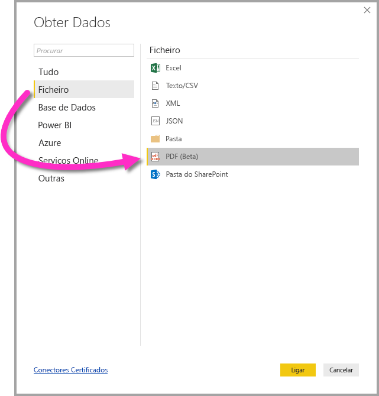

# Ligar a um ficheiro PDF no Power BI Desktop (Pré-visualização)
No Power BI Desktop, pode ligar a um **ficheiro PDF** e utilizar os dados incluídos do ficheiro tal como faria com outra origem de dados no Power BI Desktop.

As secções seguintes descrevem como pode ligar a um **ficheiro PDF**, selecionar dados e importar esses dados para o **Power BI Desktop**.

## Ativar o conector de PDF
O conector de PDF está em pré-visualização no **Power BI Desktop** e tem de ser ativado. Para ativar o conector de PDF, selecione **Ficheiro > Opções e Definições > Opções > Funcionalidades de pré-visualização** e, em seguida, selecione a caixa de verificação junto a **Obter dados de ficheiros PDF**. 

Terá de reiniciar o **Power BI Desktop** depois de efetuar a seleção.

Quando utiliza o conector de **PDF (beta)** pela primeira vez, é informado de que o conector de PDF ainda está em desenvolvimento e poderá ser alterado no futuro. Selecione **Continuar** para utilizar o conector.

Recomendamos sempre que atualize para a versão mais recente do **Power BI Desktop**, que pode obter através de uma ligação no artigo [Obter o Power BI Desktop](desktop-get-the-desktop.md). 

## Ligar a um ficheiro PDF
Para ligar a um ficheiro **PDF**, selecione **Obter Dados** no friso **Base** do Power BI Desktop. Selecione **Ficheiro** nas categorias no lado esquerdo e verá **PDF (beta)**.

É-lhe pedido para indicar a localização do ficheiro PDF que pretende utilizar. Depois de indicar a localização do ficheiro e de o ficheiro PDF ser carregado, é apresentada a janela **Navegador** que apresenta os dados disponíveis no ficheiro, a partir do qual pode selecionar um ou vários elementos a importar e utilizar no **Power BI Desktop**.

Se selecionar a caixa de verificação junto aos elementos detetados no ficheiro PDF, estes são apresentados no painel à direita. Quando estiver pronto para importar, selecione o botão **Carregar** para importar os dados para o **Power BI Desktop**.

A partir da versão de novembro de 2018 do **Power BI Desktop**, pode especificar a **Página Inicial** e a **Página Final** como parâmetros opcionais para a sua ligação de PDF. Também pode especificar estes parâmetros na linguagem da fórmula M com o seguinte formato:

`Pdf.Tables(File.Contents("c:\sample.pdf"), [StartPage=10, EndPage=11])`

## Próximos passos
Existem diversos tipos de dados aos quais se pode ligar através do Power BI Desktop. Para obter mais informações sobre origens de dados, consulte os seguintes recursos:

* [O que é o Power BI Desktop?](desktop-what-is-desktop.md)
* [Origens de Dados no Power BI Desktop](desktop-data-sources.md)
* [Formatar e Combinar Dados com o Power BI Desktop](desktop-shape-and-combine-data.md)
* [Ligar a livros do Excel no Power BI Desktop](desktop-connect-excel.md)   
* [Introduzir dados diretamente no Power BI Desktop](desktop-enter-data-directly-into-desktop.md)   

