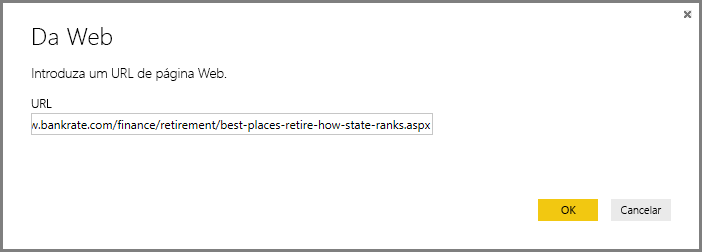
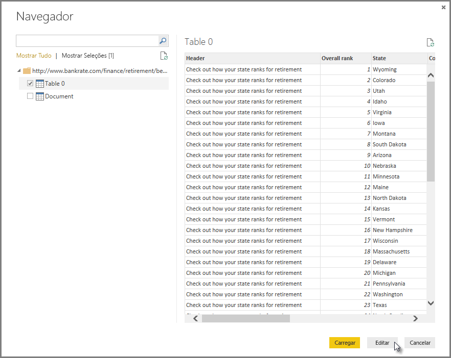
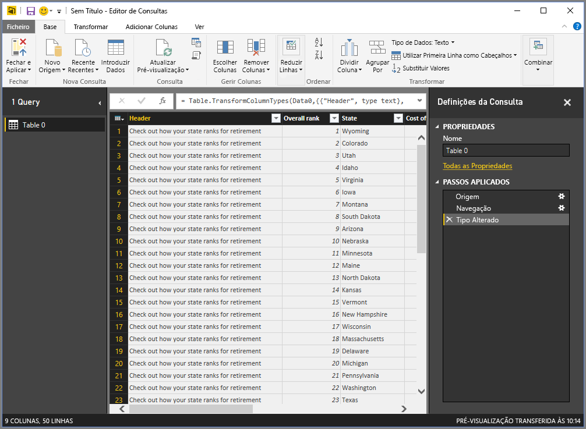
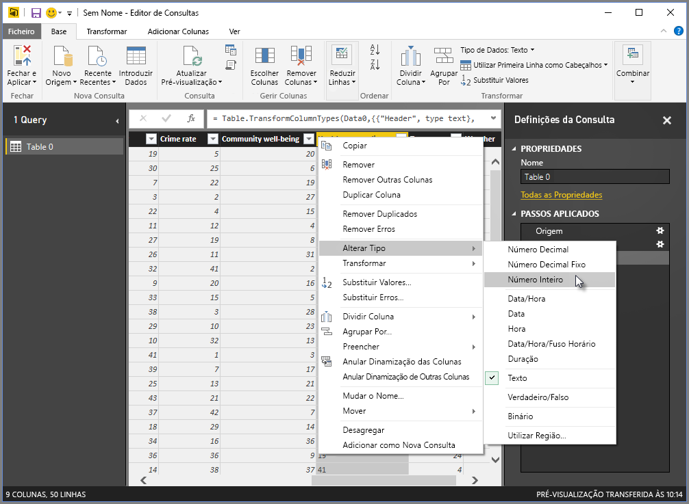
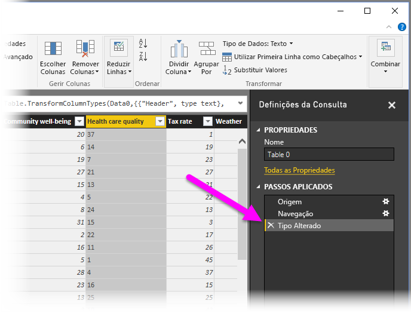
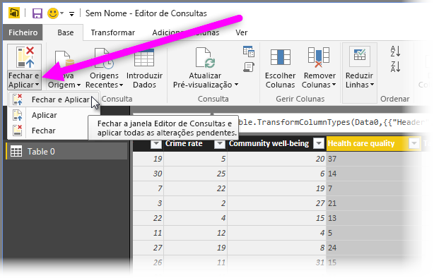
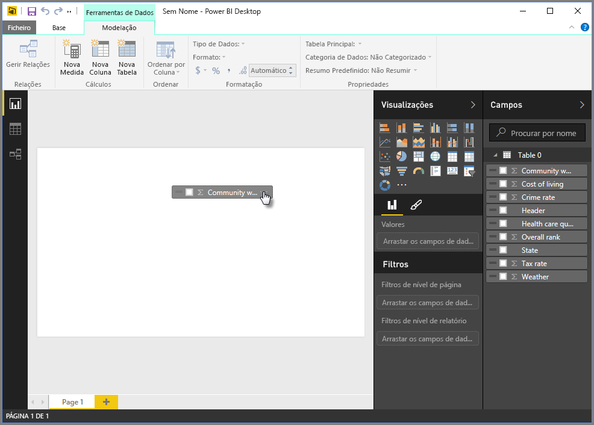
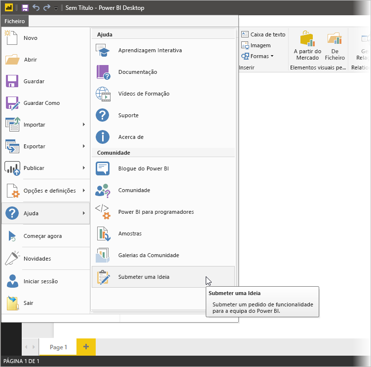

# Ligar a dados no Power BI Desktop
Com o Power BI Desktop, pode ligar facilmente ao mundo dos dados, que está em constante expansão. Se não tiver o Power BI Desktop, pode [transferir](http://go.microsoft.com/fwlink/?LinkID=521662) e instalá-lo.

Há *todos os tipos* de origens de dados disponíveis no Power BI Desktop. A imagem a seguir mostra como ligar-se a dados, ao selecionar o friso **Ficheiro** e, em seguida, **Obter Dados \> Mais**.

Neste exemplo, vamos ligar-nos a uma origem de dados **Web**.

Imagine que vai reformar-se – deseja viver onde há muito sol, impostos favoráveis e uma boa assistência médica. Ou... talvez seja um cientista de dados e queira essas informações para ajudar os seus clientes - como, por exemplo, para ajudar o seu cliente que fabrica capas de chuva a direcionar suas vendas para onde chove *muito*.

De qualquer modo, pode encontrar um recurso Web com dados interessantes sobre esses tópicos e muito mais:

[*http://www.bankrate.com/finance/retirement/best-places-retire-how-state-ranks.aspx*](http://www.bankrate.com/finance/retirement/best-places-retire-how-state-ranks.aspx)

Seleciona **Obter Dados \> Web** e escreve o endereço.

Ao selecionar **OK**, a funcionalidade **Consulta** do Power BI Desktop começa a funcionar. O Power BI Desktop entra em contacto com o recurso da Web e a janela **Browser** devolve os resultados encontrados pela consulta nessa página da Web. Neste caso, encontrou uma tabela (Tabela 0) e o Documento geral. Estamos interessados na tabela, pelo que vamos selecioná-la na lista. A janela **Browser** apresenta uma pré-visualização.

Neste ponto, podemos editar a consulta antes de carregar a tabela selecionando **Editar** na parte inferior da janela, ou podemos carregar a tabela.

Se selecionarmos **Editar**, a tabela é carregada e o Editor de Consulta inicia. O painel **Configurações de Consulta** aparece (se não, é possível selecionar **Vista** no friso e, em seguida, **Mostrar \> Configurações de Consulta**, para ver o painel **Configurações de Consulta**). Eis o respetivo aspeto.

Todas essas pontuações são texto e não números e precisamos que sejam números. Sem problemas – basta clicar com o botão direito do rato no título da coluna e selecionar **Alterar Tipo \> Número Inteiro** para alterá-los. Para escolher mais de uma coluna, primeiro selecionamos uma coluna, mantemos pressionada a tecla **SHIFT**, selecionamos colunas adjacentes adicionais e clicamos com o botão direito do rato num título de coluna para alterar todas as colunas selecionadas. Utilize **CTRL** para selecionar colunas que não são adjacentes.

Em **Configurações de Consulta**, as **Etapas Aplicadas** refletem as alterações que foram feitas. Conforme realiza alterações adicionais aos dados, o Editor de Consultas vai registar essas alterações na secção **Etapas Aplicadas** e poderá ajustar, revisitar, reorganizar ou eliminá-las conforme necessário.

Ainda podem ser feitas alterações adicionais à tabela depois desta ser carregada, mas o que já fizemos é suficiente por enquanto. Quando terminamos, selecionamos **Fechar e Aplicar** no friso **Início** e o Power BI Desktop aplica as nossas alterações e fecha o Editor de Consulta.

Com o modelo de dados carregado, na vista de **Relatório** no Power BI Desktop, podemos começar a criar visualizações ao arrastar campos para o ecrã.

Obviamente, este é um modelo simples com uma única ligação de dados; a maioria dos relatórios do Power BI Desktop terá ligações a diferentes origens de dados, moldadas para satisfazer as suas necessidades, com relações que produzem um modelo de dados avançado. 

### Passos seguintes
Existem inúmeras coisas que pode fazer com o Power BI Desktop. Para obter mais informações sobre as suas capacidades, veja os seguintes recursos:

* [Introdução ao Power BI Desktop](desktop-getting-started.md)
* [Descrição Geral das Consultas no Power BI Desktop](desktop-query-overview.md)
* [Origens de Dados no Power BI Desktop](desktop-data-sources.md)
* [Formatar e Combinar Dados com o Power BI Desktop](desktop-shape-and-combine-data.md)
* [Tarefas de Consulta Comuns no Power BI Desktop](desktop-common-query-tasks.md)   

Pretende enviar-nos comentários? Fantástico! Utilize o item de menu **Submeter uma Ideia** no Power BI Desktop ou aceda ao [Feedback da Comunidade](http://community.powerbi.com/t5/Community-Feedback/bd-p/community-feedback). Aguardamos o seu contacto!

