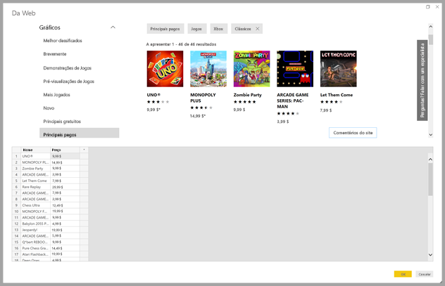
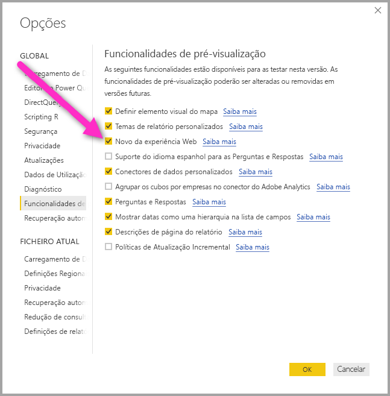
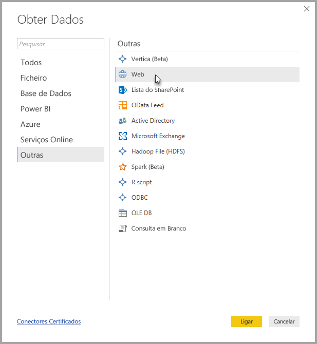
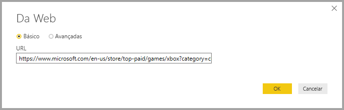
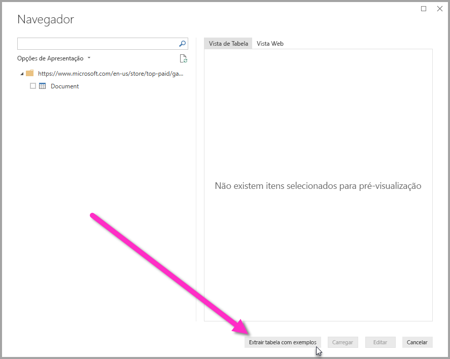
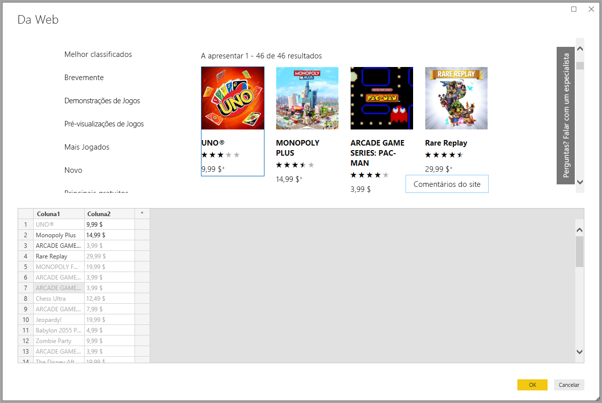
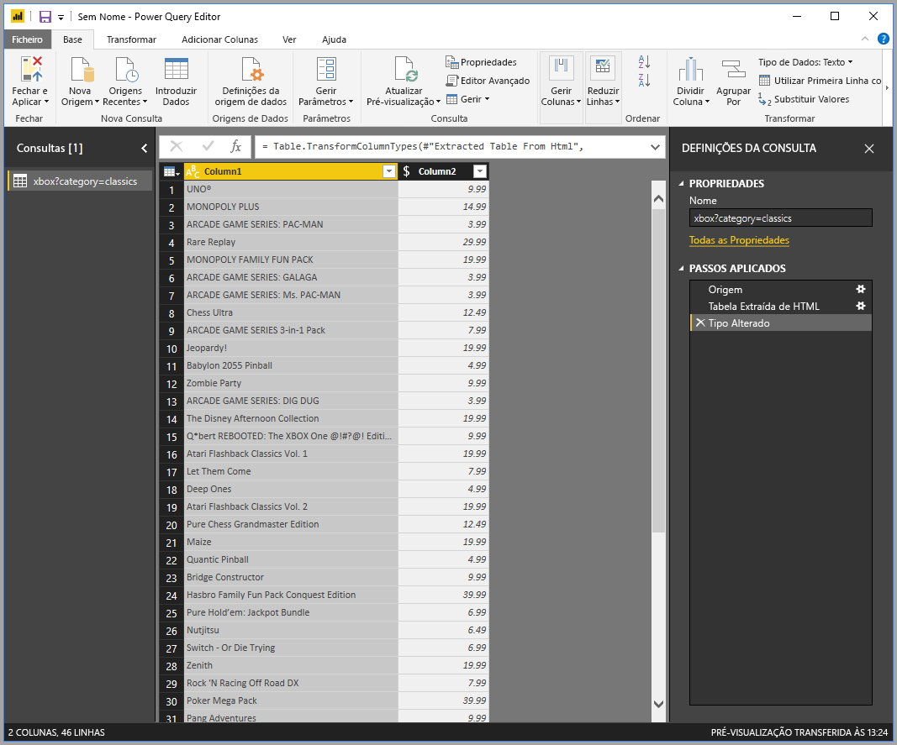

# Obter dados de uma página Web ao fornecer um exemplo (Pré-visualização)

A obtenção de dados de uma página Web permite aos utilizadores extrair facilmente dados de páginas Web e importar esses dados para o **Power BI Desktop**. Muitas vezes, no entanto, os dados nas páginas Web não estão em tabelas bem organizadas que sejam fáceis de extrair, pelo que a obtenção de dados dessas páginas (mesmo que estejam estruturados e consistentes) pode ser um desafio. 

Há uma solução. Com a funcionalidade **Obter Dados da Web por exemplo**, essencialmente, pode mostrar ao **Power BI Desktop** os dados que pretende extrair, ao fornecer um ou mais exemplos dentro da caixa de diálogo do conector, e este recolhe outros dados na página que correspondam ao seu exemplos. Com esta solução, pode extrair variadíssimos tipos de dados de páginas Web, incluindo dados encontrados em tabelas *e* outros dados não provenientes de tabelas. 

## Ativar a funcionalidade de pré-visualização Obter Dados da Web por exemplo

A funcionalidade **Obter Dados da Web por exemplo** está em Pré-visualização e tem ser ativada no **Power BI Desktop**. Para o ativar, selecione **Ficheiro > Opções e Definições > Opções > Funcionalidades de Pré-visualização** e, em seguida, selecione a caixa de verificação **Novo da experiência Web**. Terá de reiniciar o Power BI Desktop depois de efetuar a seleção.

Quando estiver ativada a funcionalidade de pré-visualização, está pronto para começar a utilizá-la. 

## Utilizar a funcionalidade Obter Dados da Web por exemplo

Para utilizar a funcionalidade **Obter Dados da Web por exemplo**, selecione **Obter Dados** no menu do friso **Base**. Na janela apresentada, selecione **Outros** nas categorias no painel esquerdo e, em seguida, selecione **Web**.

A partir daí, introduza o URL da página Web a partir da qual pretende extrair dados. Neste artigo vamos utilizar a página Web da Microsoft Store e mostrar como funciona este conector. 

Se quiser acompanhar, pode utilizar o [URL da Microsoft Store](https://www.microsoft.com/en-us/store/top-paid/games/xbox?category=classics) que utilizamos neste artigo:

    https://www.microsoft.com/en-us/store/top-paid/games/xbox?category=classics

Quando seleciona **OK**, é direcionado para a caixa de diálogo **Navegador** onde são apresentadas todas as tabelas automaticamente detetadas a partir da página Web. No caso apresentado na imagem abaixo, não foram encontradas tabelas, mas existe um botão na parte inferior da página denominado **Extrair tabela com exemplos** que lhe permite fornecer exemplos.

Selecionar o botão **Extrair tabela com exemplos** apresenta uma janela interativa onde pode pré-visualizar o conteúdo da página Web e introduzir os valores de exemplo dos dados que pretende extrair. 

Neste exemplo, vamos extrair o *Nome* e o *Preço* de cada um dos jogos na página. Podemos fazê-lo ao especificar alguns exemplos da página para cada coluna, conforme apresentado na imagem seguinte. Como os exemplos são escritos, o **Power Query** (que é a tecnologia subjacente que extrai os dados a partir da página Web) é capaz de extrair dados que se ajustam ao padrão de entradas de exemplo com algoritmos inteligentes de extração de dados.

Assim que estiver satisfeito com os dados extraídos da página Web, selecionamos **OK** para aceder ao **Editor de Consultas**, onde podemos aplicar mais transformações ou formatar os dados ao, por exemplo, combinar estes dados com outras origens de dados.

A partir daí, pode criar os elementos visuais ou utilizar os dados da página Web quando criar os seus relatórios do **Power BI Desktop**.

## Próximos passos
Existem diversos tipos de dados aos quais se pode ligar com o **Power BI Desktop**. Para obter mais informações sobre origens de dados, consulte os seguintes recursos:

* [Adicionar coluna por exemplo](desktop-add-column-from-example.md)
* [Ligar a uma página Web](desktop-connect-to-web.md)
* [Origens de Dados no Power BI Desktop](desktop-data-sources.md)
* [Formatar e Combinar Dados com o Power BI Desktop](desktop-shape-and-combine-data.md)
* [Ligar a livros do Excel no Power BI Desktop](desktop-connect-excel.md)   
* [Ligar a ficheiros CSV no Power BI Desktop](desktop-connect-csv.md)   
* [Introduzir dados diretamente no Power BI Desktop](desktop-enter-data-directly-into-desktop.md)   

