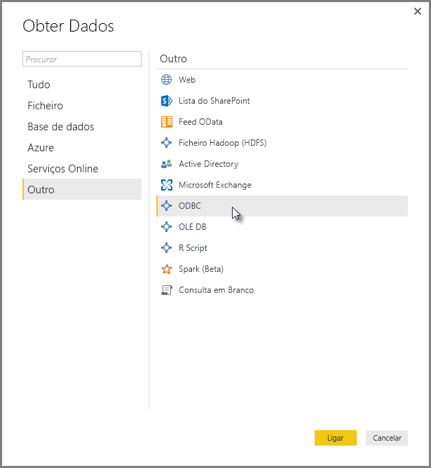
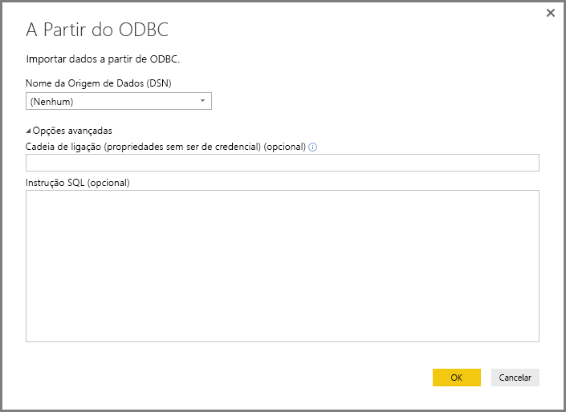
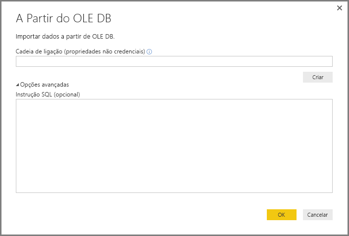
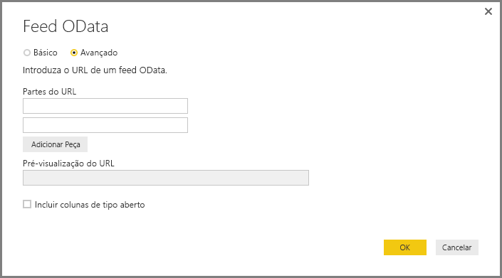
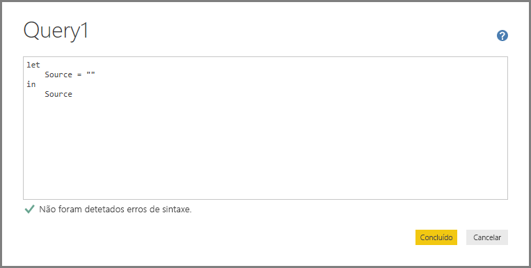
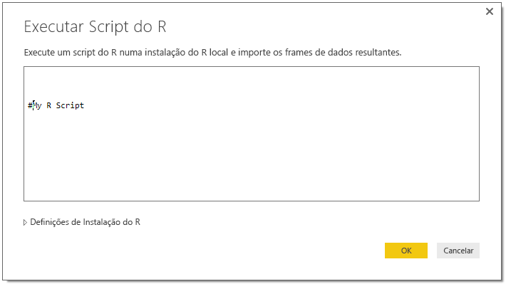

# Ligar-se a dados através de interfaces genéricas no Power BI Desktop
Pode ligar-se a uma grande diversidade de origens de dados no **Power BI Desktop**, através de conectores de dados incorporados, desde **Bases de dados de acesso** a recursos **Zendesk**, conforme mostrado na janela **Obter Dados**. Também pode ligar-se a todos os tipos de *outras* origens de dados para expandir ainda mais as suas opções de conectividade ao utilizar as interfaces genéricas (como **ODBC** ou **APIs REST**) incorporadas no **Power BI Desktop**.

## Interfaces de dados do Power BI Desktop
O **Power BI Desktop** inclui uma coleção cada vez maior de conectores de dados que estão criados para se ligarem a uma origem de dados específica. Por exemplo, o conector de dados **Lista do SharePoint** fornece campos específicos e informações de apoio durante a sequência de ligação, criados para **Listas do SharePoint**, o que acontece noutras origens de dados na janela que é apresentada quando seleciona **Obter Dados > Mais...** (mostrada na imagem anterior).

Além disso, o **Power BI Desktop** permite-lhe ligar-se a origens de dados que não são identificadas nas listas **Obter Dados** ao utilizar uma das seguintes interfaces de dados genéricas:

* **ODBC**
* **OLE DB**
* **OData**
* **APIs REST**
* **Scripts R**

Ao fornecer os parâmetros adequados nas janelas de ligação que estas interfaces genéricas proporcionam, o mundo de origens de dados às quais pode aceder e utilizar no **Power BI Desktop** aumenta exponencialmente.

Nas secções seguintes, irá encontrar listas de origens de dados às quais estas interfaces genéricas podem aceder.

Não encontra a origem de dados que pretendia utilizar no **Power BI Desktop**? Submeta a sua ideia na [lista de ideias e pedidos](https://ideas.powerbi.com/) da equipa do Power BI.

## Origens de dados acessíveis através de ODBC
O conector **ODBC** no **Power BI Desktop** permite-lhe importar dados de um controlador ODBC de terceiros simplesmente ao especificar um **Nome de Origem de Dados (DSN)** ou uma *cadeia de ligação*. Como opção, também pode especificar uma afirmação SQL para executar ao controlador ODBC.

A lista seguinte enumera alguns exemplos de origens de dados às quais o **Power BI Desktop** pode ligar-se através da interface **ODBC** genérica.

| Conector genérico do Power BI Desktop | Origem de dados externa | Ligação para mais informações |
| --- | --- | --- |
| ODBC |Cassandra |[Controlador ODBC Cassandra](http://www.simba.com/drivers/cassandra-odbc-jdbc/) |
| ODBC |Couchbase DB |[Couchbase e Power BI](https://powerbi.microsoft.com/en-us/blog/visualizing-data-from-couchbase-server-v4-using-power-bi/) |
| ODBC |DynamoDB |[Controlador ODBC DynamoDB](http://www.simba.com/drivers/dynamodb-odbc-jdbc/) |
| ODBC |Google BigQuery |[Controlador ODBC BigQuery](http://www.simba.com/drivers/bigquery-odbc-jdbc/) |
| ODBC |Hbase |[Controlador ODBC Hbase](http://www.simba.com/drivers/hbase-odbc-jdbc/) |
| ODBC |Hive |[Controlador ODBC Hive](http://www.simba.com/drivers/hive-odbc-jdbc/) |
| ODBC |IBM Netezza |[Informações sobre o IBM Netezza](https://www.ibm.com/support/knowledgecenter/SSULQD_7.2.1/com.ibm.nz.datacon.doc/c_datacon_plg_overview.html) |
| ODBC |Presto |[Controlador ODBC Presto](http://www.simba.com/drivers/presto-odbc-jdbc/) |
| ODBC |Project Online |[Artigo do Project Online](desktop-project-online-connect-to-data.md) |
| ODBC |Progress OpenEdge |[Publicação no blogue sobre o controlador ODBC Progress OpenEdge](https://na01.safelinks.protection.outlook.com/?url=https%3A%2F%2Fwww.progress.com%2Fblogs%2Fconnect-microsoft-power-bi-to-openedge-via-odbc-driver&data=02%7C01%7CMatt.Masson%40microsoft.com%7C5e63742e6c454308b58a08d4034b5923%7C72f988bf86f141af91ab2d7cd011db47%7C1%7C0%7C636137069555329811&sdata=gSu2Rq3vZ0uBVOgjaXxd8Y3uBf%2B8DidX6PG33jwAduY%3D&reserved=0) |

## Origens de dados acessíveis através do OLE DB
O conector **OLE DB** no **Power BI Desktop** permite-lhe importar de dados de qualquer controlador OLE DB simplesmente ao especificar uma *cadeia de ligação*. Tem também a opção de especificar uma afirmação SQL para executar ao controlador OLE DB.

A lista seguinte enumera alguns exemplos de origens de dados às quais o **Power BI Desktop** pode ligar-se através da interface **OLE DB** genérica.

| Conector genérico do Power BI Desktop | Origem de dados externa | Ligação para mais informações |
| --- | --- | --- |
| OLE DB |SAS OLE DB |[Fornecedor SAS para OLE DB](https://support.sas.com/downloads/package.htm?pid=648) |
| OLE DB |OLE DB Sybase |[Fornecedor Sybase para OLE DB](http://infocenter.sybase.com/help/index.jsp?topic=/com.sybase.infocenter.dc35888.1550/doc/html/jon1256941734395.html) |

## Origens de dados acessíveis através de OData
O conector **OData** no **Power BI Desktop** permite-lhe importar dados de qualquer URL do **OData** simplesmente ao escrever ou colar o URL do **OData**. Pode adicionar múltiplas partes do URL ao escrever ou colar essas ligações nas caixas de texto apresentadas na janela **Feed OData**.

A lista seguinte enumera alguns exemplos de origens de dados às quais o **Power BI Desktop** pode ligar-se através da interface **OData** genérica.

| Conector genérico do Power BI Desktop | Origem de dados externa | Ligação para mais informações |
| --- | --- | --- |
| OData |Em breve |Volte a consultar esta secção em breve para obter origens de dados do OData |

## Origens de dados acessíveis através APIs REST
Pode ligar-se a origens de dados utilizando **APIs REST** e, por conseguinte, utilizar dados de todos os tipos de origens de dados que suportem **REST**.

A lista seguinte enumera alguns exemplos de origens de dados às quais o **Power BI Desktop** pode ligar-se através da interface **APIs REST** genérica.

| Conector genérico do Power BI Desktop | Origem de dados externa | Ligação para mais informações |
| --- | --- | --- |
| APIs REST |Couchbase DB |[Informações de API REST Couchbase](https://powerbi.microsoft.com/en-us/blog/visualizing-data-from-couchbase-server-v4-using-power-bi/) |

## Origens de dados acessíveis através de Script R
Pode utilizar **scripts R** para aceder a origens de dados e utilizar esses dados no **Power BI Desktop**.

A lista seguinte enumera alguns exemplos de origens de dados às quais o **Power BI Desktop** pode ligar-se através da interface **scripts R** genérica.

| Conector genérico do Power BI Desktop | Origem de dados externa | Ligação para mais informações |
| --- | --- | --- |
| Script do R |Ficheiros SAS |[Orientações de Script R do CRAN](https://cran.r-project.org/doc/manuals/R-data.html) |
| Script do R |Ficheiros SPSS |[Orientações de Script R do CRAN](https://cran.r-project.org/doc/manuals/R-data.html) |
| Script do R |Ficheiros Estatísticos R |[Orientações de Script R do CRAN](https://cran.r-project.org/doc/manuals/R-data.html) |

## Próximos passos
Existem diversos tipos de origens de dados às quais se pode ligar através do **Power BI Desktop**. Para obter mais informações sobre origens de dados, consulte os seguintes recursos:

* [Introdução ao Power BI Desktop](desktop-getting-started.md)
* [Origens de Dados no Power BI Desktop](desktop-data-sources.md)
* [Formatar e Combinar Dados com o Power BI Desktop](desktop-shape-and-combine-data.md)
* [Ligar a livros do Excel no Power BI Desktop](desktop-connect-excel.md)   
* [Introduzir dados diretamente no Power BI Desktop](desktop-enter-data-directly-into-desktop.md)   

