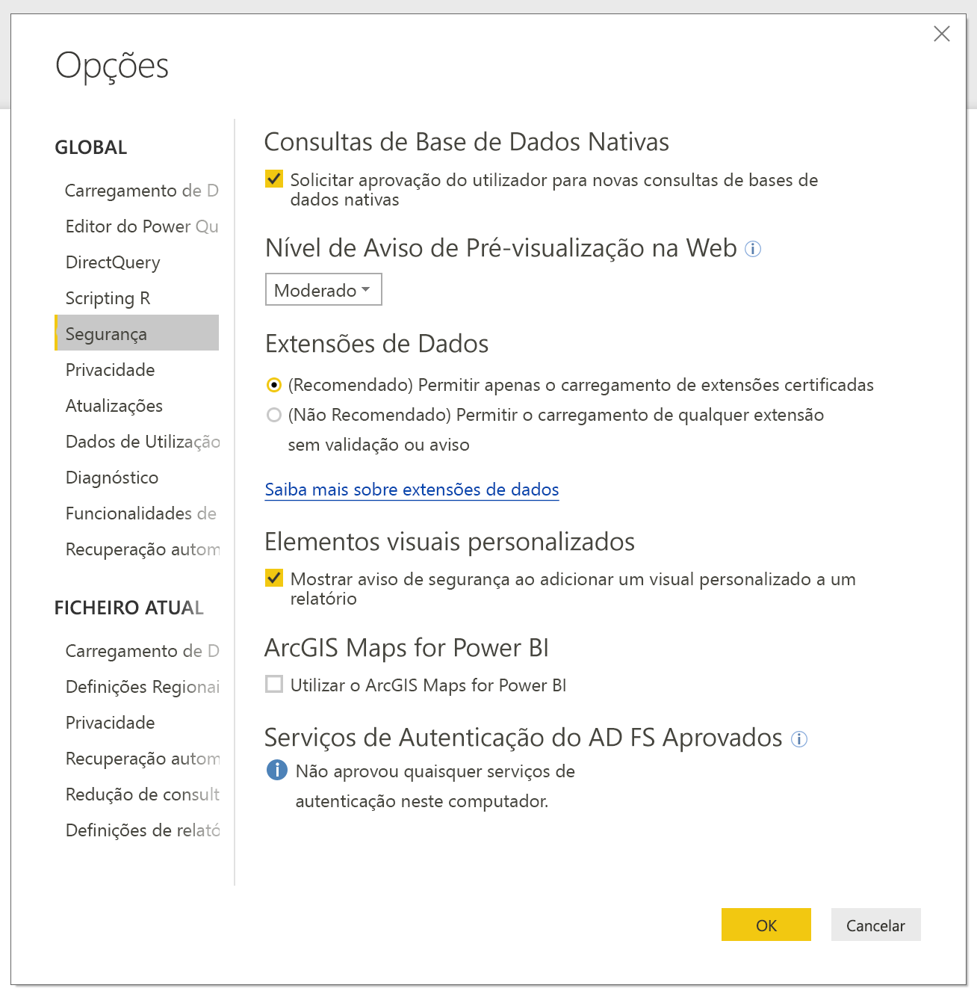
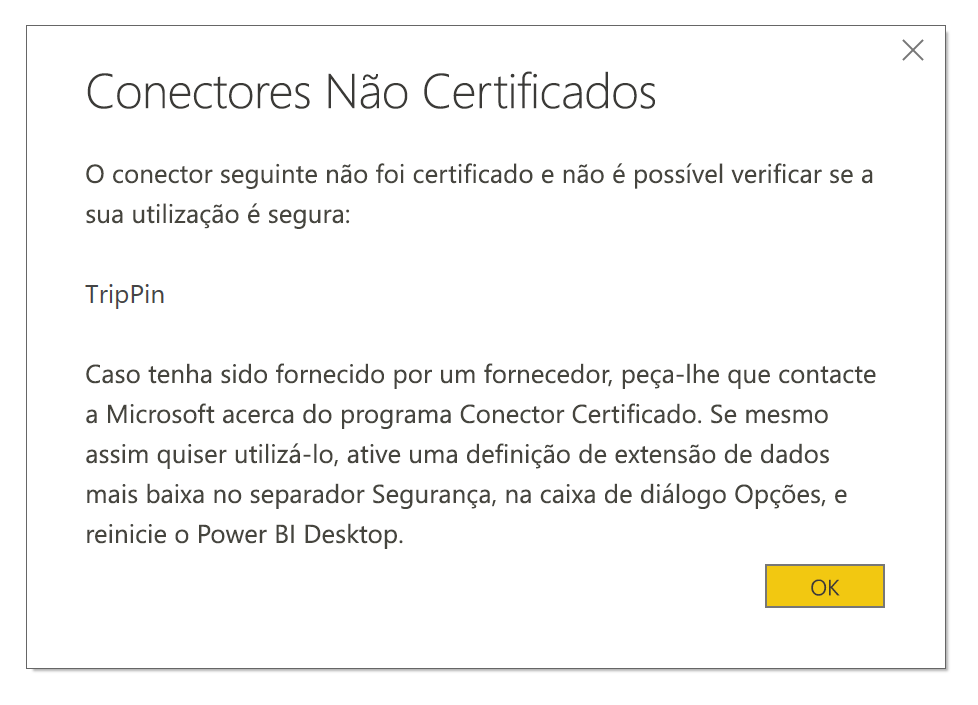

# Extensibilidade de conectores no Power BI

No Power BI, os clientes e os programadores podem expandir as origens de dados às quais se ligam de várias formas, por exemplo, ao utilizar conectores existentes e origens de dados genéricas (como ODBC, OData, Oledb, Web, CSV, XML e JSON). Além dessas origens de dados, os programadores podem criar extensões de dados designadas por **Conectores Personalizados** e certificar um conector para os tornar **Conectores Certificados**.

Atualmente, a capacidade para utilizar **Conectores Personalizados** está ativada com um comutador de funcionalidade. Antes de movermos esta funcionalidade da versão beta para a versão disponível para o público, adicionámos um menu que lhe permite controlar de forma segura o nível de código personalizado que pretende permitir que seja executado no seu sistema: todos os conectores personalizados ou apenas os conectores certificados e distribuídos pela Microsoft na caixa de diálogo **Obter Dados**.

## Conectores personalizados

Os **Conectores Personalizados** podem incluir uma vasta seleção de possibilidades, desde pequenas APIs que são importantes para o seu negócio, até grandes serviços específicos da indústria para os quais a Microsoft não lançou um conector. Muitos conectores são distribuídos pelos próprios fornecedores e, se precisar de um conector de dados específico, deverá contactar um fornecedor.

Para utilizar um **Conector Personalizado**, coloque-o na pasta *\[Documentos\\Power BI Desktop\\Conectores Personalizados* e ajuste as definições de segurança como descrito na seguinte secção.

Não precisa de ajustar as definições de segurança para utilizar **Conectores Certificados**.

## Segurança da extensão de dados

Para alterar as definições de segurança da extensão de dados, no **Power BI Desktop**, selecione **Ficheiro > Opções e Definições > Opções > Segurança**.

Em **Extensões de Dados** pode optar entre dois níveis de segurança:

* (Recomendado) Permitir apenas o carregamento de extensões certificadas
* (Não Recomendado) Permitir o carregamento de qualquer extensão sem validação ou aviso

Se estiver a planear utilizar **Conectores Personalizados** ou conectores desenvolvidos e distribuídos por si ou por terceiros, tem de selecionar **"(Não Recomendado) Permitir o carregamento de qualquer extensão sem validação ou aviso"**. Não recomendamos esta definição de segurança, a menos que esteja a planear executar **Conectores Personalizados**.

Na definição de segurança **"(Recomendado)"**, se existirem conectores personalizados no seu sistema, será apresentado um erro a descrever os conectores que não podem ser carregados devido à segurança.

Para corrigir o erro e utilizar esses conectores, tem de alterar as suas definições de segurança para a definição **"(Não Recomendado)"** como descrito anteriormente e reiniciar o **Power BI Desktop**.

## Conectores certificados

Um subconjunto limitado de extensões de dados é considerado **Certificado** e tais conectores certificados estão disponíveis ao utilizar a caixa de diálogo **Obter Dados**. Porém, a parte responsável pela manutenção e suporte continua a ser a empresa de programadores terceiros que criou o conector. Apesar de distribuir estes conectores, a Microsoft não é responsável pelo respetivo desempenho ou funcionalidade continuada.

Se pretender que um conector personalizado seja certificado, peça ao seu fornecedor que contacte a dataconnectors@microsoft.com.
