# Criar e gerir relações no Power BI Desktop
Quando importa múltiplas tabelas, é provável que faça algumas análises com dados de todas essas tabelas. As relações entre essas tabelas são necessárias para calcular os resultados com precisão e apresentar as informações corretas nos seus relatórios. O Power BI Desktop facilita a criação dessas relações. Na verdade, na maioria dos casos, não tem de fazer nada: a funcionalidade de Deteção Automática pode fazer isso por si. No entanto, em alguns casos, talvez tenha de criar relações ou talvez seja necessário fazer algumas alterações a uma relação. De qualquer modo, é importante compreender as relações no Power BI Desktop e como criá-las e editá-las.

## Deteção automática durante o carregamento
Se consultar duas ou mais tabelas ao mesmo tempo, quando os dados forem carregados, o Power BI Desktop tentará localizar e criar relações para si. As propriedades Cardinalidade, Direção de filtro cruzado e Ativo são definidas automaticamente. O Power BI Desktop procura os nomes de coluna nas tabelas que está a consultar para determinar se existem potenciais relações. Se houver, essas relações são criadas automaticamente. Se o Power BI Desktop não conseguir determinar com um elevado nível de confiança que existe uma correspondência, não criará automaticamente a relação. Pode também utilizar a caixa de diálogo Gerir Relações para criar ou editar relações.

## Criar uma relação com Deteção Automática
No separador **Página Principal**, clique em **Gerir Relações** \> **AutoDetect**.

## Criar uma relação manualmente
1. No separador **Página Principal**, clique em **Gerir Relações** \> **Novo**.
2. Na caixa de diálogo **Criar Relação**, na primeira lista pendente de tabelas, selecione uma tabela e, em seguida, selecione a coluna que pretende utilizar na relação.
3. Na segunda lista pendente de tabelas, selecione a outra tabela que pretende ter na relação e, em seguida, a outra coluna que quer utilizar. Depois, clique em **OK**.

Por predefinição, o Power BI Desktop configurará automaticamente as propriedades Cardinalidade (direção), Direção de filtro cruzado e Ativo para a sua nova relação; no entanto, pode alterá-las, se necessário. Para obter mais informações, veja a secção Noções básicas sobre opções adicionais, mais adiante neste artigo.

## Editar uma relação
1. No separador **Página Principal**, clique em **Gerir Relações**.
2. Na caixa de diálogo **Gerir Relações**, selecione a relação e, em seguida, clique em **Editar**.

## Configurar opções adicionais
Quando cria ou edita uma relação, pode configurar opções adicionais.  Por predefinição, as opções adicionais são configuradas automaticamente com base na melhor estimativa. Isto pode ser diferente para cada relação, com base nos dados contidos nas colunas.

## Cardinalidade
**Muitos para um (\*: 1)** – Este é o tipo de predefinição mais comum. Isto significa que a coluna numa tabela pode ter mais de uma instância de um valor, enquanto que a outra tabela relacionada, geralmente conhecida como Tabela de referência, tem apenas uma instância de um valor.

**Um para um (1:1)** – Isto significa que a coluna numa tabela tem apenas uma instância de um valor específico e a outra tabela relacionada tem apenas uma instância de um valor específico.

Veja a secção Noções básicas sobre opções adicionais, mais adiante neste artigo, para obter mais detalhes sobre quando alterar a cardinalidade.

## Direção de filtro cruzado
**Ambos** – Esta é a direção predefinida mais comum. Isto significa que, para fins de filtragem, ambas as tabelas são tratadas como se fossem uma única tabela.  Isto funciona bem com uma única tabela que tem uma série de tabelas de referência à sua volta.  Um exemplo é uma tabela de dados reais de Vendas com uma tabela de referência por departamento.  Isto é frequentemente chamado de Configuração de esquema em estrela (uma tabela central com várias tabelas de referência).  No entanto, se tiver duas ou mais tabelas que também têm tabelas de referência (com algumas em comum), não é vantajoso utilizar a definição Ambas.  Para continuar o exemplo anterior, neste caso, também tem uma tabela de vendas de orçamento que regista o orçamento de destino de cada departamento.  A tabela de departamento está ligada tanto à tabela de vendas como à de orçamento.  Evite a definição Ambas para este tipo de configuração.

**Único** – Isto significa que as opções de filtragem nas tabelas ligadas funcionam na tabela em que os valores estão a ser agregados. Se importar uma tabela do Power Pivot no Excel 2013 ou um modelo de dados anterior, todas as relações terão uma única direção. 

Veja a secção Noções básicas sobre opções adicionais, mais adiante neste artigo, para obter mais detalhes sobre quando alterar a direção de filtro cruzado.

## Tornar esta relação ativa
Quando selecionado, significa que a relação serve de relação ativa predefinida.  Em casos em que existe mais de uma relação entre duas tabelas, a relação ativa fornece uma forma de o Power BI Desktop criar automaticamente visualizações que incluem ambas as tabelas.

Consulte a secção Noções básicas sobre opções adicionais, mais adiante neste artigo, para obter mais detalhes sobre quando tornar ativa uma relação específica.

## Noções básicas sobre relações
Depois de ter ligado duas tabelas através de uma relação, pode trabalhar com os dados em ambas as tabelas como se fossem uma única e não tem de se preocupar com os detalhes da relação nem unir essas tabelas numa única antes de importá-las.  Em muitas situações, o Power BI Desktop pode criar relações automaticamente, pelo que talvez nem seja necessário criar essas relações por si. No entanto, se o Power BI Desktop não conseguir determinar com um elevado grau de certeza que deve existir uma relação entre duas tabelas, não criará automaticamente a relação. Nesse caso, terá de criar a relação.   

Vamos fazer um pequeno tutorial, para mostrar melhor como funcionam as relações no Power BI Desktop.

>[!TIP]
>Pode concluir esta lição por si. Copie a tabela ProjectHours abaixo para uma folha de cálculo do Excel, selecione todas as células e clique em **INSERIR** \> **Tabela**. Na caixa de diálogo **Criar Tabela**, basta clicar em **OK**. Em seguida, em **Nome da Tabela**, escreva **ProjectHours**. Faça o mesmo para a tabela CompanyProject. Em seguida, pode importar os dados utilizando a opção **Obter Dados** no Power BI Desktop. Selecione o livro e as tabelas como uma origem de dados.

Esta primeira tabela, ProjectHours, é um registo de pedidos de trabalho que registam o número de horas que uma pessoa trabalhou num projeto específico.  

**ProjectHours**

| **Ticket** | **SubmittedBy** | **Hours** | **Project** | **DateSubmit** |
| ---:|:--- | ---:|:--- | ---:|
| 1001 |Alan Brewer |22 |Azul |1/1/2013 |
| 1002 |Alan Brewer |26 |Vermelho |2/1/2013 |
| 1003 |Shu Ito |34 |Amarelo |1242012 |
| 1004 |Alan Brewer |13 |Laranja |1/2/2012 |
| 1005 |Eli Bowen |29 |Roxo |1012013 |
| 1006 |Nuno Bento |35 |Verde |2/1/2013 |
| 1007 |David Hamilton |10 |Amarelo |1012013 |
| 1008 |Mu Han |28 |Laranja |1/2/2012 |
| 1009 |Shu Ito |22 |Roxo |2/1/2013 |
| 1010 |Eli Bowen |28 |Verde |1012013 |
| 1011 |Eli Bowen |9 |Azul |10/15/2013 |

Esta segunda tabela, CompanyProject, é uma lista de projetos aos quais é atribuída uma prioridade, A, B ou C. 

**CompanyProject**

| **ProjName** | **Priority** |
| --- | --- |
| Azul |A |
| Vermelho |B |
| Verde |C |
| Amarelo |C |
| Roxo |B |
| Laranja |C |

Repare que cada tabela tem uma coluna de projeto. Cada uma é nomeada de modo ligeiramente diferente, mas os valores parecem ser os mesmos. Isso é importante e voltaremos a esse assunto em breve.

Agora que temos as duas tabelas importadas num modelo, vamos criar um relatório. A primeira coisa que queremos obter é o número de horas submetido por prioridade de projeto, pelo que vamos selecionar **Prioridade** e **Horas** em Campos.

 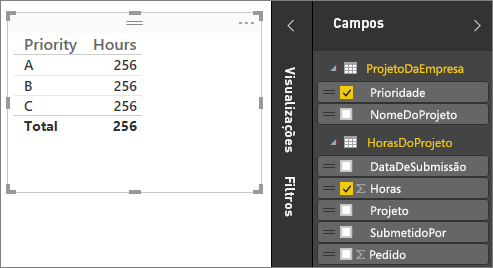

Se olhar para a tabela na tela Relatório, verá que o número de horas é **256.00** para cada projeto, sendo também o total. Obviamente isto não está correto. Porquê? Porque não podemos calcular uma soma total dos valores de uma tabela (Hours na tabela Project), dividida pelos valores na outra tabela (Priority na tabela CompanyProject) sem que exista uma relação entre estas duas tabelas.

Portanto, vamos criar uma relação entre estas duas tabelas.

Lembra-se das colunas que vimos em ambas as tabelas com um nome de projeto, mas com valores parecidos? Vamos utilizá-las para criar uma relação entre as nossas tabelas.

Por quê essas colunas? Bem, se observarmos a coluna Project na tabela ProjectHours, vemos valores como Azul, Vermelho, Amarelo, Laranja e assim por diante. Na verdade, podemos ver várias linhas com o mesmo valor. Assim, temos muitos valores de cor para Project.

Se observarmos a coluna ProjName na tabela CompanyProject, vemos que existe apenas um de cada valor de cor para Project. Cada valor de cor nesta tabela é exclusivo e isso é importante, porque podemos criar uma relação entre essas duas tabelas. Nesse caso, uma relação muitos para um. Numa relação muitos para um, pelo menos uma coluna numa das tabelas tem de conter valores exclusivos. Existem algumas opções adicionais para determinadas relações e vamos analisá-las posteriormente, mas por enquanto, vamos criar uma relação entre as colunas Project em cada uma das duas tabelas.

### Para criar a nova relação
1. Clique em **Gerir Relações**.
2. Em **Gerir Relações**, clique em **Nova**. Esta ação abre a caixa de diálogo **Criar Relação**, onde podemos selecionar as tabelas, colunas e quaisquer definições adicionais que queremos para a relação.
3. Na primeira tabela, selecione **ProjectHours** e, em seguida, selecione a coluna **Project**. Este é o lado muitos da relação.
4. Na segunda tabela, selecione **CompanyProject** e, em seguida, selecione a coluna **ProjName**. Este é o lado um da relação.  
5. Avance e clique em **OK** em ambas as caixas de diálogo **Criar Relação** e **Gerir Relações**.

Com o intuito de fazer a divulgação completa, acabámos realmente por criar esta relação da forma mais complicada. Poderia ter simplesmente clicado no botão Deteção Automática na caixa de diálogo Gerir Relações. Na verdade, a Deteção Automática já teria feito isso automaticamente quando carregou os dados se ambas as colunas tivessem o mesmo nome. Mas qual é o desafio disso?

Agora, vamos analisar novamente a tabela na tela Relatório.

 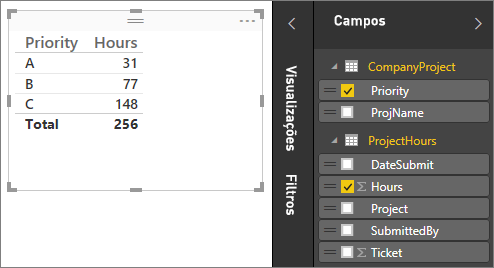

A aparência está muito melhor, não está?

Quando somamos as horas por prioridade, o Power BI Desktop procura cada instância dos valores de cor exclusivos na tabela de referência CompanyProject e procura cada instância de cada um desses valores na tabela CompanyProject; por fim, calcula uma soma total para cada valor exclusivo.

Foi bastante fácil; na verdade, com a Deteção Automática, talvez nem tenha de fazer tudo isto.

## Noções básicas sobre opções adicionais
Quando uma relação é criada, seja com a Deteção Automática ou manualmente, o Power BI Desktop configurará opções adicionais automaticamente com base nos dados das tabelas. Pode configurar estas propriedades de relação adicionais na parte inferior da caixa de diálogo Criar/Editar relação.

 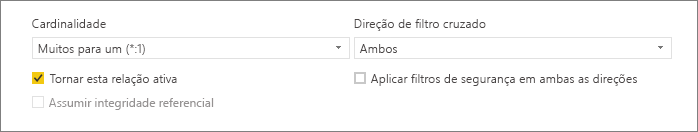

Como dissemos, geralmente são definidas automaticamente e não tem de lidar com elas; no entanto, há várias situações em que talvez queira configurar estas opções.

## Atualizações futuras aos dados requerem uma cardinalidade diferente
Normalmente, o Power BI Desktop pode determinar automaticamente a melhor cardinalidade para a relação.  Se tiver de substituir a definição automática por saber que os dados serão alterados no futuro, pode selecioná-la no controlo Cardinalidade. Vejamos um exemplo em que temos de selecionar uma cardinalidade diferente.

A tabela CompanyProjectPriority abaixo é uma lista de todos os projetos da empresa, incluindo a prioridade de cada um. A tabela ProjectBudget é o conjunto de projetos para os quais o orçamento foi aprovado.

**ProjectBudget**

| **Approved Projects** | **BudgetAllocation** | **AllocationDate** |
|:--- | ---:| ---:|
| Azul |40.000 |1212012 |
| Vermelho |100.000 |1212012 |
| Verde |50.000 |1212012 |

**CompanyProjectPriority**

| **Project** | **Priority** |
| --- | --- |
| Azul |A |
| Vermelho |B |
| Verde |C |
| Amarelo |C |
| Roxo |B |
| Laranja |C |

Se criarmos uma relação entre a coluna Project na tabela CompanyProjectPriority e a coluna ApprovedProjects na tabela ProjectBudget, deste modo:

 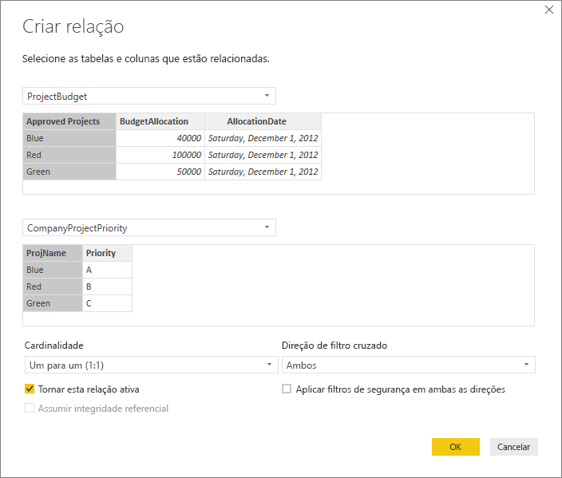

A cardinalidade é definida automaticamente como Um Para Um (1:1) e a direção da filtragem cruzada como Ambas (conforme mostrado).  Isto ocorre porque, para o Power BI Desktop, a melhor combinação das duas tabelas tem agora esta aparência:

| **Project** | **Priority** | **BudgetAllocation** | **AllocationDate** |
|:--- | --- | ---:| ---:|
| Azul |A |40.000 |1212012 |
| Vermelho |B |100.000 |1212012 |
| Verde |C |50.000 |1212012 |
| Amarelo |C |  |  |
| Roxo |B |  |  |
| Laranja |C |  |  |

Existe uma relação um para um entre as duas tabelas, porque não há repetição de valores na coluna Project da tabela combinada. A coluna Project é exclusiva, porque cada valor ocorre apenas uma vez; portanto, as linhas das duas tabelas podem ser combinadas diretamente sem nenhuma duplicação.

Mas digamos que sabe que os dados serão alterados da próxima vez que os atualizar. Uma versão atualizada da tabela ProjectBudget tem agora linhas adicionais para Azul e Vermelho:

**ProjectBudget**

| **Approved Projects** | **BudgetAllocation** | **AllocationDate** |
| --- | ---:| ---:|
| Azul |40.000 |1212012 |
| Vermelho |100.000 |1212012 |
| Verde |50.000 |1212012 |
| Azul |80.000 |6/1/2013 |
| Vermelho |90.000 |6/1/2013 |

 Isto significa que a melhor combinação das duas tabelas tem agora esta aparência: 

| **Project** | **Priority** | **BudgetAllocation** | **AllocationDate** |
| --- | --- | ---:| ---:|
| Azul |A |40.000 |1212012 |
| Vermelho |B |100.000 |1212012 |
| Verde |C |50.000 |1212012 |
| Amarelo |C |  |  |
| Roxo |B |  |  |
| Laranja |C |  |  |
| Azul |A |80000 |6/1/2013 |
| Vermelho |B |90000 |6/1/2013 |

Nesta nova tabela combinada, existe repetição de valores na coluna Project.  As duas tabelas originais não terão uma relação um para um depois de a tabela ser atualizada. Neste caso, por sabermos que as atualizações futuras farão com que a coluna Project tenha duplicados, queremos definir a Cardinalidade como Muitos Para Um (\*:1), com Muitos no lado de ProjectBudget e Um no lado de CompanyProjectPriority.

## Ajustar a direção de filtro cruzado para um conjunto complexo de tabelas e relações
Para a maioria das relações, a direção de filtro cruzado é definida como "Ambas".  No entanto, existem algumas circunstâncias mais invulgares em que talvez tenha de definir isto de forma diferente da predefinição, como se estivesse a importar um modelo de uma versão anterior do PowerPivot, na qual cada relação é configurada para uma única direção. 

A definição Ambas permite ao Power BI Desktop tratar todos os aspetos das tabelas ligadas como se fossem uma única tabela.  No entanto, existem algumas situações em que o Power BI Desktop não pode definir a direção de filtro cruzado da relação como "Ambas" e, ao mesmo tempo, manter um conjunto inequívoco de predefinições disponíveis para relatórios. Se a direção de filtro cruzado de uma relação não estiver definida como Ambas, é geralmente porque iria criar ambiguidade.  Se a predefinição de filtro cruzado não estiver a funcionar, experimente defini-la para uma tabela específica ou Ambas.

A filtragem cruzada numa única direção funciona em inúmeras situações.  Na verdade, se importar um modelo do PowerPivot no Excel 2013 ou anterior, todas as relações serão definidas para uma única direção.  A utilização de uma única direção significa que as opções de filtragem, em tabelas ligadas, funcionam na tabela na qual está a ocorrer o trabalho de agregação de valores.  Por vezes, compreender a filtragem cruzada pode ser um pouco difícil, por isso, vamos analisar um exemplo.

 

Com a filtragem cruzada de direção única, se criar um relatório que resume as horas de projeto, pode optar por resumir (ou filtrar) por CompanyProject, Priority ou CompanyEmployee, City.   No entanto, se quiser contar o número de colaboradores por projeto (uma pergunta menos comum), isso não funcionará. Obterá uma coluna de valores todos iguais.  No exemplo abaixo, a direção de filtragem cruzada de ambas as relações está definida como uma única direção, em direção à tabela ProjectHours:

 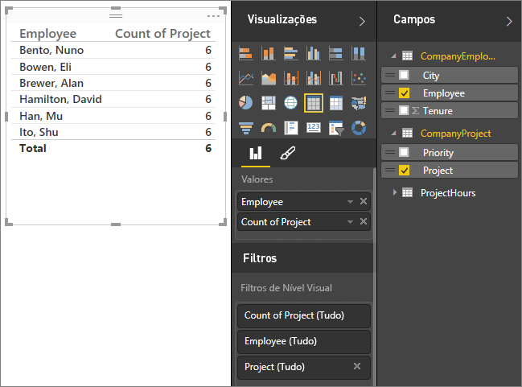

A especificação de filtro fluirá de CompanyProject para CompanyEmployee (conforme mostrado na imagem abaixo), mas, o fluxo não chegará até CompanyEmployee.  No entanto, se definir a direção de filtragem cruzada como Ambas, funcionará.  A definição Ambas permite à especificação de filtro fluir até Employee.

 

Com a direção de filtragem cruzada definida como Ambas, o relatório parece agora correto:

 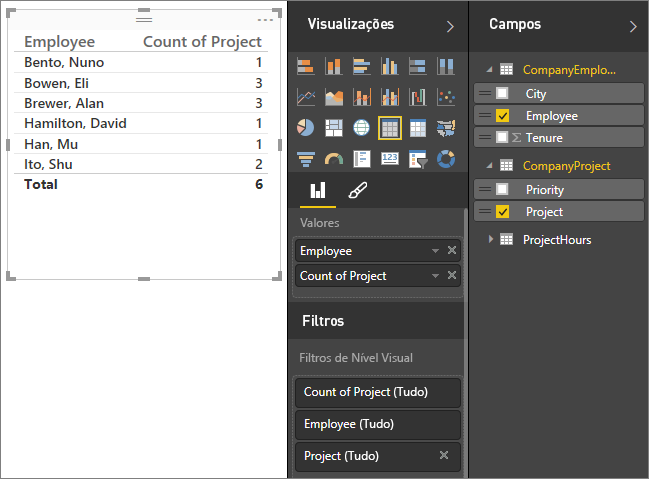

A filtragem cruzada em ambas as direções funciona bem para um padrão de relações de tabela que se assemelham ao padrão acima. Isto é mais frequentemente designado por esquema em estrela, como este:

 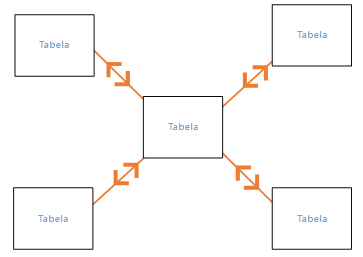

A direção de filtragem cruzada não funciona bem com um padrão mais geral encontrado com frequência em bases de dados, como neste diagrama:

 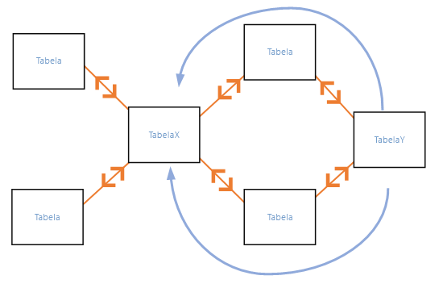

Se tiver um padrão de tabela como este, com ciclos, a filtragem cruzada pode criar um conjunto ambíguo de relações. Por exemplo, se somar um campo da Tabela X e, em seguida, optar por filtrar por um campo na Tabela Y, o percurso que o filtro deve fazer não fica claro, pela tabela superior ou pela inferior. Um exemplo comum para este tipo de padrão é a Tabela X como uma tabela Sales com dados reais e a Tabela Y ser de dados de orçamento. Em seguida, as tabelas no meio são tabelas de referência utilizadas por ambas as tabelas, como Divisão ou Região. 

Tal como acontece com relações ativas/inativas, o Power BI Desktop não permite que uma relação seja definida como Ambas se isso gerar ambiguidade nos relatórios. Existem várias formas diferentes de lidar com isto. Seguem-se as duas mais comuns:

* Eliminar ou marcar as relações como inativas para reduzir a ambiguidade. Em seguida, pode definir a filtragem cruzada de uma relação como Ambas.
* Inclua uma tabela duas vezes (com um nome diferente na segunda vez) para eliminar os ciclos.  Isto torna o padrão de relações semelhante a um esquema em estrela.  Com um esquema em estrela, todas as relações podem ser definidas como Ambas.

## Relação ativa errada
Quando o Power BI Desktop cria relações automaticamente, por vezes encontra mais de uma relação entre duas tabelas.  Quando isso acontece, apenas uma das relações é definida como ativa.  A relação ativa serve de relação padrão para que, quando selecionar campos de duas tabelas diferentes, o Power BI Desktop possa criar automaticamente uma visualização.  No entanto, em alguns casos, a relação selecionada automaticamente pode estar errada.  Pode utilizar a caixa de diálogo Gerir Relações para definir uma relação como ativa ou inativa, ou definir a relação ativa na caixa de diálogo Editar relação. 

Para garantir que existe uma relação padrão, o Power BI Desktop permite apenas uma relação ativa entre duas tabelas num determinado momento.  Assim, tem de definir primeiro a relação atual como inativa e, em seguida, definir como ativa a relação desejada.

Vejamos um exemplo. Esta primeira tabela é ProjectTickets, a tabela a seguir é EmployeeRole.

**ProjectTickets**

| **Ticket** | **OpenedBy** | **SubmittedBy** | **Hours** | **Project** | **DateSubmit** |
| ---:|:--- |:--- | ---:|:--- | ---:|
| 1001 |Tom Perham |Alan Brewer |22 |Azul |1/1/2013 |
| 1002 |Daniel Romano |Alan Brewer |26 |Vermelho |2/1/2013 |
| 1003 |Daniel Roth |Shu Ito |34 |Amarelo |1242012 |
| 1004 |Tom Perham |Alan Brewer |13 |Laranja |1/2/2012 |
| 1005 |Daniel Romano |Eli Bowen |29 |Roxo |1012013 |
| 1006 |Daniel Roth |Nuno Bento |35 |Verde |2/1/2013 |
| 1007 |Daniel Roth |David Hamilton |10 |Amarelo |1012013 |
| 1008 |Tom Perham |Mu Han |28 |Laranja |1/2/2012 |
| 1009 |Daniel Romano |Shu Ito |22 |Roxo |2/1/2013 |
| 1010 |Daniel Roth |Eli Bowen |28 |Verde |1012013 |
| 1011 |Tom Perham |Eli Bowen |9 |Azul |10/15/2013 |

**EmployeeRole**

| **Employee** | **Role** |
| --- | --- |
| Nuno Bento |Gestor de Projeto |
| Eli Bowen |Líder de Projeto |
| Alan Brewer |Gestor de Projeto |
| David Hamilton |Líder de Projeto |
| Mu Han |Líder de Projeto |
| Shu Ito |Líder de Projeto |
| Tom Perham |Patrocinador de Projeto |
| Daniel Romano |Patrocinador de Projeto |
| Daniel Roth |Patrocinador de Projeto |

Na verdade, existem duas relações aqui. Uma é entre SubmittedBy na tabela ProjectTickets e Employee na tabela EmployeeRole, enquanto que a outra é entre OpenedBy na tabela ProjectTickets e Employee na tabela EmployeeRole.

 

Se adicionarmos ambas as relações no modelo (OpenedBy primeiro), a caixa de diálogo Gerir Relações mostrará que OpenedBy está ativa:

 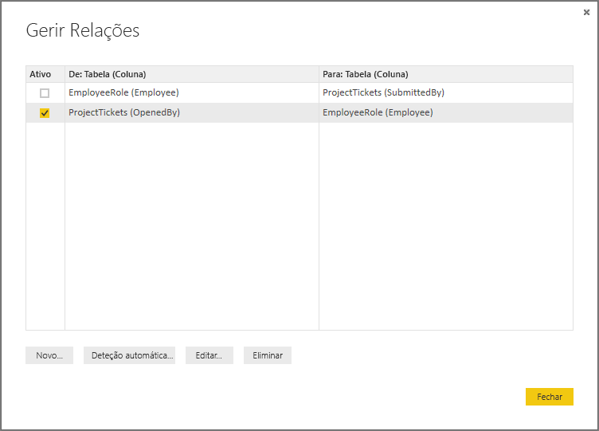

Agora, se criarmos um relatório que utiliza os campos Role e Employee de EmployeeRole, e o campo Hours de ProjectTickets numa visualização de tabela na tela Relatório, veremos apenas os patrocinadores de projeto, porque são os únicos que têm um pedido de projeto aberto.

 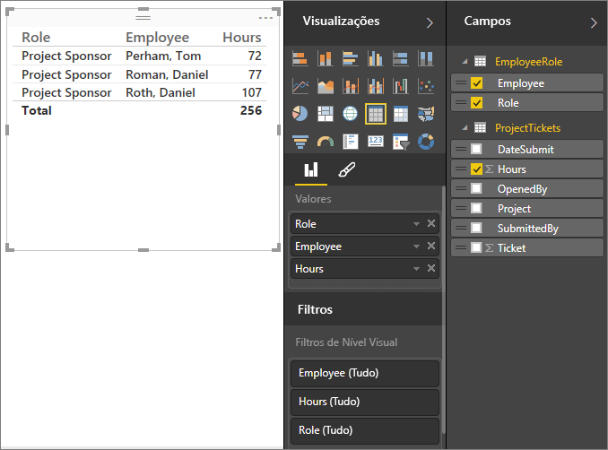

Podemos alterar a relação ativa e obter SubmittedBy em vez de OpenedBy. Em Gerir Relações, desmarcamos a relação entre ProjectTickets(OpenedBy) e EmployeeRole(Employee) e, em seguida, selecionamos a relação entre Project Tickets(SubmittedBy) e EmployeeRole(Employee).

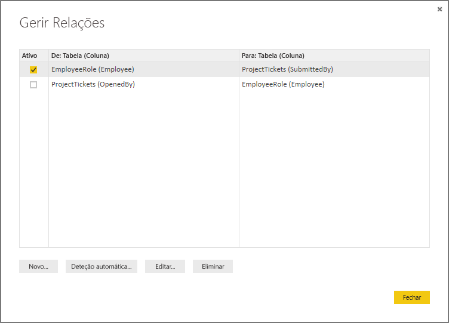

## Ver todas as relações na Vista de Relação
Por vezes, o modelo tem múltiplas tabelas e relações complexas. A Vista de Relação no Power BI Desktop mostra todas as relações no modelo, a direção e a cardinalidade num diagrama fácil de entender e personalizável. Para saber mais, consulte [Vista de Relações no Power BI Desktop](desktop-relationship-view.md).

