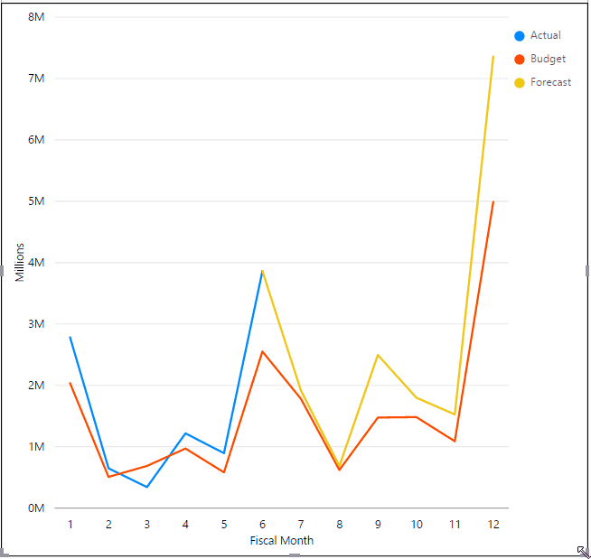
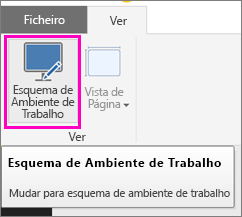
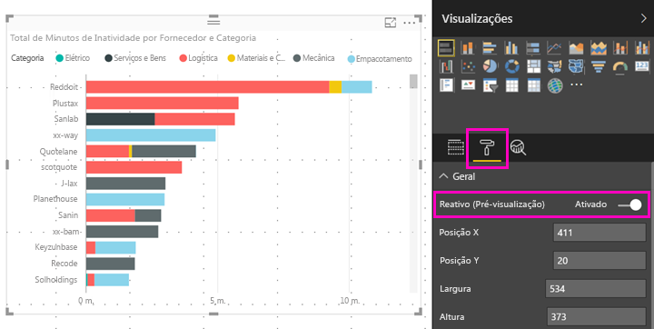

# Otimizar um elemento visual do Power BI para qualquer tamanho
Pode definir os elementos visuais no seu dashboard ou relatório como *reativos*, para que sejam alterados dinamicamente para apresentarem a quantidade máxima de dados e informações, independentemente do tamanho do ecrã.

À medida que o elemento visual muda de tamanho, o Power BI dá prioridade à vista de dados, por exemplo, ao remover o preenchimento e ao mover a legenda para a parte superior do elemento visual automaticamente, para que o elemento visual permaneça informativo mesmo enquanto fica mais pequeno. A capacidade de resposta é especialmente útil em elementos visuais na aplicação móvel do Power BI em telemóveis.

Pode ativar a capacidade de resposta para qualquer elemento visual com os eixos X e Y, e as segmentações.

## Ativar a capacidade de resposta no Power BI Desktop
1. No Power BI Desktop, no separador **Ver**, certifique-se de que está no **Esquema de Ambiente de Trabalho**.
   
    
2. Selecione um elemento visual e, no painel **Visualizações**, selecione a secção **Formato**.
3. Expanda **Geral** > deslize **Reativo** para **Ligado**.
   
    
   
     Agora, quando [criar um relatório otimizado para telemóvel](desktop-create-phone-report.md) e adicionar este elemento visual, o mesmo será redimensionado corretamente.

## Ativar a capacidade de resposta no serviço Power BI
Ative a capacidade de resposta para um elemento visual num relatório do serviço Power BI. Terá de conseguir editar o relatório.

1. Num relatório no serviço Power BI ([https://powerbi.com](https://powerbi.com)), selecione **Editar Relatório**.
2. Selecione um elemento visual e, no painel **Visualizações**, selecione a secção **Formato**.
3. Expanda **Geral** > deslize **Reativo** para **Ligado**.
   
    
   
     Agora, quando [criar uma vista de telemóvel de um dashboard](service-create-dashboard-mobile-phone-view.md) e adicionar este elemento visual, será redimensionado corretamente.

## Passos seguintes
* [Criar relatórios otimizados para aplicações de telemóvel do Power BI](desktop-create-phone-report.md)
* [Criar uma vista de telemóvel de um dashboard no Power BI](service-create-dashboard-mobile-phone-view.md)
* [Ver relatórios do Power BI otimizados para o seu telemóvel](mobile-apps-view-phone-report.md)
* Mais perguntas? [Experimente perguntar à Comunidade do Power BI](http://community.powerbi.com/)

