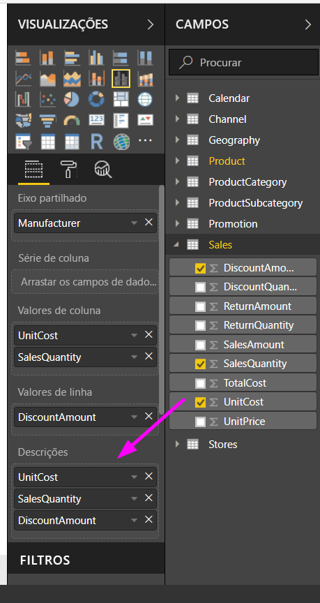
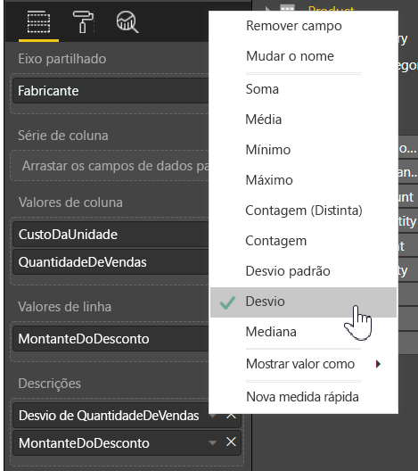

# Personalizar Descrições no Power BI Desktop
As descrições são uma forma elegante de fornecer informações mais contextuais e detalhes para pontos de dados num elemento visual. A imagem seguinte mostra uma descrição aplicada a um gráfico no Power BI Desktop.

Quando uma visualização é criada, a descrição predefinida apresenta o valor e a categoria do ponto de dados. Existem várias instâncias em que a personalização das informações de descrição é útil e poderia fornecer contexto e informações adicionais aos utilizadores que visualizam o elemento visual. As descrições personalizadas permitem-lhe especificar os pontos de dados adicionais que são apresentados como parte da descrição.

## Como personalizar descrições
Para criar uma descrição personalizada, no poço **Campos** do painel **Visualizações**, arraste um campo para o registo **Descrições**, mostrado na imagem seguinte. Na seguinte imagem, foram colocados dois campos no registo **Descrições**.

Depois de as descrições serem adicionadas ao conjunto de campos, pairar o rato sobre um ponto de dados na visualização apresentará os valores desses campos na descrição.

## Personalizar as descrições com agregação ou Cálculos Rápidos
Pode personalizar ainda mais uma descrição, ao selecionar uma função de agregação ou um *Cálculo Rápido*, selecionando a seta junto do campo no registo **Descrições** e selecionando entre as opções disponíveis.

Existem várias formas de personalizar **descrições**, com qualquer campo disponível no conjunto de dados, para transmitir informações rápidas aos utilizadores que visualizam os dashboards ou relatórios.

