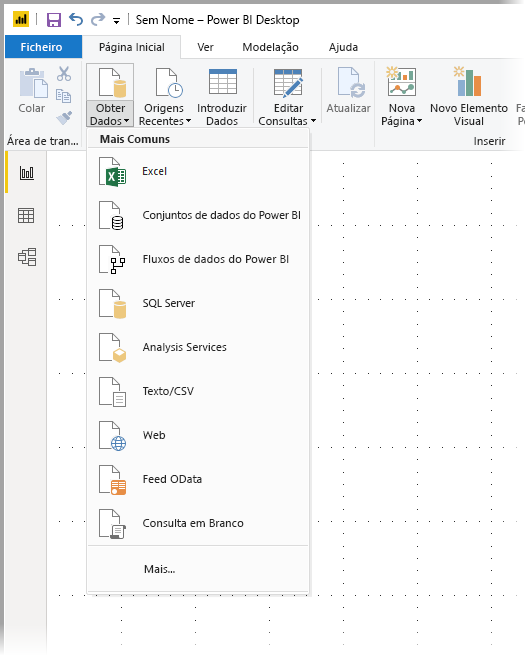
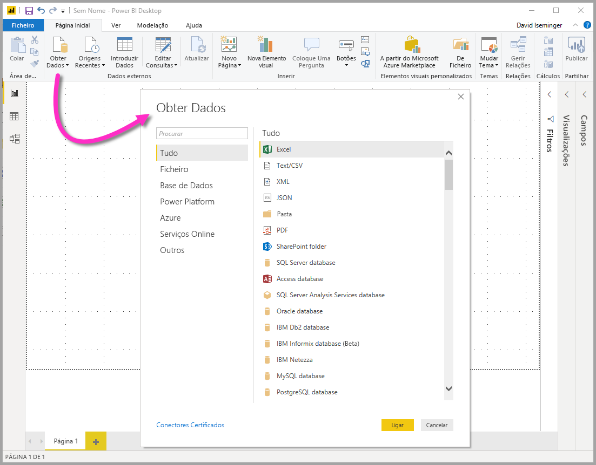
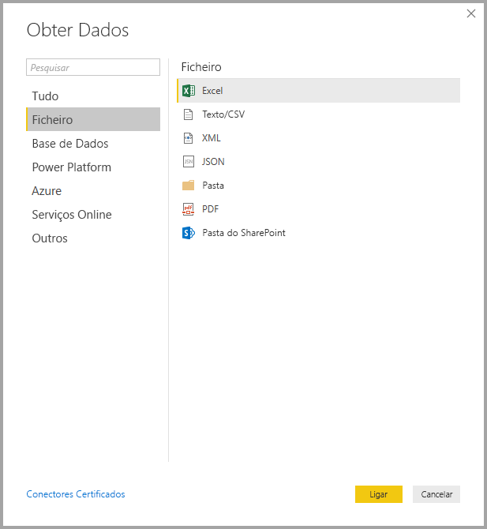
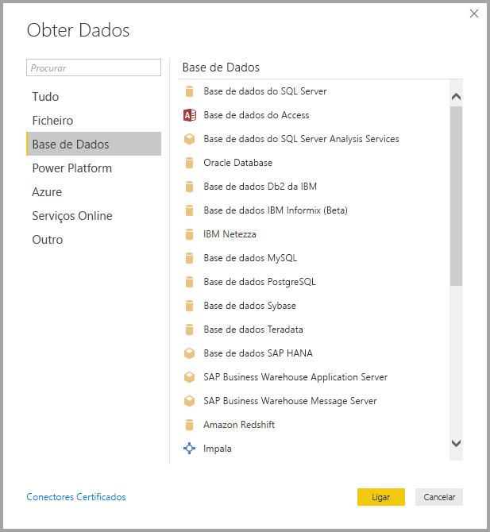
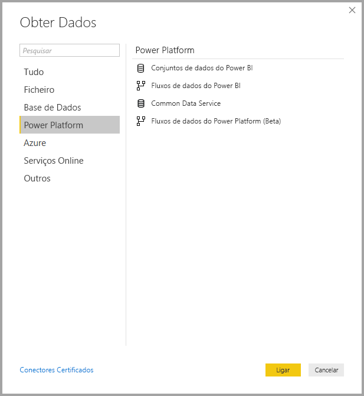
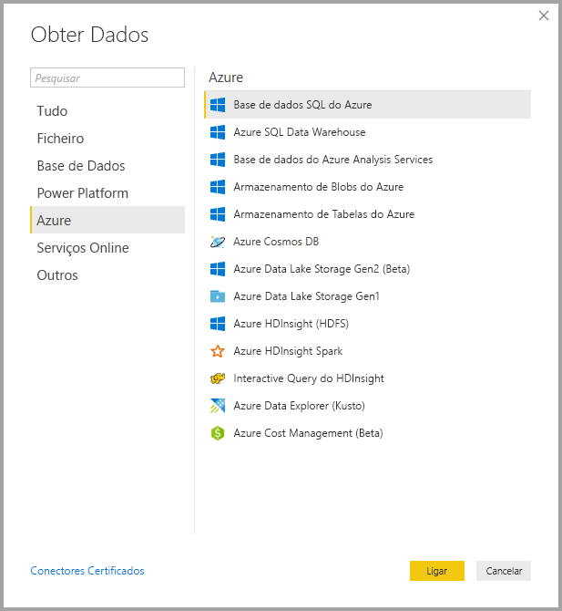
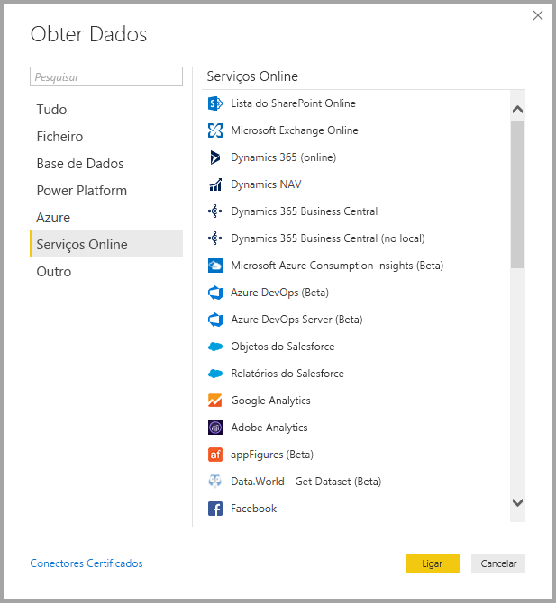
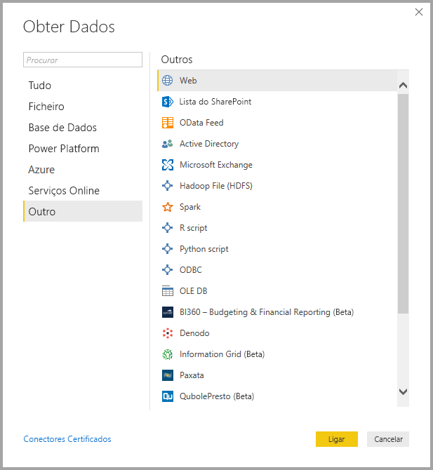
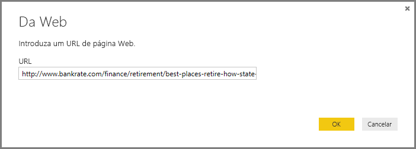
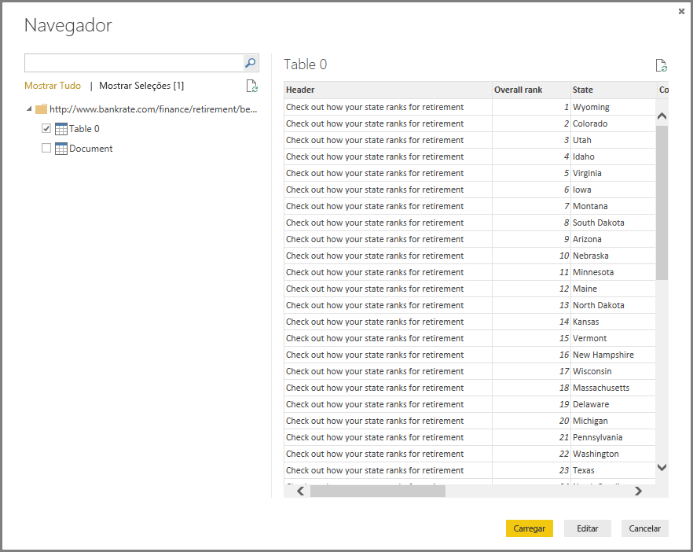

# <a name="data-sources-in-power-bi-desktop"></a>Origens de dados no Power BI Desktop

O Power BI Desktop permite ligar-se a dados de várias origens diferentes. Para obter uma lista completa de origens de dados, veja [Origens de dados do Power BI](power-bi-data-sources.md).

Para se ligar a dados, selecione **Obter Dados** No friso **Base**. Selecionar a seta para baixo ou o texto **Obter Dados** no botão mostra o menu dos tipos de dados **Mais Comuns**, apresentado na imagem seguinte:



Selecionar **Mais…** no menu **Mais Comuns** mostra a janela **Obter Dados**. Também pode abrir a janela **Obter Dados** (e ignorar o menu **Mais Comuns**) ao selecionar o **botão do ícone** **Obter Dados** diretamente.



> [!NOTE]
> A equipa do Power BI está continuamente a expandir as origens de dados disponíveis para o **Power BI Desktop** e o **serviço Power BI**. Como tal, verá frequentemente versões anteriores de origens de dados em construção marcadas como *Beta* ou *Pré-visualização*. Qualquer origem de dados marcada como *Beta* ou *Pré-visualização* tem suporte e funcionamento limitados, não devendo ser utilizada em ambientes de produção. Além disso, qualquer origem de dados marcada como *Beta* ou *Pré-visualização* para o **Power BI Desktop** pode não estar disponível para utilização no **serviço Power BI** ou noutros serviços da Microsoft, até que a origem de dados fique disponível para o público.

## <a name="data-sources"></a>Origens de dados
Os tipos de dados são organizados nas categorias a seguir:

* Tudo
* Ficheiro
* Base de Dados
* Power BI
* Azure
* Serviços Online
* Outros

A categoria **Todos** inclui todos os tipos de ligação de dados de todas as categorias.

A categoria **Ficheiro** fornece as seguintes ligações de dados:

* Excel
* Texto/CSV
* XML
* JSON
* Pasta
* PDF
* Pasta do SharePoint

A imagem seguinte mostra a janela **Obter Dados** para **Ficheiro**.



A categoria **Base de dados** fornece as seguintes ligações de dados:

* Base de Dados do SQL Server
* Base de Dados do Access
* Base de Dados do SQL Server Analysis Services
* Base de Dados Oracle
* Base de Dados IBM DB2
* Base de dados IBM Informix (Beta)
* IBM Netezza
* Base de Dados MySQL
* Base de Dados PostgreSQL
* Base de Dados Sybase
* Teradata
* Base de Dados do SAP HANA
* SAP Business Warehouse Application Server
* SAP Business Warehouse Message Server
* Amazon Redshift
* Impala
* Google BigQuery
* Vertica
* Snowflake
* Essbase
* Cubos AtScale
* Conector BI
* Dremio
* Exasol
* Indexima (Beta)
* InterSystems IRIS (Beta)
* Jethro (Beta)
* Kyligence Enterprise (Beta)
* MarkLogic (Beta)

> [!NOTE]
> Alguns conectores de base de dados requerem que os ative ao selecionar **Ficheiro > Opções e definições > Opções** e, em seguida, selecionar **Funcionalidades de Pré-visualização** e ativar o conector. Se não vir alguns dos conectores mencionados acima e pretender utilizá-los, consulte as suas definições de **Funcionalidades de Pré-visualização**. Note também que qualquer origem de dados marcada como *Beta* ou *Pré-visualização* tem suporte e funcionamento limitados, não devendo ser utilizada em ambientes de produção.

A imagem a seguir mostra a janela **Obter Dados** para **Base de dados**.



A categoria do **Power Platform** fornece as seguintes ligações de dados:

* Conjuntos de dados do Power BI
* Fluxos de dados do Power BI
* Common Data Service
* Power Platform dataflows (Fluxos de dados do Power Platform)

A seguinte imagem mostra a janela **Obter Dados** para o **Power Platform**.



A categoria **Azure** fornece as seguintes ligações de dados:

* Base de Dados SQL do Azure
* Azure SQL Data Warehouse
* Base de dados do Azure Analysis Services
* Armazenamento de Blobs do Azure
* Armazenamento de Tabelas do Azure
* Azure Cosmos DB
* Azure Data Lake Storage Gen2
* Azure Data Lake Storage Gen1
* Azure HDInsight (HDFS)
* Azure HDInsight Spark
* Interactive Query do HDInsight
* Azure Data Explorer (Kusto)
* Azure Cost Management
* Azure Time Series Insights (Beta)

A imagem a seguir mostra a janela **Obter Dados** para **Azure**.



A categoria **Serviços Online** fornece as seguintes ligações de dados:

* Lista do SharePoint Online
* Microsoft Exchange Online
* Dynamics 365 (online)
* Dynamics NAV
* Dynamics 365 Business Central
* Dynamics 365 Business Central (no local)
* Microsoft Azure Consumption Insights (Beta)
* Azure DevOps (Beta)
* Azure DevOps Server (Beta)
* Objetos do Salesforce
* Relatórios do Salesforce
* Google Analytics
* Adobe Analytics
* appFigures (Beta)
* Data.World – Obter Conjunto de Dados (Beta)
* Facebook
* GitHub (Beta)
* MailChimp (Beta)
* Marketo (Beta)
* Mixpanel (Beta)
* Planview Enterprise One – PRM (Beta)
* Planview Projectplace (Beta)
* QuickBooks Online (Beta)
* Smartsheet
* SparkPost (Beta)
* Stripe (Beta)
* SweetIQ (Beta)
* Planview Enterprise One - CMT (Beta)
* Twilio (Beta)
* tyGraph (Beta)
* Webtrends (Beta)
* ZenDesk (Beta)
* Dynamics 365 for Customer Insights (Beta)
* Origem de Dados Emigo (Beta)
* Entersoft Business Suite (Beta)
* Industrial App Store
* Intune Data Warehouse (Beta)
* Segurança do Microsoft Graph (Beta)
* Quick Base
* TeamDesk (Beta)


A imagem a seguir mostra a janela **Obter Dados** para **Serviços Online**.



A categoria **Outros** fornece as seguintes ligações de dados:

* Web
* Lista do SharePoint
* Feed OData
* Active Directory
* Microsoft Exchange
* Ficheiro Hadoop (HDFS)
* Spark
* Script do R
* Script de Python
* ODBC
* OLEDB
* BI360 - Budgeting & Financial Reporting (Beta)
* Denodo
* Information Grid (Beta)
* Paxata 
* QubolePresto (Beta)
* Roamler (Beta)
* SurveyMonkey (Beta)
* Tenforce (Smart)List (Beta)
* Workforce Dimensions (Beta)
* Consulta em Branco

A imagem a seguir mostra a janela **Obter Dados** para **Outros**.



> [!NOTE]
> Atualmente, não é possível ligar-se a origens de dados personalizadas protegidas através do Azure Active Directory.

## <a name="connecting-to-a-data-source"></a>Ligar a uma origem de dados
Para se ligar a uma origem de dados, selecione a origem de dados na janela **Obter Dados** e selecione **Ligar**. Na imagem que se segue, a opção **Web** é selecionada da categoria de ligação de dados **Outros**.


É apresentada uma janela de ligação específica para o tipo de ligação de dados. Se as credenciais forem precisas, serão pedidas. A imagem a seguir mostra um URL a ser introduzido para ligar a uma origem de dados da Web.



Quando o URL ou as informações de ligação de recurso forem inseridas, selecione **OK**. O Power BI Desktop estabelece a ligação à origem de dados e apresenta as origens de dados disponíveis no **Navegador**.



Pode carregar os dados ao selecionar o botão **Carregar**, na parte inferior do painel **Navegador**, ou editar a consulta antes de carregar os dados ao selecionar o botão **Editar**.

E é tudo o que precisa de saber sobre ligar-se a origens de dados no Power BI Desktop! Experimente ligar-se a dados da nossa cada vez maior lista de origens de dados e consulte esta secção com frequência, pois estamos constantemente a expandir esta lista.

## <a name="using-pbids-files-to-get-data"></a>Utilizar ficheiros PBIDS para obter dados

Os ficheiros PBIDS são ficheiros do Power BI Desktop que possuem uma estrutura específica e têm uma extensão .PBIDS para os identificar como um ficheiro de origem de dados do Power BI.

Pode criar um ficheiro .PBIDS para simplificar a experiência de **Obter Dados** dos criadores de relatórios na sua organização. É recomendado que os administradores criem estes ficheiros para ligações utilizadas com frequência, para facilitar a utilização de ficheiros PBIDS para os novos autores de relatório. 

Quando um autor abre um ficheiro .PBIDS, o Power BI Desktop é aberto e pede ao utilizador as credenciais para autenticar e ligar à origem de dados que é especificada no ficheiro. A caixa de diálogo Navegação é apresentada e o utilizador deve selecionar as tabelas nessa origem de dados para serem carregadas para o modelo. Os utilizadores também poderão ter de selecionar a(s) base(s) de dados se não tiver sido especificada nenhuma no ficheiro .PBIDS. 

Deste ponto em diante, o utilizador pode começar a criar visualizações ou revisitar *Origens recentes* para carregar um novo conjunto de tabelas para o modelo. 

Atualmente, os ficheiros .PBIDS só suportam uma única origem de dados num ficheiro. A especificação de mais do que uma origem de dados resulta num erro. 

Para criar o ficheiro .PBIDS, os administradores devem especificar as entradas necessárias para uma única ligação e podem especificar o modo de ligação, como **DirectQuery** ou **Importação**. Se o **modo** estiver em falta ou for nulo no ficheiro, será pedido ao utilizador que abrir o ficheiro no Power BI Desktop que selecione DirectQuery ou Importação. 

### <a name="pbids-file-examples"></a>Exemplos de ficheiros PBIDS

Esta seção fornece alguns exemplos de origens de dados utilizadas com frequência. O tipo de ficheiro .PBIDS apenas suporta ligações de dados que também são suportadas no Power BI Desktop, com duas exceções: Live Connect e Consulta em branco. 

O ficheiro .PBIDS *não* inclui informações de autenticação nem informações de tabela e de esquema.  

A seguir encontram-se vários exemplos comuns de ficheiro .PBIDS. Estes exemplos não estão completos nem não são exaustivos. Para outras origens de dados, pode consultar o [formato de Referência da Origem de Dados (DSR) para as informações de protocolo e endereço](https://docs.microsoft.com/azure/data-catalog/data-catalog-dsr#data-source-reference-specification).

Estes exemplos são apenas para conveniência, não pretendem ser exaustivos e não incluem todos os conectores suportados no formato DSR. Os administradores ou as organizações podem criar as suas próprias origens de dados ao utilizar estes exemplos como guias, a partir das quais podem criar e dar suporte aos seus próprios ficheiros de origem de dados. 


**Azure AS**
```
{ 
    "version": "0.1", 
    "connections": [ 
    { 
        "details": { 
        "protocol": "analysis-services", 
        "address": { 
            "server": "server-here" 
        }, 
        } 
    } 
    ] 
}
```


 

**Pasta**
```
{ 
  "version": "0.1", 
  "connections": [ 
    { 
      "details": { 
        "protocol": "folder", 
        "address": { 
            "path": "folder-path-here" 
        } 
      } 
    } 
  ] 
} 
```

**OData**
```
{ 
  "version": "0.1", 
  "connections": [ 
    { 
      "details": { 
        "protocol": "odata", 
        "address": { 
            "url": "URL-here" 
        } 
      } 
    } 
  ] 
} 
```
 
**SAP BW**
```
{ 
  "version": "0.1", 
  "connections": [ 
    { 
      "details": { 
        "protocol": "sap-bw-olap", 
        "address": { 
          "server": "server-name-here", 
          "systemNumber": "system-number-here", 
          "clientId": "client-id-here" 
        }, 
      } 
    } 
  ] 
} 
```
 
**SAP Hana**
```
{ 
  "version": "0.1", 
  "connections": [ 
    { 
      "details": { 
        "protocol": "sap-hana-sql", 
        "address": { 
          "server": "server-name-here:port-here" 
        }, 
      } 
    } 
  ] 
} 
```

**Lista do SharePoint**

O URL deve apontar para o site do SharePoint e não para uma lista no site. Os utilizadores obtêm um navegador que lhes permite selecionar uma ou mais listas desse site, cada uma delas torna-se uma tabela no modelo. 
```
{ 
  "version": "0.1", 
  "connections": [ 
    { 
      "details": { 
        "protocol": "sharepoint-list", 
        "address": { 
          "url": "URL-here" 
        }, 
       } 
    } 
  ] 
} 
```
 
 
**SQL Server**
```
{ 
  "version": "0.1", 
  "connections": [ 
    { 
      "details": { 
        "protocol": "tds", 
        "address": { 
          "server": "server-name-here", 
          "database": "db-name-here (optional) "
        } 
      }, 
      "options": {}, 
      "mode": "DirectQuery" 
    } 
  ] 
} 
```
 

**Ficheiro de texto**
```
{ 
  "version": "0.1", 
  "connections": [ 
    { 
      "details": { 
        "protocol": "file", 
        "address": { 
            "path": "path-here" 
        } 
      } 
    } 
  ] 
} 
```
 

**Web**
```
{ 
  "version": "0.1", 
  "connections": [ 
    { 
      "details": { 
        "protocol": "http", 
        "address": { 
            "url": "URL-here" 
        } 
      } 
    } 
  ] 
} 
```
 

**Fluxo de dados**
```
{
  "version": "0.1",
  "connections": [
    {
      "details": {
        "protocol": "powerbi-dataflows",
        "address": {
          "workspace":"workspace id (Guid)",
          "dataflow":"optional dataflow id (Guid)",
          "entity":"optional entity name"
        }
       }
    }
  ]
}
```


## <a name="next-steps"></a>Próximos passos
Existem inúmeras coisas que pode fazer com o Power BI Desktop. Para obter mais informações sobre as suas capacidades, veja os seguintes recursos:

* [O que é o Power BI Desktop?](desktop-what-is-desktop.md)
* [Descrição Geral das Consultas no Power BI Desktop](desktop-query-overview.md)
* [Tipos de Dados no Power BI Desktop](desktop-data-types.md)
* [Formatar e Combinar Dados com o Power BI Desktop](desktop-shape-and-combine-data.md)
* [Tarefas Comuns de Consulta no Power BI Desktop](desktop-common-query-tasks.md)    
