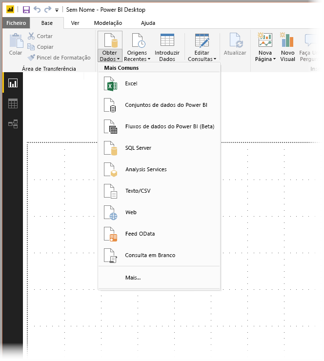
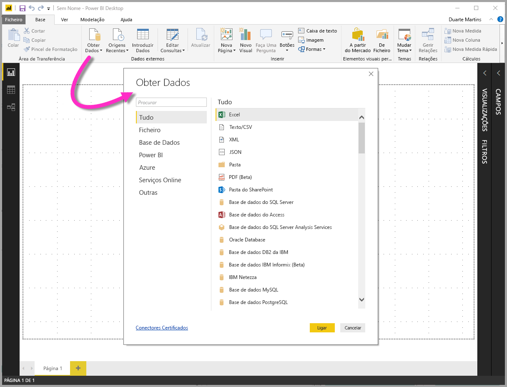
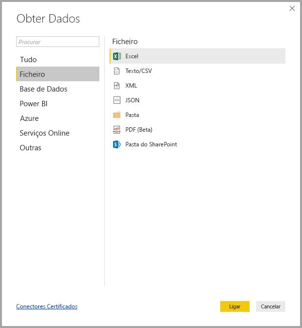
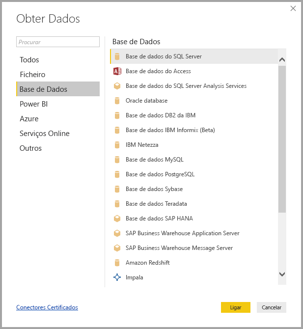
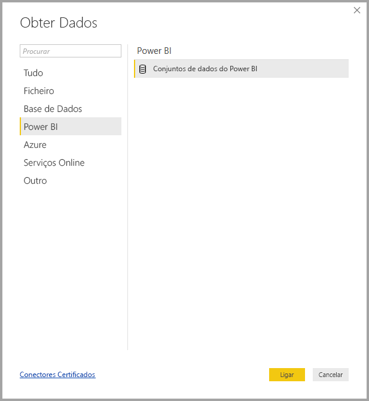
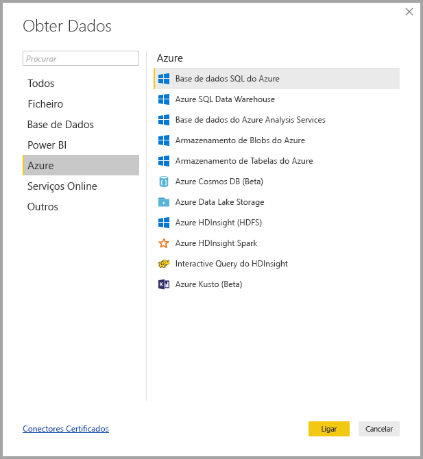
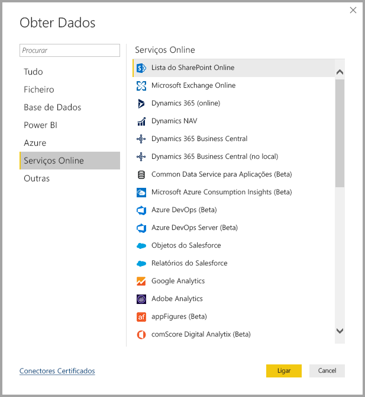
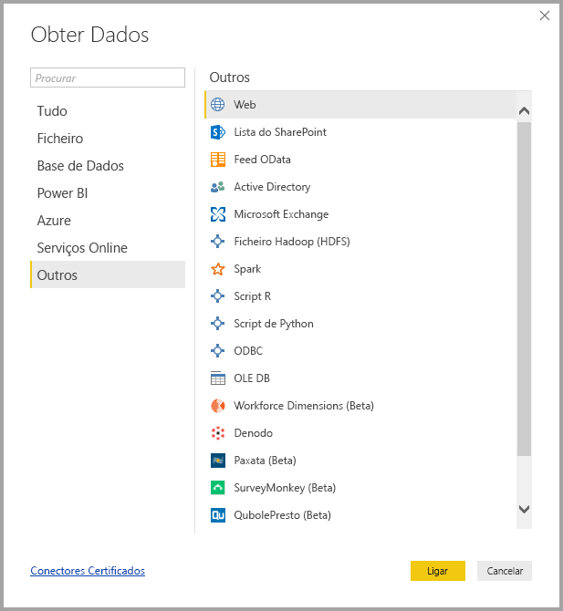

# Origens de dados no Power BI Desktop
O Power BI Desktop permite ligar-se a dados de várias origens diferentes. Veja uma lista completa das origens de dados disponíveis na parte inferior desta página.

Para se ligar a dados, selecione **Obter Dados** No friso **Base**. Selecionar a seta para baixo ou o texto **Obter Dados** no botão mostra o menu dos tipos de dados **Mais Comuns**, apresentado na imagem seguinte:

Selecionar **Mais…** no menu **Mais Comuns** mostra a janela **Obter Dados**. Também pode abrir a janela **Obter Dados** (e ignorar o menu **Mais Comuns**) ao selecionar o botão do ícone **Obter Dados** **diretamente**.

> [!NOTE]
> A equipa do Power BI está continuamente a expandir as origens de dados disponíveis para o **Power BI Desktop** e o **serviço Power BI**. Como tal, verá frequentemente versões anteriores de origens de dados em construção marcadas como *Beta* ou *Pré-visualização*. Qualquer origem de dados marcada como *Beta* ou *Pré-visualização* tem suporte e funcionamento limitados, não devendo ser utilizada em ambientes de produção.

## Origens de Dados
Os tipos de dados são organizados nas categorias a seguir:

* Todos
* Ficheiro
* Base de Dados
* Power BI
* Azure
* Serviços Online
* Outros

A categoria **Todos** inclui todos os tipos de ligação de dados de todas as categorias.

A categoria **Ficheiro** fornece as seguintes ligações de dados:

* Excel
* Texto/CSV
* XML
* JSON
* Pasta
* PDF
* Pasta do SharePoint

A imagem seguinte mostra a janela **Obter Dados** para **Ficheiro**.

A categoria **Base de dados** fornece as seguintes ligações de dados:

* Base de Dados do SQL Server
* Base de Dados do Access
* Base de Dados do SQL Server Analysis Services
* Base de Dados Oracle
* Base de Dados IBM DB2
* Base de dados IBM Informix (Beta)
* IBM Netezza
* Base de Dados MySQL
* Base de Dados PostgreSQL
* Base de Dados Sybase
* Base de Dados Teradata
* Base de Dados do SAP HANA
* SAP Business Warehouse Application Server
* SAP Business Warehouse Message Server
* Amazon Redshift
* Impala
* Google BigQuery
* Vertica
* Snowflake
* Essbase
* Cubos AtScale (Beta)
* Conector BI
* Dremio
* Exasol
* Indexima (Beta)
* InterSystems IRIS (Beta)
* Jethro (Beta)
* Kyligence Enterprise (Beta)
* MarkLogic (Beta)

> [!NOTE]
> Alguns conectores de base de dados requerem que os ative ao selecionar **Ficheiro > Opções e definições > Opções** e, em seguida, selecionar **Funcionalidades de Pré-visualização** e ativar o conector. Se não vir alguns dos conectores mencionados acima e pretender utilizá-los, consulte as suas definições de **Funcionalidades de Pré-visualização**. Note também que qualquer origem de dados marcada como *Beta* ou *Pré-visualização* tem suporte e funcionamento limitados, não devendo ser utilizada em ambientes de produção.

A imagem a seguir mostra a janela **Obter Dados** para **Base de dados**.

A categoria **Power BI** fornece as seguintes ligações de dados:

* Conjuntos de dados do Power BI
* Fluxos de dados do Power BI

A imagem a seguir mostra a janela **Obter Dados** para **Power BI**.

A categoria **Azure** fornece as seguintes ligações de dados:

* Base de Dados SQL do Azure
* Azure SQL Data Warehouse
* Base de dados do Azure Analysis Services
* Armazenamento de Blobs do Azure
* Armazenamento de Tabelas do Azure
* Azure Cosmos DB (Beta)
* Geração 1 Lake armazenamento de dados do Azure
* Azure HDInsight (HDFS)
* Azure HDInsight Spark
* Interactive Query do HDInsight
* Explorador de dados do Azure (Kusto)
* Gestão de custos do Azure (Beta)

A imagem a seguir mostra a janela **Obter Dados** para **Azure**.

A categoria **Serviços Online** fornece as seguintes ligações de dados:

* Lista do SharePoint Online
* Microsoft Exchange Online
* Dynamics 365 (online)
* Dynamics NAV
* Dynamics 365 Business Central
* Dynamics 365 Business Central (no local)
* Common Data Service para Aplicações (Beta)
* Microsoft Azure Consumption Insights (Beta)
* Azure DevOps (Beta)
* Azure DevOps Server (Beta)
* Objetos do Salesforce
* Relatórios do Salesforce
* Google Analytics
* Adobe Analytics
* appFigures (Beta)
* Data.World – Obter Conjunto de Dados (Beta)
* Facebook
* GitHub (Beta)
* MailChimp (Beta)
* Marketo (Beta)
* Mixpanel (Beta)
* Planview Enterprise One – PRM (Beta)
* Planview Projectplace (Beta)
* QuickBooks Online (Beta)
* Smartsheet
* SparkPost (Beta)
* Stripe (Beta)
* SweetIQ (Beta)
* Planview Enterprise One - CMT (Beta)
* Twilio (Beta)
* tyGraph (Beta)
* Webtrends (Beta)
* ZenDesk (Beta)
* Origem de Dados Emigo (Beta)
* IndustrialAppStore (Beta)
* Segurança do Microsoft Graph (Beta)
* TeamDesk (Beta)

A imagem a seguir mostra a janela **Obter Dados** para **Serviços Online**.

A categoria **Outros** fornece as seguintes ligações de dados:

* Web
* Lista do SharePoint
* Feed OData
* Active Directory
* Microsoft Exchange
* Ficheiro Hadoop (HDFS)
* Spark
* Script do R
* Script de Python
* ODBC
* OLEDB
* BI360 - orçamento e financeiro relatórios (Beta)
* Denado
* Grelha de informações (Beta)
* Paxata 
* QubolePresto (Beta)
* Quick Base (Beta)
* Roamler (Beta)
* SurveyMonkey (Beta)
* Tenforce (Beta)
* Workforce Dimensions (Beta)
* Consulta em Branco

A imagem a seguir mostra a janela **Obter Dados** para **Outros**.

> [!NOTE]
> Atualmente, não é possível ligar-se a origens de dados personalizadas protegidas através do Azure Active Directory.

## Ligar a uma Origem de Dados
Para se ligar a uma origem de dados, selecione a origem de dados na janela **Obter Dados** e selecione **Ligar**. Na imagem que se segue, a opção **Web** é selecionada da categoria de ligação de dados **Outros**.

É apresentada uma janela de ligação específica para o tipo de ligação de dados. Se as credenciais forem precisas, serão pedidas. A imagem a seguir mostra um URL a ser introduzido para ligar a uma origem de dados da Web.

Quando o URL ou as informações de ligação de recurso forem inseridas, selecione **OK**. O Power BI Desktop estabelece a ligação à origem de dados e apresenta as origens de dados disponíveis no **Navegador**.

Pode carregar os dados ao selecionar o botão **Carregar**, na parte inferior do painel **Navegador**, ou editar a consulta antes de carregar os dados ao selecionar o botão **Editar**.

E é tudo o que precisa de saber sobre ligar-se a origens de dados no Power BI Desktop! Experimente ligar-se a dados da nossa cada vez maior lista de origens de dados e consulte esta secção com frequência, pois estamos constantemente a expandir esta lista.

## Próximos passos
Existem inúmeras coisas que pode fazer com o Power BI Desktop. Para obter mais informações sobre as suas capacidades, veja os seguintes recursos:

* [O que é o Power BI Desktop?](desktop-what-is-desktop.md)
* [Descrição Geral das Consultas no Power BI Desktop](desktop-query-overview.md)
* [Tipos de Dados no Power BI Desktop](desktop-data-types.md)
* [Formatar e Combinar Dados com o Power BI Desktop](desktop-shape-and-combine-data.md)
* [Tarefas Comuns de Consulta no Power BI Desktop](desktop-common-query-tasks.md)    
