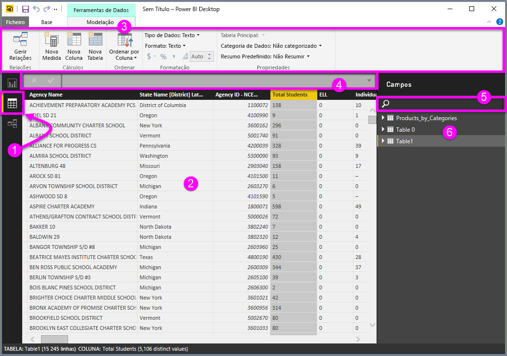
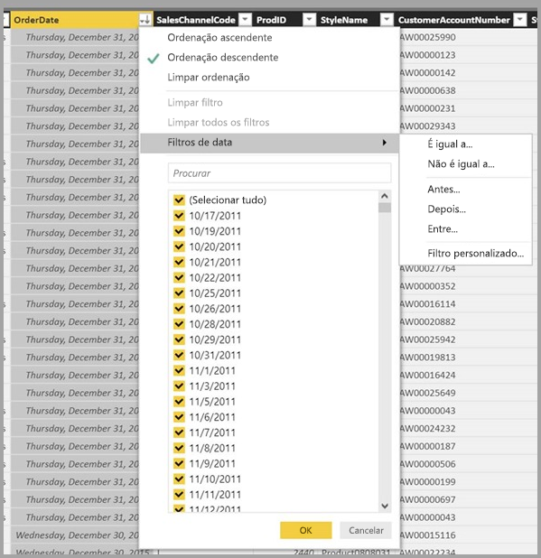

# Vista de Dados no Power BI Desktop
A **Vista de Dados** ajuda a inspecionar, explorar e compreender os dados no modelo do **Power BI Desktop**. É diferente do modo que vê tabelas, colunas e dados no **Editor de Consultas**. Com a Vista de Dados, está a ver os seus dados *após* eles terem sido carregados no modelo.

Quando está a modelar seus dados, às vezes deseja ver o que está realmente numa tabela ou coluna, sem criar um elemento visual na tela de relatório, geralmente imediatamente abaixo do nível de linha. Isto é particularmente útil quando está a criar colunas calculadas e medidas, ou quando precisa de identificar um tipo de dados ou uma categoria de dados.

Analisemos mais detalhadamente alguns dos elementos que se encontram na **Vista de Dados**.

1. **Ícone da Vista de Dados** – selecione este ícone para aceder à Vista de Dados.

2. **Grelha de Dados** – esta opção mostra a tabela selecionada e todas as colunas e linhas presentes na mesma. As colunas ocultadas da **Vista de Relatório** aparecem acinzentadas. Pode clicar com o botão direito do rato numa coluna para ver as opções.

3. **Friso de modelagem** – aqui pode gerir relações, criar cálculos, alterar o tipo de dados, a formatação ou a categoria de dados de uma coluna.

4. **Barra de fórmulas** – insira fórmulas DAX para Medidas e Colunas calculadas.

5. **Pesquisa** – procure uma tabela ou coluna no seu modelo.

6. **Lista de campos** – selecione uma tabela ou coluna para ver na grelha de dados.

## Filtragem na Vista de Dados

Também pode filtrar e ordenar dados na **Vista de Dados**. Cada coluna mostra um ícone que identifica a direção de ordenação (se estiver aplicada).

Pode filtrar valores individuais ou utilizar a filtragem avançada com base nos dados na coluna. 

> [!NOTE]
> Quando um modelo do Power BI é criado numa cultura diferente da utilizada na interface do utilizador atual (por exemplo, o modelo foi criado em inglês dos EUA e está a vê-lo em espanhol), a caixa de pesquisa irá aparecer na interface do utilizador da Vista de Dados apenas para campos de texto.
