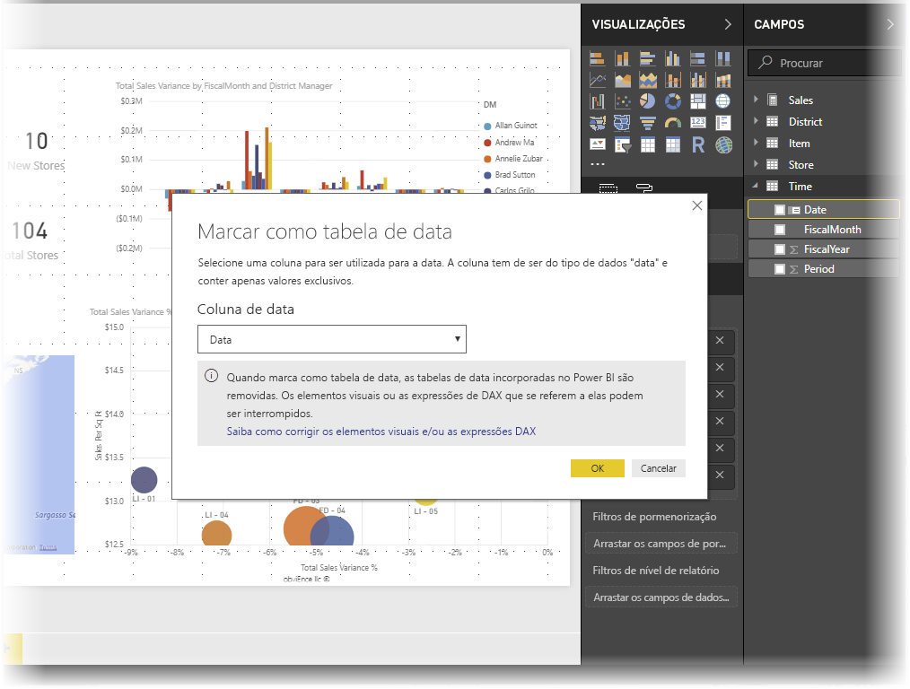
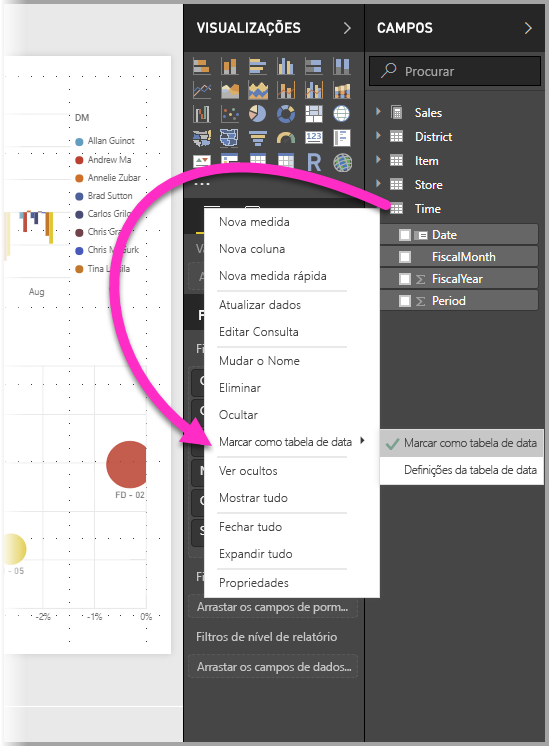
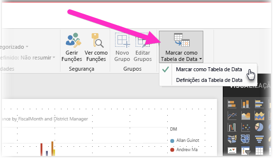
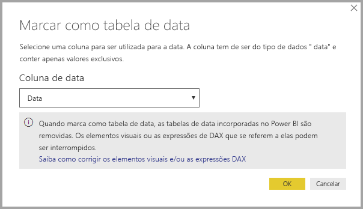
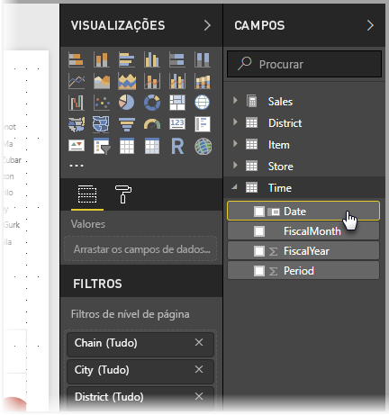
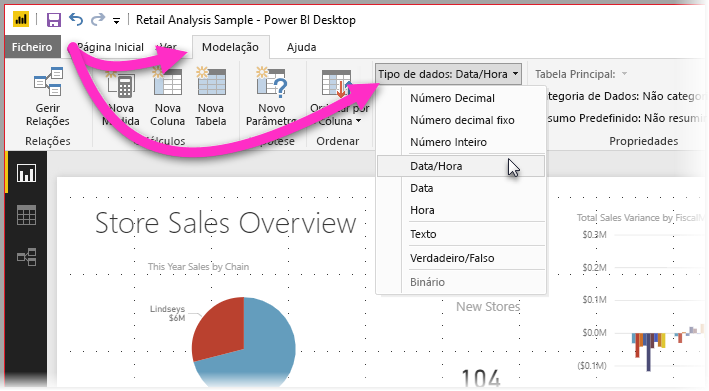

# Definir e utilizar tabelas de datas no Power BI Desktop

O **Power BI Desktop** funciona nos bastidores para identificar automaticamente colunas que representam datas e, em seguida, cria hierarquias de datas e outros metadados de ativação para o modelo, em seu nome. Em seguida, pode utilizar essas hierarquias incorporadas ao criar funcionalidades do relatório, como elementos visuais, tabelas, medidas rápidas, segmentações de dados e assim sucessivamente. O Power BI Desktop fá-lo ao criar tabelas ocultas em seu nome, que, em seguida, pode utilizar para os relatórios e expressões DAX.

Muitos analistas de dados preferem criar as suas próprias tabelas de datas. No **Power BI Desktop**, pode especificar a tabela que pretende que o modelo utilize como a **tabela de datas** e, subsequentemente, pode criar, por exemplo, elementos visuais, tabelas e medidas rápidas relacionados com as datas através dos dados das datas dessa tabela. Quando especificar a sua própria tabela de datas, controla as hierarquias de datas criadas no seu modelo e pode utilizá-las em **medidas rápidas** e outras operações que utilizam a tabela de datas do modelo. 

## Definir a sua própria tabela de datas

Para definir uma **tabela de datas**, selecione a tabela que quer utilizar como uma tabela de datas no painel **Campos** e, em seguida, clique com o botão direito do rato na tabela e selecione **Marcar como tabela de datas > Marcar como tabela de datas** no menu apresentado, conforme mostrado na imagem seguinte.

Pode também selecionar a tabela e, em seguida, selecionar **Marcar como Tabela de Datas** no friso **Modelação**, apresentado aqui.

Quando especificar a sua própria **tabela de datas**, o Power BI Desktop realiza as seguintes validações dessa coluna e dos seus dados para garantir que os dados:

* contêm valores exclusivos
* não contêm valores nulos
* contêm valores de datas contíguas (do início ao fim)
* Se for um tipo de dados **Data/Hora**, têm o mesmo carimbo de data/hora em cada valor

Existem dois cenários prováveis para criar a sua própria tabela de datas, sendo que qualquer uma delas é uma abordagem razoável:

* O primeiro cenário é quando utiliza uma hierarquia e uma tabela de datas básica ou canónica. Esta é uma tabela nos dados que cumpre os critérios de validação descritos anteriormente para uma tabela de datas. 

* O segundo cenário é quando utiliza uma tabela do Analysis Services, por exemplo, com um campo *dim date* que quer utilizar como a tabela de datas. 

Depois de especificar uma tabela de datas, pode selecionar a coluna dessa tabela que é a coluna de data. Pode especificar a coluna que quer utilizar ao selecionar a tabela no painel **Campos** e, em seguida, clicar com o botão direito na tabela e selecionar **Marcar como tabela de datas > Definições da tabela de datas**. É apresentada a janela seguinte, onde pode selecionar a coluna a utilizar como a tabela de datas na caixa pendente.

É importante ter em conta que quando especificar a sua própria tabela de datas, o **Power BI Desktop** não cria automaticamente as hierarquias que iria criar no modelo em seu nome. Se, mais tarde, desmarcar a tabela de datas (e já não tiver uma tabela de datas manualmente definida), o Power BI Desktop recria as tabelas de datas incorporadas criadas automaticamente para as colunas de datas na tabela.

Também é importante ter em atenção que ao marcar uma tabela como uma tabela de datas, a tabela de datas (criada automaticamente) incorporada que o Power BI Desktop criou é removida e todos os elementos visuais ou expressões DAX que criou anteriormente com base nessas tabelas incorporadas deixarão de funcionar corretamente. 

## Marcar a tabela de datas como o tipo de dados adequado

Quando especificar a sua **tabela de datas**, tem de garantir que o tipo de dados está definido corretamente. Quer definir o **Tipo de dados** para **Data/Hora** ou **Data**. Siga estes passos para o fazer:

1. Selecione a **tabela de datas** no painel **Campos**, expanda-o, se necessário, e selecione a coluna que quer utilizar como a data.
   
     

2. No separador **Modelação**, selecione **Tipo de dados:** e, em seguida, clique na seta para baixo para mostrar os tipos de dados disponíveis.

    

3. Especifique o tipo de dados da coluna. 

## Próximos passos

Poderá também estar interessado nos seguintes artigos.

* [Tipos de dados no Power BI Desktop](desktop-data-types.md)

 
