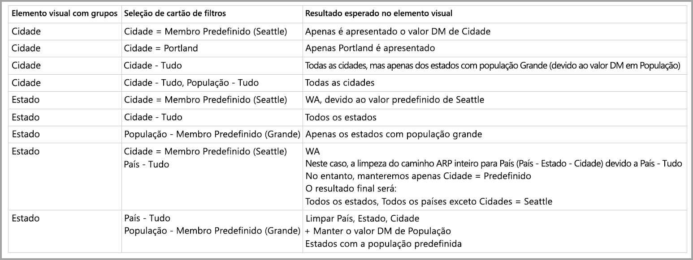

# Membro predefinido em modelos multidimensionais no Power BI

Pode ligar-se a modelos multidimensionais no Power BI e criar relatórios que visualizam todos os tipos de dados no modelo. Ao trabalhar com modelos multidimensionais, o Power BI aplica regras sobre como processa os dados, com base na coluna definida como *membro predefinido*. 

Ao trabalhar com modelos multidimensionais, o Power BI processa os dados do modelo, com base na coluna que contém o **DefaultMember** utilizado. O atributo *DefaultMember* está definido na CSDL (Linguagem de Definição de Esquema Conceitual) para uma determinada coluna num modelo multidimensional. Pode saber mais acerca do membro predefinido no [artigo de propriedades de atributos](https://docs.microsoft.com/sql/analysis-services/multidimensional-models/attribute-properties-define-a-default-member?view=sql-server-2017). Quando uma consulta DAX é executada, o membro predefinido especificado no modelo é aplicado automaticamente.

Este artigo descreve como o Power BI se comporta em diferentes circunstâncias ao trabalhar com modelos multidimensionais, com base no ponto onde se encontra o *membro predefinido*. 

## Trabalhar com cartões de filtro

Ao criar um cartão de filtro num campo com um membro predefinido, o valor do campo do membro predefinido é selecionado automaticamente no cartão de filtro. O resultado é que todos os elementos visuais afetados pelo cartão de filtro mantêm os seus modelos predefinidos na base de dados. Os valores nestes cartões de filtro refletem esse membro predefinido.

Se o membro predefinido for removido, desmarcar o valor limpará todos os elementos visuais aos quais o cartão de filtro se aplica e os valores apresentados não refletirão o membro predefinido.

Por exemplo, imagine que temos uma coluna *Moeda* com um membro predefinido configurado para *USD*:

* Neste caso, se tivermos um cartão que mostra o *Total de Vendas*, o valor terá o membro predefinido aplicado e poderemos ver as vendas que correspondem a “USD”.
* Se arrastarmos a *Moeda* para o painel do cartão de filtro, veremos *USD* como o valor predefinido selecionado. O valor de *Total de Vendas* permanece o mesmo, uma vez que o membro predefinido está aplicado.
* No entanto, se desmarcarmos o valor *USD* do filtro de cartão, o membro predefinido para *Moeda* será limpo e, agora, o *Total de Vendas* refletirá todas as moedas.
* Consequentemente, quando selecionamos outro valor no cartão de filtro (digamos que selecionamos *EURO*), juntamente com o membro predefinido, o *Total de Vendas* reflete o filtro *MOEDA EM {USD, EURO}*.

## Comportamento de agrupamento

No Power BI, sempre que agrupa um elemento visual numa coluna que possui um *membro predefinido*, o Power BI limpa o *membro predefinido* dessa coluna e o caminho da relação do atributo. Tal garante que o elemento visual apresenta todos os valores, ao invés de apenas os valores predefinidos.

## Caminhos da relação do atributo (ARPs)

Os caminhos da relação do atributo (ARPs) fornecem aos *membros predefinidos* capacidades poderosas, mas também introduzem uma certa quantidade de complexidade. Quando são encontrados ARPs, o Power BI segue o caminho dos ARPs para limpar membros predefinidos adicionais noutras colunas, para disponibilizar um processamento de dados consistente e preciso para os elementos visuais.

Vamos examinar um exemplo para esclarecer o comportamento. Considere a seguinte configuração dos ARPs:

Agora, vamos imaginar que os seguintes *membros predefinidos* estão definidos para estas colunas:

* Cidade > Seattle
* Estado > WA
* País > EUA
* População > Grande

Depois, vamos examinar o que acontece quando cada uma das colunas é utilizada no Power BI. Quando os elementos visuais se agrupam nas seguintes colunas, este é o resultado:

* **Cidade** – o Power BI apresenta todas as cidades ao limpar todos os **membros predefinidos** de *Cidade*, *Estado*, *País*, mas conserva o **membro predefinido** de *População*; o Power BI limpa todo o ARP de *Cidade*.
    > [!NOTE]
    > *População* não está no caminho do ARP de *Cidade*, está relacionada exclusivamente com *Estado* e, portanto, o Power BI não a limpa.
* **Estado** – o Power BI apresenta todos os *Estados* ao limpar todos os **membros predefinidos** de *Cidade*, *Estado*, *País* e *População*.
* **País** – o Power BI apresenta todos os países ao limpar todos os **membros predefinidos** de *Cidade*, *Estado* e *País*, mas conserva o **membro predefinido** de *População*.
* **Cidade e Estado** – o Power BI limpa todos os **membros predefinidos** de todas as colunas.

Os grupos apresentados no elemento visual têm todo o caminho do ARP limpo. 

Se um grupo não for apresentado no elemento visual, mas fizer parte do caminho do ARP de outra coluna agrupada, aplicar-se-á o seguinte:

* Nem todos os ramos do caminho do ARP são limpos automaticamente.
* Esse grupo é filtrado na mesma pelo **membro predefinido** não limpo.

### Segmentação de Dados e cartões de filtro

Ao trabalhar com a segmentação de dados ou os cartões de filtro, ocorre o seguinte comportamento:

* Quando uma segmentação de dados ou um cartão de filtro são carregados com dados, o Power BI agrupa na coluna no elemento visual, para que o comportamento de exibição seja o mesmo, tal como descrito na secção anterior.

Uma vez que a segmentação de dados e os cartões de filtro são frequentemente utilizados para interagir com outros elementos visuais, a lógica de limpeza dos **membros predefinidos** dos elementos visuais afetados ocorre conforme explicado na tabela seguinte. 

Nesta tabela, vamos utilizar os mesmos dados de exemplo utilizados anteriormente neste artigo:

As seguintes regras aplicam-se à forma como o Power BI se comporta nessas circunstâncias.

O Power BI limpará um **membro predefinido** de uma determinada coluna se:

* O Power BI agrupar nessa coluna
* O Power BI agrupar numa coluna relacionada a essa coluna (em qualquer lugar no ARP, acima ou abaixo)
* O Power BI filtrar uma coluna que está no ARP (acima ou abaixo)
* A coluna tiver um cartão de filtro com o estado *TUDO*
* A coluna tiver um cartão de filtro com qualquer valor selecionado (o Power BI recebe um filtro para a coluna)

O Power BI não limpará nenhum **membro predefinido** de uma determinada coluna se:

* A coluna tiver um cartão de filtro com o estado predefinido e o Power BI estiver a agrupar numa coluna no ARP.
* A coluna for superior a outra coluna no ARP e o Power BI tiver um cartão de filtro para essa coluna no estado predefinido.

## Próximos passos

Este artigo descreveu o comportamento do Power BI ao trabalhar com membros predefinidos em modelos multidimensionais. Poderá também estar interessado nos seguintes artigos: 

* [Mostrar itens sem dados no Power BI](desktop-show-items-no-data.md)
* [Origens de dados no Power BI Desktop](desktop-data-sources.md)
