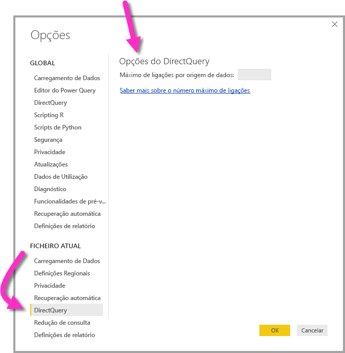

# <a name="about-using-directquery-in-power-bi"></a>Acerca de utilizar o DirectQuery no Power BI

Pode ligar-se a todos os diferentes tipos de origens de dados através do *Power BI Desktop* ou do *serviço Power BI* e pode efetuar essas ligações de dados de formas diferentes. Pode *importar* dados para o Power BI, que é a forma mais comum de os obter, ou ligar-se diretamente aos dados no repositório de origem original, conhecido como *DirectQuery*. Este artigo descreve as funcionalidades do DirectQuery:

* Diferentes opções de conectividade para o DirectQuery
* Orientações para quando deve considerar a utilização do DirectQuery em vez da importação
* Desvantagens da utilização do DirectQuery
* Melhores práticas para utilizar o DirectQuery

Siga as melhores práticas para utilizar a importação ou o DirectQuery:

* Deve importar os dados para o Power BI sempre que possível. A importação utiliza o motor de consultas de elevado desempenho do Power BI e proporciona uma experiência altamente interativa e avançada.
* Se os seus objetivos não puderem ser alcançados através da importação de dados, considere utilizar o DirectQuery. Por exemplo, se os dados são alterados muitas vezes e os relatórios têm de refletir os mais recentes, o DirectQuery poderá ser a melhor opção. No entanto, a utilização do DirectQuery só é exequível se a origem de dados subjacente puder fornecer consultas interativas (menos de 5 segundos para as consultas de agregação típicas) e conseguir processar a carga de consultas que será gerada. Além disso, a lista de limitações para a utilização do DirectQuery deve ser analisada cuidadosamente.

O conjunto de funcionalidades proporcionadas pelo Power BI para a importação e para o DirectQuery evolui ao longo do tempo. As alterações incluem a disponibilização de mais flexibilidade ao utilizar dados importados para que a importação possa ser utilizada em mais casos e a eliminação de algumas das desvantagens da utilização do DirectQuery. Independentemente das melhorias, ao utilizar o DirectQuery, o desempenho da origem de dados subjacente é sempre uma das principais considerações. Se a origem de dados subjacente for lenta, a utilização do DirectQuery nessa origem continuará a ser pouco exequível.

Este artigo descreve o DirectQuery com o Power BI, mas não com o *SQL Server Analysis Services*. O DirectQuery também é uma funcionalidade do SQL Server Analysis Services. Muitos dos detalhes descritos neste artigo aplicam-se a essa funcionalidade. Também existem diferenças importantes. Para obter informações sobre como utilizar o DirectQuery com o SQL Server Analysis Services, veja [DirectQuery no SQL Server 2016 Analysis Services](https://download.microsoft.com/download/F/6/F/F6FBC1FC-F956-49A1-80CD-2941C3B6E417/DirectQuery%20in%20Analysis%20Services%20-%20Whitepaper.pdf).

Este artigo abrange o fluxo de trabalho recomendado para o DirectQuery, no qual o relatório é criado no Power BI Desktop, mas também explica como ligar diretamente no serviço Power BI.

## <a name="power-bi-connectivity-modes"></a>Modos de conectividade do Power BI

O Power BI liga-se a um grande número de diferentes origens de dados, que incluem:

* Serviços online (Salesforce, Dynamics 365, entre outros)
* Bases de dados (SQL Server, Access, Amazon Redshift, entre outros)
* Ficheiros simples (Excel, JSON, entre outros)
* Outras origens de dados (Spark, Web sites, Microsoft Exchange, entre outros)

Nestas origens de dados, é possível importar os dados para o Power BI. Em algumas, também é possível ligar com o DirectQuery. Para obter um resumo das origens que suportam o DirectQuery, veja [Data Sources supported by DirectQuery](desktop-directquery-data-sources.md) (Origens de Dados suportadas pelo DirectQuery). Serão disponibilizadas mais origens compatíveis com o DirectQuery no futuro, com especial atenção àquelas que se espera que consigam proporcionar um bom desempenho de consultas interativas.

O SQL Server Analysis Services é um caso especial. Ao ligar ao SQL Server Analysis Services, pode optar por importar os dados ou utilizar uma *ligação em direto*. A utilização de uma ligação em direto é semelhante ao DirectQuery. Não são importados dados e a origem de dados subjacente é sempre consultada para atualizar um elemento visual. Uma ligação em direto é diferente em muitos outros aspetos, pelo que é utilizado um termo diferente: *ligação em direto* versus *DirectQuery*.

As três opções para ligar aos dados são a *importação*, o *DirectQuery* e a *ligação em direto*.

### <a name="import-connections"></a>Importar ligações

Para a importação, ao utilizar **Obter Dados** no Power BI Desktop para ligar a uma origem de dados, como o SQL Server, o comportamento dessa ligação é o seguinte:

* Durante a experiência de Obter Dados inicial, cada uma das tabelas selecionadas do conjunto de tabelas define uma consulta que irá devolver um conjunto de dados. Essas consultas podem ser editadas antes de carregar os dados para, por exemplo, aplicar filtros, agregar os dados ou associar tabelas diferentes.
* Após o carregamento, todos os dados definidos por essas consultas serão importados para a cache do Power BI.
* Após a criação de um elemento visual no Power BI Desktop, os dados importados serão consultados. O arquivo do Power BI garante que a consulta será rápida. Todas as alterações ao elemento visual são refletidas imediatamente.
* Nenhuma alteração aos dados subjacentes é refletida nos elementos visuais. É necessário *Atualizar* para reimportar os dados.
* Após a publicação do relatório como o ficheiro *.pbix* no serviço Power BI, é criado e carregado um conjunto de dados para o serviço Power BI. Os dados importados estão incluídos nesse conjunto de dados. Em seguida, é possível agendar a atualização desses dados, para, por exemplo, voltar a importá-los todos os dias. Consoante a localização da origem de dados original, poderá ser necessário configurar um gateway de dados no local.
* Ao abrir um relatório existente no serviço Power BI ou ao criar um novo, os dados importados são consultados novamente, garantindo uma interatividade.
* Os elementos visuais, bem como as páginas de relatórios inteiras, podem ser afixados como mosaicos do dashboard. Os mosaicos são atualizados automaticamente sempre que o conjunto de dados subjacente for atualizado.

### <a name="directquery-connections"></a>Ligações DirectQuery

No caso do DirectQuery, ao utilizar **Obter Dados** no Power BI Desktop para ligar a uma origem de dados, o comportamento dessa ligação é o seguinte:

* Durante a experiência de Obter Dados inicial, a origem é selecionada. Para origens relacionais, é selecionado um conjunto de tabelas, sendo que cada tabela define uma consulta que devolve um conjunto de dados de forma lógica. Para origens multidimensionais, como SAP BW, só é selecionada a origem.
* No entanto, após o carregamento, não são importados dados para o arquivo do Power BI. Em vez disso, após a criação de um elemento visual no Power BI Desktop, as consultas são enviadas para a origem de dados subjacente, para obter os dados necessários. O tempo decorrido para atualizar o elemento visual depende do desempenho da origem de dados subjacente.
* Nenhuma alteração aos dados subjacentes é refletida imediatamente nos elementos visuais existentes. Continua a ser necessário atualizar. As consultas necessárias são reenviadas para cada um dos elementos visuais e estes são atualizados, conforme necessário.
* Após a publicação do relatório no serviço Power BI, será novamente gerado um conjunto de dados no serviço Power BI, tal como sucede com a importação. Contudo, esse conjunto de dados *não* incluirá dados.
* Ao abrir um relatório existente no serviço Power BI ou ao criar um novo, a origem de dados subjacente é consultada novamente para obter os dados necessários. Consoante a localização da origem de dados original, poderá ser necessário configurar um gateway de dados no local, que também é necessário para o modo de importação se os dados forem atualizados.
* Os elementos visuais, bem como as páginas de relatórios inteiras, podem ser afixados como mosaicos do dashboard. Para garantir que a abertura de um dashboard é rápida, os mosaicos são atualizados automaticamente com base num agendamento (por exemplo, a cada hora). A frequência dessa atualização pode ser controlada para refletir a frequência com que os dados são alterados e a importância de ver os dados mais recentes. Ao abrir um dashboard, os mosaicos refletem os dados no momento da última atualização e não necessariamente as últimas alterações feitas à origem subjacente. Pode atualizar um dashboard aberto para garantir que o mesmo está atualizado.

### <a name="live-connections"></a>Ligações em direto

Ao ligar ao SQL Server Analysis Services, existe uma opção para importar os dados ou ligar em direto ao modelo de dados selecionado. Se utilizar a importação, irá definir uma consulta nessa origem do SQL Server Analysis Services externa e os dados serão importados normalmente. Se utilizar a ligação em direto, não é definida nenhuma consulta e todo o modelo externo é apresentado na lista de campos.

A situação descrita no parágrafo anterior aplica-se igualmente à ligação às seguintes origens, exceto que não há nenhuma opção para importar os dados:

* Conjuntos de dados do Power BI, por exemplo, ao ligar a um conjunto de dados do Power BI que foi criado anteriormente e publicado no serviço, para criar um relatório novo com base no mesmo.
* Common Data Services.

O comportamento dos relatórios no SQL Server Analysis Services, após a publicação no serviço Power BI, é semelhante ao dos relatórios do DirectQuery nos seguintes aspetos:

* Ao abrir um relatório existente no serviço Power BI ou ao criar um novo, a origem do SQL Server Analysis Services subjacente é consultada, podendo exigir um gateway de dados no local.
* Os mosaicos do dashboard são atualizados automaticamente com base num agendamento (por exemplo, a cada hora).

Também existem diferenças importantes. Por exemplo, no caso das ligações em direto, a identidade do utilizador que abre o relatório é sempre transmitida à origem do SQL Server Analysis Services subjacente.

Uma vez descritas estas comparações, o resto do artigo vai dedicar-se apenas ao DirectQuery.

## <a name="when-is-directquery-useful"></a>Em que casos é útil utilizar o DirectQuery?

A seguinte tabela descreve cenários em que a ligação com o DirectQuery pode ser especialmente útil. Inclui casos em que deixar os dados na origem original será considerado vantajoso. A descrição inclui um tópico sobre se o cenário especificado está disponível no Power BI.

| Limitação | Descrição |
| --- | --- |
| Os dados mudam frequentemente e são necessários relatórios quase em tempo real |Os modelos com dados importados podem ser atualizados uma vez por hora, no máximo. Se os dados forem alterados constantemente e os relatórios tiverem de apresentar os dados mais recentes, utilizar a importação com a atualização agendada poderá não satisfazer essas necessidades. Pode transmitir dados em fluxo diretamente para o Power BI, embora haja limites para os volumes de dados suportados neste caso. <br/> <br/> Por outro lado, a utilização do DirectQuery significa que abrir ou atualizar um relatório ou dashboard apresenta sempre os dados mais recentes da origem. Além disso, os mosaicos do dashboard podem ser atualizados com mais frequência (como de 15 em 15 minutos). |
| Os dados são muito grandes |Se os dados forem muito grandes, não será exequível importá-los todos. Por outro lado, o DirectQuery não exige transferências de dados volumosas, uma vez que é consultado no local. <br/> <br/> Contudo, os dados de grande dimensão também podem significar que o desempenho das consultas executadas nessa origem subjacente é demasiado lento, conforme descrito em [Implicações da utilização do DirectQuery](#implications-of-using-directquery). Nem sempre tem de importar os dados detalhados completos. Em vez disso, os dados podem ser previamente agregados durante a importação. O *Editor de Consulta* facilita a agregação prévia durante a importação. Em último caso, seria possível importar exatamente os dados agregados necessários para cada elemento visual. Embora o DirectQuery seja a abordagem mais simples para dados de grande dimensão, a importação dos dados agregados poderá ser uma solução nos casos em que a origem subjacente esteja demasiado lenta. |
| As regras de segurança são definidas na origem subjacente |Quando os dados são importados, o Power BI liga à origem de dados com as credenciais atuais do utilizador a partir do Power BI Desktop ou com as credenciais definidas no âmbito da configuração da atualização agendada, a partir do serviço Power BI. Na publicação e na partilha de um relatório deste tipo, deve ter cuidado para partilhar apenas com utilizadores que tenham permissão para ver os mesmos dados ou para definir a segurança ao nível da linha no âmbito do conjunto de dados. <br/> <br/> Idealmente, uma vez que o DirectQuery consulta sempre a origem subjacente, esta configuração permitiria que fosse aplicada qualquer segurança nessa origem subjacente. No entanto, atualmente o Power BI liga sempre à origem subjacente com as mesmas credenciais que seriam utilizadas para a importação. <br/> <br/> Enquanto o Power BI não permitir que a identidade do consumidor do relatório seja transmitida para a origem subjacente, o DirectQuery não oferece nenhuma vantagem relativamente à segurança das origens de dados. |
| Aplicam-se restrições de soberania de dados |Algumas organizações têm políticas relativamente à soberania de dados, o que significa que os dados não podem sair das instalações da organização. Uma solução baseada na importação apresentaria claramente limitações. Em contrapartida, com o DirectQuery, os dados permanecem na origem subjacente. <br/> <br/> No entanto, mesmo com o DirectQuery, algumas caches de dados ao nível do elemento visual são mantidas no serviço Power BI, devido à atualização agendada dos mosaicos. |
| A origem de dados subjacente é uma origem OLAP que contém medidas |Se a origem de dados subjacente contiver *medidas*, como o SAP HANA ou o SAP Business Warehouse, a importação dos dados acarreta outros problemas. Significa que os dados importados estão num determinado nível de agregação, conforme definido pela consulta. Por exemplo, suponhamos a medição de **TotalSales** por **Class**, **Year** e **City**. Em seguida, se for criado um elemento visual que peça dados num agregado de nível superior, como **TotalSales** por **Year**, haverá uma agregação adicional do valor agregado. Esta agregação funciona para medidas de adição, como **Soma** e **Mín**, mas não para as outras, como **Média** ou **ContagemDistinta**. <br/> <br/> Para facilitar a obtenção dos dados agregados corretos (conforme necessário para o elemento visual específico) diretamente da origem, será preciso enviar consultas por elemento visual, tal como no DirectQuery. <br/> <br/> Ao ligar ao SAP Business Warehouse (BW), escolher o DirectQuery permite este tratamento das medidas. Para obter informações sobre o SAP BW, veja [DirectQuery e SAP BW](desktop-directquery-sap-bw.md). <br/> <br/> No entanto, a abordagem atual do DirectQuery no SAP HANA é como se se tratasse de uma origem relacional, proporcionando um comportamento semelhante ao da importação. Este tópico é descrito mais detalhadamente em [DirectQuery e SAP HANA](desktop-directquery-sap-hana.md). |

Em suma, dadas as funcionalidades atuais do DirectQuery no Power BI, os cenários em que são proporcionados benefícios são os seguintes:

* Os dados mudam frequentemente e são necessários relatórios quase em tempo real.
* Processamento de dados muito grandes, sem a necessidade da agregação prévia.
* Aplicam-se restrições de soberania de dados.
* A origem é multidimensional e contém medidas, como o SAP BW.

Os detalhes da lista anterior estão relacionados com a utilização do Power BI individualmente. Em alternativa, pode utilizar um modelo do SQL Server Analysis Services ou do Azure Analysis Services externo para importar dados. Em seguida, utilize o Power BI para ligar a esse modelo. Embora esta abordagem exija configuração adicional, proporciona maior flexibilidade. Podem ser importados volumes de dados muito maiores. Não existem restrições quanto à frequência com que os dados podem ser atualizados.

## <a name="implications-of-using-directquery"></a>Implicações da utilização do DirectQuery

A utilização do DirectQuery tem implicações potencialmente negativas, conforme detalhado nesta secção. Algumas destas limitações são ligeiramente diferentes consoante a origem exata que esteja a ser utilizada. Mencionamos as limitações sempre que aplicável e as origens que sejam substancialmente diferentes são analisadas em artigos separados.

### <a name="performance-and-load-on-the-underlying-source"></a>Desempenho e carga na origem subjacente

Ao utilizar o DirectQuery, a experiência global depende muito do desempenho da origem de dados subjacente. Se a atualização de cada elemento visual, por exemplo, após a alteração de um valor de segmentação de dados, demorar alguns segundos (geralmente menos de 5 segundos), a experiência será razoável. A experiência poderá parecer lenta em comparação com a resposta imediata ao importar os dados para o Power BI. Se a lentidão da origem fizer com que os elementos visuais individuais demorem mais do que dezenas de segundos, a experiência tornar-se-á muito má. As consultas podem até exceder o limite de tempo.

Juntamente com o desempenho da origem subjacente, tenha em atenção a carga colocada na origem. A carga afeta o desempenho. Cada utilizador que abre um relatório partilhado e cada mosaico do dashboard que é atualizado envia, pelo menos, uma consulta por elemento visual para a origem subjacente. Este facto exige que a origem consiga lidar com esta carga de consultas, mantendo, ao mesmo tempo, um desempenho razoável.

### <a name="security-implications-when-combining-data-sources"></a>Implicações de segurança ao combinar origens de dados

Pode utilizar múltiplas origens de dados num modelo do DirectQuery, tal como quando importa dados, com a funcionalidade [Modelos compostos](desktop-composite-models.md). Ao utilizar múltiplas origens de dados, é importante compreender de que forma os dados são transmitidos entre as origens de dados subjacentes e as [implicações de segurança](desktop-composite-models.md#security-implications) inerentes.

### <a name="limited-data-transformations"></a>Transformações de dados limitadas

Da mesma forma, existem limitações nas transformações de dados que podem ser aplicadas no Editor de Consultas. Com os dados importados, pode ser facilmente aplicado um conjunto avançado de transformações para limpar e reformatar os dados antes de os utilizar para criar elementos visuais, como analisar documentos JSON ou deslocar dados de um formulário de colunas para um formulário de linhas. Estas transformações mais são limitadas no DirectQuery.

Em primeiro lugar, ao ligar a uma origem OLAP, como o SAP Business Warehouse, não é possível definir nenhuma transformação e todo o modelo externo é obtido da origem. Nas origens relacionais, como o SQL Server, continua a ser possível definir um conjunto de transformações por consulta, mas estas são limitadas por motivos de desempenho.

Qualquer uma destas transformações terá de ser aplicada a todas as consultas feitas na origem subjacente e não apenas uma vez na atualização dos dados, pelo que estão limitadas às transformações que podem ser razoavelmente traduzidas numa única consulta nativa. Se utilizar uma transformação demasiado complexa, será apresentado um erro a indicar que a mesma tem de ser eliminada ou que o modelo tem de ser alterado para a importação.

Além disso, a consulta que resulta da caixa de diálogo **Obter Dados** ou do Editor de Consultas será utilizada numa subseleção nas consultas geradas e enviadas para obter os dados necessários para um elemento visual. A consulta definida no Editor de Consultas tem de ser válida neste contexto. Concretamente, não é possível utilizar consultas com Expressões de Tabela Comuns nem consultas que invoquem Procedimentos Armazenados.

### <a name="modeling-limitations"></a>Limitações de modelação

Neste contexto, o termo *modelação* refere-se à ação de refinar e enriquecer os dados não processados, como parte da criação de relatórios que os utilizam. Os exemplos incluem:

* Definir relações entre tabelas
* Adicionar cálculos novo (colunas calculadas e medidas)
* Mudar o nome e ocultar colunas e medidas
* Definir hierarquias
* Definir a formatação, o resumo predefinido e a ordenação de colunas
* Agrupar ou criar clusters de valores

Ao utilizar o DirectQuery, continua a ser possível fazer muitas destas melhorias aos modelos e aplica-se, certamente, o princípio de que os dados não processados estão a ser aperfeiçoados, de forma que o consumo posterior seja melhorado. No entanto, algumas funcionalidades de modelação não estão disponíveis ou são limitadas ao utilizar o DirectQuery. Geralmente, as limitações são aplicadas para evitar problemas de desempenho. O conjunto de limitações comuns a todas as origens do DirectQuery é apresentado abaixo. Poderão aplicar-se limitações adicionais a origens individuais, conforme descrito em [Próximos passos](#next-steps).

* **Sem hierarquia de data incorporada:** ao importar dados, todas as colunas de data/data e hora terão também uma hierarquia de datas incorporada disponível por predefinição. Por exemplo, se importar uma tabela de encomendas de vendas que inclua uma coluna **OrderDate**, ao utilizar **OrderDate** num elemento visual, será possível escolher o nível adequado (ano, mês, dia) a utilizar. Esta hierarquia de datas incorporada não está disponível ao utilizar o DirectQuery. Se existir uma tabela **Data** disponível na origem subjacente, o que é comum em muitos armazéns de dados, as funções DAX de Análise de Tempo poderão ser utilizadas normalmente.
* **Suporte de data/hora apenas até ao segundo:** ao utilizar colunas de hora no seu conjunto de dados, o Power BI apenas emite consultas para a origem subjacente com um detalhe até ao segundo. As consultas não são enviadas para a origem do DirectQuery em milissegundos. Remova esta parte das horas das colunas de origem.
* **Limitações nas colunas calculadas:** as colunas calculadas estão limitadas a ser intralinhas, no sentido em que apenas podem referenciar valores de outras colunas da mesma tabela sem utilizar qualquer função de agregação. Além disso, as funções escalares DAX permitidas, como `LEFT()`, são limitadas às funções que podem ser enviadas por push para a origem subjacente. As funções variam de acordo com as funcionalidades exatas da origem. As funções que não são suportadas não são apresentadas na conclusão automática durante a criação do DAX para uma coluna calculada e, se forem utilizadas, resultarão em erro.
* **Sem suporte para funções DAX principal/subordinado:** no modo DirectQuery, não é possível utilizar a família de funções `DAX PATH()` que, geralmente, processam as estruturas Principal-Subordinado, como um gráfico de contas ou hierarquias de colaboradores.
* **As tabelas calculadas não são suportadas:** a capacidade de definir uma tabela calculada com uma expressão DAX não é suportada no modo DirectQuery.
* **Filtragem de relações:** Para obter informações sobre a filtragem bidirecional, veja [Bidirectional cross-filtering](https://download.microsoft.com/download/2/7/8/2782DF95-3E0D-40CD-BFC8-749A2882E109/Bidirectional%20cross-filtering%20in%20Analysis%20Services%202016%20and%20Power%20BI.docx) (Filtragem cruzada bidirecional). Este documento técnico apresenta exemplos no contexto do SQL Server Analysis Services. Os pontos fundamentais também se aplicam ao Power BI.
* **Sem Clustering:** ao utilizar o DirectQuery, não é possível utilizar a funcionalidade Clustering para encontrar grupos automaticamente.

### <a name="reporting-limitations"></a>Limitações de relatórios

Quase todas as capacidades dos relatórios são suportadas nos modelos do DirectQuery. Como tal, desde que a origem subjacente ofereça um nível adequado de desempenho, pode ser utilizado o mesmo conjunto de visualizações. Existem algumas limitações importantes em algumas das outras funcionalidades proporcionadas pelo serviço Power BI após a publicação de um relatório:

* **As Informações Rápidas não são suportadas:** as Informações Rápidas do Power BI procuram diferentes subconjuntos do seu conjunto de dados enquanto aplicam um grupo de algoritmos sofisticados para detetar informações potencialmente interessantes. Tendo em conta a necessidade de consultas de desempenho muito alto, esta funcionalidade não está disponível em conjuntos de dados que utilizem o DirectQuery.
* **As Perguntas e Respostas não são suportadas:** as Perguntas e Respostas do Power BI permitem-lhe explorar os seus dados com capacidades de linguagem natural e intuitiva e receber respostas na forma de gráficos e quadros. No entanto, não são atualmente suportadas em conjuntos de dados que utilizem o DirectQuery.
* **Utilizar o Explorador no Excel vai resultar, provavelmente, num desempenho pior:** pode explorar os seus dados com a funcionalidade Explorar no Excel num conjunto de dados. Esta abordagem permite criar Tabelas Dinâmicas e Gráficos Dinâmicos no Excel. Embora esta funcionalidade seja suportada em conjuntos de dados que utilizem o DirectQuery, o desempenho é, geralmente, mais lento do que a criação de elementos visuais no Power BI, pelo que, se a utilização do Excel for importante para os seus cenários, deve ter em conta este facto quando decidir se vai utilizar o DirectQuery.

### <a name="security"></a>Segurança

Conforme descrito anteriormente neste artigo, um relatório no DirectQuery utiliza sempre as mesmas credenciais para ligar à origem de dados subjacente, após a publicação no serviço Power BI. Este comportamento aplica-se ao DirectQuery e não às ligações em direto ao SQL Server Analysis Services, que é diferente quanto a este aspeto. Imediatamente após a publicação de um relatório do DirectQuery, é necessário configurar as credenciais do utilizador que serão utilizadas. Até configurar as credenciais, abrir o relatório no serviço Power BI resultará num erro.

As credenciais de utilizador serão utilizadas assim que forem disponibilizadas, *independentemente do utilizador que abrir o relatório*. Este aspeto é exatamente o mesmo no caso dos dados importados. Cada utilizador vê os mesmos dados, a menos que a segurança ao nível da linha tenha sido definida no âmbito do relatório. Também é preciso ter em atenção a partilha do relatório, caso haja regras de segurança definidas na origem subjacente.

### <a name="behavior-in-the-power-bi-service"></a>Comportamento no serviço Power BI

Esta secção descreve o comportamento de um relatório do DirectQuery no serviço Power BI para explicar o grau de carga que será colocada na origem de dados de back-end, dado o número de utilizadores com os quais o relatório e o dashboard serão partilhados, a complexidade do relatório e se a segurança ao nível da linha foi definida no mesmo.

#### <a name="reports--opening-interacting-with-editing"></a>Relatórios – abrir, interagir e editar

Ao abrir um relatório, todos os elementos visuais na página atualmente visível são atualizados. Geralmente, cada elemento visual exige, pelo menos, uma consulta à origem de dados subjacente. Alguns elementos visuais poderão exigir mais de uma consulta. Por exemplo, um elemento visual poderá apresentar valores agregados de duas tabelas de factos diferentes ou conter uma medida mais complexa ou totais de medidas não aditivas, como Count Distinct. A mudança para uma nova página atualiza esses elementos visuais. A atualização envia um novo conjunto de consultas para a origem subjacente.

Cada interação do utilizador no relatório poderá resultar na atualização dos elementos visuais. Por exemplo, selecionar um valor diferente numa segmentação de dados exige o envio de um novo conjunto de consultas para atualizar todos os elementos visuais afetados. O mesmo se aplica ao clicar num elemento visual para fazer uma seleção cruzada de outros elementos ou ao alterar um filtro.

Da mesma forma, editar um relatório novo exige o envio de consultas para cada passo do caminho, para produzir o elemento visual final.

Ocorre alguma colocação em cache de resultados. A atualização de um elemento visual é instantânea, caso já tenham sido obtidos recentemente os mesmos resultados. Se a segurança ao nível da linha não estiver definida, essas caches não serão partilhadas com os utilizadores.

#### <a name="dashboard-refresh"></a>Atualização do Dashboard

Os elementos visuais, bem como as páginas inteiras, podem ser afixados ao dashboard como mosaicos. Os mosaicos baseados nos conjuntos de dados do DirectQuery são atualizados automaticamente de acordo com um agendamento. Os mosaicos enviam consultas para a origem de dados de back-end. Por predefinição, os conjuntos de dados são atualizados de hora a hora, mas o intervalo pode ser configurado nas definições do conjunto de dados para ser semanal ou de 15 em 15 minutos.

Se não estiver definida nenhuma segurança ao nível da linha no modelo, cada mosaico será atualizado uma vez e os resultados serão partilhados com todos os utilizadores. Caso contrário, poderá ocorrer um grande efeito multiplicador. Cada mosaico exige o envio de consultas separadas por utilizador para a origem subjacente.

Um dashboard com 10 mosaicos, partilhado com 100 utilizadores, criado num conjunto de dados que utiliza o DirectQuery com a segurança ao nível da linha e configurado para ser atualizado de 15 em 15 minutos resultará no envio de, pelo menos, 1000 consultas a cada 15 minutos para a origem de dados de back-end.

É preciso ter cuidado ao utilizar a segurança ao nível da linha e ao configurar a agenda de atualização.

#### <a name="time-outs"></a>Tempos limite

Um tempo limite de quatro minutos é aplicado a consultas individuais no serviço Power BI. As consultas que demorarem mais tempo do que isso irão falhar. Conforme salientado anteriormente, recomendamos que utilize o DirectQuery para origens que forneçam um desempenho de consulta quase interativo. Esse limite destina-se a evitar problemas decorrentes de tempos de execução excessivamente longos.

### <a name="other-implications"></a>Outras implicações

Seguem-se outras implicações gerais relativas à utilização do DirectQuery:

* **Se os dados forem alterados, será necessário atualizar para garantir que são apresentados os mais recentes:** devido à utilização das caches, não é possível garantir que o elemento visual apresenta sempre os dados mais recentes. Por exemplo, um elemento visual poderá mostrar as transações no último dia. Devido à alteração de uma segmentação de dados, a atualização poderá ser feita para apresentar as transações dos últimos dois dias. As transações poderão incluir as recentes e as recém-recebidas. Repor o valor original da segmentação de dados fará com que volte a ser apresentado o valor em cache obtido anteriormente.

  Selecionar **Atualizar** limpa todas as caches e atualiza todos os elementos visuais na página, para apresentar os dados mais recentes.

* **Se os dados forem alterados, não será possível garantir a consistência entre os elementos visuais:** diferentes elementos visuais, quer estejam na mesma página ou em páginas diferentes, podem ser atualizados em momentos distintos. Se os dados na origem subjacente estiverem a ser alterados, não será possível garantir que cada elemento visual apresenta os dados exatamente no mesmo ponto no tempo. Na verdade, dado que, por vezes, é necessária mais de uma consulta para um elemento visual individual (por exemplo, para obter os detalhes e os totais), nem sequer é garantida a consistência dentro de elementos visuais individuais. Para garantir essa consistência, seria necessária uma sobrecarga para atualizar todos os elementos visuais sempre que um elemento visual fosse atualizado, juntamente com a utilização de funcionalidades dispendiosas, como o Isolamento de Instantâneo, na origem de dados subjacente.

  Este problema pode ser, em grande medida, mitigado ao selecionar novamente **Atualizar**, o que atualiza todos os elementos visuais na página. Mesmo que seja utilizado o modo de importação, existe um problema semelhante para garantir a consistência ao importar dados de mais de uma tabela.

* **É necessário Atualizar no Power BI Desktop para refletir eventuais alterações aos metadados:** após a publicação de um relatório, selecionar **Atualizar** fará com que os elementos visuais no relatório sejam atualizados. Se o esquema da origem subjacente tiver sido alterado, essas alterações não serão aplicadas automaticamente para alterar os campos disponíveis na lista de campos. Se as tabelas ou as colunas tiverem sido removidas da origem subjacente, isso poderá resultar numa falha da consulta após a atualização. Abrir o relatório no Power BI Desktop e selecionar **Atualizar** faz com que os campos no modelo sejam atualizados para refletir as alterações.

* **Limite de 1 milhão de linhas devolvidas em qualquer consulta:** é aplicado um limite fixo de 1 milhão de linhas ao número de linhas que podem ser devolvidas à origem subjacente em qualquer consulta individual. Geralmente, este limite não tem implicações práticas nem os elementos visuais irão apresentar muitos pontos. No entanto, o limite pode ocorrer em casos em que o Power BI não esteja a otimizar totalmente as consultas enviadas e em que estejam a ser pedidos resultados intermédios que excedam o limite. Isto também pode ocorrer durante a criação de um elemento visual em que o objetivo é obter um estado final mais razoável. Por exemplo, a inclusão de **Customer** e **TotalSalesQuantity** atingiria este limite se houvesse mais de 1 milhão de clientes, até que fosse aplicado um filtro.

  O erro devolvido seria o seguinte: "O conjunto de resultados de uma consulta a uma origem de dados externa excedeu o tamanho máximo permitido de "1000000" linhas."

* **Não é possível passar do modo de importação para o modo DirectQuery:** embora seja possível mudar um modelo do modo DirectQuery para utilizar o modo de importação, todos os dados necessários têm de ser importados. Também não é possível reverter a mudança, sobretudo devido ao conjunto de funcionalidades que o modo DirectQuery não suporta. Os modelos do DirectQuery em origens multidimensionais, como o SAP BW, também não podem mudados do modo DirectQuery para o modo de importação, devido ao tratamento diferente das medidas externas.

## <a name="directquery-in-the-power-bi-service"></a>O DirectQuery no serviço Power BI

São suportadas todas as origens provenientes do Power BI Desktop. Algumas origens também estão disponíveis diretamente no serviço Power BI. Por exemplo, um utilizador empresarial pode utilizar o Power BI para ligar aos seus dados no Salesforce e obter imediatamente um dashboard, sem utilizar o Power BI Desktop.

Apenas duas das origens compatíveis com o DirectQuery estão disponíveis diretamente no serviço:

* Spark
* Azure SQL Data Warehouse

No entanto, recomendamos que qualquer utilização do DirectQuery nestas duas origens tenha início no Power BI Desktop. O motivo é que, quando a ligação é feita inicialmente no serviço Power BI, se aplicam muitas limitações importantes. Embora o ponto de partida tenha sido fácil (iniciar no serviço Power BI), existem limitações quanto a melhorias adicionais do relatório resultante. Por exemplo, deixa de ser possível criar cálculos, utilizar várias funcionalidades analíticas ou, até, atualizar os metadados para refletir alterações ao esquema subjacente.

## <a name="guidance-for-using-directquery-successfully"></a>Orientações para a utilização do DirectQuery com êxito

Se quiser utilizar o DirectQuery, esta secção fornece algumas orientações gerais para garantir uma utilização bem-sucedida. As orientações nesta secção derivam das implicações da utilização do DirectQuery que foram descritas neste artigo.

### <a name="back-end-data-source-performance"></a>Desempenho da origem de dados de back-end

Confirme se os elementos visuais simples são atualizados num tempo razoável. Um período de atualização não deve ser superior a 5 segundos, para que seja proporcionada uma experiência interativa razoável. Se os elementos visuais demorarem mais de 30 segundos, é bastante provável que ocorram mais problemas após a publicação do relatório. Esses problemas podem fazer com que a solução deixe de ser exequível.

Se as consultas estiverem lentas, verifique se estão a ser enviadas para a origem subjacente e investigue o motivo desse desempenho. Este artigo não inclui a vasta gama de melhores práticas de otimização de bases de dados no conjunto completo das potenciais origens subjacentes. Este artigo descreve as práticas padrão de bases de dados que se aplicam à maioria das situações:

* Geralmente, as relações com base em colunas de números inteiros têm um desempenho melhor do que as associações em colunas de outros tipos de dados.
* Devem ser criados os índices adequados. Normalmente, a criação de índices significa a utilização de índices de arquivo de colunas nas origens que os suportam, como, por exemplo, o SQL Server.
* Eventuais estatísticas necessárias na origem devem ser atualizadas.

### <a name="model-design-guidance"></a>Orientação para o Design de Modelos

Ao definir o modelo, tenha em conta as seguintes orientações:

* **Evite consultas complexas no Editor de Consultas.** O Editor de Consultas traduz uma consulta complexa para uma única consulta SQL. A consulta única é apresentada na subseleção de cada consulta enviada para essa tabela. Se essa consulta for complexa, poderá resultar em problemas de desempenho em todas as consultas enviadas. A consulta SQL real para um conjunto de passos pode ser obtida ao selecionar o último passo no Editor de Consultas e escolher **Ver Consulta Nativa**, no menu de contexto.
* **Mantenha as medidas simples.** Pelo menos inicialmente, recomendamos a limitação das medidas a agregados simples. Em seguida, se as medidas funcionarem de uma forma satisfatória, poderão ser definidas medidas mais complexas, tendo sempre em atenção o desempenho de cada uma.
* **Evite relações em colunas calculadas.** Esta orientação é relevante para bases de dados em que precisa de fazer associações de várias colunas. Atualmente, o Power BI não permite que uma relação se baseie em múltiplas colunas como a FK/PK. Uma solução comum é utilizar uma coluna calculada para concatenar as colunas e basear a associação nessa coluna. Embora essa solução seja razoável para dados importados, no caso do DirectQuery resulta numa associação numa expressão. Geralmente, esse resultado impede a utilização de índices e conduz a um fraco desempenho. A única solução é realmente materializar as várias colunas numa única coluna na base de dados subjacente.
* **Evite relações em colunas uniqueidentifier.** O Power BI não suporta nativamente um tipo de dados `uniqueidentifier`. Definir uma relação entre colunas do tipo `uniqueidentifier` resulta numa consulta com uma associação que envolve uma conversão. Mais uma vez, esta abordagem conduz geralmente a um fraco desempenho. Enquanto este caso não esteja especificamente otimizado, a única solução é materializar as colunas de um tipo alternativo na base de dado subjacente.
* **Oculte a coluna "para" nas relações.** Nas relações, a coluna *para* é normalmente a chave primária na tabela *para*. Esta coluna deve ser ocultada. Se for ocultada, não será apresentada na lista de campos e não poderá ser utilizada em elementos visuais. Muitas vezes, as colunas nas quais as relações de baseiam são, na realidade, *colunas de sistema* (por exemplo, chaves de substituição num armazém de dados). De qualquer forma, constitui uma boa prática ocultar essas colunas. Se a coluna tiver significado, introduza uma coluna calculada que esteja visível e que tenha uma expressão simples igual à chave primária, como no seguinte exemplo:

  ```sql  
      ProductKey_PK   (Destination of a relationship, hidden)
      ProductKey (= [ProductKey_PK],   visible)
      ProductName
      ...
  ```

* **Examine todas as utilizações das colunas calculadas e alterações de tipos de dados.** A utilização destas funcionalidades não é necessariamente prejudicial. Estas funcionalidades fazem com que as consultas sejam enviadas para a origem subjacente que contém expressões em vez de simples referências às colunas. Mais uma vez, isso pode resultar na não utilização de índices.
* **Evite utilizar a filtragem cruzada bidirecional em relações.** A utilização da filtragem cruzada bidirecional pode originar instruções de consulta que não funcionam corretamente.
* **Experimente a definição *Assumir integridade referencial*.** A definição Assumir Integridade Referencial nas relações permite que as consultas utilizem instruções `INNER JOIN` em vez de instruções `OUTER JOIN`. Geralmente, esta definição melhora o desempenho das consultas, embora dependa das especificidades da origem de dados.
* **Não utilize a filtragem de data relativa no Editor de Consultas.** É possível definir a filtragem de data relativa no Editor de Consultas. Por exemplo, para filtrar pelas linhas nas quais a data está nos últimos 14 dias.
  
  
  
  No entanto, esta filtragem é convertida num filtro baseado na data fixada, como a hora a que a consulta foi criada. Este resultado pode ser visto na consulta nativa.
  
  
  
  Provavelmente, este resultado não é o que pretendia. Para garantir que o filtro é aplicado com base na data à hora em que o relatório é executado, aplique o filtro no relatório como um Filtro de Relatório. Atualmente, esta abordagem seria concretizada ao criar uma coluna calculada que calculasse o número de dias no passado (com a função `DAX DATE()`) e, em seguida, ao utilizar essa coluna calculada num filtro.

### <a name="report-design-guidance"></a>Orientação para o Design de Relatórios

Ao criar um relatório com uma ligação do DirectQuery, siga as seguintes orientações:

* **Considere a utilização das opções de Redução de Consulta:** o Power BI dispõe de opções no relatório para enviar menos consultas e para desativar determinadas interações que resultarão numa má experiência, caso as consultas resultantes demorem muito tempo a ser executadas. Para aceder a estas opções no Power BI Desktop, aceda a **Ficheiro** > **Opções e definições** > **Opções** e selecione **Redução de consulta**.

   

    As seleções da caixa de verificação na **Redução de consulta** permitem-lhe desativar o realce cruzado em todo o relatório. Também pode apresentar um botão **Aplicar** para as seleções de segmentações de dados/filtros. Esta abordagem permite-lhe realizar várias seleções de segmentações de dados e filtros antes da aplicação. Não são enviadas quaisquer consultas enquanto não selecionar o botão **Aplicar** na segmentação de dados. As suas seleções podem ser utilizadas para filtrar os dados.

    Estas opções aplicam-se ao relatório enquanto interage com o mesmo no Power BI Desktop. Estas opções também se aplicam quando os utilizadores consomem o relatório no serviço Power BI.

* **Aplique filtros primeiro:** aplique sempre todos os filtros aplicáveis no início da criação de um elemento visual. Por exemplo, em vez de arrastar **TotalSalesAmount** e **ProductName**, e filtrar por um determinado ano, aplique o filtro em **Year**, logo no início. Cada passo da criação de um elemento visual envia uma consulta. Embora seja possível fazer outras alterações antes da conclusão da primeira consulta, esta abordagem continua a colocar uma carga desnecessária na origem subjacente. Normalmente, a aplicação de filtros logo no início faz com que estas consultas intermédias sejam menos dispendiosas. Além disso, a não aplicação de filtros logo no início pode fazer com que seja atingido o limite de 1 milhão de linhas.
* **Limite o número de elementos visuais numa página:** ao abrir uma página ou alterar uma segmentação de dados ou um filtro ao nível da página, todos os elementos visuais na mesma são atualizados. Também existe um limite no número de consultas enviadas em paralelo. À medida que o número de elementos visuais aumenta, alguns deles são atualizados em série, o que aumenta o tempo de atualização de toda a página. Por este motivo, recomendamos que limite a quantidade de elementos visuais numa única página e, em alternativa, crie mais páginas simples.
* **Pondere desativar a interação entre elementos visuais:** Por predefinição, as visualizações numa página de relatório podem ser utilizadas para filtro cruzado e realce cruzado de outras visualizações na página. Por exemplo, se selecionar **1999** no gráfico circular, o gráfico de colunas é realçado de forma cruzada para apresentar as vendas por categoria para **1999**.
  
  
  
  A filtragem cruzada e o realce cruzado no DirectQuery exigem que as consultas sejam submetidas para a origem de dados subjacente. A interação deve ser desativada se o tempo necessário para responder às seleções dos utilizadores for excessivamente longo. Pode desativar esta interação. Desative a interação para todo o relatório, conforme descrito anteriormente para as opções de redução de consulta, ou caso a caso. Para obter mais informações, veja [Como os elementos visuais efetuam a filtragem cruzada entre si num relatório do Power BI](consumer/end-user-interactions.md).

Além das sugestões anteriores, cada uma das seguintes funcionalidades de relatórios pode causar problemas de desempenho:

* **Filtros de medidas:** os elementos visuais que contêm medidas ou agregados de colunas podem conter filtros nessas medidas. Por exemplo, o seguinte gráfico apresenta **SalesAmount** por **Category**, mas inclui apenas as categorias com mais de **20 milhões** de vendas.
  
  
  
  Esta abordagem resulta no envio de duas consultas para a origem subjacente:
  
  * A primeira consulta obtém as categorias que cumprem a condição **SalesAmount** superior a 20 milhões.
  * Em seguida, a segunda consulta obtém os dados necessários para o elemento visual, incluindo as categorias que cumprem a condição na cláusula `WHERE`.
  
  Geralmente, esta abordagem funciona bem se existirem centenas ou milhares de categorias, como neste exemplo. O desempenho pode diminuir se o número de categorias for muito superior. A consulta falha se mais de um milhão de categorias cumprirem a condição. O limite de 1 milhão de linhas foi descrito anteriormente.

* **Filtros TopN:** Podem ser definidos filtros avançados para filtrar apenas os valores N superiores ou inferiores classificados por uma determinada medida. Por exemplo, os filtros podem incluir as 10 principais categorias no elemento visual anterior. Mais uma vez, esta abordagem resulta no envio de duas consultas para a origem subjacente. No entanto, a primeira consulta devolverá todas as categorias da origem subjacente e os valores de TopN são determinados com base nos resultados devolvidos. Consoante a cardinalidade da coluna envolvida, esta abordagem pode originar problemas de desempenho ou falhas nas consultas, devido ao limite de 1 milhão de linhas.

* **Mediana:** Geralmente, qualquer agregação, como `Sum` ou `Count Distinct`, é enviada por push para a origem subjacente. No entanto, este facto não se aplica à mediana, uma vez que, regra geral, a origem subjacente não suporta esta agregação. Nestes casos, os dados de detalhe são obtidos da origem subjacente e a mediana é calculada com base nos resultados devolvidos. Esta abordagem é aceitável se a mediana for calculada sobre um número relativamente pequeno de resultados. Caso a cardinalidade seja grande, ocorrerão problemas de desempenho ou falhas de consultas devido ao limite de 1 milhão de linhas. Por exemplo, **Median Country Population** poderá ser razoável, mas **Median Sales Price**, não.

* **Filtros de texto avançados (_contém_ e semelhantes):** ao filtrar numa coluna de texto, a filtragem avançada permite filtros como *contém*, *começa com*, entre outros. Estes filtros podem, certamente, resultar num desempenho pior em algumas origens de dados. Em particular, o filtro predefinido *contém* não deve ser utilizado se for necessária uma correspondência exata. Embora os resultados possam ser os mesmos, dependendo dos dados reais, o desempenho poderá ser radicalmente diferente devido à utilização de índices.

* **Segmentações de dados com seleções múltiplas:** por predefinição, as segmentações de dados só permitem fazer uma única seleção. Permitir várias seleções em filtros pode causar alguns problemas de desempenho, pois o utilizador seleciona um conjunto de itens na segmentação de dados. Por exemplo, se o utilizador selecionar os 10 produtos de interesse, cada nova seleção resultará no envio de consultas para a origem. Embora o utilizador possa selecionar o item seguinte antes da conclusão da consulta, esta abordagem resulta numa carga adicional na origem subjacente.

* **Considere desativar os totais nos elementos visuais:** por predefinição, as tabelas e matrizes apresentam totais e subtotais. Em muitos casos, tem de enviar consultas separadas para a origem subjacente para obter os valores para esses totais. Este facto aplica-se sempre que utilizar a agregação *ContagemDistinta* ou o DirectQuery através do SAP BW ou do SAP HANA. Esses totais deverão ser desativados através do painel **Formato**.

### <a name="maximum-number-of-connections-option-for-directquery"></a>Opção Número máximo de ligações do DirectQuery

Pode definir o número máximo de ligações que o DirectQuery abre para cada origem de dados subjacente e, assim, controlar o número de consultas enviadas em simultâneo para cada origem de dados.

O DirectQuery abre um número máximo predefinido de 10 ligações simultâneas. Pode alterar o número máximo do ficheiro atual no Power BI Desktop. Aceda a **Ficheiro** > **Opções e Definições** > **Opções**. Na secção **Ficheiro Atual** no painel esquerdo, selecione **DirectQuery**.



Esta definição só será ativada quando existir pelo menos uma origem do DirectQuery no relatório atual. O valor aplica-se a todas as origens do DirectQuery e a todas as novas origens do DirectQuery adicionadas ao mesmo relatório.

Aumentar o **Máximo de ligações por origem de dados** garante que podem ser enviadas mais consultas, até o número máximo especificado, para a origem de dados subjacente. Esta abordagem é útil se uma única página contiver vários elementos visuais ou muitos utilizadores acederem a um relatório ao mesmo tempo. Quando for atingido o número máximo de ligações, as consultas seguintes serão colocadas em fila até que uma ligação fique disponível. Aumentar o limite não resultará num maior carregamento na origem subjacente, pelo que a definição não garante melhorias do desempenho geral.

Após a publicação de um relatório, o número máximo de consultas simultâneas enviadas para a origem de dados subjacente também depende dos limites fixados. Os limites dependem do ambiente de destino no qual o relatório é publicado. Diferentes ambientes, como o Power BI, o Power BI Premium ou o Power BI Report Server, podem impor diferentes limites.

### <a name="diagnosing-performance-issues"></a>Diagnosticar problemas de desempenho

Esta secção descreve como diagnosticar problemas de desempenho ou como obter informações mais detalhadas para permitir a otimização dos relatórios.

Recomendamos que inicie o diagnóstico de problemas de desempenho no Power BI Desktop, em vez de no serviço Power BI. Muitas vezes, os problemas de desempenho têm origem no desempenho da origem subjacente. Pode identificar e diagnosticar problemas mais facilmente no ambiente mais isolado do Power BI Desktop. Inicialmente, esta abordagem elimina determinados componentes, como o gateway do Power BI. Se o Power BI Desktop não tiver problemas de desempenho, investigue as especificidades do relatório no serviço Power BI. O [analisador de desempenho](desktop-performance-analyzer.md) é uma ferramenta útil para identificar problemas ao longo deste processo.

Da mesma forma, recomendamos que tente primeiro isolar problemas num elemento visual individual, em vez de em vários elementos numa página.

Suponhamos que os passos nos parágrafos anteriores desta seção foram seguidos. Temos agora um único elemento visual numa página no Power BI Desktop, que ainda está lento. Utilize o [analisador de desempenho](desktop-performance-analyzer.md) para determinar que consultas são enviadas pelo Power BI Desktop para a origem subjacente. Também é possível ver rastreios e informações de diagnóstico que poderão ser emitidos pela origem de dados subjacente. Os rastreios também poderão conter detalhes úteis sobre a forma como a consulta foi executada e sobre como pode ser melhorada.

Além disso, mesmo que esses rastreios da origem não estejam disponíveis, é possível ver as consultas enviadas pelo Power BI, juntamente com os tempos de execução, conforme descrito na secção seguinte.

#### <a name="determining-the-queries-sent-by-power-bi-desktop"></a>Determinar as consultas que o Power BI Desktop envia

Por predefinição, o Power BI Desktop regista os eventos durante uma determinada sessão num ficheiro de rastreio com o nome *FlightRecorderCurrent.trc*.

Para algumas origens do DirectQuery, este registo inclui todas as consultas enviadas para a origem de dados subjacente. As origens do DirectQuery restantes serão incluídas no futuro. As seguintes origens enviam consultas para o registo:

* SQL Server
* Base de Dados SQL do Azure
* Azure SQL Data warehouse
* Oracle
* Teradata
* SAP HANA

O ficheiro de rastreio está disponível na pasta *AppData* do utilizador atual:

*\<Utilizador>\AppData\Local\Microsoft\Power BI Desktop\AnalysisServicesWorkspaces*

Para aceder a esta pasta, no Power BI Desktop, selecione **Ficheiro** > **Opções e definições** > **Opções** e, em seguida, selecione **Diagnósticos**. É apresentada a seguinte caixa de diálogo:


Ao selecionar **Abrir pasta de informação de falha de sistema/rastreios**, em **Opções de Diagnóstico**, é aberta a seguinte pasta: *\<Utilizador>\AppData\Local\Microsoft\Power BI Desktop\Traces*.

Navegar para a pasta principal dessa pasta apresenta a pasta que contém *AnalysisServicesWorkspaces*, que irá conter uma pasta de área de trabalho para cada instância aberta do Power BI Desktop. Estas pastas incluem no nome um sufixo de número inteiro, como *AnalysisServicesWorkspace2058279583*.

Dentro dessa pasta, encontra-se uma pasta *\\Data*. Esta contém o ficheiro de rastreio *FlightRecorderCurrent.trc* da sessão atual do Power BI. A pasta de área de trabalho correspondente é eliminada quando a sessão do Power BI Desktop associada é terminada.

Os ficheiros de rastreio podem ser lidos com a ferramenta *SQL Server Profiler*. Obtenha-a como parte da transferência gratuita do [SQL Server Management Studio](https://msdn.microsoft.com/library/mt238290.aspx).

Depois de transferir e instalar o SQL Server Management Studio, execute o SQL Server Profiler.


Para abrir o ficheiro de rastreio, siga os passos abaixo:

1. No SQL Server Profiler, selecione **Ficheiro** > **Abrir** > **Ficheiro de rastreio**.

1. Introduza o caminho para o ficheiro de rastreio da sessão do Power BI atualmente iniciada, tal como: *C:\Utilizadores\<utilizador>\AppData\Local\Microsoft\Power BI Desktop\AnalysisServicesWorkspaces\AnalysisServicesWorkspace2058279583\Data*.

1. Abra o ficheiro *FlightRecorderCurrent.trc*.

São apresentados todos os eventos da sessão atual. É apresentado um exemplo anotado abaixo, que realça grupos de eventos. Cada grupo tem os seguintes eventos:

* Os eventos `Query Begin` e `Query End`, que representam o início e o fim de uma consulta DAX gerada pela IU (por exemplo, a partir de um elemento visual ou do preenchimento de uma lista de valores na IU do filtro).
* Um ou mais pares de eventos `DirectQuery Begin` e `DirectQuery End`, que representam uma consulta enviada para a origem de dados subjacente no âmbito da avaliação da consulta DAX.

É possível executar múltiplas consultas DAX em paralelo, pelo que podem ser intercalados eventos de grupos diferentes. O valor do `ActivityID` pode ser utilizado para determinar que eventos pertencem ao mesmo grupo.


Seguem-se outras colunas importantes:

* **TextData:** o detalhe textual do evento. Para eventos `Query Begin/End`, o detalhe é a consulta DAX. Para eventos `DirectQuery Begin/End`, o detalhe é a consulta SQL enviada para a origem subjacente. O valor **TextData** para o evento atualmente selecionado também é apresentado na área, na parte inferior.
* **EndTime:** a hora a que o evento foi concluído.
* **Duration:** a duração, em milissegundos, que demorou a executar a consulta DAX ou SQL.
* **Error:** indica se ocorreu um erro, caso em que o evento também é apresentado a vermelho.

Na imagem acima, algumas das colunas menos interessantes foram reduzidas para permitir ver mais facilmente as outras colunas.

Recomendamos a seguinte abordagem para capturar um rastreio que ajude a diagnosticar potenciais problemas de desempenho:

* Abra uma sessão única do Power BI Desktop, para evitar a confusão de ter múltiplas pastas de área de trabalho.
* Execute o conjunto de ações de interesse no Power BI Desktop. Inclua algumas ações adicionais para garantir que todos os eventos de interesse são enviados para o ficheiro de rastreio.
* Abra o SQL Server Profiler e verifique o rastreio, conforme descrito anteriormente. Tenha em atenção que fechar o Power BI Desktop elimina o ficheiro de rastreio. Além disso, ações adicionais no Power BI Desktop não são imediatamente apresentadas. O ficheiro de rastreio deve ser fechado e reaberto para ver os novos eventos.
* Mantenha as sessões individuais razoavelmente pequenas – talvez com 10 segundos de ações, e não centenas. Esta abordagem facilita a interpretação do ficheiro de rastreio. Também há um limite para o tamanho do ficheiro de rastreio. Para sessões longas, existe a possibilidade de os eventos iniciais serem removidos.

#### <a name="understanding-the-form-of-query-sent-by-power-bi-desktop"></a>Compreender a forma de consultas que o Power BI Desktop envia

O formato geral das consultas criadas e enviadas pelo Power BI Desktop utiliza subseleções para cada uma das tabelas referenciadas. A consulta do Editor de Consultas define a subseleção. Por exemplo, imaginemos as seguintes tabelas TPC-DS no SQL Server:


Considere a consulta seguinte:


Esta consulta resulta no elemento visual seguinte:


A atualização deste elemento visual resultará na consulta SQL apresentada abaixo. Como pode ver, há três subseleções para `Web Sales`, `Item` e `Date_dim`, sendo que cada uma devolve todas as colunas na respetiva tabela, apesar de o elemento visual só referenciar efetivamente quatro colunas. Estas consultas nas subseleções que estão sombreadas são exatamente o resultado das consultas definidas no Editor de Consultas. Até à data, não se registaram impactos no desempenho resultantes desta utilização das subseleções nas origens de dados que o DirectQuery suporta. As origens de dados, como o SQL Server, otimizam as referências às outras colunas.

O Power BI utiliza esse padrão porque a consulta SQL utilizada pode ser fornecida diretamente pelo analista. É utilizada "conforme fornecida", sem uma tentativa de a reescrever.


## <a name="next-steps"></a>Próximos passos

Este artigo descreve os aspetos do DirectQuery comuns a todas as origens de dados. Existem determinados detalhes que são específicos de origens individuais. Veja os seguintes artigos sobre origens específicas:

* [DirectQuery and SAP HANA](desktop-directquery-sap-hana.md) (DirectQuery e SAP HANA)
* [DirectQuery and SAP HANA](desktop-directquery-sap-bw.md) (DirectQuery e SAP HANA)

Para obter mais informações sobre o DirectQuery, veja o seguinte recurso:

* [Data sources supported by DirectQuery](desktop-directquery-data-sources.md) (Origens de Dados que o DirectQuery suporta)
