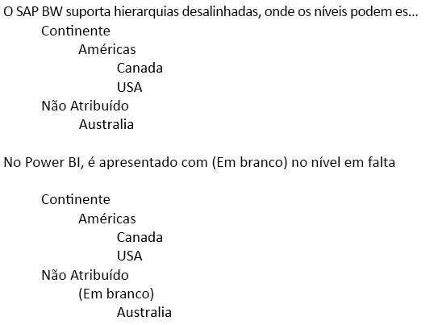

# DirectQuery e SAP Business Warehouse (BW)
Pode ligar a origens de dados do **SAP Business Warehouse (BW)** diretamente com o **DirectQuery**. Tendo em conta a natureza OLAP/multidimensional do SAP BW, existem várias diferenças importantes entre o DirectQuery através de SAP BW versus origens relacionais, como o SQL Server. Estas diferenças são resumidas da seguinte forma:

* No **DirectQuery** através de origens relacionais existe um conjunto de consultas (conforme definido na caixa de diálogo **Obter Dados** ou **Editor de Consultas**) que define logicamente os dados que estão disponíveis na lista de campos. Este *não* é caso ao ligar a uma origem OLAP, como o SAP BW. Em vez disso, ao ligar ao servidor SAP com **Obter Dados**, apenas a consulta do Infocube ou BEx fica selecionada. Em seguida, todos os Valores Chave e dimensões da Consulta Infocube/BEx ficarão disponíveis na lista de campos.   
* Da mesma forma, não há nenhum **Editor de Consultas** ao ligar ao SAP BW. As definições de origens de dados (por exemplo, o nome do servidor) podem ser alteradas, selecionando **Editar Consultas > Definições da origem de dados**. As definições de quaisquer Parâmetros podem ser alteradas ao selecionar **Editar Consultas > Gerir Parâmetros**.
* Tendo em conta a natureza única das origens OLAP, existem restrições adicionais (para modelação e visualizações) aplicáveis, além das restrições normais impostas ao DirectQuery. Estas restrições são descritas posteriormente neste artigo.

Além disso, é *extremamente importante* compreender que muitas funcionalidades do SAP BW não são suportadas no Power BI e que, devido à natureza da interface pública para o SAP BW, existem casos significativos em que os resultados vistos através do Power BI não irão corresponder aos que forem vistos ao utilizar uma ferramenta SAP. Estas limitações são descritas posteriormente neste artigo. Estas limitações e diferenças de comportamento devem ser cuidadosamente revistas, para garantir que os resultados vistos através do Power BI, conforme forem devolvidos pela interface pública SAP, são interpretados corretamente.  

> [!NOTE]
> A capacidade para utilizar o DirectQuery no SAP BW esteve no modo de pré-visualização até à atualização de março de 2018 para o Power BI Desktop. Durante a pré-visualização, o feedback e as melhorias sugeridas pediam uma alteração que tivesse impacto nos relatórios criados com essa versão de pré-visualização. Agora que a Disponibilidade Geral (GA) do DirectQuery no SAP BW foi lançada, *tem* de eliminar todos os relatórios existentes (baseados na pré-visualização) que utilizem o DirectQuery no SAP BW criados com a versão anterior à Disponibilidade Geral. Nos relatórios criados com a versão anterior à Disponibilidade Geral do DirectQuery no SAP BW, serão apresentados erros ao tentar atualizar os metadados com quaisquer alterações ao cubo SAP BW subjacente. Volte a criar esses relatórios num relatório em branco, com a versão de Disponibilidade Geral do DirectQuery no SAP BW. 

## Restrições de Modelação Adicionais
As principais restrições de modelação adicionais ao ligar ao SAP BW com o DirectQuery no Power BI são as seguintes:

* **Não existe suporte para colunas calculadas:** a capacidade de criar colunas calculadas está desativada. Isto também significa que o Agrupamento e o Clustering, que criam colunas calculadas, não estão disponíveis.
* **Limitações adicionais para medidas:** existem limitações adicionais impostas em expressões DAX que podem ser utilizadas em medidas, para refletir o nível de suporte oferecido pelo SAP BW.
* **Não existe suporte para definir relações:** as relações são inerentes na origem SAP externa e não é possível definir relações adicionais no modelo.
* **Sem Vista de Dados:** a **Vista de Dados** normalmente apresenta os dados de nível de detalhe nas tabelas. Tendo em conta a natureza das origens OLAP, como o SAP BW, esta vista não está disponível através do SAP BW.
* **Os detalhes das colunas e medidas são fixos:** a lista de colunas e medidas vistas na lista de campos é fixa pela origem subjacente e não pode ser modificada. Por exemplo, não é possível eliminar uma coluna, nem alterar o respetivo tipo de dados (no entanto, o nome pode ser mudado).
* **Limitações adicionais no DAX:** existem limitações adicionais no DAX que podem ser utilizadas nas definições de medida, para refletir as limitações na origem. Por exemplo, não é possível utilizar uma função de agregação através de uma tabela.

## Restrições de Visualização Adicionais
As principais restrições adicionais em visualizações ao ligar ao SAP BW com o DirectQuery no Power BI são as seguintes:

* **Nenhuma agregação de colunas:** não é possível alterar a agregação de uma coluna num elemento visual e é sempre *Não Resumir*
* **A filtragem de medidas está desativada:** a filtragem de medidas está desativada para refletir o suporte oferecido pelo SAP BW.
* **Seleção múltipla e incluir/excluir:** a capacidade de selecionar vários pontos de dados num elemento visual estará desativada, se os pontos representarem valores de mais do que uma coluna. Por exemplo, num gráfico de barras que mostra as Vendas por País, com Categoria na Legenda, não seria possível selecionar o ponto para (EUA, Bicicletas) e (França, Roupas). Da mesma forma, não seria possível selecionar o ponto para (EUA, Bicicletas) e exclui-lo do elemento visual. Ambas as limitações são impostas para refletir o suporte oferecido pelo SAP BW.

## Suporte para funcionalidades do SAP BW
A tabela seguinte apresenta uma lista de todas as funcionalidades do SAP BW que não são totalmente suportadas ou que irão comportar-se de forma diferente ao utilizar o Power BI.   

| Destaque | Descrição |
| --- | --- |
| Cálculos locais |Os cálculos locais definidos numa Consulta BEx irão alterar os números, conforme apresentado através de ferramentas como o BEx Analyzer. No entanto, não são refletidos nos números devolvidos do SAP, através da interface MDX pública.     **Como tal, os números vistos num elemento visual do Power BI não correspondem necessariamente a um elemento visual correspondente numa ferramenta SAP.**     Por exemplo, ao ligar a um cubo de consultas de uma consulta BEx que define a agregação como Acumulado (por exemplo, soma parcial), o Power BI iria devolver os números base, ignorando essa definição.  Um analista iria certamente aplicar então um cálculo de soma parcial localmente no Power BI, mas teria de ter cuidado na forma como os números seriam interpretados, se isto não fosse feito. |
| Agregações |Em alguns casos (particularmente ao lidar com várias moedas), os números de agregação devolvidos pela interface pública SAP não correspondem aos que são mostrados pelas ferramentas SAP.     **Como tal, os números vistos num elemento visual do Power BI não correspondem necessariamente a um elemento visual correspondente numa ferramenta SAP.**     Por exemplo, os totais de moedas diferentes seriam mostrados como "*" no BEx Analyzer, mas o total seria devolvido pela interface pública SAP, sem informações de que esse número agregado seria insignificante. Por conseguinte, o número (ao agregar, por exemplo, $, EUR e AUD) seria apresentado pelo Power BI. |
| Formatação de moeda |Qualquer formatação de moeda (por exemplo, $2.300 ou 4000 AUD) não é refletida no Power BI. |
| Unidades de medida |As unidades de medida (por exemplo, 230 KG) não são refletidas no Power BI. |
| Chave versus texto (breve, médio, longo) |Para uma característica do SAP BW como CostCenter, a lista de campos mostrará uma única coluna Centro de Custos.  A utilização dessa coluna apresentará o texto predefinido.  Ao mostrar campos ocultos, será também possível ver a coluna com o nome exclusivo (que devolve o nome exclusivo atribuído pelo SAP BW, e que é a base da exclusividade).     A chave e outros campos de texto não estão disponíveis. |
| Várias hierarquias de uma característica |No **SAP**, uma característica pode ter várias hierarquias. Por conseguinte, em ferramentas como o BEx Analyzer, quando uma característica é incluída numa consulta, o utilizador pode selecionar a hierarquia a utilizar.     No **Power BI**, as várias hierarquias podem ser vistas na lista de campos como hierarquias diferentes na mesma dimensão.  No entanto, a seleção de vários níveis de duas hierarquias diferentes na mesma dimensão resultará na devolução de dados em branco pelo SAP. |
| Tratamento de hierarquias desalinhadas | |
| Fator de dimensionamento/inverter sinal |No SAP, um valor chave pode ter um fator de dimensionamento (por exemplo, 1000) definido como uma opção de formatação, o que significa que toda a apresentação será dimensionada por esse fator.     Da mesma forma, pode ter um conjunto de propriedades que inverte o sinal. A utilização de tal valor chave no Power BI (num elemento visual ou como parte de um cálculo) irá resultar na utilização do número sem dimensionamento (e o sinal não é invertido). O fator de dimensionamento subjacente não está disponível. Nos elementos visuais do Power BI, as unidades de escala apresentadas no eixo (K,M,B) podem ser controladas como parte da formatação do elemento visual. |
| Hierarquias onde os níveis aparecem/desaparecem dinamicamente |Ao ligar inicialmente ao SAP BW, as informações dos níveis de uma hierarquia serão obtidas, resultando num conjunto de campos na lista de campos. Isto é colocado em cache e, se o conjunto de níveis for alterado, então o conjunto de campos não será alterado até que Atualizar seja invocado.     Isto só é possível no **Power BI Desktop**. Atualizar para refletir as alterações nos níveis não poderá ser invocado no serviço Power BI depois de Publicar. |
| Filtro predefinido |Uma consulta BEx pode incluir Filtros Predefinidos, que serão aplicados automaticamente pelo SAP BEx Analyzer. Estes não são expostos e, por conseguinte, a utilização equivalente no Power BI não aplicará os mesmos filtros por predefinição. |
| Valores chave ocultos |Uma consulta BEx pode controlar a visibilidade dos Valores Chave, e os que estão ocultos não serão apresentados no SAP BEx Analyzer. Isto não será refletido através da API pública e, por conseguinte, esses valores chave ocultos continuarão a ser apresentados na lista de campos. No entanto, podem estar ocultos no Power BI. |
| Formatação numérica |Qualquer formatação numérica (número de posições decimais, ponto decimal, etc.) não será refletida automaticamente no Power BI. No entanto, é possível controlar essas opções de formatação no Power BI. |
| Controlo de versões de hierarquia |O SAP BW permite que sejam mantidas diferentes versões de uma hierarquia, por exemplo, a hierarquia do centro de custos em 2007 versus 2008. Apenas a versão mais recente estará disponível no Power BI, uma vez que as informações sobre as versões não são expostas pela API pública. |
| Hierarquias dependentes do tempo |Ao utilizar o Power BI, as hierarquias dependentes do tempo são avaliadas na data atual. |
| Conversão de moeda |O SAP BW suporta a conversão de moeda, com base nas tarifas contidas no cubo. Estas capacidades não são expostas pela API pública e, por conseguinte, não estão disponíveis no Power BI. |
| Sequência de Ordenação |A sequência de ordenação (por Texto ou pela Chave) de uma característica pode ser definida no SAP. Esta sequência de ordenação não será refletida no Power BI. Por exemplo, os meses podem aparecer como “Abril”, “Ago” e assim sucessivamente.     Não é possível alterar esta sequência de ordenação no Power BI. |
| Nomes técnicos |Em **Obter Dados**, tanto os nomes (descrições) das características/medidas como os nomes técnicos podem ser vistos. A lista de campos irá conter apenas os nomes (descrições) das características/medidas. |
| Atributos |Não é possível aceder aos atributos de uma característica no Power BI. |
| Definição do idioma do utilizador final |A região utilizada para ligar ao SAP BW está definida como parte dos detalhes da ligação e não reflete a região do consumidor do relatório final. |
| Variáveis de Texto |O SAP BW permite que os nomes de campos contenham marcadores de posição para variáveis (por exemplo, "$YEAR$ Actuals") que seriam então substituídos pelo valor selecionado. Por exemplo, o campo é apresentado como "2016 Actuals" nas ferramentas BEx, se o ano 2016 estiver selecionado para a variável.     O nome da coluna no Power BI não será alterado consoante o valor de variável e, por conseguinte, aparece como "$YEAR$ Actuals".  No entanto, o nome da coluna pode ser alterado no Power BI. |
| Variáveis de Saída do Cliente | As Variáveis de Saída do Cliente não são expostas pela API pública e, por conseguinte, não são suportadas pelo Power BI. |
| Estruturas de Características | As Estruturas de Características na origem do SAP BW subjacente irão resultar numa “explosão” das medidas que são expostas no Power BI. Por exemplo, com as duas medidas Vendas e Custos e uma estrutura de características com Orçamento e Real, serão expostas quatro medidas: Vendas.Orçamento, Vendas.Real, Custos.Orçamento, Custos.Real. |

## Próximos passos
Para obter mais informações sobre o DirectQuery, consulte os seguintes recursos:

* [DirectQuery no Power BI](desktop-directquery-about.md)
* [Origens de Dados suportadas pelo DirectQuery](desktop-directquery-data-sources.md)
* [DirectQuery and SAP HANA](desktop-directquery-sap-hana.md) (DirectQuery e SAP HANA)

