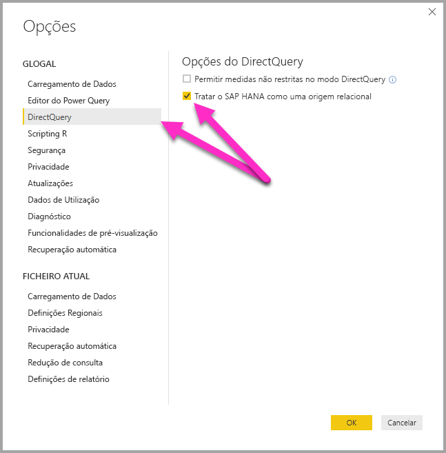
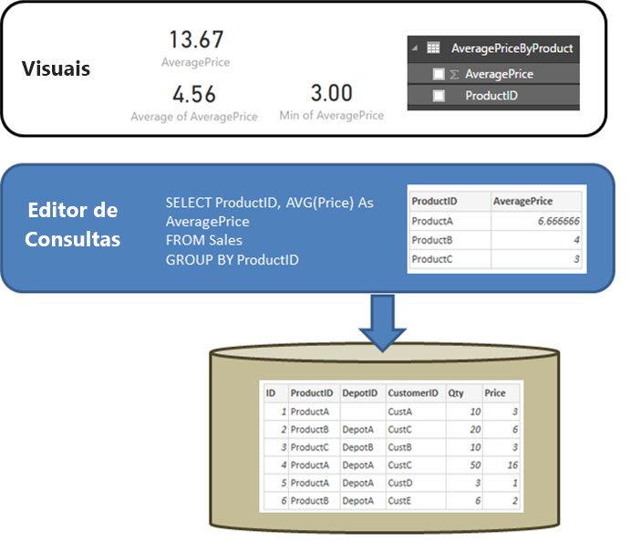

# DirectQuery e SAP HANA
Pode ligar a origens de dados **SAP HANA** diretamente com o **DirectQuery**. Existem duas opções ao ligar ao SAP HANA:

* **Tratar o SAP HANA como uma origem multidimensional (predefinição):** neste caso, o comportamento será semelhante a quando o Power BI se liga a outras origens multidimensionais como o SAP Business Warehouse ou o Analysis Services. Ao ligar ao SAP HANA com esta definição, é selecionada uma única vista de cálculo ou análise e todas as medidas, hierarquias e atributos dessa vista estarão disponíveis na lista de campos. À medida que os elementos visuais são criados, os dados agregados serão sempre obtidos a partir do SAP HANA. Esta é a abordagem recomendada e é a predefinição para os relatórios do DirectQuery no SAP HANA.

* **Tratar o SAP HANA como uma origem relacional:** neste caso, o Power BI trata o SAP HANA como uma origem relacional. Deste modo, oferece maior flexibilidade, mas deve ter cuidado para garantir que as medidas são agregadas conforme esperado e para evitar problemas de desempenho.

A abordagem utilizada para estabelecer ligação é determinada por uma opção de ferramenta global, que é definida ao selecionar **Ficheiro > Opções e definições** e, em seguida, **Opções > DirectQuery**, ao selecionar a opção **Tratar o SAP HANA como uma origem relacional**, conforme apresentado na imagem seguinte. 

A opção para tratar o SAP HANA como uma origem relacional controla a abordagem utilizada para todos os *novos* relatórios que utilizem o DirectQuery no SAP HANA. Não tem efeito em quaisquer ligações SAP HANA existentes no relatório atual, nem em ligações de quaisquer outros relatórios abertos. Por isso, se a opção estiver atualmente desmarcada, após a adição de uma nova ligação ao SAP HANA com **Obter Dados**, essa ligação será estabelecida ao tratar o SAP HANA como uma origem multidimensional. No entanto, se abrir um relatório diferente que também estabeleça ligação ao SAP HANA, esse relatório continuará a comportar-se de acordo com a opção que foi definida *no momento em que foi criado*. Tal significa que todos os relatórios ligados ao SAP HANA que foram criados antes de fevereiro de 2018 continuarão a tratar o SAP HANA como uma origem relacional. 

As duas abordagens constituem um comportamento muito diferente e não pode mudar de uma abordagem para outra num relatório existente. 

Vamos ver mais detalhes sobre cada uma destas duas abordagens, uma de cada vez.

## Tratar o SAP HANA como uma origem multidimensional (predefinição)

Todas as novas ligações ao SAP HANA utilizam este método de ligação por predefinição, ao tratarem o SAP HANA como uma origem multidimensional. Para tratar uma ligação ao SAP HANA como uma origem relacional, tem de selecionar **Ficheiro > Opções e definições** e, em seguida, selecionar a caixa em **DirectQuery > Tratar o SAP HANA como uma origem relacional**. Enquanto esta funcionalidade está em **Pré-visualização**, os relatórios criados com a abordagem multidimensional *não podem* ser publicados no serviço do Power BI e, se o fizer, ocorrerão erros quando o relatório for aberto com o serviço do Power BI.  

Ao ligar ao SAP HANA como uma origem multidimensional, aplica-se o seguinte:

* No **Navegador Obter Dados**, pode selecionar uma única vista do SAP HANA. Não pode selecionar medidas ou atributos individuais. Não há qualquer consulta definida no momento da ligação, que é diferente da importação de dados ou da utilização do DirectQuery ao tratar o SAP HANA como uma origem relacional. Tal também significa que não pode utilizar diretamente uma consulta SQL do SAP HANA quando selecionar este método de ligação.

* Todas as medidas, hierarquias e atributos da vista selecionada serão apresentados na lista de campos. 

* Ao utilizar uma medida num elemento visual, o SAP HANA será consultado para obter o valor de medida no nível da agregação necessário para o elemento visual. Por isso, ao lidar com medidas não aditivas (contadores, rácios, etc.), todas as agregações são executadas pelo SAP HANA e mais nenhuma agregação é realizada pelo Power BI. 

* Para garantir que os valores corretos agregados podem ser sempre obtidos a partir do SAP HANA, têm de ser impostas determinadas restrições. Por exemplo, não pode adicionar colunas calculadas nem combinar dados de várias vistas do SAP HANA no mesmo relatório. 

Tratar o SAP HANA como uma origem multidimensional não oferece a maior flexibilidade proporcionada pela abordagem *relacional* alternativa, mas é mais simples e assegura valores de agregação corretos ao lidar com medidas do SAP HANA mais complexas e, geralmente, resulta num desempenho superior. 

A lista **Campos** incluirá todas as medidas, atributos e hierarquias da vista do SAP HANA. Tenha em atenção os seguintes comportamentos que se aplicam ao utilizar este método de ligação:

* Todos os atributos incluídos em, pelo menos, uma hierarquia estarão ocultos por predefinição. No entanto, pode vê-los, se precisar, ao selecionar **Ver ocultos** no menu de contexto na lista de campos. No mesmo menu de contexto, pode torná-los visíveis, se precisar.

* No SAP HANA, pode definir um atributo para utilizar outro atributo como a respetiva etiqueta. Por exemplo, o **Produto** (com valores 1,2,3 e assim sucessivamente) pode utilizar o **ProductName** (com os valores Bicicleta, Camisola, Luvas e assim sucessivamente) como a etiqueta. Neste caso, será apresentado o campo único **Produto** na lista de campos, cujos valores serão as etiquetas Bicicleta, Camisola, Luvas e assim sucessivamente, mas com a ordem e a exclusividade determinadas pelos valores de chave 1,2,3. Uma coluna oculta **Product.Key** também é criada, que permite aceder aos valores de chave subjacentes, se precisar. 

Todas as variáveis definidas na vista do SAP HANA subjacente são apresentadas no momento da ligação e pode introduzir os valores necessários. Subsequentemente, pode alterar esses valores ao selecionar **Editar Consultas** no friso e, em seguida, em **Editar Variáveis** no menu pendente apresentado. 

As operações de modelação permitidas são mais restritivas do que no caso geral ao utilizar o DirectQuery, dada a necessidade de garantir que os dados agregados corretos podem ser sempre obtidos a partir do SAP HANA. No entanto, ainda pode fazer muitas adições e alterações, incluindo definir medidas, mudar o nome de campos, ocultar campos e definir os formatos de apresentação. Todas essas alterações serão mantidas na atualização e todas as alterações que não estejam em conflito feitas à vista do SAP HANA serão aplicadas. 

### Restrições de Modelação Adicionais

As restrições de modelação adicionais principais quando ligar ao SAP HANA com o DirectQuery (tratar como origem multidimensional) são as seguintes: 

* **Não existe suporte para colunas calculadas:** a capacidade de criar colunas calculadas está desativada. Isto também significa que o Agrupamento e o Clustering, que criam colunas calculadas, não estão disponíveis.
* **Limitações adicionais das medidas:** existem limitações adicionais impostas em expressões DAX que podem ser utilizadas em medidas para refletir o nível de suporte oferecido pelo SAP HANA.
* **Não existe suporte para definir relações:** apenas pode ser consultada uma única vista dentro de um relatório e, como tal, não há suporte para definir relações.
* **Sem Vista de Dados:** a **Vista de Dados** normalmente apresenta os dados de nível de detalhe nas tabelas. Tendo em conta a natureza das origens OLAP, como o SAP HANA, esta vista não está disponível através do SAP HANA.
* **Os detalhes das colunas e medidas são fixos:** a lista de colunas e medidas vistas na lista de campos é fixa pela origem subjacente e não pode ser modificada. Por exemplo, não pode eliminar uma coluna, nem alterar o seu tipo de dados (no entanto, o nome pode ser mudado).
* **Limitações adicionais no DAX:** existem limitações adicionais no DAX que podem ser utilizadas nas definições de medida, para refletir as limitações na origem. Por exemplo, não pode utilizar uma função de agregação através de uma tabela.

### Restrições de Visualização Adicionais

Existem algumas restrições nos elementos visuais ao ligar ao SAP HANA com o DirectQuery (tratar como origem multidimensional): 
* **Sem agregação de colunas:** não pode alterar a agregação de uma coluna num elemento visual e é sempre *Não Resumir*.

## Tratar o SAP HANA como uma origem relacional 

Ao escolher a ligação ao SAP HANA como uma origem relacional, fica disponível alguma flexibilidade adicional. Por exemplo, pode criar colunas calculadas, incluir dados de várias vistas do SAP HANA e criar relações entre as tabelas resultantes. No entanto, ao utilizar o SAP HANA desta forma, é importante compreender determinados aspetos da forma como são tratadas as ligações garantir o seguinte: 

* Os resultados são os esperados, quando a vista do SAP HANA contém medidas não aditivas (por exemplo, contagens distintas, ou médias, em vez de somas simples).
* As consultas resultantes são eficientes

É útil começar por esclarecer o comportamento de uma origem relacional como o SQL Server, quando a consulta definida em **Obter Dados** ou **Editor de Consultas** realiza uma agregação. No exemplo que se segue, uma consulta definida no **Editor de Consultas** devolve o preço médio por *ProductID*.  

Se os dados estiverem a ser importados para o Power BI (em vez de utilizar o DirectQuery), resultaria o seguinte:

* Os dados são importados ao nível de agregação definido pela consulta criada no **Editor de Consultas**. Por exemplo, preço médio por produto. Isto resulta numa tabela com as duas colunas *ProductID* e *AveragePrice* que podem ser utilizadas em elementos visuais.
* Num elemento visual, qualquer agregação subsequente (tal como *Soma*, *Média*, *Mín.*, entre outras) é executada através desses dados importados. Por exemplo, incluir *AveragePrice* num elemento visual irá utilizar o agregado da *Soma* por predefinição e irá devolver a soma de *AveragePrice* para cada *ProductID* – que, neste caso, seria 13,67. O mesmo se aplica a qualquer função de agregação alternativa (tal como *Mín.*, *Média*, etc.) utilizada no elemento visual. Por exemplo, a *Média* de *AveragePrice* devolve a média de 6,66, 4 e 3, o que equivale a 4,56, e não à média de *Preços* nos 6 registos na tabela subjacente, que equivale a 5,17.
  
Se o **DirectQuery** estiver a ser utilizado (com base na mesma origem relacional) em vez da opção Importar, aplica-se a mesma semântica e os resultados serão exatamente os mesmos:  

* Tendo em conta a mesma consulta, é lógico que são apresentados exatamente os mesmos dados para a camada de relatórios – embora os dados não sejam realmente importados.

* Num elemento visual, qualquer agregação subsequente (*Soma*, *Média*, *Mín.*, entre outras) é novamente executada nessa tabela lógica a partir da consulta. E, mais uma vez, um elemento visual que contenha a *Média* de *AveragePrice* devolve os mesmos 4,56.
  
Agora vamos considerar o SAP HANA, quando a ligação é tratada como uma origem relacional. O Power BI pode trabalhar com as *Vistas Analíticas* e as *Vistas de Cálculo* no SAP HANA, sendo que ambas podem conter medidas. No entanto, atualmente, a abordagem do SAP HANA segue os mesmos princípios descritos anteriormente nesta secção: a consulta definida em **Obter Dados** ou **Editor de Consultas** determinará os dados disponíveis e, em seguida, qualquer agregação subsequente num elemento visual é feita com base nesses dados e o mesmo se aplica a Importar e DirectQuery.  
No entanto, dada a natureza do SAP HANA, a consulta definida na caixa de diálogo **Obter Dados** inicial ou no **Editor de Consultas** é sempre uma consulta de agregação e, normalmente, irá incluir medidas onde a agregação real que será utilizada é definida pela vista do SAP HANA.

O equivalente ao exemplo do SQL Server acima é o facto de existir uma vista do SAP HANA que contém o *ID*, *ProductID*, *DepotID* e as medidas que incluem o *AveragePrice*, definido na vista como *Média de Preço*.  
    
Se, na experiência **Obter Dados**, as seleções feitas foram para **ProductID** e para a medida **AveragePrice**, tal definiria uma consulta na vista a pedir esses dados de agregação (no exemplo acima, é utilizado pseudo-SQL para simplificar, o que não corresponde à sintaxe exata de SAP HANA SQL). Em seguida, quaisquer agregações adicionais definidas num elemento visual vão agregar ainda mais os resultados de uma consulta deste tipo. Novamente, conforme descrito acima para o SQL Server, tal aplica-se tanto ao cenário de Importação como do DirectQuery. Tenha em atenção que no cenário de DirectQuery, a consulta de **Obter Dados** ou **Editor de Consultas** será utilizada numa única consulta enviada para o SAP HANA e, por conseguinte, não é um cenário onde todos os dados serão lidos, antes de continuar a agregar.  

Todas estas considerações e comportamentos precisam das seguintes considerações importantes ao utilizar o DirectQuery através do SAP HANA:  

* Tem de prestar atenção a qualquer outra agregação executada em elementos visuais sempre que a medida no SAP HANA for não aditiva (por exemplo, não for uma *Soma*, *Mín.* ou *Máx.* simples).

* Em **Obter Dados** ou **Editor de Consultas**, apenas devem ser incluídas as colunas necessárias para obter os dados necessários, refletindo o facto de que o resultado será uma consulta, que tem de ser uma consulta razoável que possa ser enviada para o SAP HANA. Por exemplo, se forem selecionadas dezenas de colunas, com a ideia de que poderão ser necessárias em elementos visuais subsequentes, até mesmo para o DirectQuery um elemento visual simples implica que a consulta de agregação utilizada na subseleção irá conter essas dezenas de colunas, cujo desempenho, geralmente, é muito fraco.
  
Vejamos um exemplo. No exemplo seguinte, a seleção de cinco colunas (**CalendarQuarter**, **Color**, **LastName**, **ProductLine**, **SalesOrderNumber**) na caixa de diálogo **Obter Dados**, juntamente com a medida *OrderQuantity*, significa que a criação posterior de um elemento visual simples que contenha a Min OrderQuantity resultará na seguinte consulta SQL para o SAP HANA. A parte sombreada é a subseleção, que contém a consulta de **Obter Dados** / **Editor de Consultas**. Se esta subseleção apresentar um resultado com uma cardinalidade muito elevada, o desempenho do SAP HANA resultante será provavelmente fraco.  

   
Devido a este comportamento, é recomendado que os itens selecionados em **Obter Dados** ou **Editor de Consultas** sejam limitados aos itens necessários, o que ainda resultará numa consulta razoável para o SAP HANA.  

## Melhores Práticas 

Em ambas as abordagens de ligação ao SAP HANA, as recomendações para a utilização do DirectQuery também se aplicam ao SAP HANA, em particular as que estão relacionadas com a garantia de um bom desempenho. Estas recomendações estão descritas em detalhe no artigo [Utilizar o DirectQuery no Power BI](desktop-directquery-about.md).
   
## Limitações

A lista seguinte descreve todas as funcionalidades do SAP HANA que não são totalmente suportadas ou as funcionalidades que terão um comportamento diferente ao utilizar o Power BI. 

* **Hierarquias Principal/Subordinado** – as hierarquias principal/subordinado não estarão visíveis no Power BI.
Tal acontece porque o Power BI acede ao SAP HANA através da interface do SQL e as hierarquias principal/subordinado não podem ser totalmente acedidas através do SQL.
* **Outros metadados das hierarquias** – a estrutura básica das hierarquias é apresentada no Power BI. No entanto, alguns metadados das hierarquias (por exemplo, controlar o comportamento de hierarquias desalinhadas) não têm qualquer efeito.
Novamente, deve-se a limitações impostas pela interface do SQL.
* **Ligação através do SSL** – não pode ligar a instâncias do SAP HANA configuradas para utilizar o SSL.
Suporte para as vistas Atributo – o Power BI pode ligar-se às vistas Análise e Cálculo, mas não pode ligar-se diretamente às vistas Atributo.
* **Suporte para objetos de Catálogo** – o Power BI não pode ligar-se aos objetos de Catálogo.
* **Alterar para Variáveis depois de publicar** – não pode alterar os valores de quaisquer variáveis do SAP HANA diretamente no serviço do Power BI depois de o relatório ser publicado. 
 
## Problemas conhecidos 
A lista seguinte descreve todos os problemas conhecidos ao ligar-se ao SAP HANA (DirectQuery) através do Power BI. 

* **Problema com o SAP HANA ao consultar os Contadores e outras medidas** – o SAP HANA devolverá dados incorretos se estiver a ligar-se a uma Vista Analítica e se uma medida de Contador e outra medida de rácio estiverem incluídas no mesmo elemento visual. Este problema é abordado na Nota SAP 2128928 (Resultados inesperados ao consultar uma Coluna Calculada e um Contador). Neste caso, a medida de rácio será incorreta. 

* **Várias colunas do Power BI de uma única coluna do SAP HANA** – para algumas vistas de cálculo, em que uma coluna do SAP HANA é utilizada em mais do que uma hierarquia, o SAP HANA expõe-nas como dois atributos separados. Por conseguinte, são criadas duas colunas no Power BI.  Essas colunas são ocultadas por predefinição. No entanto, todas as consultas que envolvam as hierarquias, ou as colunas diretamente, comportam-se corretamente. 
 
## Passos seguintes

Para obter mais informações sobre o DirectQuery, consulte os seguintes recursos:

* [DirectQuery no Power BI](desktop-directquery-about.md)
* [Origens de dados suportadas pelo DirectQuery](desktop-directquery-data-sources.md)
* [DirectQuery e SAP BW](desktop-directquery-sap-bw.md)
* [Gateway de dados no local](service-gateway-onprem.md)

