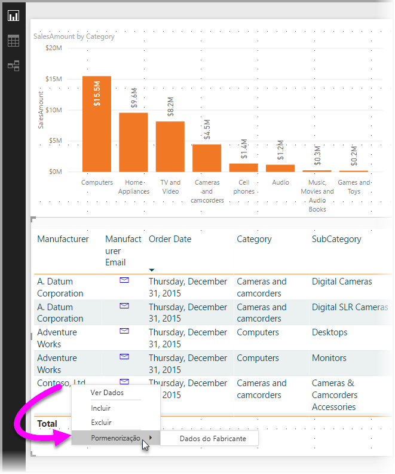
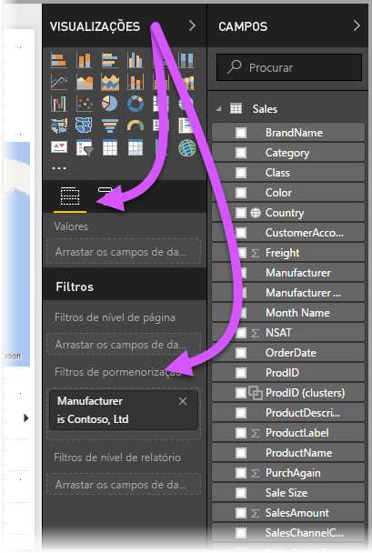
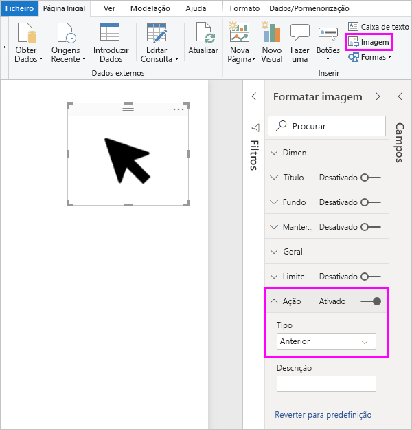
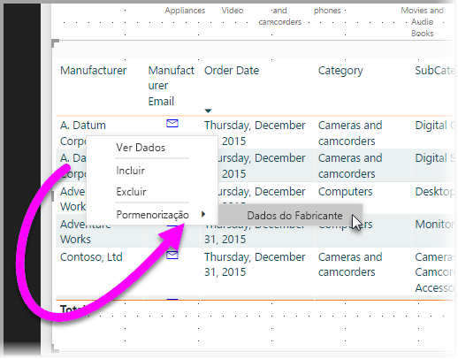
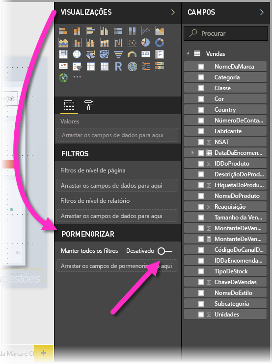
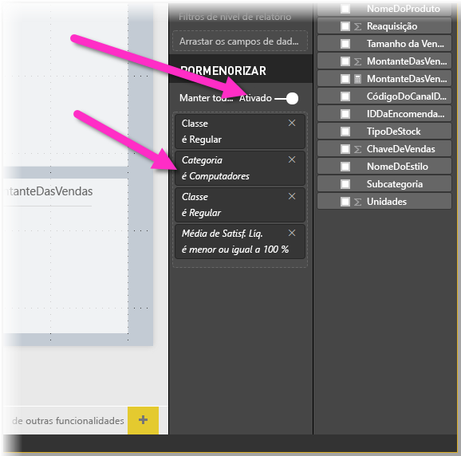
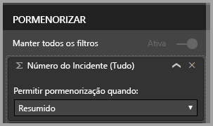

# Utilizar a pormenorização no Power BI Desktop
Com a **pormenorização** no **Power BI Desktop**, pode criar uma página no relatório centrada numa entidade específica, por exemplo, um fornecedor, um cliente ou um fabricante. Com essa página do relatório em destaque, os utilizadores podem clicar com o botão direito do rato num ponto de dados noutras páginas do relatório e obter a pormenorização da página em destaque para obter detalhes filtrados em função desse contexto.

## Utilizar a pormenorização
1. Para utilizar a **pormenorização**, crie uma página de relatório com elementos visuais que pretenda ver relativamente ao tipo de entidade para a qual irá fornecer pormenorização. 

    Por exemplo, se estiver interessado em fornecer uma pormenorização para fabricantes, pode criar uma página de pormenorização com visuais que demonstram vendas totais, unidades enviadas totais, vendas por categoria, vendas por região e assim por diante. Desta forma, quando pormenorizar nessa página, os elementos visuais serão específicos do fabricante selecionado.

2. Em seguida, na página de pormenorização, na secção **Campos** do painel **Visualizações**, arraste o campo sobre o qual pretende obter a pormenorização para a área **Filtros de pormenorização**.

    

    Quando adicionar um campo à área **Filtros de pormenorização**, o **Power BI Desktop** irá automaticamente criar um visual de botão para *voltar*. Esse visual torna-se um botão nos relatórios publicados e permite aos utilizadores que consomem o seu relatório no **serviço Power BI** regressar facilmente à página de relatório de onde vieram (a página a partir da qual optaram por fazer a pormenorização).

    

## Utilizar a sua própria imagem para um botão Anterior    
 Uma vez que o botão Anterior é uma imagem, pode substituir a imagem desse elemento visual por uma imagem à sua escolha. Continuará a funcionar como o botão que direciona os consumidores de relatórios de volta para a página original.

1. No separador **Base**, clique em **Imagem** e, em seguida, localize a imagem e coloque-a na página de pormenorização.
2. Selecione a sua nova imagem na página Pormenorização e, na secção Formatar Imagem, coloque o controlo de deslize **Ligação** na posição de ativado e defina o **Tipo** como **Anterior**. A imagem funciona agora como um botão de retrocesso.

    

    Quando a sua página de **pormenorização** estiver concluída e os utilizadores clicarem com o botão direito do rato num ponto de dados no relatório que utilize o campo que colocou na área **Filtros de pormenorização**, será apresentado um menu de contexto que permite a pormenorização nessa página.

    

    Quando os consumidores de relatórios decidirem pormenorizar, a página será filtrada para mostrar informações sobre o ponto de dados no qual clicaram com o botão direito do rato. Por exemplo, se tiverem clicado com o botão direito do rato num ponto de dados sobre a Contoso (um fabricante) e optado por pormenorizar, a página de pormenorização de destino será filtrada para a Contoso.

## Passar todos os filtros na pormenorização

A partir da versão de maio de 2018 do **Power BI Desktop**, pode passar todos os filtros aplicados para a janela de pormenorização. Por exemplo, poderia selecionar apenas uma determinada categoria de produtos, e os elementos visuais seriam filtrados somente para essa categoria, e em seguida selecionaria a pormenorização. Poderá estar interessado no aspeto que essa pormenorização teria com todos os filtros aplicados.

Para manter todos os filtros aplicados, na secção **Pormenorização** do painel **Visualizações**, defina o botão **Passar todos os filtros** para **ativado**. 

Nas versões do **Power BI Desktop** anteriores a maio de 2018, o comportamento é equivalente a ter este botão **desativado**.

Quando efetua o processo de pormenorização num elemento visual, pode ver quais os filtros aplicados como resultado do facto de o elemento visual de origem ter filtros aplicados temporariamente. Na janela de pormenorização, esses filtros transitórios são apresentados em itálico. 

Tenha em atenção que pode fazer isto com páginas de descrições, mas essa seria uma experiência estranha (a descrição pareceria não estar a funcionar corretamente), por isso não é recomendado que o faça com descrições.

## Adicionar uma medida à pormenorização

Além de poder transmitir todos os filtros para a janela de pormenorização, também pode adicionar uma medida (ou uma coluna numérica resumida) à área de pormenorização. Arraste o campo de pormenorização para o cartão Pormenorização para o aplicar. 

Ao adicionar uma medida (ou coluna numérica resumida), pode aceder à página quando o campo for utilizado na área *Valor* de um elemento visual.

E é tudo o que precisa de saber sobre a utilização da **pormenorização** nos relatórios. É uma excelente forma de obter uma vista expandida sobre as informações da entidade que selecionou para o seu filtro de pormenorização.

## Próximos passos

Poderá também estar interessado nos seguintes artigos:

* [Utilizar a segmentação de dados no Power BI Desktop](desktop-slicers.md)

