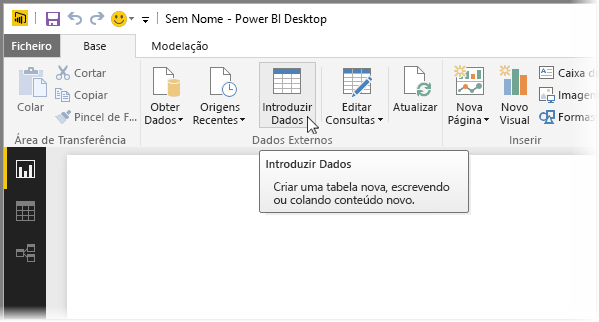
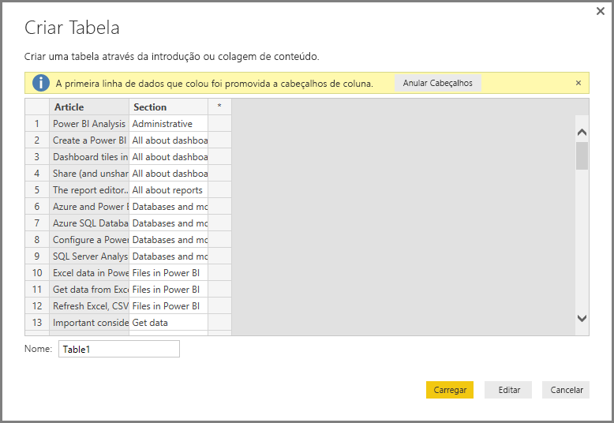
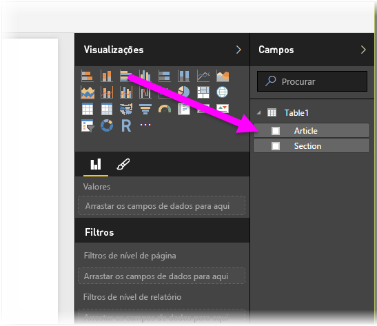

# Introduzir dados diretamente no Power BI Desktop
Com o Power BI Desktop, pode introduzir dados diretamente e utilizar esses dados nos relatórios e visualizações. Por exemplo, pode copiar partes de um livro ou página Web e colá-las no Power BI Desktop.

Para introduzir dados diretamente, selecione **Introduzir Dados** do friso **Base**.

O Power BI Desktop pode tentar efetuar transformações secundárias nos dados, se apropriado, tal como faz ao carregar dados de qualquer origem. Por exemplo, no caso seguinte promoveu a primeira linha dos dados para os cabeçalhos.

Se pretender formatar os dados introduzidos (ou colados), pode selecionar o botão Editar para apresentar o **Editor de Consultas**, onde pode formatar e transformar os dados antes de colocá-los no Power BI Desktop. Em alternativa, pode selecionar o botão **Carregar** para importar os dados conforme são apresentados.

Quando seleciona **Carregar**, o Power BI Desktop cria uma nova tabela a partir dos seus dados e disponibiliza-os no painel **Campos**. Na imagem seguinte, o Power BI Desktop mostra a minha nova tabela, denominada *Table1* por predefinição, e os dois campos dentro dessa tabela, que foram criados.

E já está – é tão simples introduzir dados no Power BI Desktop.

Está agora pronto para utilizar os dados no Power BI Desktop para criar elementos visuais, relatórios ou interagir com outros dados aos quais se possa querer ligar e importar, como livros do Excel, bases de dados ou qualquer outra origem de dados.

### Passos seguintes
Existem diversos tipos de dados aos quais se pode ligar através do Power BI Desktop. Para obter mais informações sobre origens de dados, consulte os seguintes recursos:

* [O que é o Power BI Desktop?](desktop-what-is-desktop.md)
* [Origens de Dados no Power BI Desktop](desktop-data-sources.md)
* [Formatar e Combinar Dados com o Power BI Desktop](desktop-shape-and-combine-data.md)
* [Ligar a livros do Excel no Power BI Desktop](desktop-connect-excel.md)   
* [Ligar a ficheiros CSV no Power BI Desktop](desktop-connect-csv.md)   

