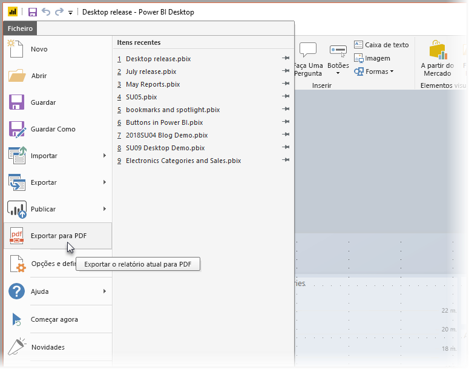
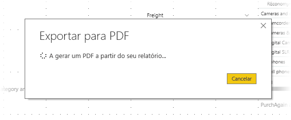

# Exportar relatórios do Power BI Desktop para PDF
No **Power BI Desktop** ou no serviço Power BI, pode exportar relatórios para um ficheiro PDF e, deste modo, partilhar ou imprimir facilmente os seus relatórios a partir desse PDF.

O processo de exportar o seu relatório do **Power BI Desktop** para um PDF, de forma a poder imprimi-lo ou partilhá-lo com outras pessoas, é simples. Basta selecionar **Ficheiro > Exportar para PDF** no Power BI Desktop.

O processo **Exportar para PDF** irá exportar todas as páginas *visíveis* no relatório, onde cada uma das páginas do relatório é exportada para uma única página no PDF. As páginas de relatório que não se encontram atualmente visíveis, tais como descrições ou páginas ocultas, não são exportadas para o ficheiro PDF. 

Ao selecionar **Ficheiro > Exportar para PDF**, a exportação é iniciada e é apresentada uma caixa de diálogo a mostrar que o processo de exportação está em curso. A caixa de diálogo permanece no ecrã até que o processo de exportação seja concluído. Durante o processo de exportação do relatório, todas as interações com o mesmo serão desativadas. A única forma de interagir com o relatório é aguardar pela conclusão do processo de exportação ou cancelar a exportação. 

Quando a exportação terminar, o PDF será carregado para o visualizador de PDFs predefinido no computador. 

## Considerações e limitações
Existem algumas considerações a ter em conta com a funcionalidade **Exportar para PDF**:

* A funcionalidade exporta elementos visuais personalizados, mas *não* exporta os padrões de fundo que possa ter aplicado ao relatório.

Uma vez que os padrões de fundo não são exportados para o PDF, deve prestar especial atenção aos relatórios que utilizam padrões de fundo escuros. Se o texto no seu relatório for de cor clara ou branco para se destacar no seu padrão de fundo escuro, irá tornar-se difícil de ler ou ilegível no processo de exportação para PDF, dado que o padrão de fundo não será exportado juntamente com o resto do relatório. 

## Próximos passos
Existem vários tipos de elementos visuais e funcionalidades interessantes no **Power BI Desktop**. Para obter mais informações, veja os seguintes recursos:

* [Utilizar elementos visuais para melhorar relatórios do Power BI](desktop-visual-elements-for-reports.md)
* [O que é o Power BI Desktop?](desktop-what-is-desktop.md)

