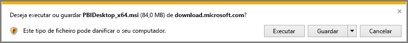

# Obter o Power BI Desktop
O **Power BI Desktop** permite-lhe criar consultas avançadas, modelos e relatórios que visualizam os dados. No **Power BI Desktop**, pode criar modelos de dados, criar relatórios e partilhar o seu trabalho ao publicar no serviço Power BI.  O **Power BI Desktop** é transferido gratuitamente.

Pode obter o **Power BI Desktop** de uma das seguintes duas formas, descritas nas secções seguintes:

* **Transferir** diretamente (um pacote MSI para transferir e instalar no computador)
* Instalar como uma aplicação a partir da **Loja Windows**

Ambas as formas dão-lhe acesso à versão mais recente do **Power BI Desktop** no seu computador, mas há algumas diferenças de relevo, descritas nas secções seguintes.

## Transferir o Power BI Desktop
Para transferir a versão mais recente do **Power BI Desktop**, pode selecionar o ícone de transferência no canto superior direito do serviço Power BI e, em seguida, selecionar **Power BI Desktop**.

Também pode transferir a versão mais recente do Power BI Desktop na seguinte página de transferência:

* [**Transferir o Power BI Desktop** (versões de 32 e 64 bits)](https://powerbi.microsoft.com/desktop).
  
  

Independentemente do método de transferência escolhido, quando o **Power BI Desktop** for transferido, ser-lhe-á pedido que execute o ficheiro de instalação:

O **Power BI Desktop** é instalado como uma aplicação e executado no seu ambiente de trabalho.

> [!NOTE]
> Não é permitido instalar a versão transferida (MSI) e a versão da **Loja Windows** do **Power BI Desktop** no mesmo computador (também conhecida como instalação *lado a lado*.
> 
> 

## Instalar como uma aplicação a partir da Loja Windows
Também pode obter o **Power BI Desktop** na Loja Windows através da seguinte ligação:

* [Instalar o **Power BI Desktop** a partir da **Loja Windows**](http://aka.ms/pbidesktopstore)

Há algumas vantagens em obter o **Power BI Desktop** na Loja Windows:

* **Atualizações automáticas** - O Windows transfere a versão mais recente automaticamente em segundo plano assim que estiver disponível, pelo que a sua versão estará sempre atualizada.
* **Transferências mais pequenas** - A **Loja Windows** garante que apenas os componentes que mudam em cada atualização são transferidos para o seu computador, o que significa transferências mais pequenas em cada atualização.
* **Sem necessidade de privilégios de administrador** - Quando transferir o MSI diretamente e instalar, terá de ser um administrador para que a instalação seja concluída com êxito. Quando obtiver o **Power BI Desktop** da Loja Windows, *não* serão necessários privilégios de administrador.
* **Implementação de TI ativada** - a versão da **Loja Windows** pode ser mais facilmente *implementada* para todas as pessoas na sua organização e pode tornar o **Power BI Desktop** disponível através da **Microsoft Store para Empresas**.
* **Deteção de idioma** - A versão da **Loja Windows** inclui todos os idiomas suportados e verifica que idiomas estão a ser utilizados no computador de cada vez que é iniciada. Isto também afeta a localização dos modelos criados no **Power BI Desktop**. Por exemplo, as hierarquias de datas incorporadas corresponderão ao idioma que o **Power BI Desktop** estava a utilizar quando o ficheiro .pbix foi criado.

Existem algumas considerações e limitações a ter em conta na instalação do **Power BI Desktop** da Windows Store, incluindo:

* Se utilizar o conector SAP, poderá ter de mover os seus ficheiros de controlador SAP para a pasta *Windows\System32*.

> [!NOTE]
> Não é permitido instalar a versão transferida (MSI) e a versão da **Loja Windows** do **Power BI Desktop** no mesmo computador (também conhecida como instalação *lado a lado*.
> 
> [!NOTE]
> A versão do Power BI Report Server do **Power BI Desktop** é uma instalação diferente e separada das várias versões discutidas neste artigo. Para obter informações sobre a versão do Report Server do **Power BI Desktop**, consulte o artigo [Início Rápido: Criar um relatório do Power BI para o Power BI Report Server](report-server/quickstart-create-powerbi-report.md).
> 
> 

## Utilizar o Power BI Desktop
Quando iniciar o **Power BI Desktop**, será apresentado um ecrã de *Boas-vindas*.

Se é a primeira vez que utiliza o **Power BI Desktop** (se a instalação não for uma atualização), ser-lhe-á pedido que preencha um formulário e responda a algumas perguntas ou inicie sessão no **serviço Power BI** antes de poder continuar.

A partir daí, pode começar a criar modelos de dados ou relatórios e, em seguida, partilhá-los com outras pessoas no serviço Power BI. Consulte as ligações na secção **Mais informações**, no final deste artigo, para obter ligações para guias que o poderão ajudar a começar a utilizar o **Power BI Desktop**.

## Requisitos mínimos
A lista seguinte apresenta os requisitos mínimos para executar o **Power BI Desktop**:

* Windows 7/Windows Server 2008 R2 ou posterior
* .NET 4.5
* Internet Explorer 9 ou posterior
* **Memória (RAM):** pelo menos 1 GB disponível, 1,5 GB ou mais, recomendado.
* **Ecrã:** pelo menos 1440 x 900 ou 1600 x 900 (16:9) recomendado. As resoluções mais baixas, como 1024 x 768 ou 1280 x 800 não são recomendadas, pois determinados controlos (como fechar o ecrã de arranque) são apresentados além destas resoluções.
* **Definições de visualização do Windows:** se as suas definições de visualização estiverem definidas para alterar o tamanho do texto, aplicações e outros itens para mais de 100%, poderá não conseguir ver determinadas caixas de diálogo que terão de ser fechadas ou respondidas para continuar, ao utilizar o **Power BI Desktop**. Caso encontre este problema, consulte as suas **Definições de visualização** acedendo a **Definições > Sistema > Visualização** no Windows e utilize o controlo de deslize para fazer as definições de visualização regressar a 100%.
* **CPU:** processador de 1 gigahertz (GHz) ou mais rápido x86 - ou x64 bits recomendado.

## Passos seguintes
Após instalar o **Power BI Desktop**, os seguintes conteúdos poderão ajudá-lo a começar rapidamente:

* [Introdução ao Power BI Desktop](desktop-getting-started.md)
* [Descrição Geral das Consultas no Power BI Desktop](desktop-query-overview.md)
* [Origens de dados no Power BI Desktop](desktop-data-sources.md)
* [Ligar a Dados no Power BI Desktop](desktop-connect-to-data.md)
* [Moldar e Combinar Dados com o Power BI Desktop](desktop-shape-and-combine-data.md)
* [Tarefas Comuns de Consulta no Power BI Desktop](desktop-common-query-tasks.md)   

