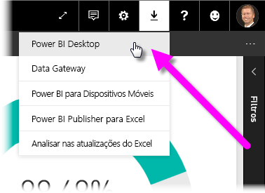
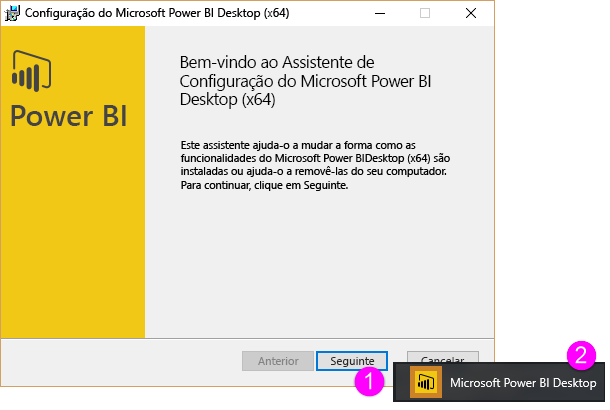
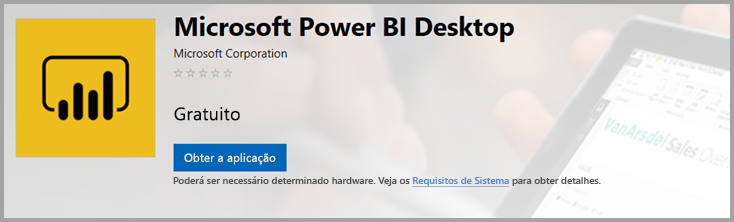
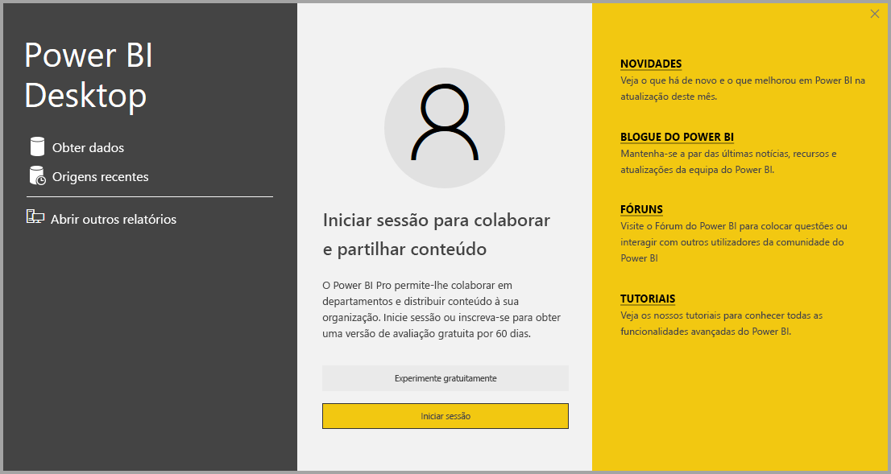

# <a name="get-power-bi-desktop"></a>Obter o Power BI Desktop
O **Power BI Desktop** permite-lhe criar consultas avançadas, modelos e relatórios que visualizam os dados. No **Power BI Desktop**, pode criar modelos de dados, criar relatórios e partilhar o seu trabalho ao publicar no serviço Power BI.  O **Power BI Desktop** é transferido gratuitamente.

Pode obter o **Power BI Desktop** de uma das seguintes duas formas, descritas nas secções seguintes:

* **Transferir** diretamente (um pacote para transferir e instalar no computador)
* Instalar como uma aplicação a partir da **Microsoft Store**

Ambas as formas dão-lhe acesso à versão mais recente do **Power BI Desktop** no seu computador, mas há algumas diferenças de relevo, descritas nas secções seguintes.

## <a name="download-power-bi-desktop"></a>Transferir o Power BI Desktop
Para transferir a versão mais recente do **Power BI Desktop**, pode selecionar o ícone de transferência no canto superior direito do serviço Power BI e, em seguida, selecionar **Power BI Desktop**.



Também pode transferir a versão mais recente do Power BI Desktop na seguinte página de transferência:

* [**Transferir o Power BI Desktop** (versões de 32 e 64 bits)](https://powerbi.microsoft.com/desktop).
  
  [](https://powerbi.microsoft.com/desktop)

Independentemente do método de transferência escolhido, quando o **Power BI Desktop** for transferido, ser-lhe-á pedido que execute o ficheiro de instalação:


A partir da versão de julho de 2019, o **Power BI Desktop** será enviado num único pacote de instalação .exe que contém todos os idiomas suportados. Existem ficheiros .exe separados para as versões de 32 bits e 64 bits. Os pacotes. msi foram descontinuados a partir da versão de setembro de 2019, o que requer o executável. exe para instalação. Esta abordagem torna a distribuição, as atualizações e a instalação muito mais fáceis e convenientes, especialmente para os administradores. Também pode utilizar parâmetros na linha de comandos para personalizar o processo de instalação, conforme descrito na secção [Utilizar opções da linha de comandos durante a instalação](#using-command-line-options-during-installation) mais adiante neste artigo.

Quando iniciar o pacote de instalação, o **Power BI Desktop** será instalado como uma aplicação e executado na sua área de trabalho.



> [!NOTE]
> Não é permitido instalar a versão transferida (MSI) e a versão da **Microsoft Store** do **Power BI Desktop** no mesmo computador (também conhecida como instalação *lado a lado*).
> 
> 

## <a name="install-as-an-app-from-the-microsoft-store"></a>Instalar como uma aplicação a partir da Microsoft Store
Também pode obter o **Power BI Desktop** na Microsoft Store através da seguinte ligação:

* [Instalar o **Power BI Desktop** a partir da **Microsoft Store**](https://aka.ms/pbidesktopstore)

  

Há algumas vantagens em obter o **Power BI Desktop** na Microsoft Store:

* **Atualizações automáticas** – o Windows transfere a versão mais recente automaticamente em segundo plano assim que estiver disponível, pelo que a sua versão estará sempre atualizada.
* **Transferências mais pequenas** – A **Microsoft Store** garante que apenas os componentes que mudam em cada atualização são transferidos para o seu computador, o que significa transferências mais pequenas em cada atualização.
* **Não são necessários privilégios de administrador** – quando transferir o pacote diretamente e instalar, terá de ser um administrador para que a instalação seja concluída com êxito. Quando obtiver o **Power BI Desktop** a partir da Microsoft Store, *não* serão necessários privilégios de administrador.
* **Implementação de TI ativada** – A versão da **Microsoft Store** pode ser mais facilmente *implementada* para todas as pessoas na sua organização e pode tornar o **Power BI Desktop** disponível através da **Microsoft Store para Empresas**.
* **Deteção de idioma** – a versão da **Microsoft Store** inclui todos os idiomas suportados e verifica que idiomas estão a ser utilizados no computador cada vez que for iniciada. Isto também afeta a localização dos modelos criados no **Power BI Desktop**. Por exemplo, as hierarquias de datas incorporadas corresponderão ao idioma que o **Power BI Desktop** estava a utilizar quando o ficheiro .pbix foi criado.

Existem algumas considerações e limitações a ter em conta ao instalar o **Power BI Desktop** da Microsoft Store, incluindo:

* Se utilizar o conector SAP, poderá ter de mover os seus ficheiros de controlador SAP para a pasta *Windows\System32*.
* Instalar o **Power BI Desktop** a partir da Microsoft Store não copia as definições de utilizador da versão de .exe. Poderá ter de voltar a ligar-se às suas origens de dados recentes e voltar a introduzir as credenciais da origem de dados. 

> [!NOTE]
> Não é permitido instalar a versão transferida (MSI) e a versão da **Microsoft Store** do **Power BI Desktop** no mesmo computador (também conhecida como instalação *lado a lado*). Deve desinstalar manualmente o **Power BI Desktop** antes de o transferir da **Microsoft Store**
> 
> [!NOTE]
> A versão do Power BI Report Server do **Power BI Desktop** é uma instalação diferente e separada das várias versões discutidas neste artigo. Para obter informações sobre a versão do Report Server do **Power BI Desktop**, veja [Criar um relatório do Power BI para o Power BI Report Server](report-server/quickstart-create-powerbi-report.md).
> 
> 

## <a name="using-power-bi-desktop"></a>Utilizar o Power BI Desktop
Quando iniciar o **Power BI Desktop**, será apresentado um ecrã de *Boas-vindas*.



Se é a primeira vez que utiliza o **Power BI Desktop** (se a instalação não for uma atualização), ser-lhe-á pedido que preencha um formulário e responda a algumas perguntas ou inicie sessão no **serviço Power BI** antes de poder continuar.

A partir daí, pode começar a criar modelos de dados ou relatórios e, em seguida, partilhá-los com outras pessoas no serviço Power BI. Consulte as ligações na secção **Mais informações**, no final deste artigo, para obter ligações para guias que o poderão ajudar a começar a utilizar o **Power BI Desktop**.

## <a name="minimum-requirements"></a>Requisitos mínimos
A lista seguinte apresenta os requisitos mínimos para executar o **Power BI Desktop**:

* Windows 7/Windows Server 2008 R2 ou posterior
* .NET 4.5
* Internet Explorer 10 ou posterior
* **Memória (RAM):** pelo menos 1 GB disponível, 1,5 GB ou mais, recomendado.
* **Ecrã:** pelo menos 1440 x 900 ou 1600 x 900 (16:9) recomendado. As resoluções mais baixas, como 1024 x 768 ou 1280 x 800 não são recomendadas, pois determinados controlos (como fechar o ecrã de arranque) são apresentados além destas resoluções.
* **Definições de Visualização do Windows:** se as suas definições de visualização estiverem definidas para alterar o tamanho do texto, das aplicações e de outros itens para mais de 100%, poderá não conseguir ver determinadas caixas de diálogo que terão de ser fechadas ou respondidas para continuar a utilizar o **Power BI Desktop**. Caso encontre este problema, consulte as suas **Definições de visualização** acedendo a **Definições > Sistema > Visualização** no Windows e utilize o controlo de deslize para fazer as definições de visualização regressar a 100%.
* **CPU:** processador de 1 gigahertz (GHz) ou mais rápido x86 – ou x64 bits recomendado.

## <a name="considerations-and-limitations"></a>Considerações e Limitações

Queremos que a sua experiência com o Power BI Desktop seja sempre excelente. Em determinadas ocasiões pode deparar-se com problemas com o Power BI Desktop, assim, esta secção contém soluções ou sugestões para resolver os problemas que possam surgir. 

### <a name="using-command-line-options-during-installation"></a>Utilizar opções da linha de comandos durante a instalação 

Ao instalar o Power BI Desktop, pode definir propriedades e opções com os parâmetros da linha de comandos. Esta funcionalidade é especialmente útil para administradores que tenham de gerir ou facilitar a instalação do Power BI Desktop em organizações. Estas opções aplicam-se a instalações .msi e .exe. 


|Opção da linha de comandos  |Comportamento  |
|---------|---------|
|-q, -quiet, -s, -silent     |instalação automática         |
|-passive     |apenas mostrar a barra de progresso durante a instalação         |
|-norestart     |suprimir o requisito de reiniciar o computador         |
|-forcerestart     |reiniciar o computador após a instalação sem apresentar um aviso         |
|-promptrestart     |informar o utilizador se é necessário reiniciar o computador (predefinição)         |
|-l<>, -log<>     |registar a instalação num ficheiro específico, com o ficheiro especificado entre <>         |
|-uninstall     |desinstalar o Power BI Desktop         |
|-repair     |reparar a instalação (ou instalar caso ainda não esteja instalada)         |
|-package, -update     |instalar o Power BI Desktop (predefinição, desde que não sejam especificados os parâmetros -uninstall ou -repair)         |

Também pode utilizar os seguintes **parâmetros de sintaxe**, que são especificados com uma sintaxe “PROPERTY=VALUE”:

|Parâmetro  |Significado  |
|---------|---------|
|ACCEPT_EULA     |Requer um valor de 1 para aceitar automaticamente o EULA         |
|ENABLECXP     |Valor de 1 inscrito no programa de experiência de utilizadores que obtém a telemetria sobre a utilização do produto         |
|INSTALLDESKTOPSHORTCUT     |O valor de 1 adiciona um atalho à área de trabalho         |
|INSTALLLOCATION     |O caminho de ficheiro onde pretende instalá-lo         |
|IDIOMA     |Código de localização, por exemplo, en-US, de-DE, pt-PT, para forçar o idioma padrão da aplicação. Se nenhum idioma for especificado, o Power BI Desktop apresentará o idioma do sistema operativo Windows. O idioma pode ser alterado pelo utilizador na caixa de diálogo Opções.         |
|REG_SHOWLEADGENDIALOG     |O valor de 0 desativa a apresentação da caixa de diálogo que aparece antes de iniciar sessão no Power BI Desktop         |

Por exemplo, poderá executá-lo com a seguinte sintaxe para instalar sem nenhuma interface de utilizador, com o idioma alemão: 

```“-quiet LANG=de-DE ACCEPT_EULA=1”```

### <a name="installing-power-bi-desktop-on-remote-machines"></a>Instalar o Power BI Desktop em computadores remotos

Se estiver a implementar o Power BI Desktop para os utilizadores com uma ferramenta que exija um ficheiro do instalador do Windows (ficheiro. msi), poderá extrair o ficheiro .msi do ficheiro .exe do instalador do Power BI Desktop. Pode utilizar ferramentas de terceiros, como o WiX Toolset para o fazer.

> [!NOTE]
> Sendo um produto de terceiros, as opções do WiX Toolset podem ser alteradas sem aviso prévio. Verifique a documentação dessas ferramentas para obter as informações mais atualizadas e contacte a lista de correio de utilizadores para obter ajuda.

* No computador em que transferiu o instalador do Power BI Desktop, transfira e instale a versão mais recente do WiX Toolset a partir do site do WiX em https://wixtoolset.org/.
* Abra uma janela da linha de comandos como administrador e navegue até à pasta onde instalou o WiX Toolset.
* Execute o seguinte comando: 
    
    ```Dark.exe <path to Power BI Desktop installer> -x <output folder>```

    Por exemplo, execute:

    ``` Dark.exe C:\PBIDesktop_x64.exe -x C:\output```

* A pasta de saída conterá uma pasta chamada *AttachedContainer* que inclui os ficheiros .msi.


### <a name="issues-when-using-previous-releases-of-power-bi-desktop"></a>Problemas ao utilizar versões anteriores do Power BI Desktop

Alguns utilizadores encontram um erro semelhante ao seguinte ao utilizarem uma versão desatualizada do **Power BI Desktop**: 

    "We weren't able to restore the saved database to the model" 

Atualizar para a versão atual do Power BI Desktop normalmente resolve este problema.

### <a name="disabling-notifications"></a>Desativar notificações
Recomendamos que atualize para a versão mais recente do Power BI Desktop para tirar partido dos avanços nas funcionalidades, no desempenho, na estabilidade, entre outras melhorias. Algumas organizações podem não querer que os utilizadores atualizem para cada nova versão. Pode desativar as notificações ao modificar o registo com os seguintes passos:

1. Com o Editor de Registo, navegue até *HKEY_LOCAL_MACHINE\SOFTWARE\Microsoft\Microsoft Power BI Desktop*
2. Crie uma nova entrada com as seguintes definições: *REG_DWORD : DisableUpdateNotification*
3. Defina o valor dessa nova entrada como **1**.

Terá de reiniciar o computador para a alteração produzir efeito.

### <a name="power-bi-desktop-loads-with-a-partial-screen"></a>O Power BI Desktop carrega um ecrã parcial

Em determinadas circunstâncias, incluindo determinadas configurações de resolução do ecrã, alguns utilizadores poderão ver o Power BI Desktop a compor conteúdo com grandes áreas em preto. Normalmente, tal deve-se a atualizações recentes do sistema operativo que afetam a forma como os itens são compostos, ao invés de um resultado direto da forma como o Power BI Desktop apresenta conteúdo. Independentemente disso, grandes áreas em preto não são tão apelativas quanto os elementos visuais grandes, assim, para resolver este problema, siga os passos seguintes:

1. Prima a tecla Início e escreva a palavra *desfocado* na barra de pesquisa apresentada.
2. Na caixa de diálogo apresentada, selecione a opção: *Permitir que o Windows corrija as aplicações que estão desfocadas*.
3. Reiniciar o Power BI Desktop.

Este problema pode ser resolvido após o lançamento das atualizações subsequentes do Windows. 
 

## <a name="next-steps"></a>Próximos passos
Após instalar o **Power BI Desktop**, os seguintes conteúdos poderão ajudá-lo a começar rapidamente:

* [O que é o Power BI Desktop?](desktop-what-is-desktop.md)
* [Descrição Geral das Consultas no Power BI Desktop](desktop-query-overview.md)
* [Origens de Dados no Power BI Desktop](desktop-data-sources.md)
* [Ligar a Dados no Power BI Desktop](desktop-connect-to-data.md)
* [Moldar e Combinar Dados com o Power BI Desktop](desktop-shape-and-combine-data.md)
* [Tarefas Comuns de Consulta no Power BI Desktop](desktop-common-query-tasks.md)   

