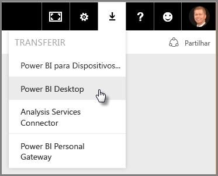
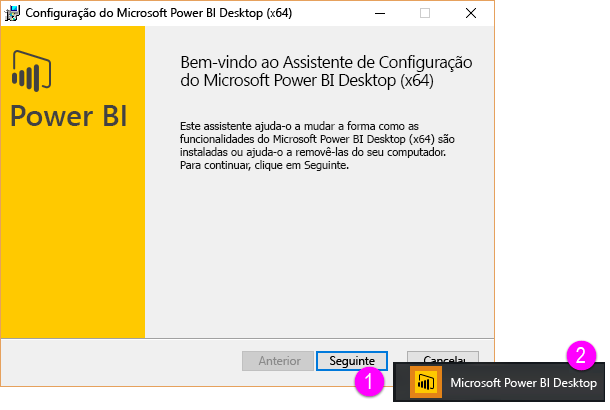
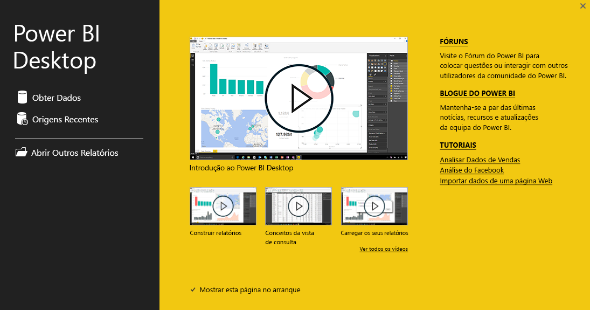

# Introdução ao Power BI Desktop
Bem-vindo ao **Guia de Introdução do Power BI Desktop**. Esta breve apresentação do Power BI Desktop apresentará como ele funciona, demonstrará o que pode fazer e acelerará a sua capacidade de criar modelos de dados robustos – juntamente com relatórios incríveis – que potencializam os seus esforços de business intelligence. 

Prefere ver em vez de ler? Aproveite para [ver o nosso vídeo de introdução](desktop-videos.md). Se quiser acompanhar o vídeo com dados de exemplo correspondentes, pode [transferir este livro do Excel de exemplo](http://go.microsoft.com/fwlink/?LinkID=521962).

O Power BI Desktop permite criar uma coleção de consultas, ligações de dados e relatórios que podem ser facilmente partilhados com outras pessoas. O Power BI Desktop integra tecnologias comprovadas da Microsoft – o poderoso motor de Consulta, modelação de dados e visualizações – e funciona perfeitamente com o [**serviço Power BI**](https://app.powerbi.com/) online.

Com a combinação do **Power BI Desktop** (onde analistas e outros podem criar avançadas ligações de dados, modelos e relatórios) e do [**serviço Power BI**](https://preview.powerbi.com/) (onde os relatórios do Power BI Desktop podem ser partilhados para que os utilizadores possam vê-los e interagir com eles), é mais fácil modelar, criar, partilhar e expandir novas informações do mundo dos dados.

Os analistas de dados descobrirão no Power BI Desktop uma ferramenta poderosa, flexível e altamente acessível para ligar ao mundo dos dados e formatá-los, criar modelos robustos e elaborar relatórios bem-estruturados.

## Como utilizar este guia
Pode utilizar este guia de duas maneiras – examiná-lo para obter uma descrição geral rápida ou ler cada secção, para obter uma compreensão sólida de como o Power BI Desktop funciona.

Se estiver com pressa, pode percorrer este guia em poucos minutos e obter uma boa noção de como o Power BI Desktop funciona e como utilizá-lo. A maior parte deste guia consiste em ecrãs que mostram visualmente como o Power BI Desktop funciona.

Para compreender melhor, pode dar uma vista de olhos a todas as secções, executar os passos e terminar com o seu próprio ficheiro do Power BI Desktop pronto para ser publicado no serviço **Power BI** e partilhá-lo com outras pessoas.

>[!NOTE]
>Também existe uma versão separada e especializada do **Power BI** chamada [**Power BI Report Server**](report-server/get-started.md) destinada a clientes que precisam que os respetivos dados e relatórios permaneçam no local. Para utilizar com essa versão especializada, também existe uma versão separada e especializada do **Power BI Desktop** chamada **Power BI Desktop for Power BI Report Server**, que apenas funciona com a versão Report Server do Power BI. Este artigo descreve o **Power BI Desktop** padrão.

## Como funciona o Power BI Desktop
Com o Power BI Desktop, pode *ligar a dados* (normalmente, várias origens de dados), *formatar esses dados* (com consultas que criam modelos de dados esclarecedores e apelativos) e utilizar esse modelo para *criar relatórios* (que outras pessoas podem explorar, utilizar como base e partilhar).

Quando concluir satisfatoriamente as passos (ligar, formatar e criar relatório), pode guardar esse trabalho no formato de ficheiro do Power BI Desktop, que tem a extensão .pbix. Os ficheiros do Power BI Desktop podem ser partilhados como qualquer outro ficheiro, mas a forma mais apelativa de partilhar ficheiros do Power BI Desktop é carregá-los (partilhá-los) no [**serviço Power BI**](https://preview.powerbi.com/). 

O Power BI Desktop centraliza, simplifica e agiliza o que seria um processo árduo, disperso e desconexo de design e criação de repositórios e relatório de business intelligence.

Pronto para experimentar? Vamos começar.

## Instalar e executar o Power BI Desktop
Pode transferir o Power BI Desktop a partir do serviço **Power BI**, selecionando o ícone de **engrenagem** e, em seguida, **Power BI Desktop**.

O Power BI Desktop é instalado como uma aplicação e executado na sua área de trabalho.

Quando executa o Power BI Desktop, é apresentado um ecrã de *Boas-vindas*.

Pode **Obter Dados**, ver **Origens Recentes** ou **Abrir Outros** **Relatórios** diretamente no ecrã de *Boas-vindas* (nas ligações no painel esquerdo). Se fechar o ecrã (selecionar o **x** no canto superior direito), a vista de **Relatório** do Power BI Desktop é apresentada.

Existem três vistas no Power BI Desktop: vista **Relatório**, vista **Dados** e vista **Relações**. O Power BI Desktop também inclui o **Editor de Consultas**, que abre numa janela separada. No **Editor de Consultas**, pode criar consultas e transformar dados e, em seguida, carregar esse modelo de dados refinado para o Power BI Desktop e criar relatórios.

O ecrã seguinte mostra os três ícones de vistas no lado esquerdo do Power BI Desktop: **Relatório**, **Dados** e **Relações**, de cima para baixo. A vista atualmente apresentada é indicada pela barra amarela à esquerda. Neste caso, é apresentada a vista de **Relatório**. Pode alterar as vistas, selecionando qualquer um desses três ícones.

Com o Power BI Desktop instalado, está pronto para ligar a dados, formatá-los e criar relatórios (geralmente por essa ordem). Nas próximas secções, faremos uma apresentação de cada um desses passos.

## Ligar a dados
Com o Power BI Desktop instalado, está pronto para ligar ao mundo dos dados, que está em constante expansão. Existem *todos os tipos* de origens de dados disponíveis na janela Consulta. A imagem seguinte mostra como ligar a dados ao selecionar o friso **Base** e, em seguida, **Obter Dados \> Mais**.

 

Nesta visita guiada, vamos ligar a algumas origens de dados da **Web** diferentes.

Imagine que vai reformar-se – deseja morar onde há muito sol, impostos favoráveis e uma boa assistência médica – ou talvez seja um analista de dados e queira essas informações para ajudar os seus clientes. Por exemplo, talvez queira ajudar um revendedor de óculos de sol a direcionar as vendas para locais ensolarados.

De qualquer modo, o seguinte recurso Web tem dados interessantes sobre esses tópicos e muito mais:

[*http://www.bankrate.com/finance/retirement/best-places-retire-how-state-ranks.aspx*](http://www.bankrate.com/finance/retirement/best-places-retire-how-state-ranks.aspx)

Selecione **Obter Dados \> Web** e cole o endereço.

 

Quando seleciona **OK**, a funcionalidade **Consulta** do Power BI Desktop começa a funcionar. A Consulta contacta o recurso da Web e a janela **Navegador** devolve o que encontrou nessa página Web. Neste caso, encontrou uma tabela (*Tabela 0*) e o Documento da Web geral. Estamos interessados na tabela, então vamos selecioná-la na lista. A janela **Browser** apresenta uma pré-visualização.

 

Nesta altura, podemos editar a consulta antes de carregar a tabela, selecionando **Editar** na parte inferior da janela, ou podemos carregar a tabela.

Ao selecionarmos **Editar**, o Editor de Consultas é iniciado e é apresentada uma vista representativa da tabela. O painel **Definições da Consulta** é apresentado (se não for, podemos selecionar **Ver** no friso e, em seguida, **Mostrar \> Definições da Consulta** para apresentar o painel **Definições da Consulta**). Eis o respetivo aspeto.

 

Para obter mais informações sobre como ligar a dados, veja [Ligar-se a Dados no Power BI Desktop](desktop-connect-to-data.md).

Na próxima secção, vamos ajustar os dados para que correspondam às nossas necessidades. O processo de ajuste de dados ligados é chamado *formatação* de dados.

## Formatar e combinar dados
Agora que estamos ligados a uma origem de dados, é necessário ajustar os dados para que correspondam às nossas necessidades. Por vezes, ajustar significa a *transformar* os dados – como mudar o nome de colunas ou tabelas, converter texto em números, remover linhas, definir a primeira linha como cabeçalhos, etc.

O Editor de Consultas no Power BI Desktop utiliza amplamente menus de contexto, além de disponibilizar tarefas no friso. A maioria das opções que pode selecionar no friso **Transformar** também está disponível ao clicar com o botão direito do rato num item (como uma coluna) e escolher no menu que é apresentado.

## Formatar dados
Quando formata dados no **Editor de Consultas**, está a dar instruções passo a passo (que o **Editor de Consultas** executa) para ajustar os dados à medida que o **Editor de Consultas** os carrega e apresenta. A origem de dados original não é afetada; apenas esta vista específica dos dados é ajustada ou *formatada*.

Os passos que especificar (como mudar o nome de uma tabela, transformar um tipo de dados ou eliminar colunas) são registados pelo **Editor de Consultas** e sempre que esta consulta ligar à origem de dados, esses passos são executados para que os dados sejam sempre formatados da forma que especificar. Esse processo ocorre sempre que utilizar a consulta no Power BI Desktop, ou para qualquer pessoa que utilize a sua consulta partilhada, como no serviço **Power BI**. Esses passos são capturados, sequencialmente, no painel **Definições da Consulta**, em **Passos Aplicados**.

A imagem seguinte mostra o painel **Definições da Consulta** para uma consulta que foi formatada – abordaremos cada um desses passos nos próximos parágrafos.

 

Vamos voltar ao nossos dados de reforma, que encontramos ao ligar a uma origem de dados da Web e ao formatar esses dados para se adequarem às nossas necessidades.

Para começar, a maioria das classificações foi inserida no **Editor de Consultas** como números inteiros, mas não foram todas (uma coluna continha texto e números, pelo que não foi convertida automaticamente). É necessário que os dados sejam números. Sem problemas – basta clicar com o botão direito do rato no cabeçalho da coluna e selecionar **Alterar Tipo \> Número Inteiro** para alterar o tipo de dados. Se precisássemos de escolher mais do que uma coluna, poderíamos selecionar primeiro uma coluna, manter premida a tecla **SHIFT**, selecionar colunas adjacentes adicionais e clicar com o botão direito do rato num cabeçalho de coluna para alterar todas as colunas selecionadas. Também pode utilizar **CTRL** para selecionar colunas não adjacentes.

 

Também pode alterar, ou *transformar,* essas colunas de texto para cabeçalho através do friso **Transformar**. Eis o friso **Transformar**, com uma seta a apontar para o botão **Tipo de Dados**, que lhe permite transformar o tipo de dados atual noutro tipo de dados.

 

Repare que nas **Definições da Consulta**, os **Passos Aplicados** refletem as alterações que foram feitas. Se quiser remover qualquer passo do processo de formatação, basta selecionar esse passo e, em seguida, selecionar o **X** à esquerda do passo.

 

Temos de fazer mais algumas alterações para obtermos a consulta onde a queremos:

* *Remover a primeira coluna* – não precisamos dela, inclui apenas linhas redundantes que indicam “Verifique qual é a classificação do seu estado em relação à reforma”, o que é um artefacto por esta ser uma tabela baseada na Web

<!-- -->

* *Corrigir alguns erros* – na página Web, uma coluna tinha texto misturado com os números (alguns estados empatados numa categoria). Isso funciona bem no site, mas não para a nossa análise de dados. É fácil (neste caso) de corrigir e mostra algumas funcionalidades e capacidades interessantes do **Editor de Consultas** e os seus **Passos Aplicados**

<!-- -->

* *Alterar o Nome da Tabela* – o nome **Tabela 0** não é um descritor útil, mas é fácil alterá-lo

Cada uma destes passos é demonstrado em **[Formatar e Combinar Dados no Power BI Desktop](desktop-shape-and-combine-data.md)**. Aproveite para verificar essa página ou prossiga neste documento para ver o que faria em seguida. A próxima secção retoma após a aplicação das alterações acima.

## Combinar dados
Esses dados sobre vários estados são interessantes e serão úteis para a criação de esforços de análise e consultas adicionais. Mas há um problema: a maioria dos dados utilizam uma abreviatura de duas letras para códigos de estado, em vez de utilizarem o nome completo do estado. Precisamos de alguma forma de associar os nomes de estado às respetivas abreviaturas.

Estamos com sorte: há outra origem de dados pública que faz exatamente isso, mas também precisa de formatação considerável antes de a podermos ligar à nossa tabela de reforma. Eis o recurso Web para abreviaturas de estado:

<http://en.wikipedia.org/wiki/List_of_U.S._state_abbreviations>

No friso **Base** no **Editor de Consultas**, selecionamos **Obter Dados \> Web** e escrevemos o endereço, selecionamos **OK** e janela **Navegador** mostra o que encontrou nessa página Web.

 

Selecionamos **Table[edit]** porque inclui os dados que queremos, mas vai ser preciso alguma formatação para restringir os dados dessa tabela. Cada um destes passos também é demonstrado em **[Formatar e Combinar Dados no Power BI Desktop](desktop-shape-and-combine-data.md)**. Para resumir esses passos, eis aqui o que fazemos:

Selecionamos **Editar** e, em seguida:

* *Removemos as duas primeiras linhas* – são o resultado da forma como essa página Web foi criada e não precisamos delas.

<!-- -->

* *Removemos as últimas 26 linhas* – correspondem a todos os territórios, que não precisamos incluir.

<!-- -->
* *Filtramos Washington DC* – a tabela de estatísticas de reforma não inclui DC e, por isso, vamos excluir da nossa lista.

<!-- -->

* *Removemos algumas colunas desnecessárias* – só precisamos do mapeamento do estado para a respetiva abreviatura oficial de duas letras, pelo que podemos remover as outras colunas.

<!-- -->

* *Utilizamos a primeira linha como cabeçalhos* – como removermos as primeiras três linhas, a primeira linha atual é o cabeçalho que queremos.

    >[!NOTE]
    >Esta é uma boa altura para salientar que a *sequência* de passos aplicados no **Editor de Consultas** é importante e pode afetar a forma como os dados são formatados. Também é importante considerar como um passo pode afetar outro passo subsequente. Se remover um passo dos **Passos Aplicados**, o comportamento dos passos subsequentes pode não ser o que pretendíamos originalmente, devido ao impacto da sequência de passos da consulta.

* *Mudamos o nome das colunas e da própria tabela* – como é habitual, existem algumas formas de mudar o nome de uma coluna, pelo que pode escolher aquela que preferir.

Com a tabela *StateCodes* formatada, podemos combinar essas duas tabelas ou consultas numa só. Como as tabelas que temos agora são o resultado das consultas que aplicámos aos dados, são geralmente designadas por *consultas*.

Existem duas formas principais de combinar consultas – *unindo* e *acrescentando*.

Quando tem uma ou mais colunas que pretende adicionar a outra consulta, **une** as consultas. Quando tem linhas de dados adicionais que pretende adicionar a uma consulta existente, **acrescenta** a consulta.

Neste caso, pretendemos intercalar consultas. Para começar, selecionamos a consulta *à qual* pretendemos unir a outra consulta e, em seguida, selecionamos **Intercalar Consultas** no separador **Base** do friso.

 

A janela **Unir** é apresentada e pede-nos para selecionarmos a tabela que pretendemos unir à tabela selecionada e, em seguida, as colunas correspondentes a utilizar para a união. Selecione *State* na tabela *RetirementStats* (consulta) e, em seguida, selecione a consulta *StateCodes* (neste caso é fácil, uma vez que só existe outra consulta – quando ligar a várias origens de dados, existem muitas consultas por onde escolher). Quando selecionamos as colunas correspondentes corretas – *State* em *RetirementStats* e *State Name* em *StateCodes* – a janela **Unir** é semelhante à seguinte e o botão **OK** está ativado.

 

Uma **NewColumn** é criada no fim da consulta, que consiste no conteúdo da tabela (consulta) que foi unida à consulta existente. Todas as colunas da consulta unida são condensadas na **NewColumn**, mas pode optar por **Expandir** a tabela e incluir as colunas que quiser. Para expandir a tabela intercalada e selecionar as colunas que pretende incluir, selecione o ícone de expansão (). A janela **Expandir** é apresentada.

 

Neste caso, como só queremos a coluna *State Code*, selecionamos apenas essa coluna e, em seguida, selecionamos **OK**. Desmarcamos a caixa de verificação **Utilizar o nome de coluna original como prefixo** porque não precisamos nem queremos essa opção; se a deixarmos selecionada, a coluna unida teria o nome *NewColumn.State Code* (o nome da coluna original ou *NewColumn*, seguido de um ponto e do nome da coluna que está a ser inserida na consulta).

>[!NOTE]
>Quer fazer experiências com a forma de introduzir essa tabela *NewColumn*? Pode experimentar um pouco e, se não gostar dos resultados, basta eliminar esse passo da lista **Passos Aplicados** no painel **Definições da Consulta**; a consulta volta ao estado anterior à aplicação desse passo **Expandir**. Pode refazer estas ações livremente, quantas vezes desejar, até que o processo de expansão tenha o aspeto pretendido.

Agora temos uma única consulta (tabela) que combinou duas origens de dados, cada uma das quais foi desenvolvida para corresponder às nossas necessidades. Esta consulta pode servir como base para muitas ligações de dados adicionais interessantes – como estatísticas de custo de alojamento, dados demográficos ou oportunidades de trabalho em qualquer estado.

Para obter uma descrição mais completa de cada um destes passos de formatação e combinação de dados, veja [Formatar e Combinar Dados no Power BI Desktop](desktop-shape-and-combine-data.md).

Por enquanto, temos dados suficientes para criar alguns relatórios interessantes, tudo no Power BI Desktop. Como se trata de um marco, vamos guardar este ficheiro do Power BI Desktop – vamos chamá-lo de **Introdução ao Power BI Desktop**. Para aplicar as alterações no **Editor de Consultas** e carregá-las para o Power BI Desktop, selecione **Fechar e Aplicar** no friso **Base**.

## Criar relatórios
Outras alterações podem ser feitas depois de a tabela ser carregada, e pode recarregar um modelo para aplicar as alterações feitas. Mas, por enquanto, isto será suficiente. Na vista de **Relatório** do Power BI Desktop, pode começar a criar relatórios.

A vista de **Relatório** tem cinco áreas principais:

1. O friso, que apresenta tarefas comuns associadas a relatórios e visualizações
2. A vista de **Relatório**, ou tela, onde as visualizações são criadas e dispostas
3. A área do separador **Páginas** ao longo da parte inferior, que permite selecionar ou adicionar uma página de relatório
4. O painel **Visualizações**, onde pode alterar visualizações, personalizar cores ou eixos, aplicar filtros, arrastar campos e muito mais
5. O painel **Campos**, onde os elementos e filtros de consulta podem ser arrastados para a vista de **Relatório** ou arrastados para a área **Filtros** do painel **Visualizações**
   
   

Os dashboards **Visualizações** e **Campos** podem ser fechados, ao selecionar a pequena seta ao longo da margem, proporcionando mais espaço na vista de **Relatório** para criar visualizações fantásticas. Ao modificar visualizações, também verá essas setas a apontar para cima ou para baixo, o que significa que pode expandir ou fechar essa secção em conformidade.

 

Para criar uma visualização, basta arrastar um campo da lista **Campos** para a vista de **Relatório**. Neste caso, vamos arrastar o campo *State* de *RetirementStats* e ver o que acontece.

 

Observe... O Power BI Desktop criou automaticamente uma visualização baseada em mapa, porque reconheceu que o campo *State* continha dados de geolocalização.

Repare que no painel **Visualizações**, posso selecionar diferentes tipos de visualizações, e na área abaixo desses ícones, posso arrastar campos para diferentes áreas para aplicar uma Legenda ou modificar a visualização.

 

Vamos avançar um pouco e ver que aspeto tem a vista de **Relatório** após a adição de várias visualizações, bem como de algumas novas páginas de Relatório. Para obter mais informações sobre relatórios, veja [Vista de Relatório no Power BI Desktop](desktop-report-view.md).

A primeira página do Relatório fornece uma perspetiva dos dados com base na *Classificação geral*. Quando selecionamos uma das visualizações, o painel **Campos e Filtros** mostra os campos que estão selecionados e a estrutura da visualização (que campos são aplicados ao **Eixo partilhado**, **Valores de coluna** e **Valores de Linha**).

 

Existem seis **Páginas** neste Relatório e cada uma visualiza determinados elementos dos nossos dados.

1. A primeira página, apresentada acima, mostra todos os estados com base na *Classificação geral*.
2. A segunda página foca-se nos dez primeiros estados com base na *Classificação geral*.
3. Na terceira página, são visualizados os dez melhores estados em termos de custo de vida (e os dados associados).
4. Meteorologia é o foco da quarta página, filtrada para apresentar os 15 estados mais ensolarados.
5. Na quinta página, o Bem-estar da comunidade é apresentado num gráfico e visualizado para os 15 estados melhor classificados nessa categoria.
6. Por último, as estatísticas de crime são visualizadas, mostrando os melhores (e também os piores) dez estados nessa categoria.

A página de Relatório voltada para o custo de vida é semelhante à seguinte.

 

Existem vários tipos de relatórios e visualizações interessantes que pode criar.

## Partilhar o seu trabalho
Agora que temos um relatório do Power BI Desktop razoavelmente concluído, podemos partilhá-lo com outras pessoas no serviço **Power BI**. Existem algumas formas de partilhar o seu trabalho no Power BI Desktop. Pode publicar no serviço **Power BI**, pode carregar o ficheiro .pbix a partir diretamente do serviço Power BI ou pode guardar o ficheiro .pbix e enviá-lo como qualquer outro ficheiro.

Em primeiro lugar, vamos ver a publicação no serviço **Power BI** a partir diretamente do Power BI Desktop. No friso **Base**, selecione **Publicar**.

Poderá ser-lhe solicitado que inicie sessão no Power BI.

Após iniciar sessão e o processo de publicação estar concluído, verá a caixa de diálogo seguinte.

Quando inicia sessão no Power BI, verá o ficheiro do Power BI Desktop que acabou de carregar nas secções **Dashboards**, **Relatórios** e **Conjuntos de dados** do serviço.

Outra forma de partilhar o seu trabalho é carregá-lo a partir do serviço **Power BI**. A ligação seguinte abre o serviço **Power BI** num browser:

`https://app.powerbi.com`

Selecione **Obter Dados** para iniciar o processo de carregamento do seu relatório do Power BI Desktop.

 

A página **Obter Dados** é apresentada, na qual pode selecionar o local a partir do qual pretende obter os seus dados. Neste caso, selecionamos **Obter** na caixa **Ficheiros**.

A vista de **Ficheiros** é apresentada. Neste caso, selecionamos **Ficheiro Local**.

Ao selecionar o ficheiro, o Power BI carrega-o.

Depois de carregado o ficheiro, pode selecionar o ficheiro a partir de **Relatórios** no painel esquerdo do serviço Power BI.

O serviço **Power BI** apresenta a primeira página do relatório. Na parte inferior da página, pode selecionar qualquer separador para apresentar uma página específica do relatório.

 

Pode fazer alterações a um relatório no serviço **Power BI**, selecionando **Editar Relatório** na parte superior da tela do relatório.

Para guardar o relatório, selecione **Ficheiro \> Guardar como** no serviço. Há todos os tipos de elementos visuais interessantes que pode criar no serviço **Power BI** por a partir do seu relatório, que pode anexar a um *dashboard*. Para saber mais sobre dashboards no serviço **Power BI**<strong>[, veja Sugestões para conceber um excelente dashboard](service-dashboards-design-tips.md)</strong>.

 

Depois de guardar, selecione o ícone **Partilhar** na página principal.

 

Aqui, pode enviar um e-mail para os colegas com quem gostaria de partilhar o dashboard.

 

Para obter mais informações sobre como criar, partilhar e modificar dashboards, veja [Partilhar um dashboard](service-share-dashboards.md).

Há inúmeras combinações e visualizações apelativas relacionadas com dados que pode criar com o Power BI Desktop e com o serviço Power BI. Consulte a próxima secção para obter mais informações.

## Diagnóstico

O Power BI Desktop suporta a ligação a uma porta de diagnóstico. A porta de diagnóstico permite que outras ferramentas se liguem e executem rastreios para fins de diagnóstico. *Fazer alterações ao modelo não é suportado! As alterações ao modelo podem provocar danos e perda de dados.*

## Próximos passos
Existem inúmeras coisas que pode fazer com o Power BI Desktop. Para obter mais informações sobre as respetivas capacidades, consulte os seguintes recursos:

* [Descrição Geral da Consulta com o Power BI Desktop](desktop-query-overview.md)
* [Origens de Dados no Power BI Desktop](desktop-data-sources.md)
* [Ligar a Dados no Power BI Desktop](desktop-connect-to-data.md)
* [Moldar e Combinar Dados com o Power BI Desktop](desktop-shape-and-combine-data.md)
* [Tarefas Comuns de Consulta no Power BI Desktop](desktop-common-query-tasks.md)   