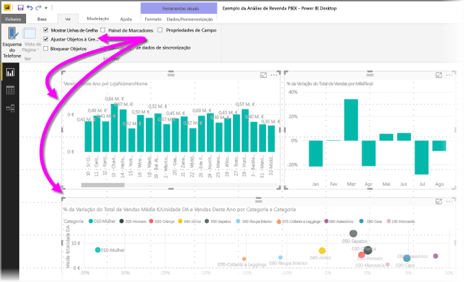
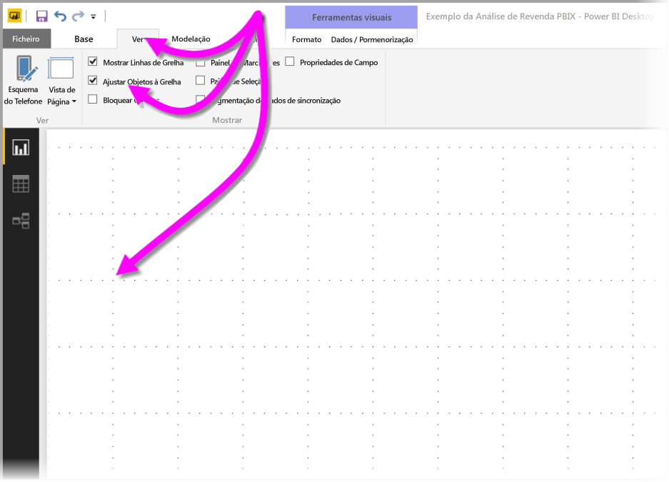
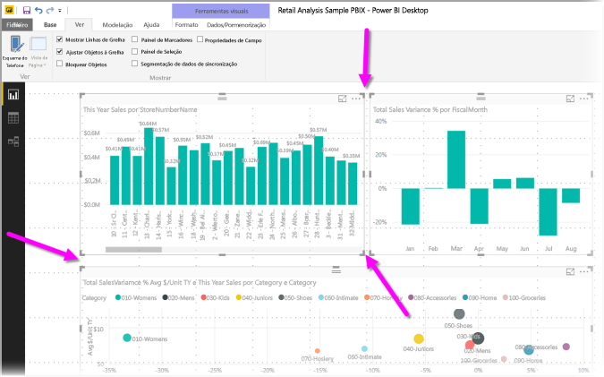
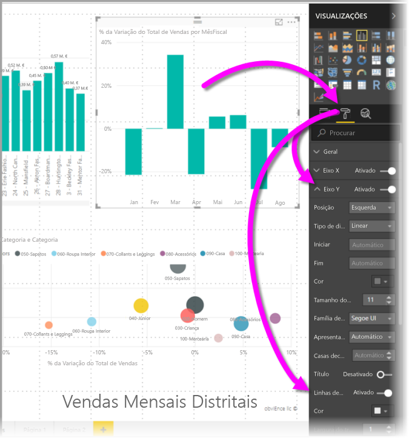
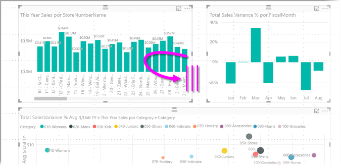
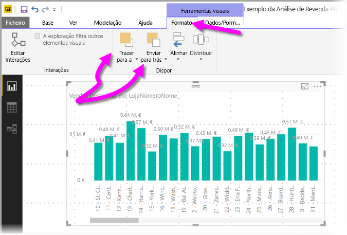
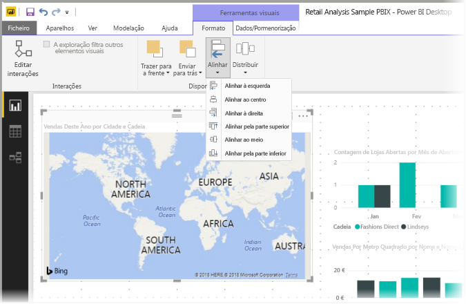
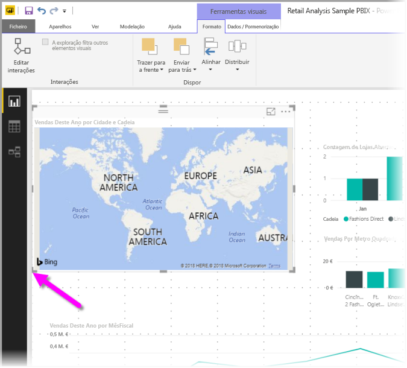
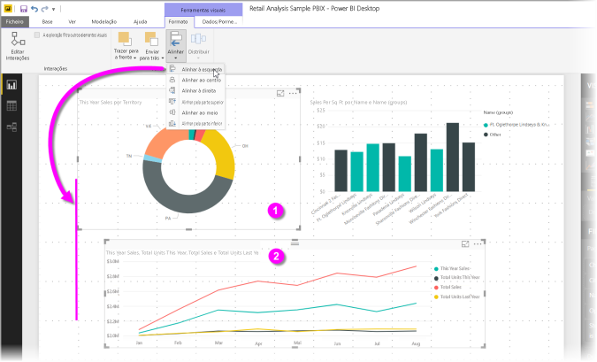
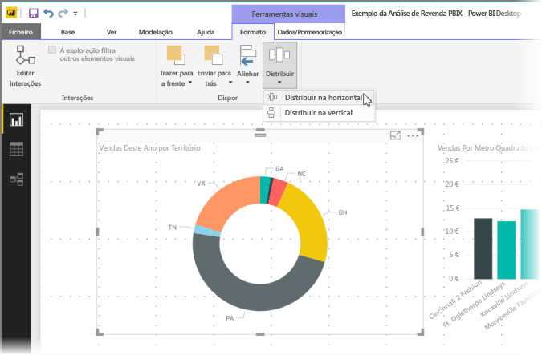

# Utilizar linhas de grelha e ajustar à grelha em relatórios do Power BI Desktop
A tela de relatório do **Power BI Desktop** fornece linhas de grelha que lhe permitem, de forma organizada, alinhar visuais numa página de relatório, e também fornece funcionalidades de ajuste à grelha, para que os visuais nos seus relatórios tenham um aspeto organizado, alinhado e com espaçamentos regulares.

No **Power BI Desktop**, também pode ajustar a ordenação z (trazer para a frente, enviar para trás) de objetos num relatório, bem como alinhar ou distribuir uniformemente os visuais selecionados na tela.

### Ativar linhas de grelha e ajuste à grelha
Para ativar as linhas de grelha e o ajuste à grelha, selecione o friso **Ver** e, em seguida, ative as caixas de verificação **Mostrar linhas de grelha** e **Ajustar objetos à grelha**. Pode selecionar uma ou ambas as caixas, pois têm um funcionamento independente.

> [!NOTE]
> Se as opções **Mostrar linhas de grelha** e **Ajustar objetos à grelha** estiverem desativadas, ligue-se a uma origem de dados para ativá-las.
> 
> 

### Utilizar linhas de grelha
As linhas de grelha são guias visuais que permitem ver se dois ou mais visuais estão devidamente alinhados. Esteja a tentar determinar se dois (ou mais) visuais estão alinhados horizontal ou verticalmente, utilize as linhas de grelha para determinar visualmente se os limites estão alinhados.

Pode utilizar *CTRL+Clique* para selecionar dois ou mais visuais de cada vez, o que mostra todos os limites dos visuais selecionados, permitindo facilmente ver se os visuais estão devidamente alinhados.

#### Utilizar linhas de grelha dentro de visuais
No Power BI, também existem linhas de grelha dentro de visuais, que fornecem guias visuais para comparar pontos de dados e valores. A partir da versão do **Power BI Desktop** de setembro de 2017, pode gerir as linhas de grelha em visuais utilizando o cartão do **Eixo X** ou o cartão do **Eixo Y** (conforme adequado com base no tipo de visual), que se encontra na secção **Formatar** do painel **Visualizações**. Pode gerir os seguintes elementos das linhas de grelha num visual:

* Ativar ou desativar linhas de grelha
* Alterar a cor das linhas de grelha
* Ajustar o traço (largura) das linhas de grelha
* Selecione o estilo da linha das linhas de grelha no visual, como por exemplo sólido, tracejado ou pontilhado

Pode ser especialmente útil modificar determinados elementos de linhas de grelha em relatórios que utilizem fundos escuros para visuais. A imagem seguinte mostra a secção *Linhas de grelha* no cartão **Eixo X**.

### Utilizar ajuste à grelha
Quando ativar a opção **Ajustar objetos à grelha**, todos os visuais na tela do **Power BI Desktop** que mover (ou redimensionar) serão automaticamente alinhados com o eixo de grelha mais próximo, o que torna muito mais fácil garantir que dois ou mais visuais se alinham com o mesmo tamanho ou localização vertical ou horizontal.

E é tudo o que precisa de saber sobre a utilização de **linhas de grelha** e **ajuste à grelha** para garantir facilmente que os visuais nos seus relatórios estão bem alinhados.

### Utilizar a ordenação z, alinhar e distribuir
Também pode gerir a ordem de frente para trás dos visuais num relatório, normalmente conhecida como a *ordenação z* dos elementos. Isto permite-lhe sobrepor visuais como pretender e, em seguida, ajustar a ordenação de frente para trás de cada visual. Esta ordenação é feita através dos botões **Trazer para a Frente** e **Enviar para Trás**, na secção **Dispor** do friso **Formatar**, que aparece assim que seleciona um ou mais visuais na página (se não forem selecionados visuais, não estará disponível).

O friso **Formatar** também lhe permite alinhar os seus visuais de muitas formas diferentes. Isto permite-lhe garantir que os seus visuais aparecem na página no alinhamento que considera melhor em termos de aspeto e funcionamento.

Quando um visual estiver selecionado, utilizar o botão **Alinhar** alinha esse visual com o limite (ou o centro) da tela de relatório, conforme mostrado na imagem seguinte.

Quando dois ou mais visuais estiverem selecionados, estes alinham-se e utilizam o limite alinhado existente dos visuais para alinhamento. Por exemplo, com dois visuais selecionados e o botão *Alinhar à Esquerda* selecionado, os visuais alinham-se com o limite mais à esquerda de todos os visuais selecionados.

Pode também distribuir os seus visuais uniformemente na tela de relatório, seja vertical ou horizontalmente. Basta utilizar o botão **Distribuir** do friso **Formatar**.

Com algumas seleções destas ferramentas de linhas de grelha, alinhamento e distribuição, os seus relatórios terão exatamente o aspeto que pretende.

