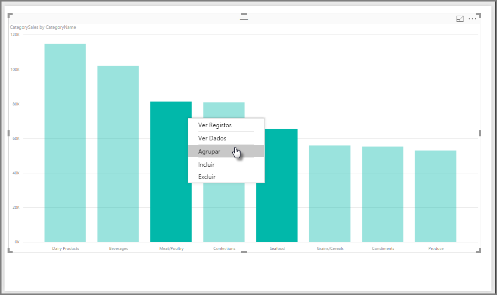
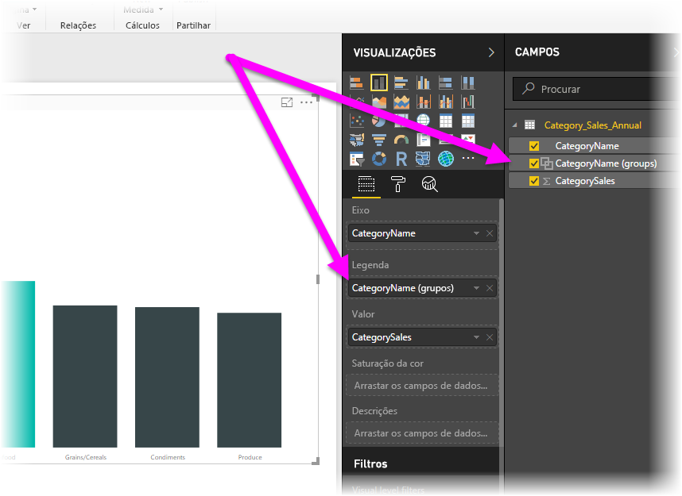
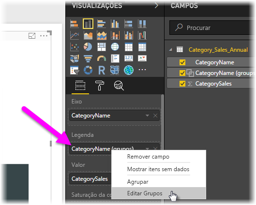
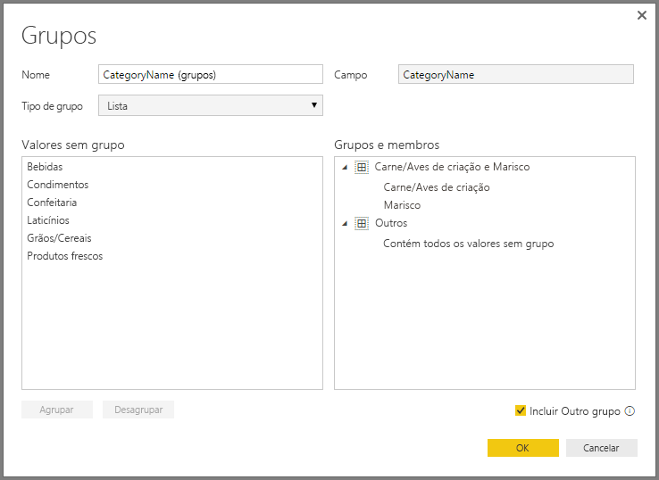
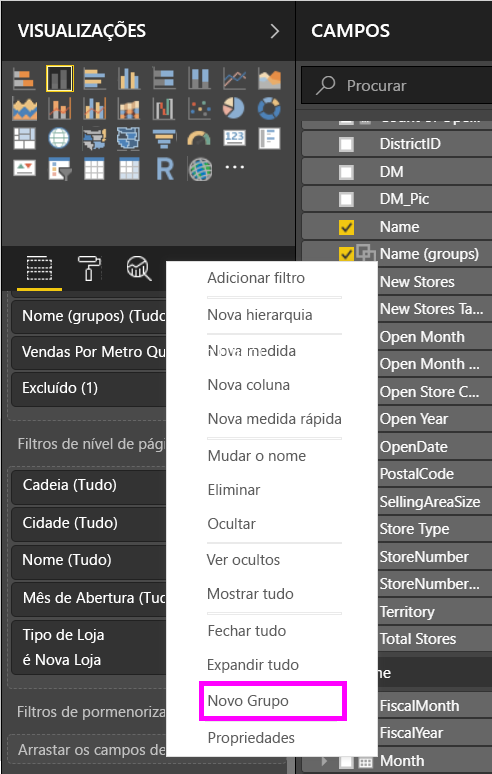
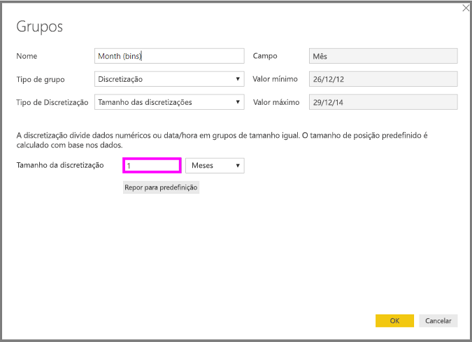
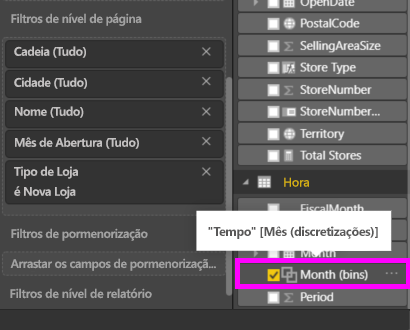

# Utilizar agrupamento e discretização no Power BI Desktop
Quando o **Power BI Desktop** cria elementos visuais, agrega os dados em segmentos (ou grupos) com base nos valores encontrados nos dados subjacentes. Muitas vezes não há problema, mas poderá haver alturas em que queira refinar a forma como os segmentos são apresentados. Por exemplo, pode querer colocar três categorias de produtos numa categoria maior (um *grupo*). Em alternativa, poderá querer ver os valores das vendas inseridos em tamanhos de discretização de 1 000 000 dólares, em vez de divididos uniformemente, 923 983 dólares.

No Power BI Desktop, pode **Agrupar** pontos de dados para ajudar a ver, analisar e explorar dados e tendências nos elementos visuais de forma mais clara. Também pode definir o **Tamanho de discretização**, frequentemente denominado *discretização*, para colocar os valores em grupos de tamanho igual que permitem ver melhor os dados de formas significativas.

### Utilizar o agrupamento
Para utilizar o agrupamento, selecione dois ou mais elementos num elemento visual através de Ctrl+Clique para selecionar vários elementos. Em seguida, clique com o botão direito do rato num dos vários elementos selecionados e selecione **Agrupar** no menu apresentado.

Uma vez criado, o grupo é adicionado ao registo **Legenda** do elemento visual e também aparece na lista **Campos**.

Depois de ter um grupo, pode editar facilmente os membros ao clicar com o botão direito do rato no registo **Legenda** ou na lista **Campos** e ao selecionar **Editar Grupos**.

Na janela **Grupos** apresentada, pode criar novos grupos ou modificar os grupos existentes. Também pode *mudar o nome* de qualquer grupo ao fazer duplo clique no título do grupo na caixa **Grupos e membros** e ao escrever um novo nome.

Há inúmeras coisas que pode fazer com os grupos. Pode adicionar itens da lista **Valores sem grupo** a um novo grupo ou a um dos grupos existentes. Para criar um novo grupo, selecione dois ou mais itens (com Ctrl+clique) na caixa **Valores sem grupo** e, em seguida, clique no botão **Grupo** abaixo dessa caixa.

Pode adicionar um valor sem grupo a um grupo existente: basta selecionar o valor sem grupo e, em seguida, selecionar o grupo existente ao qual quer adicionar e clicar no botão **Grupo**. Para remover um item de um grupo, selecione-o na caixa **Grupos e membros** e, em seguida, clique em **Desagrupar**. Também pode selecionar se as categorias sem grupo devem ser colocadas no grupo **Outros** ou permanecer sem grupo.

> [!NOTE]
> Pode criar grupos para qualquer campo no painel **Campos**, sem ter de selecionar vários a partir de um elemento visual existente. Basta clicar com o botão direito do rato e selecionar **Novo Grupo** no menu apresentado.
> 
> 

### Utilizar a discretização
Pode definir o tamanho de discretização dos campos numéricos e temporais no **Power BI Desktop.** Pode utilizar a discretização para dimensionar os dados apresentados pelo **Power BI Desktop**.

Para aplicar um tamanho de discretização, clique com o botão direito do rato num **Campo** e selecione **Novo Grupo**.

Na janela **Grupos**, defina o **Tamanho da discretização** para o tamanho pretendido.

Quando selecionar **OK**, será apresentado um novo campo no painel **Campos** com *(discretizações)* anexado. Em seguida, pode arrastar esse campo para a tela para utilizar o tamanho da discretização num elemento visual.

Para ver a **discretização** em ação, veja este [vídeo](https://www.youtube.com/watch?v=BRvdZSfO0DY).

E é tudo o que precisa de saber sobre a utilização do **agrupamento** e da **discretização** para garantir que os elementos visuais nos seus relatórios mostram os dados conforme quer.

