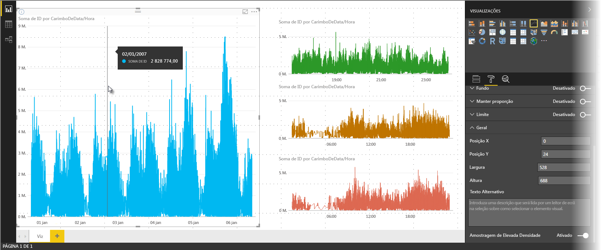
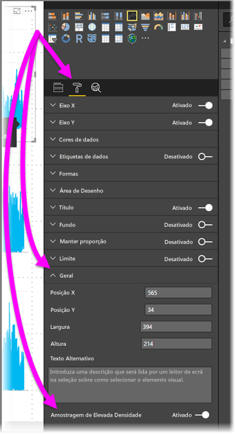

# Amostragem de linhas de alta densidade no Power BI
A partir da versão de junho de 2017 do **Power BI Desktop** e das atualizações ao **serviço Power BI**, há um novo algoritmo de amostragem disponível destinado a melhorar os elementos visuais que fornecem uma amostra dos dados de alta densidade. Por exemplo, pode criar um gráfico de linhas a partir dos resultados de vendas das suas lojas de revenda, em que cada loja tem mais de dez mil recibos de vendas por ano. Um gráfico de linhas dessas informações de vendas forneceria uma amostra dos dados (selecione uma representação expressiva desses dados, para ilustrar a variação das vendas ao longo do tempo) de cada loja e criaria um gráfico de linhas com várias séries que, desse modo, representa os dados subjacentes. Trata-se de uma prática corrente na visualização de dados de elevada densidade. O Power BI Desktop melhorou a respetiva capacidade de amostragem de dados de alta densidade, cujos detalhes são descritos neste artigo.

> [!NOTE]
> O algoritmo de **Amostragem de Alta Densidade** descrito neste artigo está disponível tanto no **Power BI Desktop** como no **serviço Power BI**.
> 
> 

## Modo de funcionamento da amostragem de linhas de alta densidade
Anteriormente, o **Power BI** selecionava, de uma forma determinista, uma coleção de pontos de dados de amostra no intervalo completo de dados subjacentes. Por exemplo, para os dados de alta densidade contidos num elemento visual referente a um ano de calendário, podem existir 350 pontos de dados de amostra apresentados no elemento visual, tendo cada um deles sido selecionado para garantir a representação do intervalo completo de dados (a série global de dados subjacentes) no elemento visual. Para ajudar a compreender como isto acontece, imagine representar preços de ações ao longo do período de um ano e selecionar 365 pontos de dados para criar um gráfico de linhas (ou seja, um ponto de dados para cada dia).

Nessa situação, existem inúmeros valores para um preço de ações em cada dia. Naturalmente, existe um valor diário alto e outro baixo, mas estes podem ocorrer em qualquer altura do dia enquanto a bolsa de valores está aberta. No que se refere à amostragem de linhas de alta densidade, se a amostra de dados subjacente tiver sido extraída às 10:30 e às 12:00 de cada dia, obtém um instantâneo representativo dos dados subjacentes (o preço às 10:30 e às 12:00), mas este pode não recolher os valores alto e baixo reais do preço das ações para esse ponto de dados representativo (desse dia). Nessa situação, bem como noutras, a amostragem é representativa dos dados subjacentes, mas nem sempre capta pontos importantes, o que, neste caso, seriam os valores diários altos e baixos do preço das ações.

Por definição, a amostragem de dados de alta densidade é efetuada para criar visualizações reativas à interação com alguma rapidez. Demasiados pontos de dados num elemento visual podem torná-lo demasiado denso e afetar a visibilidade das tendências. Assim, a forma como esses dados são objeto de amostragem é o que pauta a criação do algoritmo de amostragem, a fim de proporcionar a melhor experiência de visualização possível. No Power BI Desktop, o algoritmo foi melhorado para fornecer a melhor combinação de capacidade de resposta, representação e preservação dos pontos importantes em cada ciclo de tempo.

## Modo de funcionamento do novo algoritmo de amostragem de linhas
O novo algoritmo para a amostragem de linhas de alta densidade está disponível para os seguintes elementos visuais: gráfico de linhas e gráfico de área com um eixo X contínuo.

Para um elemento visual de alta densidade, o **Power BI** reparte inteligentemente os dados em segmentos de alta resolução e, em seguida, escolhe pontos importantes para representar cada segmento. Esse processo de repartição de dados de alta resolução está especificamente otimizado para garantir que o gráfico resultante é visualmente indistinguível no que toca a composição de todos os pontos de dados subjacentes, mas de uma forma muito mais rápida e interativa.

### Valores mínimos e máximos para elementos visuais de linhas de alta densidade
As limitações de elementos visuais que se seguem aplicam-se a qualquer visualização fornecida:

* **3500** é o número máximo de pontos de dados *apresentados* no elemento visual, independentemente do número de pontos de dados ou séries subjacente. Como tal, se tiver 10 séries com 350 pontos de dados cada, o elemento visual terá atingido o limite máximo de pontos de dados global. Se tiver uma série, esta poderá ter até 3500 pontos de dados caso o novo algoritmo considere que essa é a melhor amostragem para os dados subjacentes.
* Há um máximo de **60 séries** para qualquer elemento visual. Se tiver mais de 60 séries, divida os dados e crie vários elementos visuais com 60 ou menos séries cada. É recomendável utilizar uma **segmentação de dados** para mostrar apenas segmentos dos dados (apenas determinadas séries). Por exemplo, se estiver a apresentar todas as subcategorias na legenda, pode utilizar uma segmentação de dados para filtrar pela categoria global na mesma página do relatório.

Estes parâmetros garantem que a composição dos elementos visuais no Power BI Desktop é muito rápida, que estes reagem à interação com os utilizadores e que isso não resulta numa sobrecarga computacional indevida no computador responsável pela composição do elemento visual.

### Avaliar pontos de dados representativos para elementos visuais de linhas de alta densidade
Quando o número de pontos de dados subjacentes excede os pontos de dados máximos que podem ser representados no elemento visual (mais de 3500), é dado início a um processo chamado *discretização*, que segmenta os dados subjacentes em grupos chamados *contentores* e, em seguida, refina esses contentores de forma iterativa.

O algoritmo cria o maior número de contentores comportável para criar a maior granularidade possível para o elemento visual. Dentro de cada contentor, o algoritmo deduz os valores de dados mínimo e máximo, a fim de garantir a recolha e apresentação de valores importantes e significativos (por exemplo, valores atípicos) no elemento visual. Tendo por base os resultados da discretização e da avaliação subsequente dos dados pelo Power BI, procede-se à determinação da resolução mínima para o eixo X do elemento visual – de modo a garantir a máxima granularidade para o elemento visual.

Conforme mencionado anteriormente, a granularidade mínima para cada série é de 350 pontos e a máxima é de 3500.

Cada contentor é representado por dois pontos de dados, que se tornam os pontos de dados representativos do contentor no elemento visual. Os pontos de dados são simplesmente os valores alto e baixo desse contentor e, ao selecioná-los, o processo de discretização assegura a recolha e composição de todo e qualquer valor alto importante ou valor baixo significativo no elemento visual.

Isto pode parecer um elevado grau de análise para garantir a recolha de um ou outro valor atípico e a respetiva apresentação correta no elemento visual, mas esta é precisamente a razão na base do novo algoritmo e do processo de discretização.

## Descrições e amostragem de linhas de alta densidade
É importante ter em atenção que este processo de discretização, que resulta na recolha e apresentação dos valores mínimo e máximo de um contentor, pode afetar o modo como as descrições apresentam dados quando faz pairar o rato sobre os pontos de dados. Para explicar como e por que razão isto acontece, vamos rever o exemplo sobre os preços de ações.

Vamos supor que está a criar um elemento visual baseado no preço das ações e a comparar duas ações diferentes, sendo que ambas estão a utilizar a **Amostragem de Alta Densidade**. Os dados subjacentes de cada série têm inúmeros pontos de dados (talvez esteja a recolher o preço das ações a cada segundo do dia). O algoritmo de amostragem de linhas de alta densidade realiza a discretização de cada série de forma independente da seguinte.

Agora, vamos supor que o preço da primeira ação sobe às 12:02 e, em seguida, volta rapidamente a baixar dez segundos depois. É um ponto de dados importante. Quando a discretização ocorre para essa ação, o valor alto registado às 12:02 será um ponto de dados representativo para esse contentor.

No entanto, na segunda ação, 12:02 não foi um valor alto nem baixo no contentor que incluía essa hora. Talvez o valor alto e baixo do contentor que incluía 12:02 tenha ocorrido três minutos depois. Nessa situação, quando o gráfico de linhas for criado e fizer pairar o rato sobre as 12:02, irá ver um valor na descrição da primeira ação (porque subiu às 12:02 e esse valor foi selecionado como o ponto de dados alto desse contentor), mas *não* irá ver qualquer valor na descrição da segunda ação às 12:02. Isto porque a segunda ação não registou qualquer valor, alto ou baixo, para o contentor que incluía a hora 12:02. Como tal, não existem dados a mostrar para a segunda ação às 12:02, logo, não existem dados de descrição a apresentar.

Esta situação é frequente com as descrições. Os valores alto e baixo para um determinado contentor poderão não corresponder de forma exata aos pontos de valor do eixo X dimensionados uniformemente, pelo que a descrição não apresentará o valor.  

## Como ativar a amostragem de linhas de alta densidade
Por predefinição, o novo algoritmo está **ativado**. Para alterar esta definição, aceda ao painel **Formatação**, na secção **Geral** e, ao longo da parte inferior, encontrará um controlo de deslize de alternar chamado **Amostragem de Alta Densidade**. Para o desativar, deslize para a posição **Desativado**.

## Considerações e limitações
O novo algoritmo para a amostragem de linhas de alta densidade é uma melhoria importante para o Power BI, mas existem algumas considerações que precisa de ter em conta quando trabalhar com dados e valores de alta densidade.

* Em virtude de uma maior granularidade e do processo de discretização, as **Descrições** poderão mostrar um valor apenas se os dados representativos estiverem alinhados com o cursor. Veja a secção *Descrições e amostragem de linhas de alta densidade* neste artigo para obter mais informações.
* Quando o tamanho de uma origem de dados global é demasiado grande, o novo algoritmo elimina séries (elementos de legenda) para acomodar a restrição relativa ao máximo de importação de dados.
  
  * Nesta situação, o novo algoritmo ordena as séries de legendas por ordem alfabética e percorre a lista de elementos de legenda por ordem alfabética, até o máximo de importação de dados ser atingido, e não importa séries adicionais.
* Quando um conjunto de dados subjacente tem mais de 60 séries (o número máximo de séries, conforme descrito anteriormente), o novo algoritmo ordena as séries por ordem alfabética e elimina as séries existentes após a 60ª série ordenada por ordem alfabética.
* Se os valores contidos nos dados não forem do tipo *numérico* ou *data/hora*, o Power BI não irá utilizar o novo algoritmo e irá reverter para o algoritmo anterior (sem ser de amostragem de alta densidade).
* A definição **Mostrar itens sem dados** não é suportada com o novo algoritmo.
* O novo algoritmo não é suportado quando é utilizada uma ligação em direto para um modelo alojado no SQL Server Analysis Services (versão 2016 ou anterior). É suportado em modelos alojados no **Power BI** ou Azure Analysis Services.

## Próximos passos
Para obter informações sobre a amostragem de alta densidade em gráficos de dispersão, veja o seguinte artigo.

* [Amostragem de Alta Densidade em gráficos de dispersão do Power BI](desktop-high-density-scatter-charts.md)

