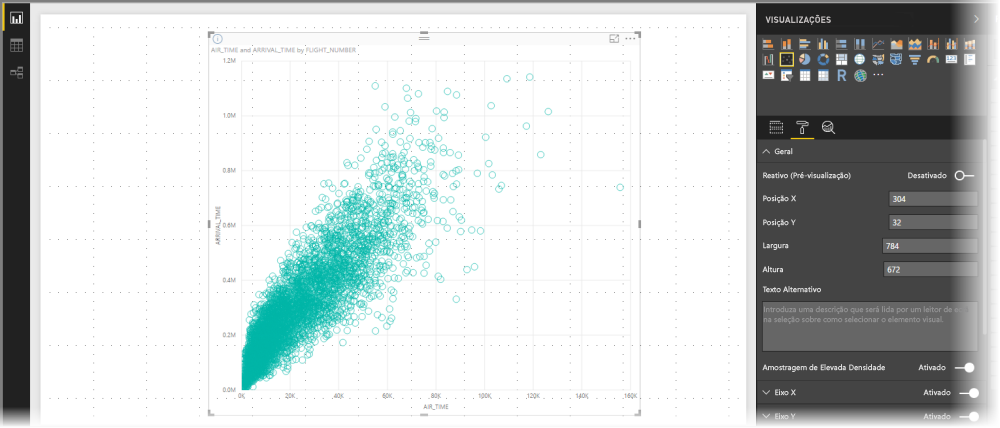
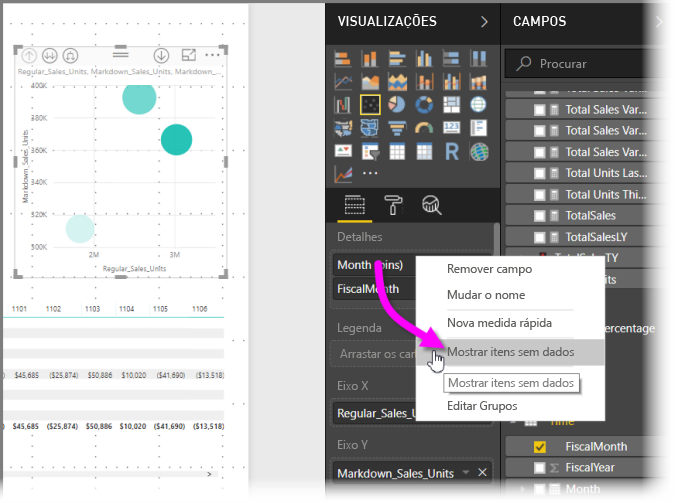
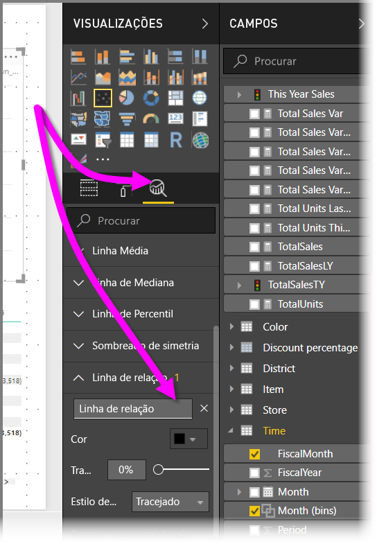
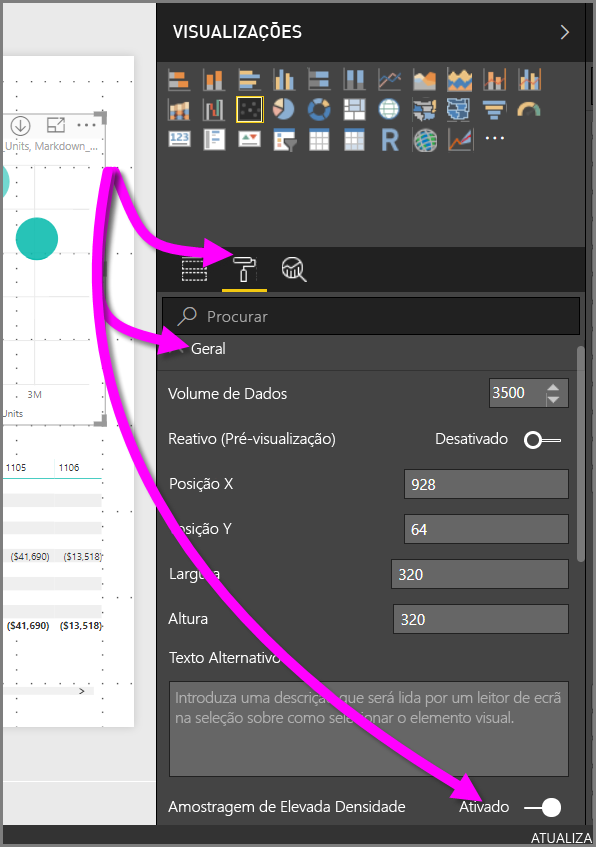

# Amostragem de alta densidade em gráficos de dispersão do Power BI
A partir da versão de setembro de 2017 do **Power BI Desktop** e das atualizações ao **serviço Power BI**, há um novo algoritmo de amostragem disponível destinado a melhorar a forma como os gráficos de dispersão representam dados de alta densidade.

Por exemplo, poderá criar um gráfico de dispersão a partir da atividade de vendas da sua organização, cada loja com dezenas de milhares de pontos de dados por ano. Um gráfico de dispersão dessas informações apresentaria uma amostra dos dados (selecione uma representação expressiva desses dados, para ilustrar a variação das vendas ao longo do tempo) dos dados disponíveis e crie um gráfico de dispersão que representa os dados subjacentes. Trata-se de uma prática corrente nos gráficos de dispersão com dados de alta densidade. O Power BI melhorou a respetiva capacidade de amostragem de dados de alta densidade, cujos detalhes são descritos neste artigo.

> [!NOTE]
> O algoritmo de **Amostragem de Alta Densidade** descrito neste artigo está disponível em gráficos de dispersão, tanto no **Power BI Desktop** como no **serviço Power BI**.
> 
> 

## Funcionamento dos gráficos de dispersão de alta densidade
Anteriormente, o **Power BI** selecionava, de uma forma determinista, uma coleção de pontos de dados de amostra no intervalo completo de dados subjacentes para criar um gráfico de dispersão. Especificamente, o Power BI deverá selecionar as primeiras e as últimas linhas de dados na série do gráfico de dispersão e, em seguida, dividir as linhas restantes uniformemente, para que sejam desenhados 3.500 pontos de dados no gráfico de dispersão. Por exemplo, se o exemplo tivesse 35 000 linhas, as primeiras e as últimas linhas seriam selecionadas para desenhar e, em seguida, a cada dez linhas também poderiam ser desenhadas (35 000/10 = a cada dez linhas = 3500 pontos de dados). Além disso, anteriormente, os valores nulos ou pontos que não puderam ser desenhados (por exemplo, valores de texto) na série de dados não foram apresentados e, por conseguinte, não foram considerados ao gerar o elemento visual. Com essa amostragem, a densidade percetível do gráfico de dispersão também foi baseada nos pontos de dados representativos e, desta forma, a densidade implícita do elemento visual foi uma circunstância dos pontos de amostras, e não a coleção completa dos dados subjacentes.

Quando ativa a **Amostragem de Alta Densidade**, o Power BI implementa um algoritmo que elimina pontos sobrepostos e assegura que os pontos do elemento visual podem ser alcançados ao interagir com o elemento visual. O algoritmo também garante que todos os pontos do conjunto de dados são representados no elemento visual, ao apresentar contexto para o significado dos pontos selecionados, em vez de desenhar apenas uma amostra representativa.

Por definição, a amostragem de dados de alta densidade é efetuada para criar visualizações reativas à interação com alguma rapidez. Demasiados pontos de dados num elemento visual podem torná-lo demasiado denso e afetar a visibilidade das tendências. Por isso, o que pauta a criação do algoritmo de amostragem é a forma como os dados são objeto de amostragem, de forma a proporcionar a melhor experiência possível de visualização e assegurar que todos os dados são representados. No Power BI, o algoritmo foi melhorado para apresentar a melhor combinação de capacidade de resposta, representação e preservação dos pontos importantes no conjunto geral dos dados.

> [!NOTE]
> Os gráficos de dispersão com o algoritmo de **Amostragem de Alta Densidade** são melhor desenhados em elementos visuais quadrados, tal como acontece com todos os gráficos de dispersão.
> 
> 

## Modo de funcionamento do novo algoritmo de amostragem do gráfico de dispersão
O novo algoritmo para a **Amostragem de Alta Densidade** para gráficos de dispersão implementa métodos que capturam e representam os dados subjacentes de forma mais eficaz e eliminam pontos sobrepostos. Fá-lo ao começar com um pequeno radius para cada ponto de dados (o tamanho do círculo visual para um determinado ponto na visualização). Em seguida, aumenta o radius de todos os pontos de dados; quando dois (ou mais) pontos de dados se sobrepõem, um círculo único (com o tamanho aumentado do radius) representa esses pontos de dados sobrepostos. O algoritmo continua a aumentar o radius de pontos de dados, até que os resultados de valor de radius num número de pontos de dados razoável - 3.500 - sejam apresentados no gráfico de dispersão.

Os métodos neste algoritmo asseguram que os valores atípicos são representados no elemento visual resultante. O algoritmo também respeita a escala ao determinar a sobreposição, de forma a que as escalas exponenciais sejam visualizadas com fidelidade aos pontos subjacentes visualizados.

O algoritmo também preserva a forma global do gráfico de dispersão.

> [!NOTE]
> Ao utilizar o algoritmo de **Amostragem de Alta Densidade** em gráficos de dispersão, a *distribuição exata* dos dados é o objetivo, e a densidade visual implícita *não* é o objetivo. Por exemplo, poderá ver um gráfico de dispersão com muitos círculos que se sobrepõem (densidade) numa determinada área e imaginar que muitos pontos de dados têm de ser agrupados lá; uma vez que o algoritmo de **Amostragem de Alta Densidade** pode utilizar um círculo para representar muitos pontos de dados, essa densidade visual implícita (ou "clustering") não irá aparecer. Para obter mais detalhes de uma determinada área, pode utilizar segmentações de dados para ampliar.
> 
> 

Além disso, os pontos de dados que não podem ser desenhados (por exemplo, nulos ou valores de texto) são ignorados, então é selecionado outro valor que possa ser desenhado, garantindo ainda mais que a forma verdadeira do gráfico de dispersão é mantida.

### Quando o algoritmo padrão é utilizado em gráficos de dispersão
Existem circunstâncias em que a **Amostragem de Alta Densidade** não pode ser aplicada num gráfico de dispersão e o algoritmo original é utilizado. Essas circunstâncias são as seguintes:

* Se clicar com o botão direito do rato num valor em **Detalhes** e o definir para **Mostrar itens sem dados** no menu, o gráfico de dispersão irá reverter para o algoritmo original.
  
  
* Os valores existentes no eixo **Reproduzir** irá resultar no gráfico de dispersão a reverter para o algoritmo original.
* Se os eixos X e Y faltarem num gráfico de dispersão, o gráfico é revertido para o algoritmo original.
* Utilizar uma **Linha de rácio** no painel **Análise** resulta no gráfico a reverter para o algoritmo original.
  
  

## Como ativar a amostragem de alta densidade de um gráfico de dispersão
Para ativar a **Amostragem de Alta Densidade**, selecione um gráfico de dispersão, aceda ao painel **Formatação**, expanda o cartão **Geral** e, na parte inferior do cartão, mude o controlo de deslize **Amostragem de Alta Densidade** para **Ativado**.

> [!NOTE]
> Depois do controlo de deslize estar ativado, o Power BI tentará utilizar o algoritmo **Amostragem de Alta Densidade** sempre que possível. Quando não for possível utilizar o algoritmo (por exemplo, poderá colocar um valor no eixo *Reproduzir*), o controlo de deslize permanece na posição **Ativado**, apesar de o gráfico estar revertido para o algoritmo padrão. Se, em seguida, remover um valor do eixo *Reproduzir* (ou as condições forem alteradas para permitir a utilização do algoritmo de amostragem de alta densidade), o gráfico irá utilizar automaticamente a amostragem de alta densidade para esse gráfico, uma vez que a funcionalidade está ativa.
> 
> [!NOTE]
> Os pontos de dados são agrupados ou selecionados pelo índice. Ter uma legenda não afeta a amostragem para o algoritmo, afeta apenas a ordenação do elemento visual.
> 
> 

## Considerações e limitações
A amostragem do algoritmo de alta densidade é uma melhoria importante para o Power BI, mas existem algumas considerações a ter em conta quando trabalhar com valores de alta densidade e gráficos de dispersão.

* O algoritmo de **Amostragem de Alta Densidade** funciona apenas com ligações em direto a modelos baseados no serviço Power BI, modelos importados ou do DirectQuery.

## Próximos passos
Para obter mais informações sobre a amostragem de alta densidade em outros gráficos, veja o seguinte artigo.

* [Amostragem de linhas de alta densidade no Power BI](desktop-high-density-sampling.md)

