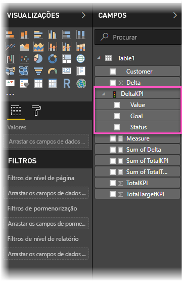
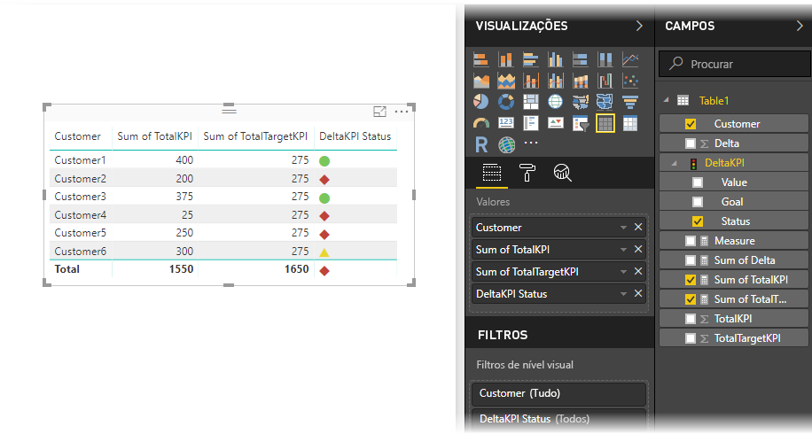

# Importar e apresentar os KPIs no Power BI
No **Power BI Desktop**, pode importar e mostrar os KPIs em tabelas, matrizes e cartões.

Siga estes passos para importar e mostrar KPIs.

1. Comece com um livro do Excel que tem um modelo do Power Pivot e KPIs. Este exercício utiliza um livro chamado *KPIs*.

1. Importe o livro do Excel para o Power BI através de **Ficheiro -> Importar -> Conteúdo do livro do Excel**. Pode também [saber como importar livros](desktop-import-excel-workbooks.md). 

1. Após a importação para o Power BI, o KPI será apresentado no painel **Campos**, marcado com o ícone de . Para utilizar um KPI no relatório, confirme que expande o conteúdo ao expor os campos **Valor**, **Objetivo** e **Estado**.

    

1. Os KPIs importados são recomendados para tipos de visualização padrão, tal como o tipo **Tabela**. O Power BI também inclui o tipo de visualização **KPI**, que só deve ser utilizado para criar novos KPIs.
   
    

É tudo. Pode utilizar os KPIs para realçar tendências, progresso ou outros indicadores de interesse.
