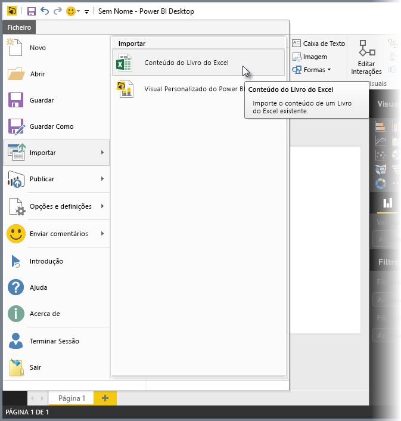
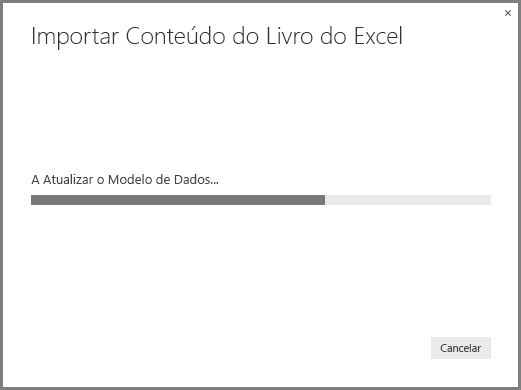
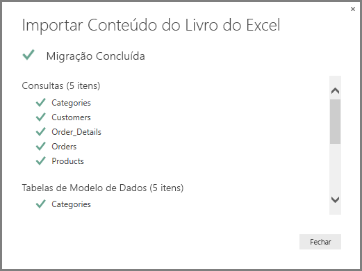
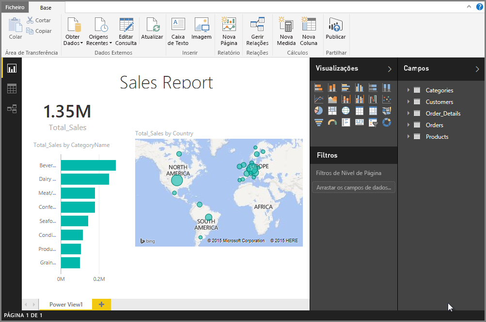

# Importar livros do Excel para o Power BI Desktop
Com o **Power BI Desktop**, pode importar facilmente livros do Excel que contêm consultas do Power Query, modelos do Power Pivot e folhas de cálculo do Power View para o Power BI Desktop. Os relatórios e as visualizações são criados automaticamente com base no livro do Excel e, uma vez importados, pode continuar a melhorar e otimizar os relatórios com o Power BI Desktop, através das funcionalidades existentes e novas funcionalidades lançadas em cada atualização mensal do Power BI Desktop.

No futuro, o plano é fornecer comunicações adicionais entre o Excel e o Power BI Desktop (como importar e exportar); esta capacidade atual de importar livros para o Power BI Desktop permite que os utilizadores existentes do Excel comecem a utilizar o Power BI Desktop.

## Como importar um livro do Excel?
Para importar um livro, no Power BI Desktop, selecione **Ficheiro -\> Importar -\> Conteúdo do Livro do Excel**.

É apresentada uma janela, permitindo-lhe selecionar o livro a importar. Atualmente, não há nenhuma limitação para o tamanho ou número de objetos no livro, mas o Power BI Desktop demora mais tempo a analisar e importar livros maiores.

> [!NOTE]
> Para carregar ou importar ficheiros do Excel de pastas **partilhadas do OneDrive para Empresas** ou de pastas de um **grupo do Office 365**, utilize o URL do ficheiro do Excel e introduza-o na origem de dados **Web** no Power BI Desktop. Tem de seguir alguns passos para formatar corretamente o URL do **OneDrive para Empresas**, portanto, consulte [Utilizar as ligações do OneDrive para Empresas no Power BI Desktop](desktop-use-onedrive-business-links.md) para obter mais informações e a série correta de passos.
> 
> 

Quando um livro é selecionado, o Power BI Desktop analisa o livro e converte-o num ficheiro do Power BI Desktop (.pbix). Esta ação é um evento único; depois de criar o ficheiro do Power BI Desktop com estes passos, o ficheiro do Power BI Desktop não tem nenhuma dependência do livro original do Excel e pode ser modificado ou alterado (e guardado e partilhado) sem afetar o livro original.

Depois de a importação estar concluída, é apresentada uma página **Resumo** que descreve os itens que foram convertidos e também lista quaisquer itens que não puderam ser importados.

Quando seleciona **Fechar**, o relatório é carregado no Power BI Desktop. A imagem seguinte mostra o Power BI Desktop depois de um livro do Excel ser importado: O Power BI Desktop carregou automaticamente o relatório com base nos conteúdos do livro.

Agora que o livro foi importado, pode continuar a trabalhar no relatório – criando novas visualizações, adicionando dados, ou criando novas páginas de relatório – com qualquer uma das funcionalidades e capacidades incluídas no Power BI Desktop.

## Que elementos de livro são importados?
O Power BI Desktop pode importar os seguintes elementos, normalmente conhecidos como *objetos*, no Excel.

| Objeto em Livro do Excel | Resultado Final no ficheiro do Power BI Desktop |
| --- | --- |
| Consultas do Power Query |Todas as consultas do Power Query do Excel são convertidas em consultas no Power BI Desktop. Se havia Grupos de Consulta definidos no Livro do Excel, a mesma organização será replicada no Power BI Desktop. Todas as consultas são carregadas, a menos que tenham sido definidas como "Apenas Criar Ligação" no Excel. O comportamento de Carregar pode ser personalizado na caixa de diálogo **Propriedades** no separador **Base** do **Editor de Consultas** no Power BI Desktop. |
| Ligações de Dados Externas do Power Pivot |Todas as ligações de Dados Externas do Power Pivot serão convertidas em consultas no Power BI Desktop. |
| Tabelas Ligadas ou tabelas de Livro Atual |Se existir uma tabela de folhas de cálculo no Excel ligada ao Modelo de Dados ou ligada a uma consulta (através da opção *Da Tabela* ou da função *Excel.CurrentWorkbook()* em M), são apresentadas as seguintes opções: <ol><li>Importe a tabela para o ficheiro do Power BI Desktop. Esta tabela é um instantâneo único dos dados, após o qual não pode editar os dados na tabela no Power BI Desktop. Há um limite de tamanho de 1 milhão de carateres (no total, combinando todas as células e cabeçalhos de coluna) para tabelas criadas com essa opção.</li><li>Mantenha uma ligação ao livro original. Em alternativa, pode manter uma ligação ao Livro do Excel original e o Power BI Desktop recupera o conteúdo mais recente nesta tabela com cada atualização, assim como qualquer outra consulta criada para um livro do Excel no Power BI Desktop.</li></ul> |
| Colunas Calculadas, Medidas, KPIs, Categorias de Dados e Relações do Modelo de Dados |Estes objetos de Modelo de Dados são convertidos em objetos equivalentes no Power BI Desktop. Tenha em atenção que existem determinadas Categorias de Dados que não estão disponíveis no Power BI Desktop, tais como **Imagem**. Nestes casos, as informações de Categoria de Dados serão redefinidas para as colunas em questão. |
| Folhas de Cálculo do Power View |Uma nova página de relatório é criada para cada folha de cálculo do Power View no Excel. O nome e a ordem destas páginas de relatório correspondem aos do livro original do Excel. |

## Há alguma limitação para importar um livro?
Existem algumas limitações para importar um livro no Power BI Desktop, que se encontram na lista seguinte:

* **Ligações Externas para Modelos Tabulares do Analysis Services:** No Excel 2013, pode criar uma ligação com os Modelos de tabela do SQL Server Analysis Services e criar relatórios do Power View sobre estes modelos, sem ter de importar os dados. Atualmente, este tipo de ligação não é suportado como parte da importação de Livros do Excel para o Power BI Desktop. Como solução, deve recriar estas ligações externas no Power BI Desktop.
* **Hierarquias:** Este tipo de objeto de Modelo de Dados não é atualmente suportado no Power BI Desktop. Como tal, as hierarquias são ignoradas como parte da importação de um Livro do Excel para o Power BI Desktop.
* **Colunas de dados binários:** Este tipo de coluna de Modelo de Dados não é atualmente suportada no Power BI Desktop. As colunas de Dados Binários são removidas da tabela resultante no Power BI Desktop.
* **Elementos do Power View não suportados:** Algumas funcionalidades do Power View não estão disponíveis no Power BI Desktop, tais como os Temas ou determinados tipos de visualizações (Gráfico de Dispersão com Eixo de Reprodução, comportamentos de Desagregação, etc.). Estas visualizações sem suporte resultam em mensagens de *Visualização Sem Suporte* nas respetivas localizações correspondentes no relatório do Power BI Desktop, que pode eliminar ou reconfigurar conforme necessário.
* **Intervalos com Nome ao utilizar** ***Da Tabela*** **no Power Query, ou ao utilizar** ***Excel.CurrentWorkbook*** **em M:** A importação destes dados de intervalo com nome para o Power BI Desktop não é atualmente suportada, mas é uma atualização planeada para o Power BI Desktop. Atualmente, estes intervalos com nome são carregados para o Power BI Desktop como uma ligação ao livro externo do Excel.
* **PowerPivot para SSRS:** As ligações externas do PowerPivot ao SSRS (SQL Server Reporting Services) não são atualmente suportadas, já que essa origem de dados não está disponível atualmente no Power BI Desktop.

