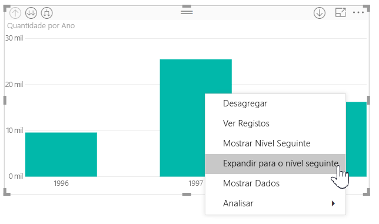
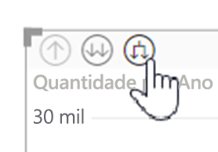
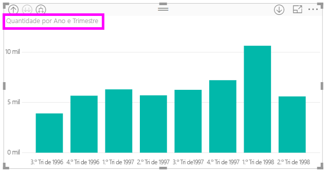
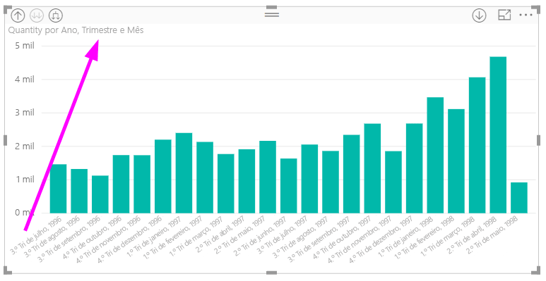
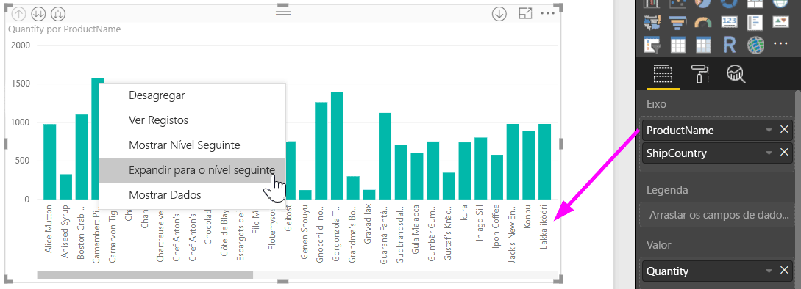
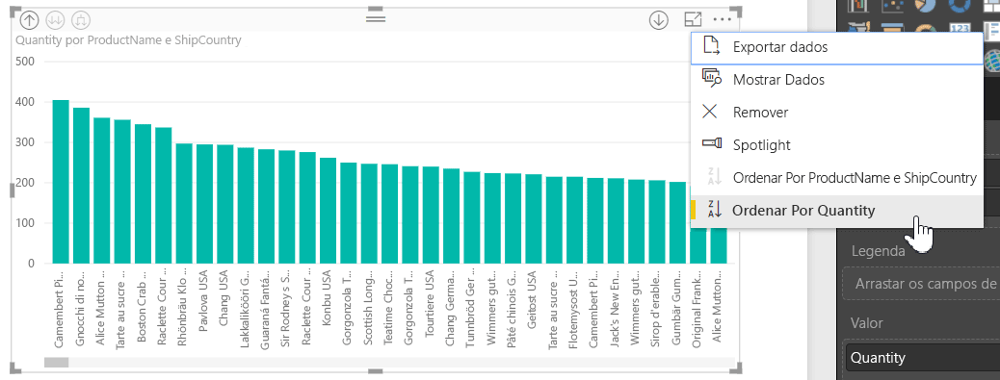
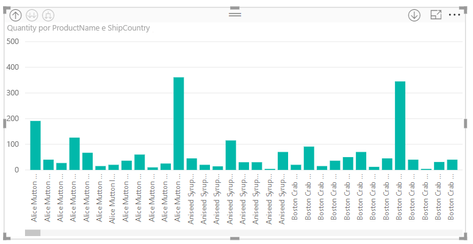

# Utilizar etiquetas de hierarquia inline no Power BI Desktop
O **Power BI Desktop** suporta a utilização de **etiquetas de hierarquia inline**, a primeira de duas funcionalidades destinadas a melhorar a desagregação hierárquica. A segunda funcionalidade, atualmente em desenvolvimento, é a capacidade de utilizar etiquetas de hierarquia aninhadas (esteja atento; as nossas atualizações ocorrem frequentemente).   

## Como funcionam as etiquetas de hierarquia inline
Com as etiquetas de hierarquia inline, pode ver as etiquetas de hierarquia à medida que expande os elementos visuais através da funcionalidade **Expandir Tudo**. Uma vantagem excelente para ver estas etiquetas de hierarquia é o facto de também poder optar por **ordenar** por estas etiquetas de hierarquia diferentes à medida que expande os dados hierárquicos.

### Utilizar a funcionalidade Expandir incorporada (sem ordenar por etiquetas de hierarquia)
Antes de vermos as etiquetas de hierarquia inline em ação, vamos rever o comportamento da funcionalidade **Expandir para o nível seguinte**. Fazê-lo ajuda-nos a compreender (e a agradecer) a utilidade das etiquetas de hierarquia inline.

A imagem seguinte mostra um elemento visual de gráfico de barras de vendas anuais. Ao clicar com o botão direito do rato numa barra, pode selecionar **Expandir para o nível seguinte**.

> [!NOTE]
> Em alternativa a clicar com o botão direito do rato numa barra, pode selecionar o botão *Expandir* no canto superior esquerdo da visualização.

  

Depois de selecionar **Expandir para o nível seguinte**, o elemento visual expande a hierarquia de datas de *Ano* até *Trimestre*, conforme apresentado na imagem seguinte.

Repare que as etiquetas *Ano* e *Trimestre* são apresentadas inline. Este esquema de etiquetas continua à medida que seleciona **Expandir Tudo** até à parte inferior da hierarquia.

É assim que se comporta a hierarquia *Data* incorporada, associada a campos que tenham um tipo de dados *data/hora*. Vamos avançar para a secção seguinte e ver como é diferente a nova funcionalidade de etiquetas de hierarquia inline.

### Utilizar etiquetas de hierarquia inline
Agora, vamos ver um gráfico diferente, através de dados com hierarquias informais. No seguinte elemento visual, temos um gráfico de barras com **Quantidade**, a utilizar *NomeDoProduto* como o eixo. Nestes dados, *NomeDoProduto* e *PaísDoEnvio* formam uma hierarquia informal. A partir daqui, pode selecionar novamente *Expandir para o nível seguinte* para desagregar a hierarquia.

A seleção de **Expandir para o nível seguinte** mostra o nível seguinte com a apresentação inline das etiquetas de hierarquia. Por predefinição, as hierarquias inline são ordenadas pelo valor de medida, neste caso, **Quantidade**. Com as etiquetas de hierarquia inline ativadas, pode optar por ordenar estes dados pela hierarquia, ao selecionar as reticências no canto superior direito (**...**) e, em seguida, selecionar **Ordenar Por NomeDoProduto PaísDoEnvio**, conforme apresentado na imagem seguinte.

Quando **PaísDoEnvio** estiver selecionado, os dados serão ordenados com base na seleção de hierarquia informal, conforme apresentado na imagem seguinte.

> [!NOTE]
> A funcionalidade de etiquetas de hierarquia inline ainda não permite ordenar a hierarquia de tempo incorporada por valor; é ordenada apenas pela ordem de hierarquia.
> 
> 

## Resolução de problemas
É possível que os elementos visuais fiquem bloqueados num estado de nível de hierarquia inline expandido. Em alguns casos, pode verificar que alguns dos elementos visuais estão bloqueados no modo a partir do qual foram expandidos. Nesse caso, a agregação não funciona. Isto pode acontecer se seguiu os passos seguintes (a correção está *abaixo* destes passos):

Passos que podem bloquear os elementos visuais num estado expandido:

1. Ativar a funcionalidade de **etiquetas de hierarquia inline**
2. Criar alguns elementos visuais com hierarquias
3. **Expandir Tudo** e guardar o ficheiro
4. *Desativar* a funcionalidade de **etiquetas de hierarquia inline** e reiniciar o Power BI Desktop
5. Voltar a abrir o ficheiro

Se seguiu esses passos e os elementos visuais estiverem bloqueados no modo expandido, pode efetuar o seguinte procedimento para resolver o problema:

1. Volte a ativar a funcionalidade de **etiquetas de hierarquia inline** e reinicie o Power BI Desktop
2. Volte a abrir o ficheiro e agregue até ao topo dos elementos visuais afetados
3. Guarde o ficheiro
4. Desative a funcionalidade de **etiquetas de hierarquia inline** e reinicie o Power BI Desktop
5. Volte a abrir o ficheiro

Em alternativa, pode simplesmente eliminar o elemento visual e recriá-lo.

