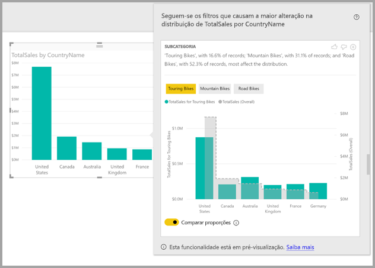
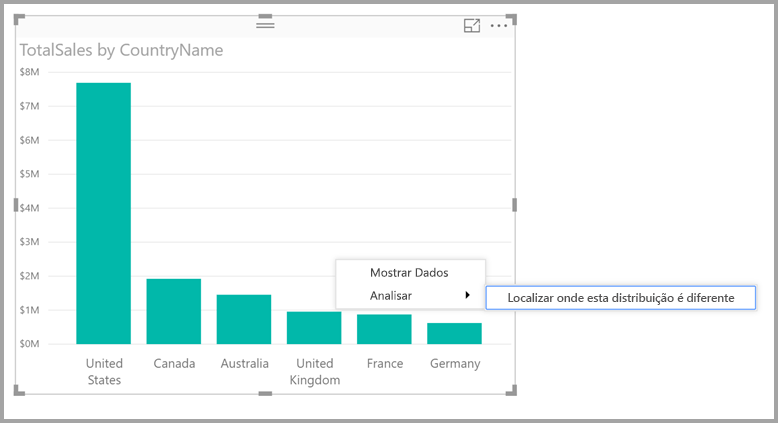

# Utilizar informações no Power BI Desktop para localizar onde a distribuição é diferente (Pré-visualização)

Muitas vezes, vê um ponto de dados nos elementos visuais e pergunta-se sobre se a distribuição seria a mesma para diferentes categorias. Com as **informações** no **Power BI Desktop** pode descobri-lo com apenas alguns cliques.

Considere o seguinte elemento visual, que mostra as *Vendas Totais* por *País*. Como o gráfico mostra, a maioria das vendas é proveniente dos Estados Unidos, que representa 57% de todas as vendas, com menos contribuições vindas de outros países. Nestes casos, muitas vezes é interessante explorar se essa mesma distribuição seria verificada em subpopulações diferentes. Por exemplo, é igual em todos os anos, todos os canais de venda e todas as categorias de produtos?  Apesar de poder aplicar filtros diferentes e comparar os resultados visualmente, isso pode consumir demasiado tempo e estar sujeito a erros. 

Pode pedir ao **Power BI Desktop** que descubra onde é que uma distribuição é diferente e obter análises rápidas, automatizadas e informativas sobre os seus dados. Clique com o botão direito do rato num ponto de dados e selecione **Analisar > Localizar onde esta distribuição é diferente** e as informações ser-lhe-ão fornecidas numa janela fácil de utilizar.

Neste exemplo, a análise automatizada mostra rapidamente que nas *Bicicletas de Passeio*, a proporção de vendas nos Estados Unidos e no Canadá é mais baixa, enquanto a proporção nos outros países é mais elevada.   

> [!NOTE]
> Esta funcionalidade encontra-se em pré-visualização e encontra-se sujeita a alterações. A funcionalidade de informações está ativada por predefinição (não precisa de assinalar uma caixa de Pré-visualização para ativá-la) a partir da versão do **Power BI Desktop** de setembro de 2017.
> 
> 

## Utilizar informações
Para utilizar as informações para localizar onde as distribuições vistas nos gráficos são diferentes, clique com o botão direito do rato no ponto de dados (ou no elemento visual por inteiro) e selecione **Analisar > Localizar onde esta distribuição é diferente**.

Em seguida, o **Power BI Desktop** executa os respetivos algoritmos de aprendizagem automática sobre os dados e preenche automaticamente uma janela com um elemento visual e uma descrição das categorias (colunas) e dos valores dessas colunas que resultam na distribuição diferente mais relevante. As informações são fornecidas num gráfico de colunas, como mostra a seguinte imagem. 

Os valores com o filtro selecionado aplicado são apresentados com a cor normal predefinida. Os valores gerais, como mostra o elemento visual inicial, são apresentados a cinzento para facilitar a comparação. Podem ser incluídos até três filtros diferentes (*Bicicletas de Passeio*, *Bicicletas de Montanha*, *Bicicletas de Estrada* neste exemplo) e podem ser selecionados filtros diferentes ao clicar nos mesmos (ou ao utilizar o atalho Ctrl+clique para selecionar vários filtros).

Para medidas de adição simples, como o *Total de Vendas* neste exemplo, a comparação baseia-se nos valores relativos e não nos absolutos. Por isso, embora as vendas de Bicicletas de Passeio sejam certamente mais baixas do que as vendas gerais em todas as categorias, por predefinição o elemento visual utiliza um eixo duplo para permitir a comparação entre a proporção de vendas em diferentes países, para Bicicletas de Passeio em comparação com todas as categorias de bicicletas.  Ativar o botão abaixo do elemento visual permite que ambos os valores sejam apresentados no mesmo eixo, o que permite que os valores absolutos sejam facilmente comparados (como mostra a imagem seguinte).    

O texto descritivo também dá indicações sobre o nível de importância que poderá estar associado ao valor de um filtro, pelo número de registos determinado que corresponde ao filtro. Neste exemplo, pode ver que embora a distribuição de *Bicicletas de Passeio* possa ser significativamente diferente, elas representam apenas 16,6% dos registos.

Os ícones de *polegar para cima* e *polegar para baixo* na parte inferior da página são fornecidos para que possa dar feedback sobre o visual e a funcionalidade. Fazer isso fornece feedback mas não prepara o algoritmo para influenciar os resultados devolvidos da próxima vez que utilizar a funcionalidade.

Uma nota importante: o botão **+** na parte superior do visual permite-lhe adicionar o visual selecionado ao relatório, como se tivesse criado o visual manualmente. Depois, pode formatar ou ajustar de outra forma o visual adicionado, como faria com outros visuais no seu relatório. Só pode adicionar um visual de informação selecionado quando estiver a editar um relatório no **Power BI Desktop**.

Pode utilizar as informações quando o seu relatório estiver em modo de leitura ou de edição, tornando-o versátil para analisar dados e para criar visuais que poderá facilmente adicionar aos seus relatórios.

## Detalhes dos resultados devolvidos
O algoritmo utiliza todas as outras colunas no modelo e todos os valores dessa coluna ao aplicá-los como filtros do elemento visual original e ao localizar que valores de filtro geram os resultados mais *diferentes* do original.

Poderá estar a perguntar-se o que significa *diferente*. Por exemplo, imagine que a divisão geral das vendas entre os E.U.A. e o Canadá é a seguinte:

|País  |Vendas (M. €)|
|---------|----------|
|EUA      |15        |
|Canadá   |5         |

Então, para uma categoria em particular de produto *"Bicicleta de Estrada"*, a divisão das vendas seria:

|País  |Vendas (M. €)|
|---------|----------|
|EUA      |3        |
|Canadá   |1         |

Apesar de os números serem diferentes em cada uma dessas tabelas, os valores relativos entre os E.U.A. e o Canadá são idênticos (75% e 25% ao todo e para Bicicletas de Estrada). Por isso, estes não são considerados diferentes. Para medidas de adição simples como esta, o algoritmo procura diferenças no valor *relativo*.  

Em contraste, considere uma medida como a margem, que é calculada como Lucro/Custo, e imagine que as margens gerais para os E.U.A. e o Canadá são as seguintes:

|País  |Margem (%)|
|---------|----------|
|EUA      |15        |
|Canadá   |5         |

Então, para uma categoria em particular de produto *"Bicicleta de Estrada"*, a divisão das vendas seria:

|País  |Margem (%)|
|---------|----------|
|EUA      |3        |
|Canadá   |1         |

Tendo em conta a natureza de tais medidas, isto *é* considerado significativamente diferente. Para medidas não aditivas, como esta margem de exemplo, o algoritmo procura diferenças no valor absoluto.

Os elementos visuais apresentados destinam-se claramente a mostrar as diferenças encontradas entre a distribuição geral (como se vê no elemento visual original) e o valor com o filtro em particular aplicado.  

Para as medidas aditivas, como as *Vendas* no exemplo anterior, é utilizado um gráfico de linhas e colunas em que é utilizado um eixo duplo com a escala adequada para que os valores relativos possam ser facilmente comparados. As colunas mostram o valor com o filtro aplicado e a linha mostra o valor geral (com o eixo da coluna à esquerda e o eixo da linha à direita, como é normal). A linha é apresentada com um estilo *gradual*, com uma linha tracejada e preenchida com cinzento. Para o exemplo anterior, se o valor máximo do eixo da coluna for 4 e o valor máximo do eixo da linha for 20, permite uma fácil comparação dos valores relativos entre os E.U.A. e o Canadá para os valores filtrados e gerais. 

Da mesma forma, para medidas não aditivas como a *Margem* no exemplo anterior, é utilizado um gráfico de linhas e colunas, em que a utilização de um único eixo significa que os valores absolutos podem ser facilmente comparados. Novamente, a linha (preenchida com cinzento) mostra o valor geral. Seja ao comparar números relativos ou reais, a determinação do grau para o qual duas distribuições são diferentes não é só uma questão de calcular a diferença nos valores. Por exemplo:

* O tamanho da população é tido em conta, uma vez que uma diferença é menos significativa estatisticamente e menos relevante quando aplicada a uma proporção mais pequena da população geral. Como exemplo, a distribuição de vendas nos países poderá ser bastante diferente para um produto em particular. Isto não seria considerado relevante se existissem milhares de produtos e, portanto, esse produto em particular fosse contabilizado para uma pequena percentagem das vendas gerais.

* As diferenças das categorias em que os valores originais eram muito altos ou muito próximos de zero são ponderadas de forma superior do que outras. Por exemplo, se um país contribuir apenas 1% para as vendas gerais, mas para um determinado tipo de produto contribuir com 6%, isso é mais significativo estatisticamente e, por isso, considerado mais relevante do que um país cuja contribuição se alterou de 50% para 55%. 

* São utilizados vários processos para selecionar os resultados mais significativos, por exemplo, ao considerar outras relações entre os dados.
     
Após examinar as diferentes colunas e os valores para cada uma dessas colunas, o conjunto de valores que dão as maiores diferenças é escolhido. Para uma compreensão fácil, estes são depois agrupados externamente por coluna, com a coluna cujos valores dão uma maior diferença listada em primeiro lugar. São apresentados até três valores por coluna, mas poderão ser apresentados menos se existirem menos de três valores com grande efeito ou se alguns valores tiverem um impacto muito maior do que outros. 

Nem todas as colunas no modelo serão examinadas durante o tempo disponível, por isso não é garantido que as colunas e os valores com maior impacto sejam apresentados. No entanto, são utilizados vários processos para garantir que as colunas com mais probabilidade são examinadas em primeiro lugar. Por exemplo, imagine que após examinar todas as colunas, determina-se que os seguintes valores/colunas têm o maior impacto na distribuição, do maior impacto para o menor:

    Subcategory = Touring Bikes
    Channel = Direct
    Subcategory = Mountain Bikes
    Subcategory = Road Bikes
    Subcategory = Kids Bikes
    Channel = Store

Estes seriam exportados pela ordem da coluna, da seguinte forma:

    Subcategory: Touring Bikes, Mountain Bikes, Road Bikes (only three listed, with the text including “...amongst others” to indicate that more than three have a significant impact) 

    Channel = Direct (only Direct listed, if it’s level of impact was much greater than Store)

## Considerações e limitações
A lista seguinte é a coleção de cenários atualmente não suportados para **informações**:

* Filtros de Primeiros N
* Filtros de medição
* Medidas não numéricas
* Utilização de "Mostrar valor como"
* Medidas filtradas: são cálculos ao nível dos elementos visuais com um filtro específico aplicado (por exemplo, *Total de Vendas de França*) e são utilizadas em alguns dos elementos visuais criados pela funcionalidade de informações

Além disso, os seguintes tipos de modelos e origens de dados não são atualmente suportados para informações:

* DirectQuery
* Ligação em direto
* Reporting Services no local
* Incorporação

## Próximos passos
Para obter mais informações sobre o **Power BI Desktop**, e sobre como começar, consulte os seguintes artigos.

* [O que é o Power BI Desktop?](desktop-what-is-desktop.md)
* [Descrição Geral das Consultas no Power BI Desktop](desktop-query-overview.md)
* [Origens de Dados no Power BI Desktop](desktop-data-sources.md)
* [Ligar a Dados no Power BI Desktop](desktop-connect-to-data.md)
* [Moldar e Combinar Dados com o Power BI Desktop](desktop-shape-and-combine-data.md)
* [Tarefas Comuns de Consulta no Power BI Desktop](desktop-common-query-tasks.md)   

