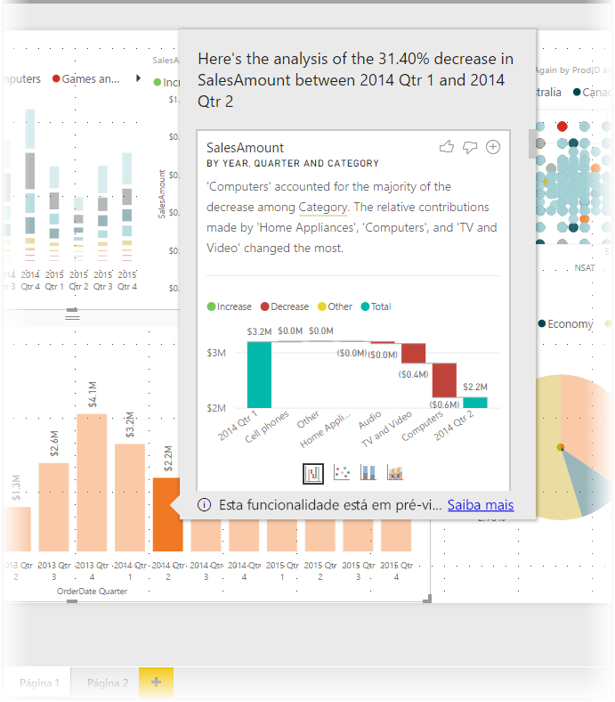
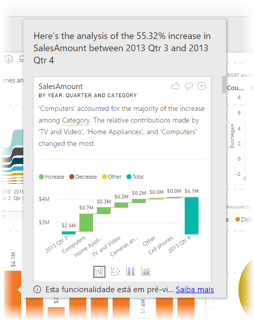
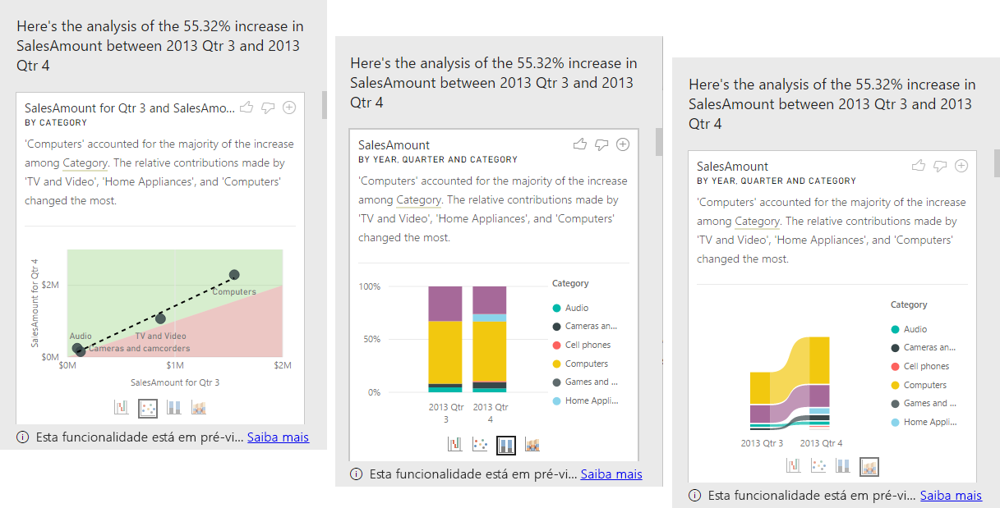

# Utilizar informações no Power BI Desktop para explicar aumentos ou diminuições observadas em elementos visuais (Pré-visualização)

Nos elementos visuais, é possível ver muitas vezes um grande aumento dos valores e, em seguida, uma queda acentuada dos mesmos e sabemos que pode questionar-se acerca dessas flutuações. Com as **informações** no **Power BI Desktop** pode saber a causa das flutuações com apenas alguns cliques.

Por exemplo, considere o seguinte elemento visual que mostra o *Valor de Vendas* por *Ano* e *País*. Em 2014 ocorreu uma grande queda das vendas e estas diminuíram drasticamente entre o *Trimestre 1* e o *Trimestre 2*. Nesses casos, pode explorar os dados para ajudar a explicar a alteração que ocorreu. 

Pode indicar ao **Power BI Desktop** para explicar os aumentos ou as diminuições nos gráficos, considerar os fatores de distribuição nos gráficos e, assim, obter análises rápidas, automatizadas e informativas sobre os seus dados. Basta clicar com o botão direito do rato num ponto de dados e selecionar **Analisar > Explicar a diminuição** (ou o aumento, se a barra anterior era mais baixa) ou **Analisar > Pesquisar onde a distribuição é diferente** e as informações são-lhe entregues numa janela fácil de utilizar.

A funcionalidade de informações é contextual e baseia-se no ponto de dados imediatamente anterior (como a barra ou coluna anterior).

> [!NOTE]
> Esta funcionalidade encontra-se em pré-visualização e encontra-se sujeita a alterações. A funcionalidade de informações está ativada por predefinição (não precisa de assinalar uma caixa de Pré-visualização para ativá-la) a partir da versão do **Power BI Desktop** de setembro de 2017.

## Utilizar informações
Para utilizar as informações para explicar os aumentos ou diminuições que vê em gráficos, clique com o botão direito do rato num ponto de dados num gráfico de barras ou de linhas e selecione **Analisar > Explicar o aumento** (ou *Explicar a diminuição*, uma vez que todas as informações se baseiam na alteração face ao ponto de dados anterior).

Depois, o **Power BI Desktop** executa algoritmos de aprendizagem automática nos dados e preenche uma janela com um visual e uma descrição que descreve quais as categorias que mais influenciaram o aumento ou a diminuição. Por predefinição, as informações são apresentadas como visual de *cascata*, conforme mostrado na seguinte imagem.

Ao selecionar os pequenos ícones na parte inferior do visual de cascata, pode optar por ter as informações apresentadas em gráfico de dispersão, gráfico de colunas empilhadas ou gráfico de friso.

Os ícones de *polegar para cima* e *polegar para baixo* na parte inferior da página são fornecidos para que possa dar feedback sobre o visual e a funcionalidade. Fazer isso fornece feedback mas não prepara o algoritmo para influenciar os resultados devolvidos da próxima vez que utilizar a funcionalidade.

Uma nota importante: o botão **+** na parte superior do visual permite-lhe adicionar o visual selecionado ao relatório, como se tivesse criado o visual manualmente. Depois, pode formatar ou ajustar de outra forma o visual adicionado, como faria com outros visuais no seu relatório. Só pode adicionar um visual de informação selecionado quando estiver a editar um relatório no **Power BI Desktop**.

Pode utilizar as informações quando o seu relatório estiver em modo de leitura ou de edição, tornando-o versátil para analisar dados e para criar visuais que poderá facilmente adicionar aos seus relatórios.

## Detalhes dos resultados devolvidos

Os detalhes devolvidos pelas informações têm o objetivo de realçar as diferenças entre os dois períodos de tempo, para ajudar a compreender a alteração entre eles.  

Por exemplo, se as *Vendas* aumentaram 55% no geral entre o *Trimestre 3* e o *Trimestre 4* e isso também acontece para cada *Categoria* de produto (as vendas de computadores, áudio, entre outras, aumentaram 55%), para cada país e para cada tipo de cliente, então os dados não nos dão muitas informações que expliquem a alteração. No entanto, esse não é o caso geralmente e podemos encontrar diferenças no que ocorreu. Nas categorias *Computadores* e *Eletrodomésticos* ocorreu um aumento de 63%, mas *TV e Áudio* aumentou apenas 23%. Por isso, as categorias *Computadores* e *Eletrodomésticos* contribuíram com um valor maior para o total do *Trimestre 4* do que tinham contribuído para o *Trimestre 3*.  Tendo em conta este exemplo, uma explicação razoável do aumento seria: *vendas particularmente fortes de Computadores e TV e Áudio*. 

O algoritmo não devolve simplesmente os valores que representam o maior valor da alteração. No entanto, se a grande maioria (98%) das vendas veio dos E.U.A., a maior parte do aumento também ocorreu nos E.U.A. A menos que os E.U.A. ou outros países tivessem uma alteração significativa na sua contribuição relativa para o total, o *País* não seria considerado interessante neste contexto.  

O algoritmo utiliza as outras colunas no modelo e calcula a divisão por essa coluna nos períodos de tempo *antes* e *depois*. Em seguida, determina a quantidade de alterações que ocorreram nessa divisão e devolve essas colunas com a maior alteração. Por exemplo, a *Categoria* foi selecionada no exemplo acima, pois a contribuição feita por *TV e Vídeo* desceu 7% de 33% para 26%, enquanto a contribuição de *Eletrodomésticos* aumentou de 0 para 6%. 

Para cada coluna devolvida, existem quatro elementos visuais que podem ser apresentados. O objetivo de três desses elementos visuais é realçar a alteração na contribuição entre os dois períodos. Por exemplo, para a explicação do aumento do *Trimestre 2* para o *Trimestre 3*.

### Dispersão

O elemento visual do gráfico de dispersão mostra o valor da medida no primeiro período (no eixo x) em comparação com o valor da medida no segundo período (no eixo y), para cada valor da coluna (*Categoria* neste caso). Portanto, conforme apresentado na imagem seguinte, os pontos de dados estão na região verde se o valor aumentar e na região vermelha se diminuir. 

A linha ponteada mostra a melhor opção. Os pontos de dados acima desta linha aumentaram mais do que a tendência geral e o contrário ocorreu com os pontos de dados abaixo da mesma.  

Tenha em atenção que os itens de dados cujos valores estavam em branco em qualquer um dos períodos não serão apresentados no gráfico de dispersão (por exemplo, *Eletrodomésticos* neste caso)

### Gráfico de colunas 100% empilhadas

O elemento visual do gráfico de colunas 100% empilhadas mostra o valor da medida antes e depois, pela coluna selecionada, apresentado como um gráfico de colunas 100% empilhadas. Isto permite uma comparação lado a lado da contribuição antes e depois. As descrições mostram a contribuição real para o valor selecionado.

### Gráfico do friso

O elemento visual do gráfico do friso também mostra o valor da medida antes e depois. É particularmente útil para mostrar as alterações nas contribuições em que a *ordenação* dos contribuidores mudou (por exemplo, anteriormente *Computadores* era o contribuidor número um, mas depois desceu para a posição três). 

### Gráfico de cascata

O quarto elemento visual é um gráfico de cascata que mostra os aumentos ou as diminuições principais entre os períodos. Este elemento visual mostra as alterações reais, mas não indica as alterações ao nível de contribuição que realçam o motivo pelo qual a coluna foi escolhida como sendo interessante. 

Ao classificar as colunas em relação às que têm as maiores diferenças nas contribuições relativas, é considerado o seguinte: 

* A cardinalidade é tida em conta, pois uma diferença é menos significativa a nível estatístico e é menos interessante quando uma coluna tem uma grande cardinalidade. 

* As diferenças das categorias em que os valores originais eram muito elevados ou muito próximos de zero são ponderadas de forma superior às outras. Por exemplo, se uma Categoria só tiver contribuído com 1% das vendas e mudar para 6%, isso é mais significativo a nível estatístico e é considerado mais interessante do que uma Categoria cuja contribuição mudou de 50% para 55%. 

* São utilizados vários processos para selecionar os resultados mais significativos, por exemplo, ao considerar outras relações entre os dados.
 
Depois de examinar colunas diferentes, as que mostram a maior alteração na contribuição relativa são escolhidas e produzidas. Os valores que tiveram a alteração mais significativa na contribuição são indicados na descrição. Além disso, os valores que tiveram os maiores aumentos e diminuições reais também são indicados.

## Considerações e limitações
Uma vez que estas informações se baseiam na alteração face ao ponto de dados anterior, não estão disponíveis quando selecionar o primeiro ponto de dados num elemento visual. 

A lista seguinte é a coleção de cenários atualmente não suportados para **explicar o aumento/diminuição**:

* Filtros de Primeiros N
* Filtros de inclusão/exclusão
* Filtros de medição
* Agregados e medidas não cumulativas
* Medidas não numéricas
* Utilização de "Mostrar valor como"
* Medidas filtradas: são cálculos ao nível dos elementos visuais com um filtro específico aplicado (por exemplo, *Total de Vendas de França*) e são utilizadas em alguns dos elementos visuais criados pela funcionalidade de informações
* Colunas categóricas no eixo X, a menos que defina uma ordenação por coluna escalar. Se utilizar uma hierarquia, todas as colunas na hierarquia ativa terão de cumprir esta condição

Além disso, os seguintes tipos de modelos e origens de dados não são atualmente suportados para informações:

* DirectQuery
* Ligação em direto
* Reporting Services no local
* Incorporação

## Próximos passos
Para obter mais informações sobre o **Power BI Desktop**, e sobre como começar, consulte os seguintes artigos.

* [O que é o Power BI Desktop?](desktop-what-is-desktop.md)
* [Descrição Geral das Consultas no Power BI Desktop](desktop-query-overview.md)
* [Origens de Dados no Power BI Desktop](desktop-data-sources.md)
* [Ligar a Dados no Power BI Desktop](desktop-connect-to-data.md)
* [Moldar e Combinar Dados com o Power BI Desktop](desktop-shape-and-combine-data.md)
* [Tarefas Comuns de Consulta no Power BI Desktop](desktop-common-query-tasks.md)   

