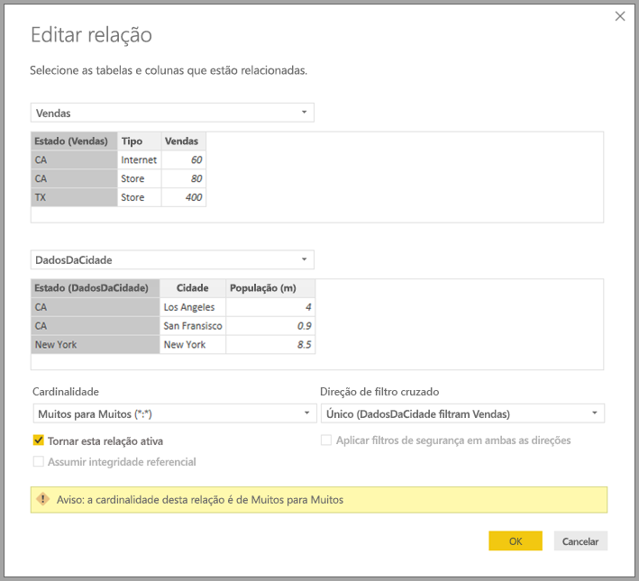

# Relações com uma cardinalidade de muitos-para-muitos no Power BI Desktop

Com a funcionalidade *relações com uma cardinalidade de muitos-para-muitos* no Power BI Desktop, pode associar tabelas com uma cardinalidade de *muitos-para-muitos*. Pode criar modelos de dados que contêm duas ou mais origens de dados mais facilmente e de forma intuitiva. A funcionalidade *relações com uma cardinalidade de muitos-para-muitos* faz parte das capacidades de *modelos compostos* maiores do Power BI Desktop.

A capacidade *relações com uma cardinalidade de muitos-para-muitos* do Power BI Desktop é uma de três funcionalidades relacionadas:

* **Modelos compostos**: permitem que um relatório tenha duas ou mais ligações de dados, incluindo ligações DirectQuery ou de Importação, em qualquer combinação. Para obter mais informações, veja [Modelos compostos no Power BI Desktop](desktop-composite-models.md).

* **Relações com uma cardinalidade de muitos-para-muitos**: com os *modelos compostos*, pode estabelecer *relações com uma cardinalidade de muitos-para-muitos* entre tabelas. Esta abordagem remove os requisitos de valores exclusivos nas tabelas. Esta operação também remove soluções anteriores como, por exemplo, apresentar novas tabelas apenas para estabelecer relações. A funcionalidade é descrita mais detalhadamente neste artigo.

* **Modo de armazenamento**: agora pode especificar que elementos visuais precisam de uma consulta às origens de dados de back-end. Os elementos visuais que não precisam de uma consulta são importados, mesmo que sejam baseados no DirectQuery. Esta funcionalidade ajuda a melhorar o desempenho e a reduzir a carga de back-end. Anteriormente, até os elementos visuais simples como as segmentações iniciavam consultas que eram enviadas para origens de back-end. Para obter mais informações, veja [Modo de armazenamento no Power BI Desktop (pré-visualização)](desktop-storage-mode.md).

## O que as *relações com uma cardinalidade de muitos-para-muitos* resolvem

Antes de a funcionalidade *relações com uma cardinalidade de muitos-para-muitos* ser disponibilizada, a relação entre duas tabelas era definida no Power BI. Pelo menos uma das colunas da tabela envolvidas na relação tinha de conter valores exclusivos. Muitas vezes, no entanto, nenhuma coluna continha valores exclusivos. 

Por exemplo, duas tabelas podiam ter uma coluna etiquetada *País*, mas os valores do *País* não eram exclusivos em nenhuma tabela. Para associar essas tabelas, era preciso criar uma solução alternativa. Uma solução poderia ser introduzir no modelo tabelas adicionais com os valores exclusivos necessários. Com a funcionalidade *relações com uma cardinalidade de muitos-para-muitos*, pode associar essas tabelas diretamente ao utilizar uma relação com uma cardinalidade de **muitos-para-muitos**.  

## Utilizar *relações com uma cardinalidade de muitos-para-muitos*

Ao definir uma relação entre duas tabelas no Power BI, tem de definir a cardinalidade da relação. Por exemplo, a relação entre *Vendas por Produto* e *Produto* &mdash; através da utilização de colunas *Vendas por Produto[Código do Produto]* e *Produto[Código do Produto]* &mdash; seria definida como *Muitos para 1*. Definimos a relação dessa forma porque existem muitas vendas para cada produto e a coluna na tabela *Produto* *(Código do Produto)* é exclusiva. Quando define uma cardinalidade da relação como *Muitos para 1*, *1 para Muitos* ou *1 para 1*, o Power BI executa a validação para garantir que a cardinalidade selecionada corresponde aos dados reais.

Por exemplo, vejamos o modelo simples na imagem seguinte:

Agora, imagine que a tabela *Produto* apresenta apenas duas linhas, conforme mostrado:

Imagine também que a tabela *Vendas* tem apenas quatro linhas, incluindo uma linha para um produto C. Devido a um erro de integridade referencial, a linha de produto C não existe na tabela *Produto*.

O *Nome do Produto* e o *Preço* (da tabela *Produto*), juntamente com o total de *Qtd* para cada produto (da tabela *Vendas por Produto*) seriam apresentados da seguinte forma: 

Como pode ver na imagem anterior, existe a linha *Nome do Produto* em branco que está associada às vendas do produto C. Esta linha em branco representa o seguinte:

* Todas as linhas na tabela *Vendas por Produto* para as quais não existe qualquer linha correspondente na tabela *Produto*. Existe um problema de integridade referencial, como podemos ver para o produto *C* neste exemplo.

* Todas as linhas da tabela *Vendas por Produto* para a qual a coluna de chave de referência tem valor nulo. 

Por esses motivos, a linha em branco em ambos os casos representa as vendas em que o *Nome do Produto* e o *Preço* são desconhecidos.

Por vezes, acontece que as tabelas são associadas por duas colunas, mas nenhuma das colunas é exclusiva. Por exemplo, considere as duas tabelas seguintes:

* A tabela *Vendas* apresenta dados de vendas por *Estado* e cada linha contém o valor de vendas para o tipo de venda nesse estado. Os estados incluem CA, WA e TX. 

    

* A tabela *Dados por Cidade* apresenta dados de cidades, incluindo a população e o estado (incluindo os estados CA, WA e Nova Iorque).

    

Embora haja uma coluna para *Estado* em ambas as tabelas e é razoável pretender comunicar as vendas totais por estado, juntamente com a população total de cada estado, existe um problema: a coluna *Estado* não é exclusiva em nenhuma das tabelas. 

## A solução anterior

Nas versões do Power BI Desktop anteriores ao lançamento de julho de 2018, os utilizadores não podiam criar uma relação direta entre essas tabelas. Uma solução comum era fazer o seguinte:

* Criar uma terceira tabela contendo apenas os IDs de *Estado* exclusivos. A tabela podia ser qualquer ou todas as opções seguintes:
  * Uma tabela calculada (definida com a linguagem DAX [Data Analysis Expressions]).
  * Uma tabela com base numa consulta definida no Editor de Consultas, que podia apresentar os IDs exclusivos desenhados a partir de uma das tabelas.
  * O conjunto completo combinado.

* Relacionar as duas tabelas originais com essa nova tabela, através de relações **Muitos para 1* comuns.

Podia deixar a tabela alternativa visível ou ocultá-la para não aparecer na lista **Campos**. Se ocultasse a tabela, as relações *Muitos para 1* seriam normalmente definidas para filtrar em ambas as direções e podia utilizar o campo *Estado* a partir de qualquer tabela. A filtragem cruzada subsequente seria propagada para a outra tabela. Essa abordagem é mostrada na imagem seguinte:

Um elemento visual a mostrar *Estado* (da tabela *Dados por Cidade*), juntamente com a *População* total e as *Vendas* totais seria apresentado da seguinte forma:

> [!NOTE]
> Devido à utilização do estado da tabela *Dados por Cidade* nesta solução alternativa, apenas os estados nessa tabela são listados e, como tal, TX é excluído. Além disso, ao contrário das relações *Muitos para 1*, enquanto a linha total inclui todas as *Vendas* (incluindo as de TX), os detalhes não incluem uma linha em branco a abranger as linhas sem correspondência. Da mesma forma, não haveria qualquer linha em branco a abranger as *Vendas* para as quais há um valor nulo em *Estado*.

Se adicionar também *Cidade* a esse elemento visual, embora a população por *Cidade* seja conhecida, as *Vendas* apresentadas para *Cidade* simplesmente repetem as *Vendas* correspondentes para *Estado*. Normalmente, tal acontece quando o agrupamento numa coluna não está relacionado com alguma medida de agregação, conforme mostrado na imagem seguinte:

Se definimos a nova tabela *Vendas* como a combinação de todos os *Estados* desta solução e a tornarmos visível na lista **Campos**, o mesmo elemento visual iria apresentar o *Estado* (na nova tabela), a *População* total e as *Vendas* totais, conforme mostrado na imagem seguinte:

Como pode ver, *TX* &mdash; com dados de *Vendas*, mas dados de *População* desconhecidos &mdash; e *Nova Iorque*&mdash;com dados de *População* conhecidos, mas sem dados de *Vendas* &mdash; seria incluído. Esta solução não é ideal e tem muitos problemas. Com a criação das relações com uma cardinalidade de muitos-para-muitos, os problemas resultantes foram resolvidos, conforme descrito na secção seguinte.

## Utilizar as *relações com uma cardinalidade de muitos-para-muitos* em vez da solução

A partir da versão de julho de 2018 do Power BI Desktop, pode relacionar diretamente tabelas, como aquelas que descrevemos anteriormente, sem ter de recorrer a soluções semelhantes. Já é possível definir a cardinalidade da relação para *Muitos para Muitos*. Esta definição indica que nenhuma das tabelas contém valores exclusivos. Para tais relações, pode ainda controlar que tabela filtra a outra tabela ou aplicar um filtro bidirecional em que ambas as tabelas se filtram mutuamente.  

No Power BI Desktop, a cardinalidade predefinida é *Muitos para Muitos* quando se determina que nenhuma das tabelas contém valores exclusivos para as colunas na relação. Nesses casos, é apresentado um aviso para confirmar que pretende essa definição de relação, em vez de obter o efeito não intencional de um problema de dados. 

Por exemplo, quando cria uma relação diretamente entre *Dados por Cidade* e *Vendas* &mdash; em que os filtros devem fluir de *Dados por Cidade* para *Vendas*&mdash; o Power BI Desktop apresenta a janela **Editar relação**, conforme mostrado na imagem seguinte:

A vista **Relação** resultante iria apresentar a relação direta muitos para muitos entre as duas tabelas. O aspeto das tabelas na lista **Campos** e o comportamento subsequente quando os elementos visuais são criados são semelhantes a quando aplicamos a solução alternativa. Na solução alternativa, a tabela adicional que apresenta os dados de *Estado* distintos não ficam visíveis. Por exemplo, conforme descrito na secção anterior, um elemento visual que mostra os dados de *Estado*, *População* e *Vendas* seria apresentado da seguinte forma:

As principais diferenças entre as *relações com uma cardinalidade de muitos-para-muitos* e as relações *muitos-para-um* mais habituais são as seguintes:

* Os valores mostrados não incluem uma linha em branco que representa linhas sem correspondência na outra tabela. Nem os valores representam linhas em que a coluna utilizada na relação na outra tabela é nula.
* Não é possível utilizar a função `RELATED()` porque mais do que uma linha pode estar relacionada.
* Utilizar a função `ALL()` numa tabela não remove os filtros que são aplicados a outras tabelas relacionadas através de uma relação muitos para muitos. No exemplo anterior, uma medida que é definida conforme mostrado no seguinte script não removeria filtros em colunas na tabela *Dados por Cidade*:

    

    Como tal, um elemento visual que mostre dados de *Estado*, *Vendas* e *Vendas totais* resultaria no seguinte:

    

Com as diferenças anteriores em mente, confirme que os cálculos que utilizam `ALL(\<Table>)`, tal como *% do total geral*, estão a devolver os resultados pretendidos. 

## Limitações e considerações

Existem algumas limitações nesta versão das *relações com uma cardinalidade de muitos-para-muitos* e dos modelos compostos.

As seguintes origens do Live Connect (multidimensionais) não podem ser utilizadas com modelos compostos:

* SAP HANA
* SAP Business Warehouse
* SQL Server Analysis Services
* Conjuntos de dados do Power BI
* Azure Analysis Services

Quando se liga a estas origens multidimensionais através do DirectQuery, não se pode ligar a outra origem do DirectQuery nem combiná-las com dados importados.

As limitações existentes da utilização do DirectQuery ainda se aplicam ao utilizar as *relações com uma cardinalidade de muitos-para-muitos*. Muitas destas limitações são agora por tabela, de acordo com o modo de armazenamento da tabela. Por exemplo, uma coluna calculada numa tabela importada pode referir-se a outras tabelas, mas uma coluna calculada numa tabela DirectQuery ainda pode referir-se apenas às colunas na mesma tabela. As outras limitações aplicar-se-ão ao modelo como um todo se qualquer uma das tabelas no modelo for DirectQuery. Por exemplo, as funcionalidades QuickInsights e Perguntas e Respostas não estarão disponíveis nos modelos se qualquer uma das tabelas dentro dos mesmos tiver um modo de armazenamento do DirectQuery. 

## Próximos passos

Para obter mais informações sobre os modelos compostos e o DirectQuery, veja os artigos seguintes:
* [Modelos compostos no Power BI Desktop](desktop-composite-models.md)
* [Modo de armazenamento no Power BI Desktop (pré-visualização)](desktop-storage-mode.md)
* [Utilização do DirectQuery no Power BI Desktop](desktop-directquery-about.md)
* [Origens de dados suportadas pelo DirectQuery no Power BI Desktop](desktop-directquery-data-sources.md)
