# Utilizar o elemento visual Matriz no Power BI Desktop
Com o elemento visual **Matriz**, pode criar elementos visuais de matriz (por vezes também designados por *tabelas*) em relatórios do **Power BI Desktop** e elementos de realce cruzado na matriz com outros elementos visuais. Além disso, pode selecionar linhas, colunas, células individuais e realces cruzados. Por último, para garantir uma melhor utilização do espaço de esquema, o elemento visual de matriz suporta um esquema gradual.

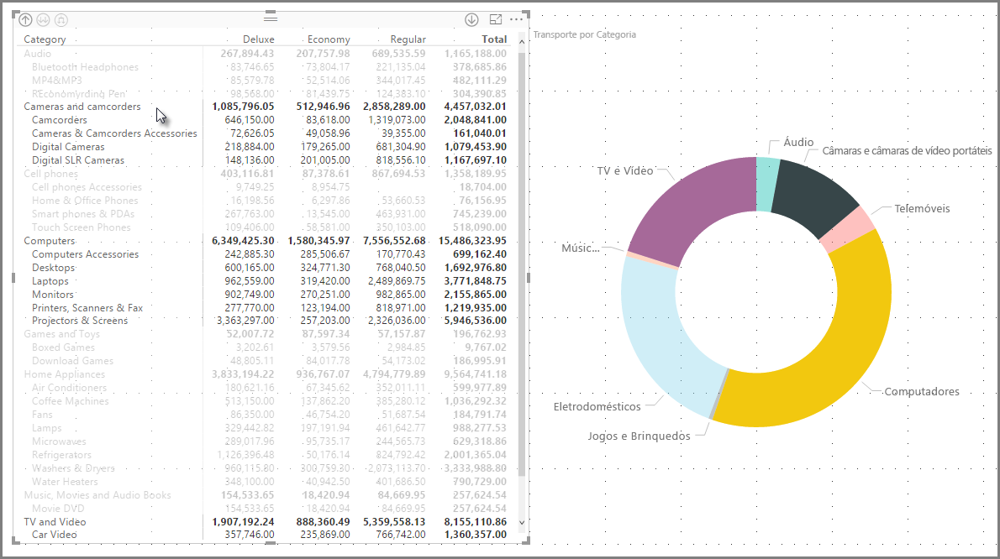

Existem muitas funcionalidades associadas à matriz e vamos analisá-las nas secções seguintes deste artigo.

> [!NOTE]
> A partir da versão de julho de 2017 do **Power BI Desktop**, os elementos visuais de matriz e tabela refletem o estilo (incluindo cores) do **Tema de Relatório** aplicado. Podem não ser as cores esperadas para o elemento visual de matriz, que pode alterar na configuração do **Tema de Relatório**. Veja [**Utilizar Temas de Relatório no Power BI Desktop**](desktop-report-themes.md) para obter mais informações sobre temas.
> 
> 

## Utilizar a desagregação no elemento visual Matriz
Com o elemento visual **Matriz**, pode fazer todos os tipos de atividades de desagregação interessantes que não estavam disponíveis anteriormente. Isto inclui a capacidade de desagregar com linhas, colunas e até em células e secções individuais. Vamos ver como funciona cada uma.

### Desagregação em cabeçalhos de linha
No painel **Visualizações**, quando adicionar vários campos à secção **Linhas** de **Campos**, ativa a desagregação nas linhas do elemento visual de matriz. Isto é semelhante à criação de uma hierarquia que lhe permite desagregar (e, em seguida, efetuar cópias de segurança) através dessa hierarquia e analisar os dados em cada nível.

Na imagem seguinte, a secção **Linhas** contém *Categoria* e *Subcategoria*, o que cria um agrupamento (ou hierarquia) nas linhas que podemos explorar.

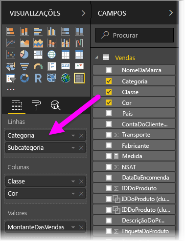

Quando o elemento visual tem um agrupamento criado na secção **Linhas**, o elemento visual apresenta os ícones *agregar* e *expandir* no canto superior esquerdo do elemento visual.

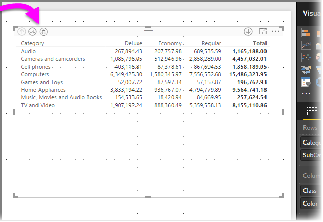

Semelhante ao comportamento de desagregação e expansão noutros elementos visuais, a seleção desses botões permite-nos desagregar (ou efetuar cópias de segurança) através da hierarquia. Neste caso, podemos desagregar de *Categoria* para *Subcategoria*, conforme mostrado na imagem seguinte, onde o ícone de um nível de desagregação (a forquilha) foi selecionado.

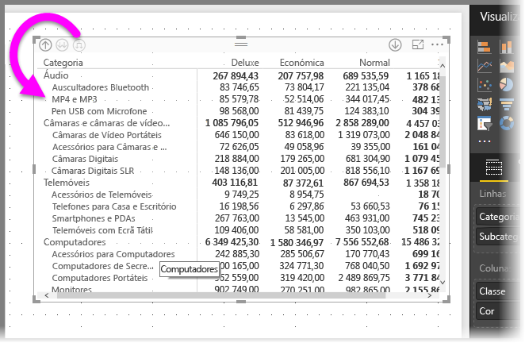

Além de utilizar estes ícones, pode clicar com o botão direito do rato em qualquer um dos cabeçalhos de linha e desagregar ao selecionar a partir do menu apresentado.

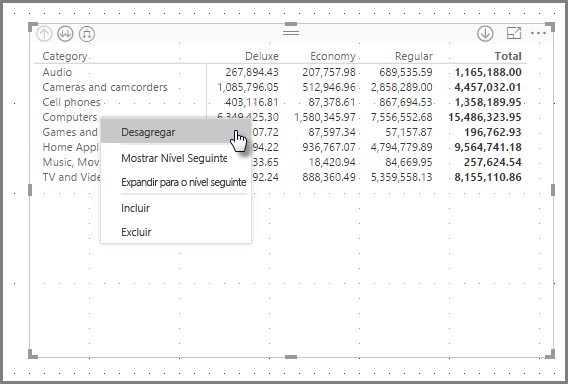

Tenha em atenção que existem algumas opções no menu apresentado, o que gera resultados diferentes:

Selecionar **Desagregar** expande a matriz para *esse* nível de linha e *exclui* todos os outros cabeçalhos de linha, exceto o cabeçalho de linha clicado com o botão direito do rato. Na imagem seguinte, *Computadores* foi clicado com o botão direito do rato e foi selecionado **Desagregar**. Tenha em atenção que outras linhas de nível superior já não aparecem na matriz. Esta é uma funcionalidade útil e torna-se especialmente útil quando chegamos à secção **realce cruzado**.

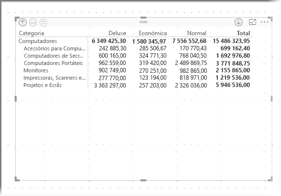

Podemos clicar no ícone **Agregar** para voltar à vista de nível superior anterior. Se selecionarmos **Mostrar Nível Seguinte** a partir do menu de contexto, obtemos uma lista alfabética de todos os itens do nível seguinte (neste caso, o campo *Subcategoria*), sem a categorização da hierarquia de nível mais elevado.

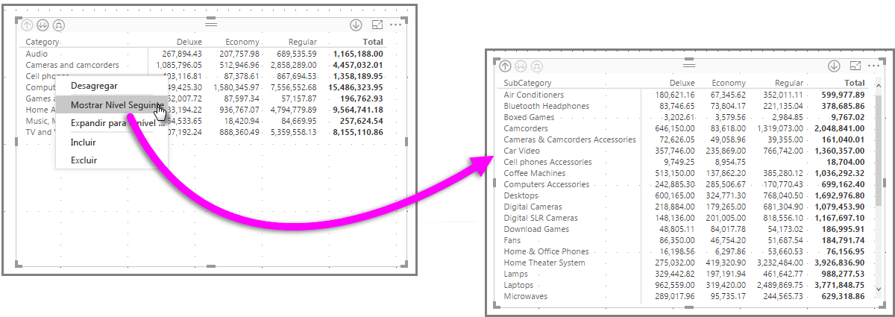

Quando clicamos no ícone **Agregar** no canto superior esquerdo para que a matriz mostre todas as categorias de nível superior, clique novamente com o botão direito do rato e selecionamos **Expandir para o nível seguinte**, vemos o seguinte:

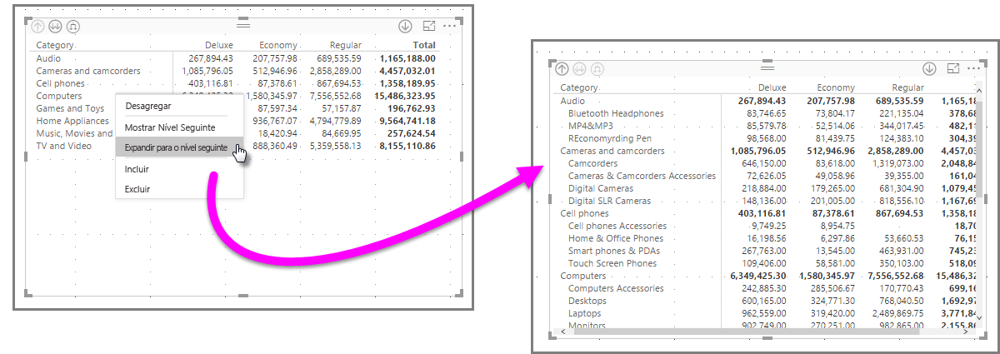

Também pode utilizar os itens de menu **Incluir** e **Excluir** para manter (ou remover, respetivamente) a linha clicada com o botão direito do rato (e quaisquer subcategorias) na matriz.

### Desagregação em cabeçalhos de coluna
Semelhante à capacidade de desagregação em linhas, também pode desagregar em **Colunas**. Na imagem seguinte, pode ver que existem dois campos no campo **Colunas**, o que cria uma hierarquia semelhante à utilizada para as linhas anteriores neste artigo. No campo **Colunas**, temos *Classe* e *Cor*.

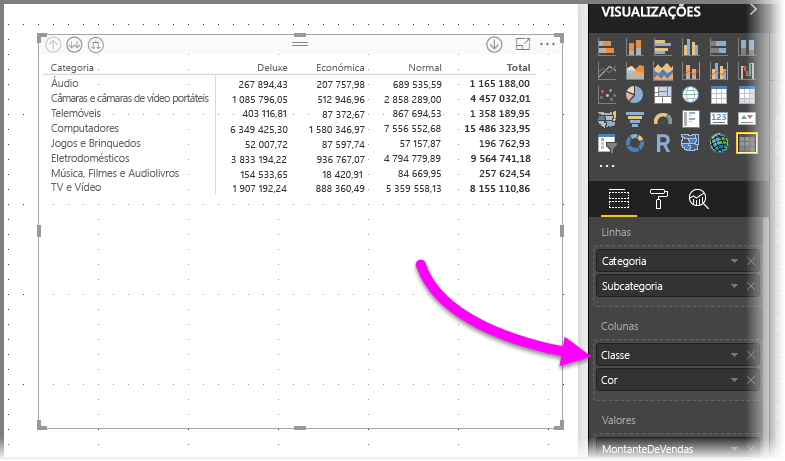

No elemento visual **Matriz**, quando clicamos com o botão direito do rato numa coluna, vemos a opção de desagregação. Na imagem seguinte, clicamos com o botão direito do rato em *Deluxe* e selecionamos **Desagregar**.

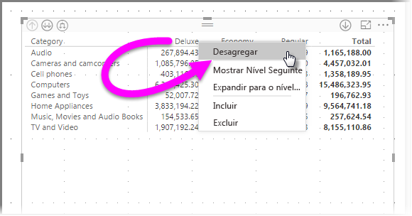

Quando **Desagregar** estiver selecionado, é apresentado o nível seguinte da hierarquia de colunas para *Deluxe*, neste caso *Cor*.

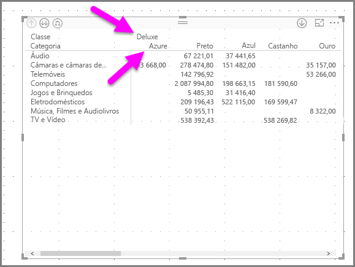

Os restantes itens de menu de contexto funcionam em Colunas da mesma forma que para linhas (veja a secção anterior, **Desagregação em cabeçalhos de linha**). Pode **Mostrar Nível Seguinte**, **Expansão para o nível seguinte** e **Incluir** ou **Excluir** as colunas, tal como faria com linhas.

> [!NOTE]
> Os ícones de desagregação e agregação na parte superior esquerda do elemento visual de matriz aplicam-se apenas a linhas. Para desagregação em colunas, tem de utilizar o menu de contexto.
> 
> 

## Esquema gradual com elementos visuais de matriz
O elemento visual **Matriz** avança automaticamente as subcategorias numa hierarquia por baixo de cada principal, o que é designado por **esquema gradual**.

Na versão *original* do elemento visual de matriz, as subcategorias foram mostradas numa coluna completamente diferente, o que ocupa muito mais espaço no elemento visual. A imagem seguinte mostra a tabela no elemento visual **Matriz** original; repare nas subcategorias numa coluna completamente separada.

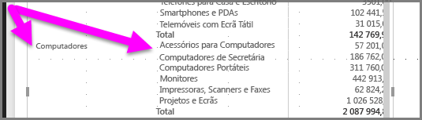

Na imagem seguinte, verá um elemento visual **Matriz** com o **esquema gradual** em ação. Tenha em atenção que a categoria *Computadores* tem as respetivas subcategorias (Acessórios de Computadores, Computadores de Secretária, Computadores Portáteis, Monitores, etc.) ligeiramente avançadas, o que fornece um elemento visual mais limpo e muito mais condensado.

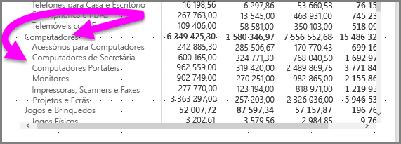

Pode ajustar facilmente as definições do **esquema gradual**. Com o elemento visual **Matriz** selecionado, na secção **Formatar** (o ícone de rolo) do painel **Visualizações**, expanda a secção **Cabeçalhos de linha**. Existem duas opções: o seletor **Esquema gradual** (que ativa ou desativa) e o botão **Avanço de esquema gradual** (especifica a quantidade de avanço em pixéis).

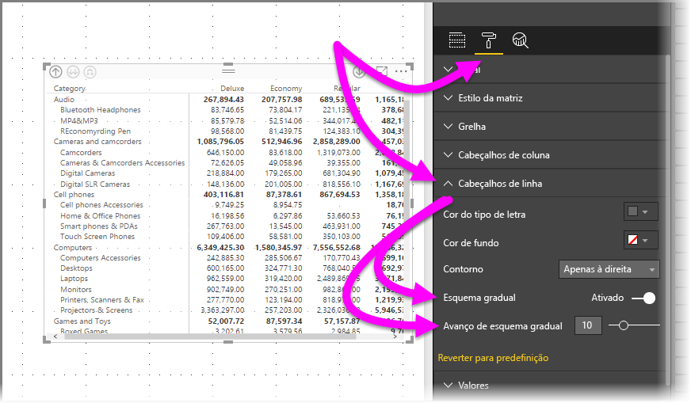

Se desativar **Esquema gradual**, as subcategorias são apresentadas noutra coluna em vez de avanços por baixo da categoria principal.

## Subtotais com elementos visuais de matriz
Pode ativar ou desativar os subtotais nos elementos visuais de matriz para linhas e colunas. Na imagem seguinte, pode ver que os subtotais da linha estão **ativados**.

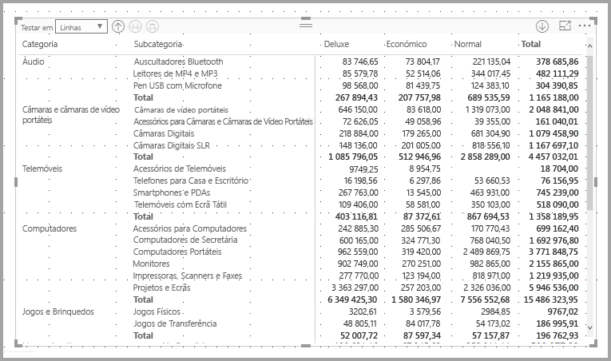

Na secção **Formatar** do painel **Visualizações**, expanda o cartão **Subtotais** e coloque o controlo de deslize **Subtotais da linha** como **Desativado**. Quando o fizer, os subtotais não são apresentados.

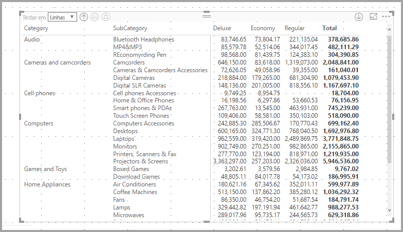

É aplicado o mesmo processo aos subtotais da coluna.

## Realce cruzado com elementos visuais de matriz
Com o elemento visual **Matriz**, quaisquer elementos na matriz podem ser selecionados como base para realce cruzado. Selecione uma coluna numa **Matriz** e essa coluna fica realçada, como quaisquer outros elementos visuais na página de relatório. Esta foi uma funcionalidade comum de outros elementos visuais e da seleção de um ponto de dados e agora o elemento visual **Matriz** pode fazer parte.

Além disso, a combinação CTRL+Clique também funciona no realce cruzado. Por exemplo, na imagem seguinte, foi selecionada uma coleção de subcategorias a partir do elemento visual **Matriz**. Repare como os itens que não foram selecionados a partir do elemento visual estão desativados e como os outros elementos visuais na página refletem as seleções efetuadas no elemento visual **Matriz**.

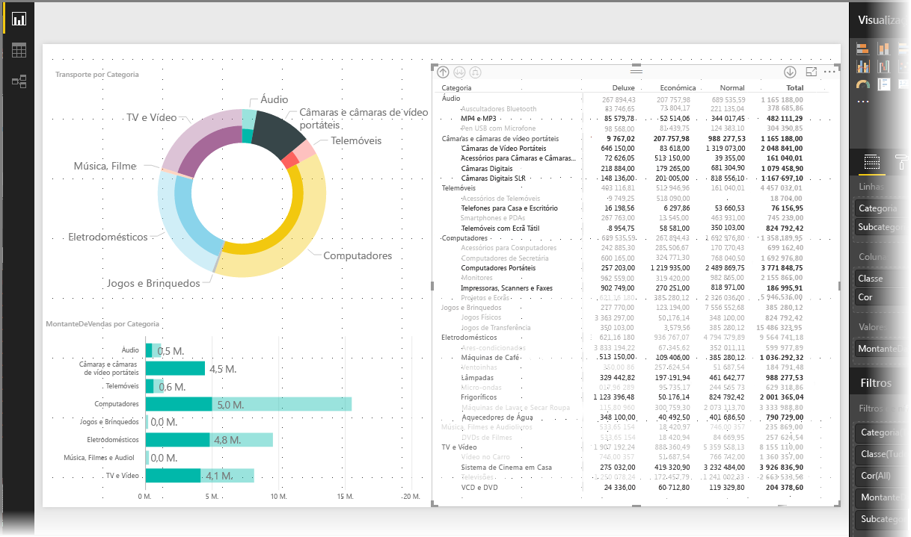

## Sombreado e cores de tipo de letra com elementos visuais de matriz
Com o elemento visual **Matriz**, pode aplicar **formatação condicional** (cores e sombreado) ao fundo das células na matriz, bem como ao texto e aos valores.

Para aplicar formatação condicional, pode efetuar qualquer um dos procedimentos seguintes quando está selecionado um elemento visual de matriz:

* No painel **Campos**, clique com o botão direito do rato e selecione **Formatação condicional** no menu.
  
  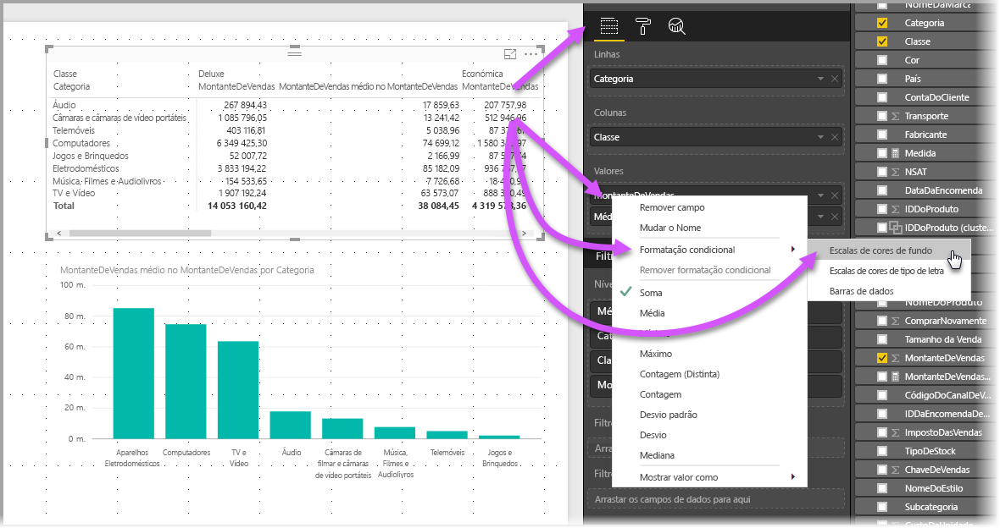
* Em alternativa, no painel **Formatar**, expanda o cartão **Formatação condicional** e, para **Escalas de cores de fundo** ou **Escalas de cores de tipo de letra**, coloque o controlo de deslize como **Ativado**. Ativar qualquer uma das opções apresenta uma ligação para *Controlos avançados*, que lhe permite personalizar as cores e os valores da formatação de cores.
  
  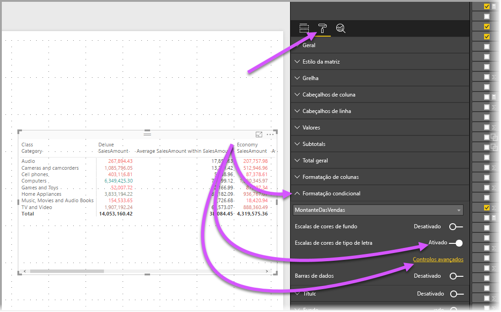

Qualquer uma das abordagens alcança o mesmo resultado. Selecionar *Controlos avançados* apresenta a caixa de diálogo seguinte, o que lhe permite efetuar ajustes:

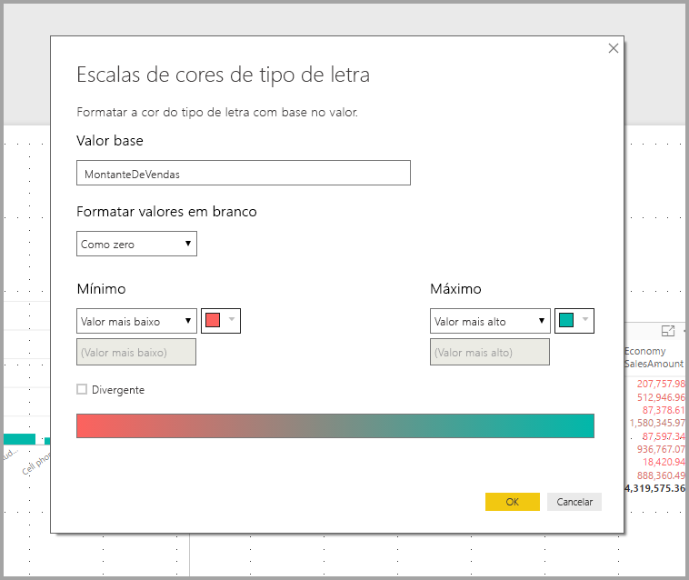

## Limitações e considerações
Nesta versão do elemento visual **Matriz**, existem algumas limitações e considerações a não esquecer.

* A desagregação em colunas só pode ser efetuada através do menu de contexto e não existe atualmente uma indicação no elemento visual que possa explorar em grupos de linhas ou colunas
* Apenas pode expandir todos os itens num nível em simultâneo, em vez de expandir uma categoria de cada vez
* **Ver Registos** pode ser apresentado num menu quando clicar com o botão direito do rato em cabeçalhos de coluna, mas não está operacional
* Atualmente, não existe nenhuma linha *Total geral*
* A desativação da linha de subtotal no esquema gradual não tem qualquer efeito
* Os cabeçalhos de coluna podem ficar truncados se os grupos internos tiverem texto mais curto do que o grupo exterior
* Alterar o avanço de esquema gradual não deve avançar o grupo de linhas mais exterior

Estamos sempre a querer ouvir os seus pensamentos. Estamos atualmente a realizar um **inquérito** sobre este elemento visual **Matriz**, por isso, se tiver alguns minutos, [responda ao inquérito](https://www.instant.ly/s/PYXT1).

