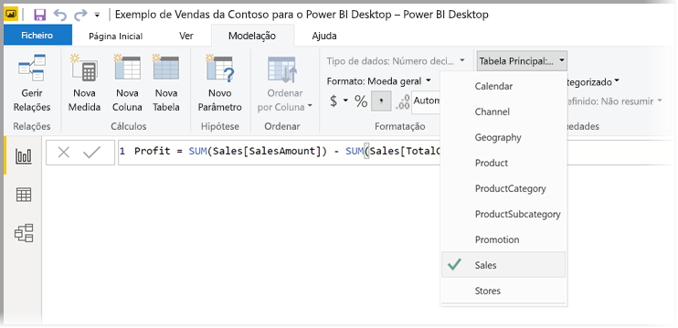
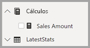

# Medidas no Power BI Desktop

O **Power BI Desktop** ajuda-o a criar informações sobre os seus dados com apenas alguns cliques. Por vezes, estes dados simplesmente não incluem tudo o que precisa para responder a algumas das suas perguntas mais importantes. As medidas podem ajudá-lo a conseguir isso.

As medidas são utilizadas em algumas das análises de dados mais comuns. Resumos simples, como somas, médias, mínimo, máximo e contagens, podem ser definidos através da secção Campos. Os resultados calculados das medidas estão sempre a mudar em resposta à sua interação com os relatórios, o que permite uma exploração de dados ad-hoc rápida e dinâmica. Vamos ver isso mais de perto. Para obter mais informações, veja [Criar medidas calculadas](/learn/modules/model-data-power-bi/4b-create-calculated-measures).

## Noções básicas sobre medidas

No **Power BI Desktop**, as medidas são criadas e apresentadas na **Vista de Relatório** ou na **Vista de Dados**. As medidas que cria são apresentadas na lista Campos com um ícone de Calculadora. Pode atribuir um nome às medidas como quiser e adicioná-las a uma visualização nova ou existente, tal como qualquer outro campo.

> [!NOTE]
> Pode também ter interesse nas **medidas rápidas**, que são medidas já preparadas que pode selecionar a partir das caixas de diálogo. São uma boa forma para criar medidas rapidamente, bem como aprender a sintaxe de DAX, dado que as fórmulas DAX automaticamente criadas estão disponíveis para revisão. Consulte o artigo: [medidas rápidas](desktop-quick-measures.md).
> 
> 

## Data Analysis Expressions

As medidas calculam um resultado através de uma fórmula de expressão. Ao criar as suas próprias medidas, vai utilizar a linguagem de fórmulas [Data Analysis Expressions](https://msdn.microsoft.com/library/gg413422.aspx) (DAX). O DAX inclui uma biblioteca de mais de 200 funções, operadores e construtores. Esta fornece uma enorme flexibilidade na criação de medidas para calcular os resultados de praticamente qualquer análise de dados necessária.

As fórmulas DAX são muito semelhantes às fórmulas do Excel. O DAX tem até muitas das mesmas funções do Excel, como DATE (DATA), SUM (SOMA) e LEFT (ESQUERDA). As funções do DAX, no entanto, devem funcionar com dados relacionais, como os que temos no Power BI Desktop.

## Vejamos um exemplo
Júlia é gestora de vendas da Contoso. Foi-lhe pedido para fornecer projeções de vendas de revendedores para o próximo ano fiscal. Júlia decide basear as estimativas nos valores de vendas do ano anterior, com um aumento anual de 6% resultante de várias promoções agendadas para os próximos seis meses.

Para criar um relatório das estimativas, Júlia importa os dados de vendas do ano anterior para o Power BI Desktop. Localiza o campo SalesAmount na tabela Reseller Sales (Vendas dos Revendedores). Como os dados que importou contêm apenas os valores de vendas do último ano, Júlia muda o nome do campo SalesAmount para Last Years Sales. Em seguida, arrasta Last Years Sales (Vendas do Ano Passado) para a tela de relatórios. Aparece numa visualização de gráfico como um valor único, que é a soma de todas as vendas dos revendedores do ano anterior.

Júlia repara que foi fornecido automaticamente um cálculo, embora não tenha especificado nenhum. O Power BI Desktop criou a sua própria medida ao somar todos os valores em Last Years Sales.

No entanto, Júlia precisa de uma medida para calcular as projeções de vendas para o próximo ano, que serão baseadas nas vendas do ano anterior multiplicadas por 1,06, para considerar o aumento de 6% esperado no negócio. Para este cálculo, Júlia criará a sua própria medida. Ao utilizar a funcionalidade Nova Medida, cria uma nova medida e, em seguida, introduz a seguinte fórmula DAX:

    Projected Sales = SUM('Sales'[Last Years Sales])*1.06

Em seguida, Júlia arrasta a nova medida Projected Sales (Vendas Projetadas) para o gráfico.

Rapidamente e com o mínimo esforço, Júlia tem agora uma medida para calcular as vendas projetadas. Júlia também pode analisar as projeções ao filtrar revendedores específicos ou ao adicionar outros campos ao relatório.

## Categorias de dados para medidas

Também pode selecionar categorias de dados para medidas. 

Esta opção permite-lhe, entre outras coisas, utilizar medidas para criar URLs dinamicamente e marcar a categoria de dados como um URL da Web. 

Pode criar tabelas que apresentam as medidas como URLs da Web e pode clicar no URL criado com base na sua seleção. Isto é particularmente útil quando quer ligar a outros relatórios do Power BI com [parâmetros de filtro de URL](service-url-filters.md).

## Organizar as medidas

As medidas têm uma tabela *Principal* que define onde se encontram na lista de campos. Pode alterar a localização das medidas ao escolher uma localização nas tabelas no modelo.

Também pode organizar os campos numa tabela nas *Pastas de Apresentação*. Selecione **Vista de Modelo** no lado esquerdo da janela do Power BI Desktop e, em seguida, selecione o campo que quer mover da lista de campos disponíveis apresentados na tela. No painel de propriedades, é apresentada uma caixa de texto para a **Pasta de apresentação**. Ao escrever um nome no campo **Pasta de apresentação**, cria a pasta e move o campo selecionado para essa pasta.

Pode criar subpastas com um caráter de barra invertida. Por exemplo, *Finanças\Moedas* cria uma pasta *Finanças* e, dentro, uma pasta *Moedas*.

Pode fazer com que um campo apareça em várias pastas com um ponto e vírgula para separar os nomes das pastas. Por exemplo, *Produtos\Nomes;Departamentos* faz com que o campo apareça numa pasta *Departamentos*, assim como uma pasta *Nomes* dentro de uma pasta *Produtos*.

Por fim, pode criar uma tabela especial que contenha apenas medidas que aparecem sempre na parte superior da **Lista de Campos**. Para tal, crie uma tabela com apenas uma coluna. Pode utilizar **Introduzir Dados** para criar essa tabela. Em seguida, mova as medidas para essa tabela. Por fim, oculte a coluna (não a tabela) que criou. Vai precisar de fechar e reabrir a **Lista de Campos** para que o Power BI Desktop o apresente corretamente. Para tal, clique na divisa na parte superior da **Lista de Campos**.

## Saiba mais
Fornecemos aqui apenas uma rápida introdução às medidas, mas há muito mais conteúdo para ajudá-lo a criar as suas próprias. Não deixe de ver o [Tutorial: Criar as suas próprias medidas no Power BI Desktop](desktop-tutorial-create-measures.md), onde pode transferir um ficheiro de exemplo e ver lições passo-a-passo sobre como criar mais medidas.  

Para saber mais sobre DAX, certifique-se de que consulta [Bases de DAX no Power BI Desktop](desktop-quickstart-learn-dax-basics.md). A [Referência das Data Analysis Expressions](https://msdn.microsoft.com/library/gg413422.aspx) fornece artigos detalhes sobre cada das funções, sintaxe, operadores e convenções de nomenclatura. O DAX já existe há muitos anos no Power Pivot no Excel e no SQL Server Analysis Services, pelo que existem muitos outros recursos excelentes disponíveis. Certifique-se de que vê o [Wiki do Centro de Recursos do DAX](http://social.technet.microsoft.com/wiki/contents/articles/1088.dax-resource-center.aspx), onde os membros influentes da comunidade de BI partilham os seus conhecimentos de DAX.

