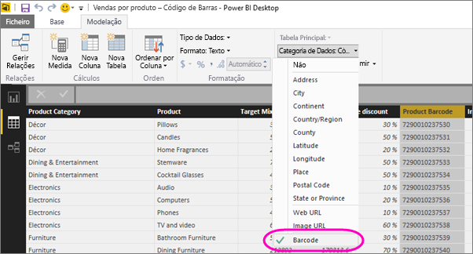

# Identificar códigos de barras no Power BI Desktop para aplicações móveis

No Power BI Desktop, pode [categorizar dados](desktop-data-categorization.md) numa coluna, para que o Power BI Desktop saiba como tratar os valores nos elementos visuais num relatório. Também pode categorizar uma coluna como **Código de Barras**. Quando o utilizador ou os seus colegas [digitalizarem um código de barras num produto com a aplicação do Power BI](consumer/mobile/mobile-apps-scan-barcode-iphone.md) no iPhone, verão todos os relatórios que incluem esse código de barras. Quando abrir o relatório na aplicação móvel, o Power BI filtra automaticamente o relatório relativamente aos dados relacionados com esse código de barras.

1. No Power BI Desktop, mude para a Vista de Dados.
2. Selecione uma coluna com os dados do código de barras. Veja a lista de [formatos de código de barras suportados](#supported-barcode-formats) abaixo.
3. No separador **Modelação**, selecione **Categoria de Dados** > **Código de Barras**.
   
    
4. Na vista Relatório, adicione este campo aos elementos visuais que pretende que sejam filtrados pelo código de barras.
5. Guarde o relatório e publique-o no serviço Power BI.

Agora, quando abrir o scanner na [aplicação do Power BI para iPhone](consumer/mobile/mobile-iphone-app-get-started.md) e digitalizar código de barras, verá este relatório na lista de relatórios. Quando abrir o relatório, os respetivos elementos visuais são filtrados pelo código de barras do produto que digitalizou.

## Formatos de código de barras suportados
Estes são os códigos de barras que o Power BI reconhece, se os puder identificar num relatório do Power BI: 

* UPCECode 
* Code39Code  
* A39Mod43Code 
* EAN13Code 
* EAN8Code  
* 93Code  
* 128Code 
* PDF417Code 
* Interleaved2of5Code 
* ITF14Code 

## Passos seguintes
* [Digitalizar um código de barras da aplicação do Power BI no iPhone](consumer/mobile/mobile-apps-scan-barcode-iphone.md)
* [Problemas ao ler códigos de barras num iPhone](consumer/mobile/mobile-apps-scan-barcode-iphone.md#issues-with-scanning-a-barcode)
* [Categorização de dados no Power BI Desktop](desktop-data-categorization.md)  
* Perguntas? [Experimente perguntar à Comunidade do Power BI](http://community.powerbi.com/)

