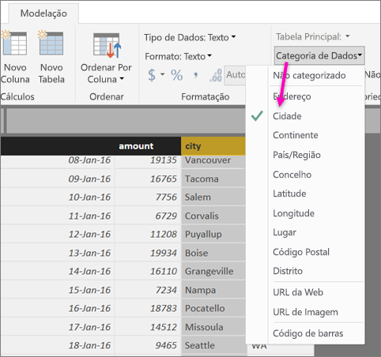
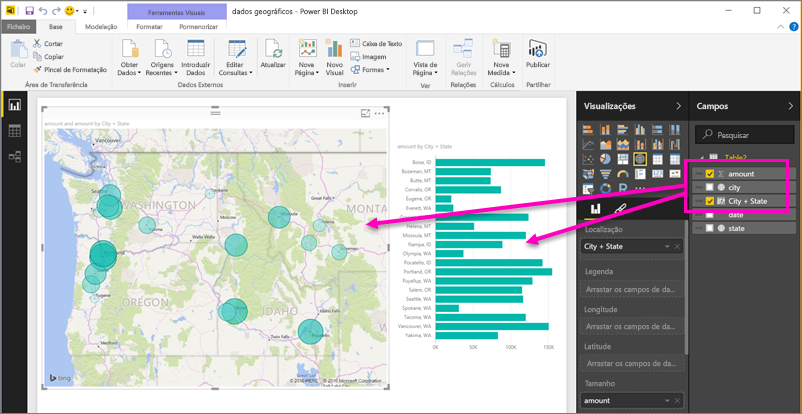
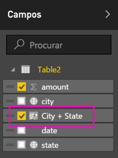
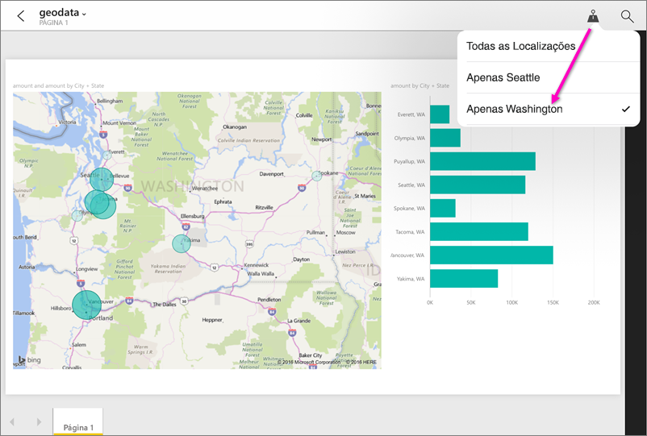

# Definir filtros geográficos no Power BI Desktop para aplicações móveis
No Power BI Desktop, pode [categorizar dados geográficos](desktop-data-categorization.md) para uma coluna, para que o Power BI Desktop saiba como tratar os valores nos visuais num relatório. Como vantagem adicional, quando o utilizador ou os seus colegas virem esse relatório nas aplicações móveis do Power BI, o Power BI fornece automaticamente filtros geográficos correspondentes à sua localização. 

Por exemplo, suponhamos que é um gestor de vendas em viagem para se encontrar com clientes e pretende filtrar rapidamente a receita e as vendas totais do cliente específico que pretende visitar. Pretende saber os dados com base na sua localização atual, seja com base no estado, cidade ou num endereço específico. Mais tarde, se lhe sobrar tempo, pretende visitar outros clientes nas proximidades. Pode [filtrar o relatório consoante a sua localização para encontrar esses clientes](consumer/mobile/mobile-apps-geographic-filtering.md).

> [!NOTE]
> Só pode filtrar por localização na aplicação móvel se os nomes geográficos no relatório estiverem em inglês (por exemplo, "New York City" ou "Germany").
> 
> 

## Identificar dados geográficos no seu relatório
1. No Power BI Desktop, mude para a Vista de Dados .
2. Selecione uma coluna com dados geográficos (por exemplo, uma coluna de Cidade).
   
    
3. No separador **Modelação**, selecione **Categoria de Dados** e, em seguida, a categoria correta (neste exemplo, **Cidade**).
   
    
4. Continue a definir as categorias de dados geográficos para outros campos no modelo. 
   
   > [!NOTE]
   > Pode definir múltiplas colunas para cada categoria de dados num modelo mas, se o fizer, o modelo não poderá filtrar com base em dados geográficos na aplicação móvel do Power BI. Para utilizar a filtragem geográfica nas aplicações móveis, defina apenas uma coluna para cada categoria de dados. Por exemplo, apenas uma coluna de **Cidade**, uma coluna de **Distrito** e uma coluna de **País**. 
   > 
   > 

## Criar visuais com os seus dados geográficos
1. Mude para a vista de Relatório e crie visuais que utilizem os campos geográficos nos seus dados. 
   
    
   
    Neste exemplo, o modelo também contém uma coluna calculada que junta cidade e estado numa só coluna. Saiba mais sobre [criar colunas calculadas no Power BI Desktop](desktop-calculated-columns.md).
   
    
2. Publique o relatório no serviço Power BI.

## Ver o relatório na aplicação móvel do Power BI
1. Abra o relatório numa das [aplicações móveis do Power BI](consumer/mobile/mobile-apps-for-mobile-devices.md).
2. Se estiver numa localização geográfica com dados no relatório, pode filtrá-los automaticamente com base na sua localização.
   
    

Saiba mais sobre [filtrar um relatório por localização nas aplicações móveis do Power BI](consumer/mobile/mobile-apps-geographic-filtering.md).

## Próximos passos
* [Categorização de dados no Power BI Desktop](desktop-data-categorization.md)  
* Perguntas? [Experimente perguntar à Comunidade do Power BI](http://community.powerbi.com/)

