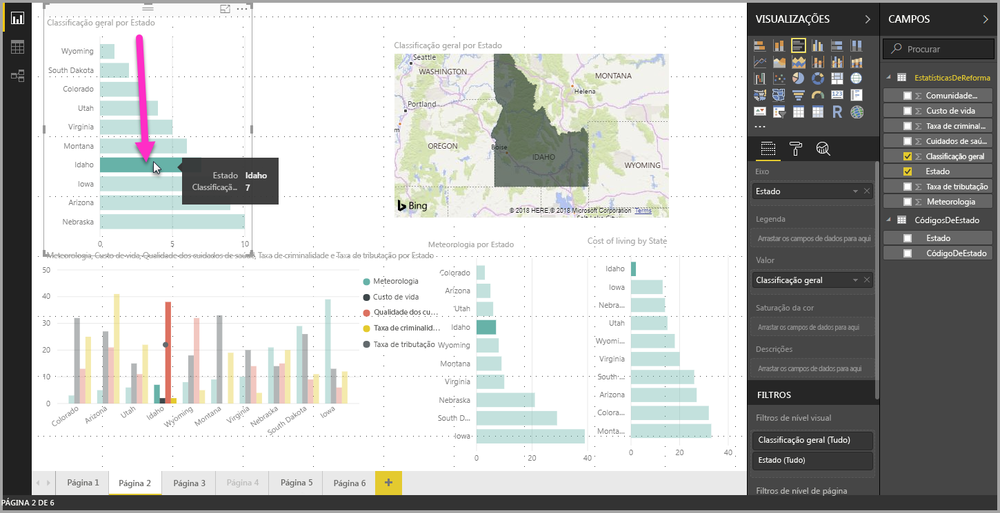
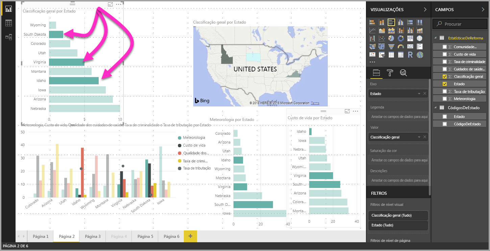

# Selecionar vários elementos de dados em elementos visuais com o Power BI Desktop

No **Power BI Desktop**, pode realçar um ponto de dados num determinado elemento visual ao clicar simplesmente no ponto de dados no elemento visual. Por exemplo, se tiver um elemento do gráfico ou barra importante e pretender outros elementos visuais na página do relatório para realçar os dados com base na seleção, poderá clicar no elemento de dados num elemento visual e ver os resultados refletidos noutros elementos visuais na página. Trata-se de um realce básico ou de seleção única. A imagem seguinte mostra um realce básico. 

Com a seleção múltipla, pode agora selecionar mais do que um ponto de dados na página de relatório do **Power BI Desktop** e realçar os resultados nos vários elementos visuais na página. Este procedimento é equivalente a uma funcionalidade ou instrução **e**, como “realçar resultados para Lisboa **e** Porto”. Para selecionar vários pontos de dados em elementos visuais, basta utilizar **CTRL+Clique**. A imagem seguinte mostra **vários pontos de dados** selecionados (seleção múltipla).

Parece uma funcionalidade simples, mas abre todo um leque de oportunidades quando criar, partilhar e interagir com relatórios. 

## Próximos passos

Poderá também estar interessado nos seguintes artigos:

* [Utilizar linhas de grelha e ajustar à grelha em relatórios do Power BI Desktop](desktop-gridlines-snap-to-grid.md)
* [Sobre filtros e realces em relatórios do Power BI](power-bi-reports-filters-and-highlighting.md)

