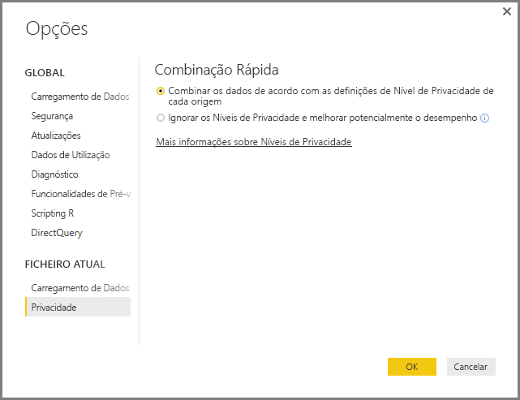
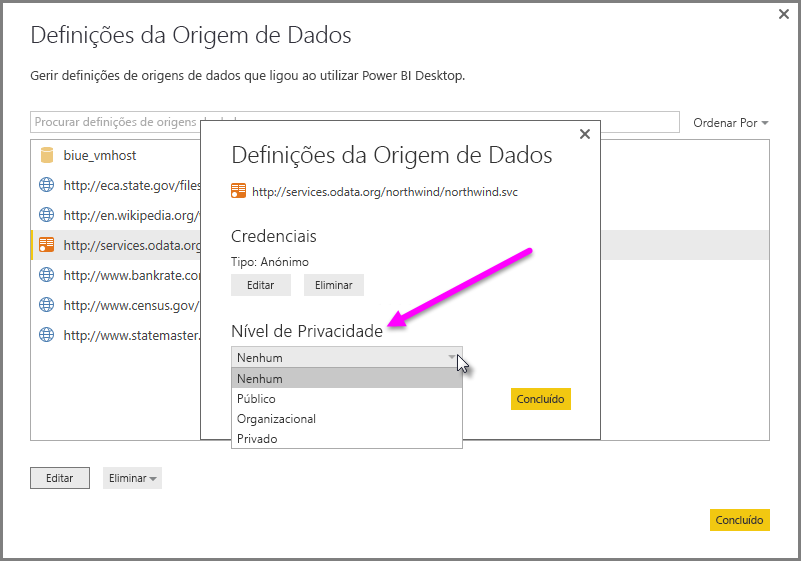

# Níveis de privacidade do Power BI Desktop
No **Power BI Desktop**, os níveis de privacidade especificam um nível de isolamento que define o grau em que uma origem de dados será isolada de outras origens de dados. Apesar de o nível de isolamento restrito bloquear a troca de informações entre as origens de dados, poderá reduzir a funcionalidade e causar um impacto no desempenho.

A definição **Níveis de Privacidade**, encontrada em **Ficheiro > Opções e definições > Opções** e **Ficheiro Atual > Privacidade** determina se o Power BI Desktop utiliza as configurações de Nível de Privacidade ao combinar dados. Esta caixa de diálogo inclui uma ligação para a documentação do Power BI Desktop sobre os Níveis de Privacidade (este artigo).

## Configurar um nível de privacidade
Nas definições do nível de privacidade, pode especificar um nível de isolamento que define o grau em que uma origem de dados deve ser isolada de outras origens de dados.

| Definição | Descrição | Exemplo de origens de dados |
| --- | --- | --- |
| **Origem de dados privada** |Uma origem de dados **Privada** contém informações confidenciais, e a visibilidade da origem de dados pode ser restringida a utilizadores autorizados. Uma origem de dados privada é completamente isolada de outras origens de dados. |Os dados do Facebook, um ficheiro de texto com concessões de ações ou um livro com informações de avaliação de funcionários. |
| **Origem de dados organizacional** |Uma origem de dados **Organizacional** limita a visibilidade de uma origem de dados a um grupo de pessoas de confiança. Uma origem de dados **Organizacional** fica isolada de todas as origens de dados **Públicas**, mas é visível para outras origens de dados **Organizacionais**. |Um documento do **Microsoft Word** num site do SharePoint com permissões ativadas para um grupo de pessoas de confiança. |
| **Origem de dados pública** |Uma origem de dados **Pública** fornece a todos os utilizadores a visibilidade dos dados contidos na origem de dados. Apenas ficheiros, origens de dados da Internet ou dados de livro podem ser marcados como **Públicos**. |Dados gratuitos do Microsoft Azure Marketplace, dados de uma página da Wikipédia ou um ficheiro local com os dados copiados de uma página Web pública. |

## Configurar definições de nível de privacidade
A caixa de diálogo das definições de **Privacidade** de cada origem de dados encontra-se em **Ficheiro > Opções e definições > Definições da origem de dados**.

Para configurar o nível de privacidade da origem de dados, selecione a origem de dados e selecione **Editar**. É apresentada a caixa de diálogo **Definições da Origem de Dados**, na qual pode selecionar o nível de privacidade adequado no menu suspenso na parte inferior da caixa de diálogo, conforme mostrado na imagem seguinte.

> [!CAUTION]
> Deve configurar uma origem de dados que contenha dados altamente confidenciais como **Privada**.
> 

## Configurar Níveis de Privacidade
**Níveis de Privacidade** é uma definição que está configurada para **Combinar os dados de acordo com as definições de Nível de Privacidade de cada origem** por predefinição, o que significa que os **Níveis de Privacidade** não estão ativados.

| Definição | Descrição |
| --- | --- |
| **Combinar os dados de acordo com as definições de Nível de Privacidade de cada origem** (ativada e a predefinição) |As configurações do nível de privacidade são utilizadas para determinar o nível de isolamento entre origens de dados ao combinar dados. |
| **Ignorar os níveis de Privacidade e melhorar potencialmente o desempenho** (desativada) |Os níveis de privacidade não são considerados ao combinar os dados. No entanto, o desempenho e a funcionalidade dos dados podem aumentar. |

> **Nota de Segurança** Ativar os **Níveis de Privacidade** ao selecionar **Ignorar os Níveis de Privacidade e melhorar potencialmente o desempenho** na caixa de diálogo **Níveis de Privacidade** irá expor dados confidenciais a uma pessoa não autorizada. Não ative os **Níveis de Privacidade**, salvo se tiver a certeza de que a origem de dados não contém dados confidenciais.
> 
> 

> [!CAUTION]
> A opção **Ignorar os Níveis de privacidade e melhorar potencialmente o desempenho** não funciona no serviço Power BI. Como tal, os relatórios do Power BI Desktop com esta definição ativada, que são em seguida publicados no serviço Power BI, *não* refletem este comportamento quando utilizados no serviço.
> 

**Configurar Níveis de Privacidade**

No Power BI Desktop ou no Editor de Consultas, selecione **Ficheiro > Opções e definições > Opções** e **Ficheiro atual > Privacidade**.

a. Quando **Combinar os dados de acordo com as definições de Nível de Privacidade de cada origem** estiver selecionado, os dados serão combinados de acordo com a sua definição dos Níveis de Privacidade. Unir dados entre zonas de isolamento de Privacidade resultará em alguma colocação dos dados em memória intermédia.

b. Quando **Ignorar os Níveis de Privacidade e potencialmente melhorar o desempenho** estiver selecionado, os dados serão combinados, ignorando os Níveis de Privacidade que poderiam revelar dados confidenciais a um utilizador não autorizado. A configuração pode melhorar o desempenho e a funcionalidade.

> **Nota de Segurança:** selecionar **Ignorar os Níveis de Privacidade e melhorar potencialmente o desempenho** pode melhorar o desempenho; no entanto, o Power BI Desktop não pode garantir a privacidade dos dados intercalados no ficheiro do Power BI Desktop.
> 
> 

