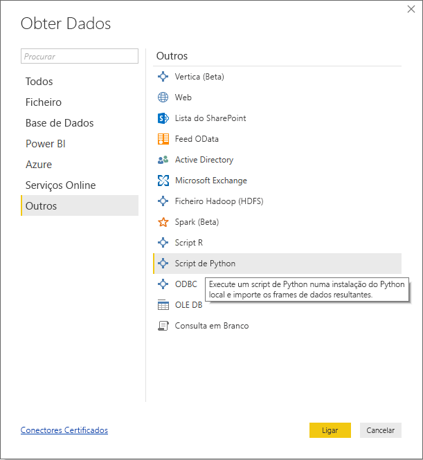
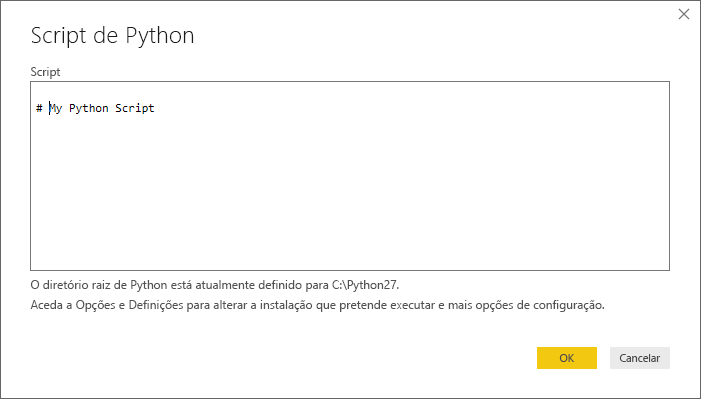
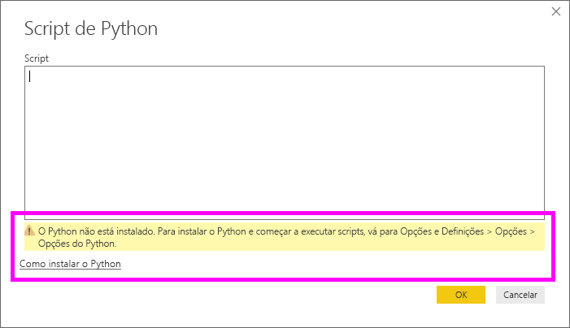
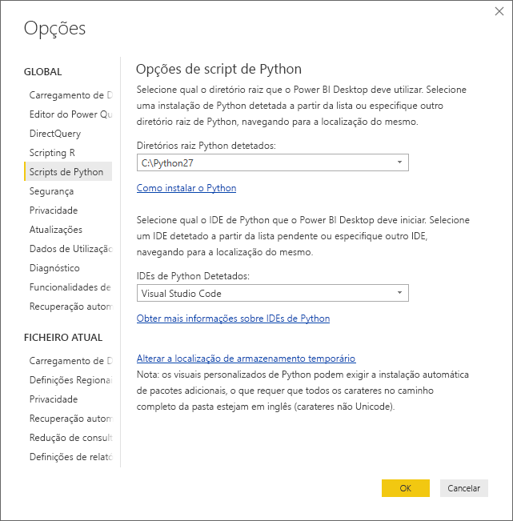

# Executar scripts de Python no Power BI Desktop
Pode executar scripts de Python diretamente no **Power BI Desktop** e importar os conjuntos de dados resultantes para um modelo de dados do Power BI Desktop.

## Instalar o Python
Para executar scripts de Python no Power BI Desktop, tem de instalar o **Python** no seu computador local. Pode transferir e instalar o **Python** gratuitamente a partir de vários locais, incluindo a partir da [página de transferência do Python Oficial](https://www.python.org/) e a partir do [Anaconda](https://anaconda.org/anaconda/python/). A versão atual de scripts de Python no Power BI Desktop suporta carateres Unicode, bem como espaços (carateres vazios) no caminho de instalação.

## Executar scripts de Python
Com apenas alguns passos no Power BI Desktop, pode executar scripts de Python e criar um modelo de dados, através do qual pode criar relatórios e partilhá-los no serviço Power BI.

### Preparar um script de Python
Para executar um script de Python no Power BI Desktop, crie o script no seu ambiente de desenvolvimento local do Python e certifique-se de que é executado com êxito.

Para executar o script no Power BI Desktop, verifique se é executado com êxito numa área de trabalho nova e não modificada. Isto significa que todos os pacotes e dependências têm de ser explicitamente carregados e executados.

Quando preparar e executar um script de Python no Power BI Desktop, existem algumas limitações:

* Apenas os pacotes de dados Pandas são importados, pelo que deve certificar-se de que os dados que pretende importar para o Power BI estão representados num pacote de dados
* Qualquer script de Python executado durante mais de 30 minutos expira
* As chamadas interativas no script de Python, como aguardar a entrada do utilizador, interrompem a execução do script
* Quando definir o diretório de trabalho no script de Python, é *necessário* definir um caminho completo para o diretório de trabalho, em vez de um caminho relativo
* As tabelas aninhadas (tabela de tabelas) não são atualmente suportadas 

### Executar o script de Python e importar dados
1. No Power BI Desktop, o conector de dados de Script de Python pode ser encontrado em **Obter Dados**. Para executar o Script de Python, selecione **Obter Dados &gt; Mais...** e, em seguida, selecione **Outros &gt; Script de Python**, conforme mostrado na seguinte imagem:
   
   
2. Se o Python estiver instalado no computador local, será selecionada a versão mais recente instalada como o motor do Python. Basta copiar o script para a janela do script e selecionar **OK**.
   
   
3. Se o Python não estiver instalado, não for identificado ou se existirem múltiplas instalações no seu computador local, será apresentado um aviso.
   
   
   
   As definições de instalação do Python estão localizadas centralmente na secção Scripts de Python da caixa de diálogo Opções. Para especificar as definições de instalação do Python, selecione **Ficheiro > Opções e definições** e, em seguida **Opções > Scripts de Python**. Se houver múltiplas instalações do Python disponíveis, será apresentado um menu pendente que lhe permite selecionar a instalação que será utilizada. Também pode selecionar **Outros** e atribuir um caminho personalizado.
   
   
4. Selecione **OK** para executar o Script de Python. Quando o script é executado com êxito, pode escolher os pacotes de dados resultantes a adicionar ao modelo do Power BI.

### Atualizar
Pode atualizar um script de Python no Power BI Desktop. Quando atualiza um script de Python, o Power BI Desktop executa-o novamente no respetivo ambiente.

## Próximos passos
Veja as seguintes informações adicionais sobre o Python no Power BI.

* [Criar Elementos Visuais do Python no Power BI Desktop](desktop-python-visuals.md)
* [Utilizar um IDE de Python externo com o Power BI](desktop-python-ide.md)