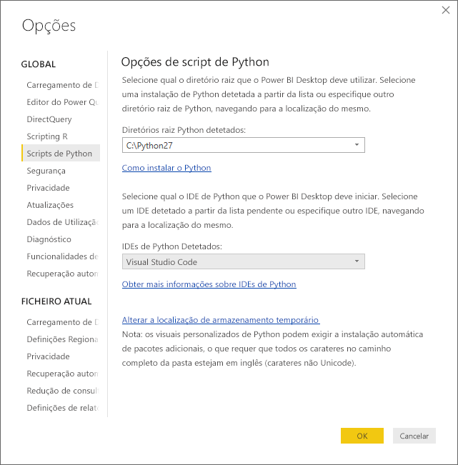
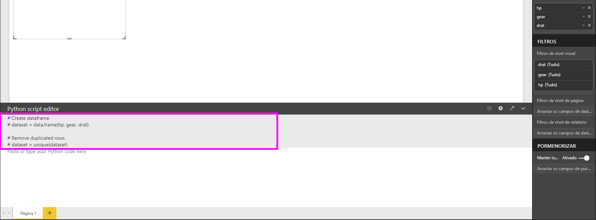
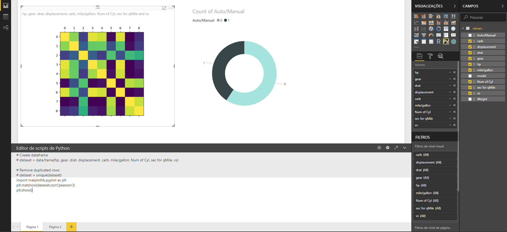
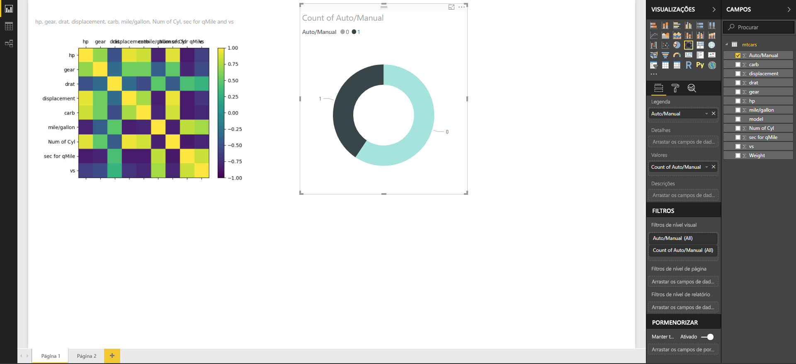
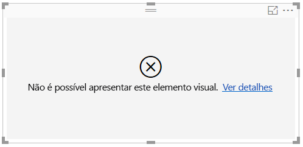

# Criar elementos visuais do Power BI através de Python
Com o **Power BI Desktop**, pode utilizar o **Python** para visualizar os seus dados.

## Instalar o Python
O **Power BI Desktop** não inclui, implementa nem instala o motor **Python**. Para executar scripts de Python no **Power BI Desktop**, tem de instalar o **Python** no computador local separadamente. Pode transferir e instalar o **Python** gratuitamente a partir de vários locais, incluindo a partir da [página de transferência do Python Oficial](https://www.python.org/) e a partir do [Anaconda](https://anaconda.org/anaconda/python/). A versão atual de scripts de Python no Power BI Desktop suporta carateres Unicode, bem como espaços (carateres vazios) no caminho de instalação.

## Ativar elementos visuais do Python
Para ativar elementos visuais do R, selecione **Ficheiro > Opções e definições > Opções** e, na página **Opções** apresentada, verifique se a sua instalação local do Python está especificada na secção **Scripts de Python** da janela **Opções**, conforme mostrado na imagem seguinte. Na seguinte imagem, a instalação local do caminho de Python é **C:\Python27** e esse caminho é explicitamente fornecido na caixa de texto. Certifique-se de que o caminho apresentado reflete a instalação local do Python que pretende que o **Power BI Desktop** utilize.
   
   

Depois de especificar a instalação do Python, estará pronto para começar a criar elementos visuais do Python.

## Criar elementos visuais do Python no Power BI Desktop
1. Selecione o ícone **Elemento visual em Python** no painel **Visualização**, conforme mostrado na seguinte imagem, para adicionar um elemento visual do Python.
   
   

   Quando adiciona um elemento visual do Python a um relatório, o **Power BI Desktop** faz o seguinte:
   
   - Uma imagem de marcador de posição do elemento visual do Python é apresentada na tela do relatório.
   
   - O **Editor de scripts de Python** é apresentado na parte inferior do painel central.
   
   

2. Em seguida, adicione os campos que pretende consumir no seu script de Python à secção **Valores** em **Campos**, como faria com qualquer outro elemento visual do **Power BI Desktop**. 
    
    Apenas os campos que foram adicionados à área **Campos** estão disponíveis para o script de Python. Pode adicionar novos campos ou remover campos desnecessários da área **Campos** enquanto trabalha no script de Python no **Editor de scripts de P do Power BI Desktop**. O **Power BI Desktop** deteta automaticamente os campos que adicionou ou removeu.
   
   > [!NOTE]
   > O tipo de agregação predefinido para elementos visuais do Python é *não resumir*.
   > 
   > 
   
3. Agora, pode utilizar os dados selecionados para criar um desenho. 

    Ao selecionar campos, o **Editor de scripts de Python** gera um código de enlace de script de Python com suporte, com base nas suas seleções na secção cinzenta na parte superior do painel do editor. Ao selecionar ou remover campos adicionais, o código de suporte no Editor de scripts de Python é automaticamente gerado ou removido adequadamente.
   
   No exemplo mostrado na imagem seguinte, três campos foram selecionados: hp, engrenagem e drat. Como resultado dessas seleções, o editor de scripts de Python gerou o seguinte código de enlace:
   
   * Um pacote de dados chamado **dataset** foi criado
     * Esse pacote de dados é composto por diferentes campos selecionados pelo utilizador
   * A agregação padrão é *não resumir*
   * Semelhantes aos elementos visuais de tabela, os campos são agrupados e as linhas duplicadas aparecem apenas uma vez
   
   
   
   > [!TIP]
   > Em certos casos, pode não querer o agrupamento automático ou pode querer que todas as linhas sejam apresentadas, incluindo duplicados. Nesse caso, pode adicionar um campo de índice ao conjunto de dados, que faz com que todas as linhas sejam consideradas exclusivas e, assim, impedir o agrupamento.
   > 
   > 
   
   O pacote de dados gerado é denominado **dataset** e pode aceder às colunas selecionadas pelos seus nomes. Por exemplo, aceda ao campo de engrenagem ao escrever *dataset["gear"]* no script de Python.

4. Com o pacote de dados gerado automaticamente pelos campos selecionados, está pronto para escrever um script de Python que resulta em desenhar no dispositivo padrão de Python. Quando o script estiver concluído, selecione **Executar** na barra de título **Editor de scripts de Python** (**Executar** está no lado direito da barra de título).
   
    Quando selecionar **Executar**, o **Power BI Desktop** identifica o desenho e apresenta-o na tela. Uma vez que o processo é executado na instalação local do Python, confirme que os pacotes necessários estão instalados.
   
   O **Power BI Desktop** volta a desenhar o elemento visual quando qualquer um dos seguintes eventos ocorre:
   
   * Quando selecionar **Executar** na barra de título **Editor de scripts de Python**
   * Sempre que ocorre uma alteração de dados, devido à atualização, filtragem ou destaque de dados

    A imagem seguinte mostra um exemplo de código de desenho de correlação, e desenha as correlações entre atributos de tipos de carros diferentes.

    

5. Para obter uma vista ampliada das visualizações, pode minimizar o **Editor de scripts de Python**. E, claro, como noutros elementos visuais no **Power BI Desktop**, pode efetuar a filtragem cruzada do desenho de correlação, ao selecionar apenas carros desportivos no elemento visual de anel (o elemento visual redondo à direita, na imagem de exemplo acima).

    

6. Também pode modificar o script de Python para personalizar o elemento visual e tirar partido do Python ao adicionar parâmetros ao comando de desenho.

    O comando original de desenho era o seguinte:

    plt.matshow(dataset.corr('pearson'))

    Com poucas alterações no script de Python, o comando é agora o seguinte:

    plt.matshow(dataset.corr('kendall'))

    Como resultado, o elemento visual do Python desenha agora com recurso ao coeficiente de correlação Kendall Tau, conforme mostrado na seguinte imagem.

    

    Ao executar um script de Python que resulta num erro, o elemento visual do Python não é desenhado. Além disso, é apresentada uma mensagem de erro na tela. Para obter detalhes sobre o erro, selecione **Ver detalhes** no erro de elemento visual do Python na tela.

    

    > **Segurança dos scripts Python:** os elementos visuais do Python são criados a partir de scripts Python, que podem conter código com riscos de segurança ou de privacidade. Ao tentar ver ou interagir com um elemento visual do Python pela primeira vez, é apresentada uma mensagem de aviso de segurança. Ative os elementos visuais do Python apenas se confiar no autor e na origem, ou depois de analisar e compreender o script de Python.
    > 
    > 

## Limitações conhecidas
Os elementos visuais do Python no **Power BI Desktop** apresentam algumas limitações:

* Limitações de tamanho de dados – os dados utilizados pelo elemento visual do Python para desenhar são limitados a 150 000 linhas. Se forem selecionadas mais de 150.000 linhas, apenas as primeiras 150.000 linhas serão utilizadas e uma mensagem será apresentada na imagem.
* Limite de tempo de cálculo – se um cálculo do elemento visual do Python exceder cinco minutos, a execução atingirá o tempo limite e resultará num erro.
* Relações – tal como com outros elementos visuais do Power BI Desktop, se os campos de dados de tabelas diferentes numa relação definida entre estes forem selecionados, ocorrerá um erro.
* Os elementos visuais do Python são atualizados após atualizações, filtragem e destaque de dados. No entanto, a própria imagem não é interativa e não pode ser a origem da filtragem cruzada.
* Os elementos visuais do Python respondem ao destaque de outros elementos visuais, mas não pode clicar em elementos no elemento visual do Python para efetuar a filtragem cruzada de outros elementos.
* Apenas os desenhos que são desenhados no dispositivo de visualização predefinida do Python são apresentados corretamente na tela. Evite a utilização explícita de um dispositivo de visualização diferente do Python.

## Próximos passos
Veja as seguintes informações adicionais sobre o Python no Power BI.

* [Executar scripts de Python no Power BI Desktop](desktop-python-scripts.md)
* [Utilizar um IDE de Python externo com o Power BI](desktop-python-ide.md)

