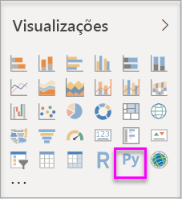
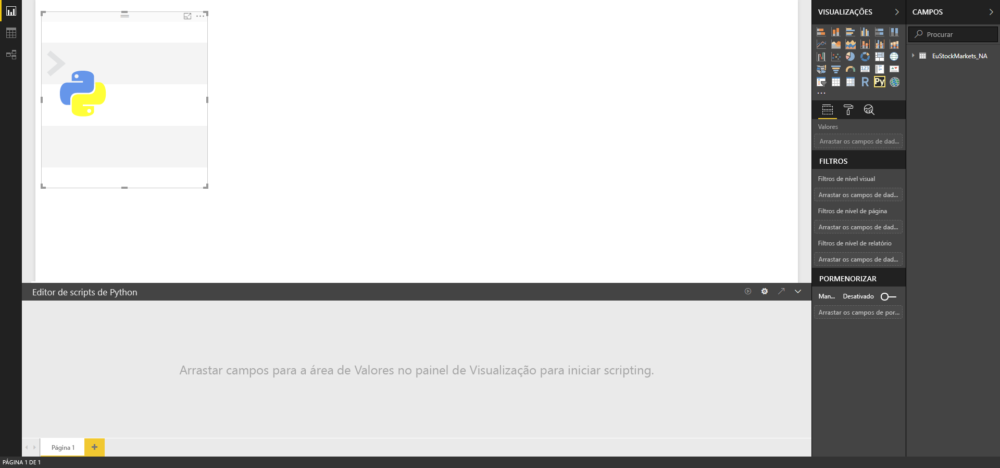
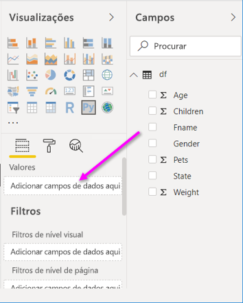
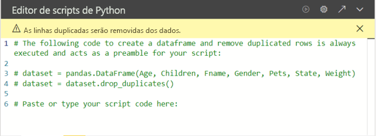
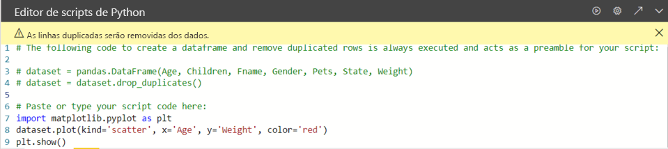

# <a name="create-power-bi-visuals-by-using-python"></a>Criar elementos visuais do Power BI através de Python

Com o *Power BI Desktop*, pode utilizar o Python para visualizar os dados.

## <a name="prerequisites"></a>Pré-requisitos

Realize o tutorial [Executar scripts de Python no Power BI Desktop](desktop-python-scripts.md) com o seguinte script de Python:

```python
import pandas as pd 
df = pd.DataFrame({ 
    'Fname':['Harry','Sally','Paul','Abe','June','Mike','Tom'], 
    'Age':[21,34,42,18,24,80,22], 
    'Weight': [180, 130, 200, 140, 176, 142, 210], 
    'Gender':['M','F','M','M','F','M','M'], 
    'State':['Washington','Oregon','California','Washington','Nevada','Texas','Nevada'],
    'Children':[4,1,2,3,0,2,0],
    'Pets':[3,2,2,5,0,1,5] 
}) 
print (df) 
```

O artigo [Executar scripts Python no Power BI Desktop](desktop-python-scripts.md) mostra-lhe como instalar o Python no computador local e como o ativar para os scripts Python no Power BI Desktop. Este tutorial utiliza dados do script acima para ilustrar a criação de elementos visuais em Python.

## <a name="create-python-visuals-in-power-bi-desktop"></a>Criar elementos visuais do Python no Power BI Desktop

1. Selecione o ícone **Elemento visual do Python** no painel **Visualizações**.

   

1. Na caixa de diálogo **Ativar visuais do script** apresentada, selecione **Ativar**.

    Quando adiciona um elemento visual do Python a um relatório, o Power BI Desktop executa as seguintes ações:

    - Uma imagem de marcador de posição do elemento visual do Python é apresentada na tela do relatório.

    - O **Editor de scripts de Python** é apresentado na parte inferior do painel central.

    

1. Em seguida, arraste os campos **Idade**, **Crianças**, **Nome**, **Sexo**, **Animais de Estimação**, **Estado** e **Peso** para a secção **Valores** onde está indicado **Adicionar campos de dados aqui**.

    

   O seu script de Python só pode utilizar os campos adicionados à secção **Valores**. Pode adicionar ou remover campos da secção **Valores** enquanto estiver a trabalhar no seu script de Python. O Power BI Desktop deteta automaticamente as alterações aos campos.

   > [!NOTE]
   > O tipo de agregação predefinido para elementos visuais do Python é *não resumir*.
   > 
   > 

1. Agora, pode utilizar os dados selecionados para criar um desenho.

    Ao selecionar ou remover campos, o código de suporte no Editor de scripts de Python é automaticamente gerado ou removido. 

    Com base nas suas seleções, o editor de scripts Python gerou o seguinte código de enlace.

    - O editor criou um pacote de dados denominado *dataset* (conjunto de dados) com os campos que adicionou.
    - A agregação predefinida é: *não resumir*.
    - Da mesma forma que acontece com elementos visuais de tabela, os campos são agrupados e as linhas duplicadas são apresentadas apenas uma vez.

    

     > [!TIP]
     > Em alguns casos, pode não querer o agrupamento automático ou pode querer que todas as linhas sejam apresentadas, incluindo duplicados. Se assim for, pode adicionar um campo de índice ao conjunto de dados, que faz com que todas as linhas sejam consideradas exclusivas, impedindo o agrupamento.

   Pode aceder às colunas no conjunto de dados através dos respetivos nomes. Por exemplo, pode utilizar o código `dataset["Age"]` no script Python para aceder ao campo Idade.

1. Com o pacote de dados gerado automaticamente pelos campos selecionados, está pronto para escrever um script Python que resulta em desenhar no dispositivo padrão do Python. Quando o script for concluído, selecione **Executar** na barra de título do **Editor de scripts de Python**.

   O Power BI Desktop volta a desenhar o elemento visual caso ocorra um dos seguintes eventos:

   - Quando selecionar **Executar** na barra de título **Editor de scripts de Python**
   - Sempre que ocorre uma alteração de dados, devido à atualização, filtragem ou destaque de dados

   Ao executar um script de Python que resulta num erro, o elemento visual em Python não será desenhado, sendo apresentada uma mensagem de erro na tela. Para obter detalhes do erro, selecione **Ver detalhes** na mensagem.

   Para obter uma vista ampliada das visualizações, pode minimizar o **Editor de scripts de Python**.

Agora, vamos criar alguns elementos visuais.

## <a name="create-a-scatter-plot"></a>Criar um gráfico de dispersão

Vamos criar um gráfico de dispersão para ver se existe uma correlação entre a idade e o peso.

1. Em **Cole ou escreva o código do script aqui**, introduza este código:

   ```python
   import matplotlib.pyplot as plt 
   dataset.plot(kind='scatter', x='Age', y='Weight', color='red')
   plt.show() 
   ```  

   O seu painel do Editor de scripts de Python deve ter agora o seguinte aspeto:

   

   A biblioteca **matplotlib** é importada para desenhar e criar os elementos visuais.

1. Quando seleciona o botão do script **Executar**, é gerado o seguinte gráfico de dispersão na imagem do elemento visual em Python de marcador de posição.

   

## <a name="create-a-line-plot-with-multiple-columns"></a>Criar um gráfico de linhas com múltiplas colunas

 Vamos criar um gráfico de linhas para cada pessoa a mostrar o respetivo número de crianças e animais de estimação. Remova ou faça um comentário no código em **Cole ou escreva o código do script aqui** e introduza este código em Python:

 ```python
 import matplotlib.pyplot as plt 
ax = plt.gca() 
dataset.plot(kind='line',x='Fname',y='Children',ax=ax) 
dataset.plot(kind='line',x='Fname',y='Pets', color='red', ax=ax) 
plt.show() 
```

Quando selecionar o botão do script **Executar**, será gerado o seguinte gráfico de linhas com múltiplas colunas.


## <a name="create-a-bar-plot"></a>Criar um gráfico de barras

Vamos criar um gráfico de barras para a idade de cada pessoa. Remova ou faça um comentário no código em **Cole ou escreva o código do script aqui** e introduza este código em Python:

```python
import matplotlib.pyplot as plt 
dataset.plot(kind='bar',x='Fname',y='Age') 
plt.show() 
```

Quando selecionar o botão do script **Executar**, será gerado o seguinte gráfico de barras:

 

## <a name="security"></a>Segurança

> [!IMPORTANT] 
> **Segurança dos scripts Python:** os elementos visuais do Python são criados a partir de scripts Python, que podem conter código com riscos de segurança ou de privacidade. Ao tentar ver ou interagir com um elemento visual do Python pela primeira vez, é apresentada uma mensagem de aviso de segurança. Ative os elementos visuais do Python apenas se confiar no autor e na origem, ou depois de analisar e compreender o script de Python.
>  

## <a name="more-information-about-plotting-with-matprolib-pandas-and-python"></a>Mais informações sobre como desenhar gráficos com as bibliotecas Matprolib, Pandas e Python

Este tutorial foi concebido para ajudar a começar a criar elementos visuais com o Python no Power BI Desktop. Abrange apenas de forma geral as imensas opções e funcionalidades para criar relatórios de elementos visuais com as bibliotecas Matprolib, Pandas e Python. Estão disponíveis muitas mais informações, mas incluímos aqui algumas ligações para começar.

- Documentação no site da [Matplotlib](https://matplotlib.org/). 
- [Matplotlib Tutorial: A Basic Guide to Use Matplotlib with Python](https://www.datasciencelearner.com/matplotlib-tutorial-complete-guide-to-use-matplotlib-with-python/) (Tutorial da Matplotlib: um Guia Básico para Utilizar a Matplotlib com Python 
- [Matplotlib Tutorial – Python Matplotlib Library with Examples](https://www.edureka.co/blog/python-matplotlib-tutorial/) (Tutorial da Matplotlib – Biblioteca Python Matplotlib com Exemplos) 
- [Referência da API da biblioteca Pandas](https://pandas.pydata.org/pandas-docs/stable/reference/index.html) 
- [Visualizações de Python no Serviço Power BI](https://powerbi.microsoft.com/blog/python-visualizations-in-power-bi-service/) 
- [Using Python Visuals in Power BI](https://www.absentdata.com/how-to-user-python-and-power-bi/) (Utilizar Elementos Visuais em Python no Power BI)

## <a name="known-limitations"></a>Limitações conhecidas

Os elementos visuais do Python no Power BI Desktop apresentam algumas limitações:

- Limitações de tamanho de dados. Os dados utilizados pelo elemento visual do Python para desenhar são limitados a 150 000 linhas. Se forem selecionadas mais de 150.000 linhas, apenas as primeiras 150.000 linhas serão utilizadas e uma mensagem será apresentada na imagem.
- Resolução. Todos os elementos visuais do Python são apresentados a 72 DPI.
- Limitação do tempo de cálculo. Se um cálculo do elemento visual do Python exceder cinco minutos, a execução atingirá o tempo limite e resultará num erro.
- Relações. Tal como com outros elementos visuais do Power BI Desktop, se os campos de dados de tabelas diferentes numa relação definida entre estes forem selecionados, ocorrerá um erro.
- Os elementos visuais do Python são atualizados após atualizações, filtragem e destaque de dados. No entanto, a própria imagem não é interativa e não pode ser a origem da filtragem cruzada.
- Os elementos visuais em Python respondem ao realce de outros elementos visuais, mas não pode clicar em elementos no elemento visual em Python para efetuar a filtragem cruzada de outros elementos.
- Apenas os desenhos que são desenhados no dispositivo de visualização predefinida do Python são apresentados corretamente na tela. Evite a utilização explícita de um dispositivo de visualização diferente do Python.

## <a name="next-steps"></a>Próximos passos

Veja as seguintes informações adicionais sobre o Python no Power BI.

- [Executar scripts de Python no Power BI Desktop](desktop-python-scripts.md)
- [Utilizar um IDE de Python externo com o Power BI](desktop-python-ide.md)

