# Descrição geral de consulta no Power BI Desktop
Com o **Power BI Desktop**, pode ligar-se ao mundo dos dados, criar relatórios apelativos e fundamentais e partilhar os seus trabalhos com outras pessoas, que poderão basear-se no seu trabalho e expandir os seus esforços de business intelligence.

O Power BI Desktop tem três vistas:

* Vista de **Relatório**, onde pode utilizar consultas criadas por si para criar visualizações atraentes, dispostas como pretender, e com múltiplas páginas, que pode partilhar com outras pessoas
* Vista de **Dados**: veja os dados no seu relatório em formato de modelo de dados, onde pode adicionar medidas, criar novas colunas e gerir relações
* Vista de **Relações**: obtenha uma representação gráfica das relações que foram estabelecidas no seu modelo de dados e gira ou modifique as mesmas conforme necessário.

Estas vistas são acedidos através da seleção de um dos três ícones no lado esquerdo do Power BI Desktop. Na imagem seguinte, a vista de Relatório está selecionada, indicada pela faixa amarela ao lado do ícone.  

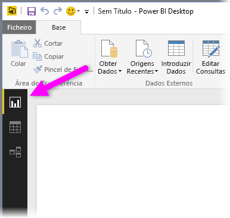

O Power BI Desktop também vem com o **Editor de Consultas**, onde se pode ligar a uma ou várias origens de dados, formatar e transformar os dados em função das suas necessidades e, em seguida, carregar esse modelo para o Power BI Desktop.

Este documento fornece uma descrição geral de como trabalhar com os dados no **Editor de Consultas**. É claro que há mais para aprender e, posto isto, no final deste documento, encontrará ligações para diretrizes detalhadas sobre os tipos de dados suportados, ligação a dados, formatação de dados, criação de relações e como começar.

Mas primeiro, vamos conhecer melhor o **Editor de Consultas**.

## Editor de Consultas
Para ir para o **Editor de Consultas**, selecione **Editar Consultas** no separador **Base** do Power BI Desktop.  

Sem ligações de dados, o **Editor de Consultas** é apresentado como um painel em branco, pronto para receber dados.  

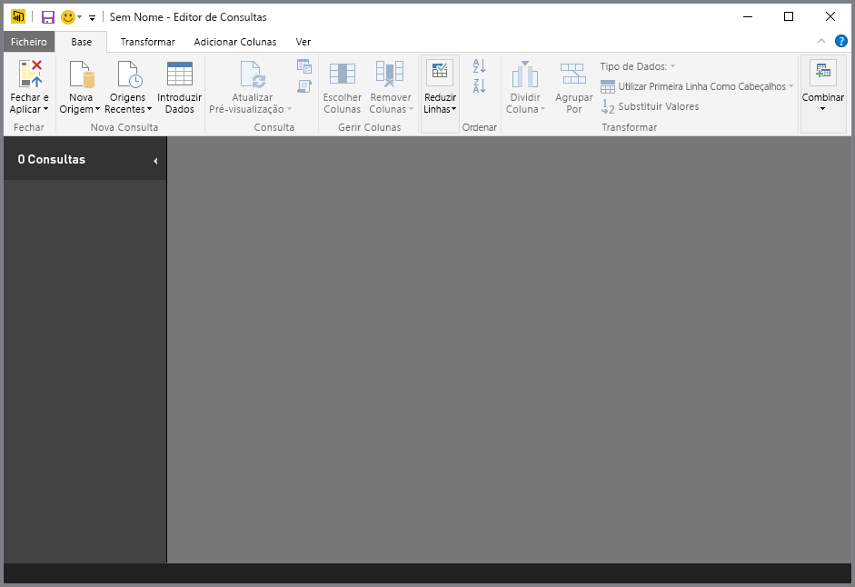

Após uma consulta ser carregada, a vista do **Editor de Consultas** torna-se mais interessante. Se nos ligarmos à seguinte origem de dados, o **Editor de Consultas** carrega informações sobre os dados, que pode depois começar a formatar.

[*http://www.bankrate.com/finance/retirement/best-places-retire-how-state-ranks.aspx*](http://www.bankrate.com/finance/retirement/best-places-retire-how-state-ranks.aspx)

Eis o aspeto do **Editor de Consultas** após uma ligação de dados ser estabelecida:

1. Na faixa de opções, muitos botões estão agora ativos para interagir com os dados na consulta
2. No painel esquerdo, as consultas são listadas e ficam disponíveis para seleção, visualização e formatação
3. No painel central, os dados da consulta selecionada são apresentados e estão disponíveis para formatação
4. A janela **Definições de Consulta** é apresentada, listando as propriedades e passos aplicados da consulta  
   
   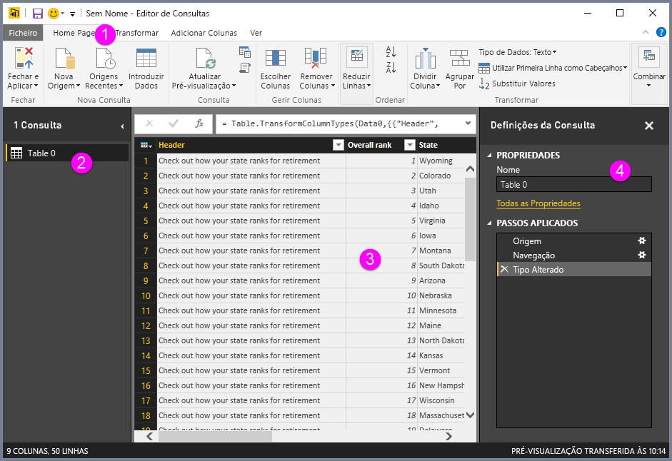

Examinemos cada uma destas quatro áreas – a faixa de opções, o painel de consultas, a vista de dados e o painel de Configurações de Consulta – nas secções seguintes.

## Friso de consulta
O friso no **Editor de Consultas** consiste em quadro separadores: **Base**, **Transformar**, **Adicionar Coluna** e **Vista**.

O separador **Base** contém as tarefas de consulta comuns, incluindo o primeiro passo de qualquer consulta, ou seja, **Obter Dados**. A seguinte imagem mostra o friso **Base**.  

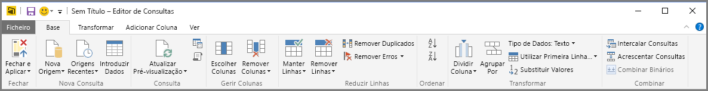

Para se ligar aos dados e dar início ao processo de criação da consulta, selecione o botão **Obter Dados**. É apresentado um menu, fornecendo as origens de dados mais comuns.  

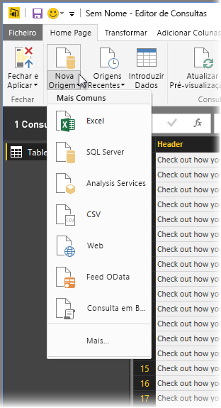

Para obter mais informações sobre as origens de dados disponíveis, consulte **Origens de Dados**. Para obter informações sobre como se ligar a dados, incluindo exemplos e passos, consulte **Ligar-se a Dados**.

O separador **Transformar** fornece acesso a tarefas comuns de transformação de dados, como adicionar ou remover colunas, alterar os tipos de dados, dividir colunas e outras tarefas baseadas em dados. A seguinte imagem mostra o separador **Transformar**.  

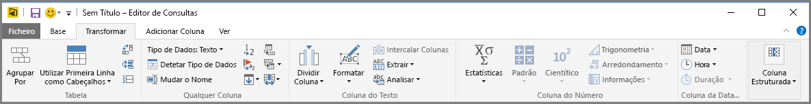

Para obter mais informações sobre como transformar dados, incluindo exemplos, consulte **Combinar e Formatar Dados**.

O separador **Adicionar Coluna** fornece tarefas adicionais associadas à adição de uma coluna, formatação de dados da coluna e adição de colunas personalizadas. A seguinte imagem mostra o separador **Adicionar Coluna**.  

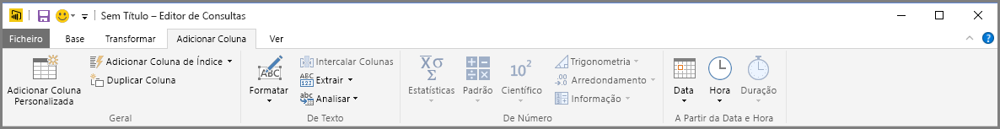

O separador **Ver** no friso é utilizado para mostrar ou ocultar determinados painéis ou janelas. Também é utilizado para apresentar o Editor Avançado. A seguinte imagem mostra o separador **Ver**.  

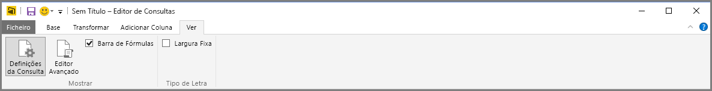

É útil saber que muitas das tarefas disponíveis na faixa de opções também estão disponíveis clicando com o botão direito do rato numa coluna ou noutros dados, no painel central.

## Painel à esquerda
O painel esquerdo apresenta o número de consultas ativas, bem como o nome da consulta. Quando seleciona uma consulta no painel à esquerda, os dados são apresentados no painel central, no qual pode formatar e transformar os dados para atender às suas necessidades. A imagem seguinte mostra o painel esquerdo com várias consultas.  

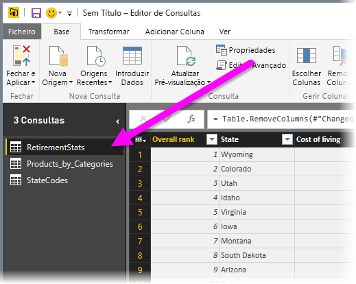

## Painel central (dados)
No painel central ou no painel Dados, são apresentados os dados da consulta selecionada. É aqui que muito do trabalho da vista de Consulta é realizado.

Na imagem a seguir, a ligação de dados da Web estabelecida anteriormente é mostrada, a coluna **Pontuação geral** está selecionada e seu cabeçalho foi clicado com o botão direito do rato para mostrar os itens de menu disponíveis. Tenha em atenção que muitos destes itens de menu de clique com o botão direito do rato são os mesmos botões nos separadores da faixa de opções.  

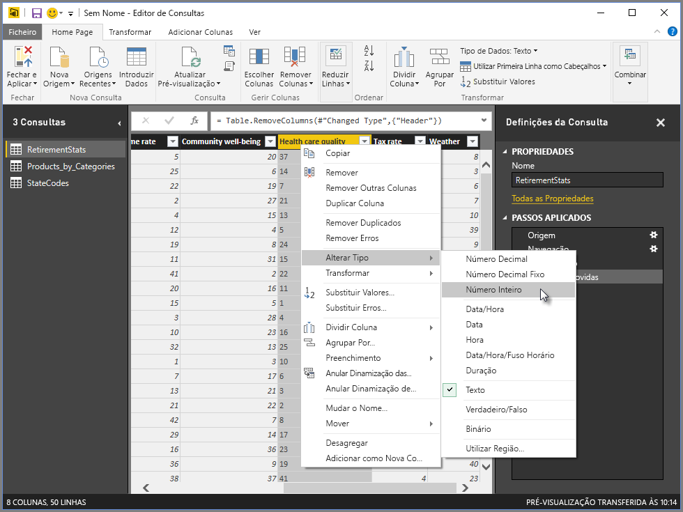

Quando seleciona um item de menu de clique com o botão direito do rato (ou um botão da faixa de opções), a Consulta aplica o passo aos dados e guarda-a como parte da própria consulta. Os passos são registados no painel **Definições de Consulta** por ordem sequencial, conforme descrito na próxima secção.  

## Painel Definições de Consulta
O painel **Definições de Consulta** é onde são apresentados todos os passos associados a uma consulta. Por exemplo, na imagem a seguir, a secção **Passos Aplicados** do painel **Definições de Consulta** reflete o facto de que acabámos de alterar o tipo da coluna **Pontuação geral**.

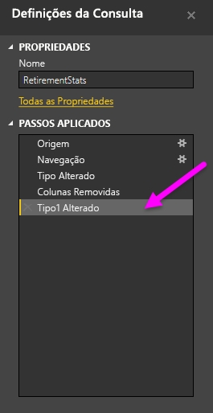

Conforme os passos de formatação adicionais são aplicados à consulta, são capturados na secção **Passos Aplicados**.

É importante saber que os dados subjacentes *não* são alterados; em vez disso, o Editor de Consultas ajusta e formata a sua vista dos dados, sendo que qualquer interação com os dados subjacentes ocorre com base na vista moldada e modificada do Editor de Consultas para esses dados.

No painel **Definições de Consulta**, pode mudar o nome de passos, eliminar passos ou reordenar os passos conforme julgue mais adequado. Para o fazer, clique com o botão direito do rato no passo na secção **Passos Aplicados** e selecione uma opção no menu apresentado. Todos os passos de consultas são efetuados pela ordem apresentada no painel **Passos Aplicados**.

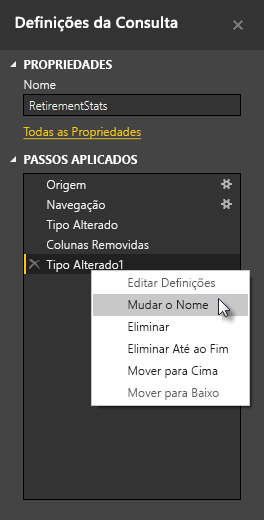

## Editor Avançado
Se pretender ver o código que a Consulta está a criar em cada passo ou criar o seu próprio código de formatação, pode utilizar o **Editor Avançado**. Para abrir o editor avançado, selecione **Ver** no friso e, em seguida, selecione **Editor Avançado**. É apresentada uma janela a mostrar o código da consulta.  
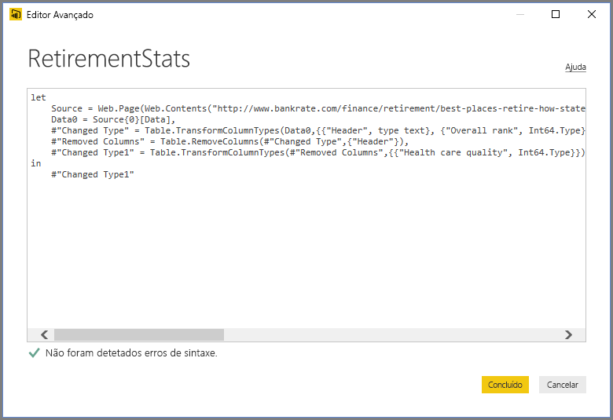

Pode editar diretamente o código na janela **Editor Avançado**. Para fechar a janela, selecione o botão **Concluído** ou **Cancelar**.  

## Guardar o seu trabalho
Quando a consulta está onde pretende, é possível fazer com que o Editor de Consulta aplique as alterações ao modelo de dados no Power BI Desktop e feche o Editor de Consulta. Para o fazer, selecione **Fechar e Aplicar** no menu **Ficheiro** do Editor de Consultas.  
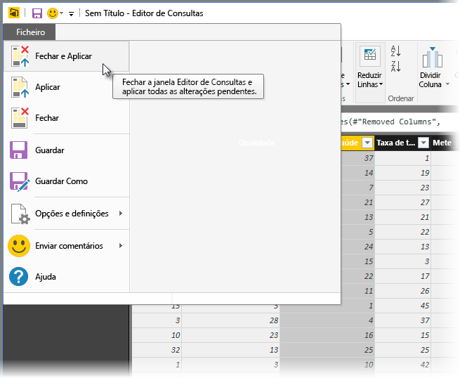

Conforme registado progresso, o Power BI Desktop fornece um diálogo para apresentar o estado.  
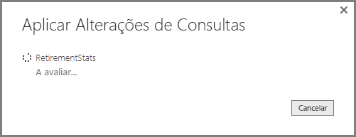

Uma vez que a consulta esteja onde pretende, ou se apenas desejar certificar-se de que o trabalho está guardado, o Power BI Desktop pode guardar o trabalho na forma de um ficheiro .pbix.

Para guardar o seu trabalho, selecione **Ficheiro \> Guardar** (ou **Ficheiro \> Guardar Como**), conforme mostrado na imagem seguinte.  

## Passos seguintes
Existem inúmeras coisas que pode fazer com o Power BI Desktop. Para obter mais informações sobre as suas capacidades, veja os seguintes recursos:

* [O que é o Power BI Desktop?](desktop-what-is-desktop.md)
* [Origens de Dados no Power BI Desktop](desktop-data-sources.md)
* [Ligar a Dados no Power BI Desktop](desktop-connect-to-data.md)
* [Moldar e Combinar Dados com o Power BI Desktop](desktop-shape-and-combine-data.md)
* [Tarefas Comuns de Consulta no Power BI Desktop](desktop-common-query-tasks.md)   

