# Utilizar Medidas rápidas para realizar facilmente cálculos comuns e poderosos
Pode utilizar **Medidas rápidas** para realizar rápida e facilmente cálculos comuns e poderosos. Uma **Medida rápida** executa um conjunto de comandos DAX em segundo plano (não tem de escrever o DAX, é feito automaticamente) com base nas informações que fornecer na caixa de diálogo e, em seguida, apresenta os resultados a utilizar no relatório. O melhor de tudo é que pode ver o DAX executado pela Medida rápida e impulsionar ou expandir os seus próprios conhecimentos de DAX.

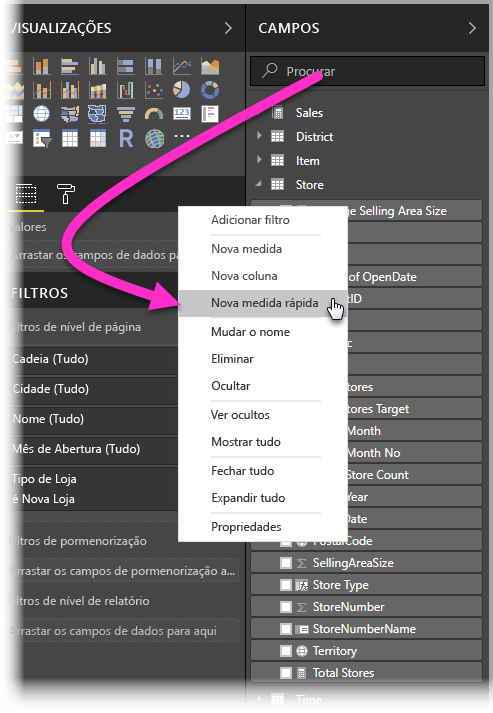

Pode criar **Medidas rápidas** ao clicar com o botão direito do rato num campo na secção **Campos** e, em seguida, ao selecionar **Medidas rápidas** no menu apresentado. Também pode clicar com o botão direito do rato em qualquer valor no painel **Valores** de um elemento visual existente (como o campo *Valores* num elemento visual *Gráfico de barras*). Existem muitas categorias de cálculos disponíveis e formas de modificar cada cálculo para se ajustarem às suas necessidades.

### As Medidas rápidas estão agora geralmente disponíveis

A partir do lançamento de fevereiro de 2018 do **Power BI Desktop**, as medidas rápidas estão disponíveis globalmente (já não estão em pré-visualização). Se estiver a utilizar uma versão anterior do **Power BI Desktop**, poderá experimentar a funcionalidade **Medidas rápidas** a partir do lançamento de **abril de 2017** do **Power BI Desktop** ao selecionar **Ficheiro > Opções e Definições > Opções > Funcionalidades de Pré-visualização** e, em seguida, selecionar a caixa de verificação junto a **Medidas rápidas**.

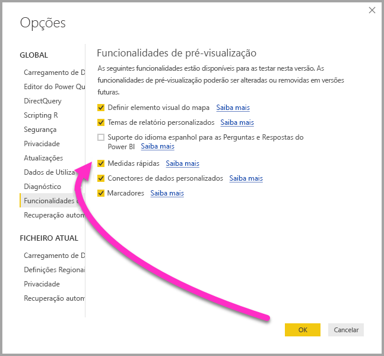

Terá de reiniciar o **Power BI Desktop** depois de efetuar a seleção.

## Utilizar Medidas rápidas
Para criar uma **Medida rápida**, clique com o botão direito do rato num campo (num qualquer) na secção **Campos** no **Power BI Desktop** e selecione **Medida rápida** no menu apresentado.

A modelação tem de estar disponível no conjunto de dados atualmente carregado para que as **Medidas rápidas** estejam disponíveis. Como tal, as ligações em direto (por exemplo, uma ligação a um conjunto de dados do serviço Power BI) não apresentarão o item de menu **Medidas rápidas** quando clicar com o botão direito do rato na lista **Campos**, à exceção das ligações em direto do SSAS. 

Quando utilizar ligações em direto do SQL Server Analysis Services (SSAS), estão disponíveis algumas **Medidas rápidas**. O **Power BI Desktop** mostra apenas a coleção de **Medidas rápidas** suportadas para a versão do SSAS para o qual a ligação foi estabelecida. Por isso, se estiver ligado a uma origem de dados dinâmicos do SSAS e não visualizar determinadas **Medidas rápidas** na lista, é porque a versão do SSAS à qual está ligado não suporta a medida DAX utilizada para implementar essa **Medida rápida**.

Quando selecionadas no menu de contexto, é apresentada a seguinte janela **Medidas rápidas**, a qual permite selecionar o cálculo que quer e os campos em relação aos quais pretende efetuar o cálculo.

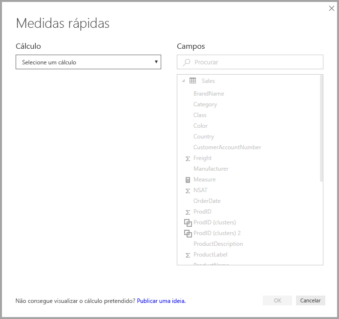

Quando seleciona o menu pendente, é apresentada uma longa lista de **Medidas rápidas** disponíveis.

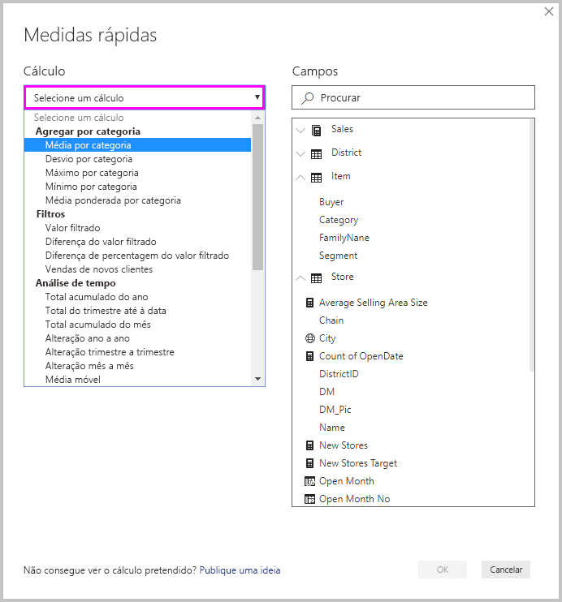

Existem cinco grupos distintos de tipos de cálculo de Medidas rápidas, cada um com uma coleção de cálculos. Esses grupos e cálculos são os seguintes:

* **Agregar por categoria**
  * Média por categoria
  * Desvio por categoria
  * Máximo por categoria
  * Mínimo por categoria
  * Média ponderada por categoria
* **Filtros**
  * Valor filtrado
  * Diferença do valor filtrado
  * Diferença de percentagem do valor filtrado
  * Vendas de novas categorias
* **Análise de tempo**
  * Total do ano até à data
  * Total do trimestre até à data
  * Total do mês até à data
  * Alteração ano a ano
  * Alteração trimestre a trimestre
  * Alteração ao longo dos meses
  * Média móvel
* **Totais**
  * Total corrente
  * Total da categoria (filtros aplicados)
  * Total da categoria (filtros não aplicados)
* **Operações matemáticas**
  * Adição
  * Subtração
  * Multiplicação
  * Divisão
  * Diferença de percentagem
  * Coeficiente de correlação
* **Texto**
  * Classificação em estrelas
  * Lista de valores concatenada

Antecipamos a adição a esses cálculos e queremos saber a sua opinião sobre que **Medidas rápidas** gostaria de ver e se tem ideias (incluindo fórmulas DAX subjacentes) relativamente às **Medidas rápidas** que queira submeter para consideração. Pode obter mais informações sobre isto no final deste artigo.

## Exemplo de Medidas rápidas
Vamos ver um exemplo destas **Medidas rápidas** em ação.

O elemento visual **Matriz** seguinte mostra uma tabela de vendas para vários produtos eletrónicos. É uma tabela básica que inclui o total de cada categoria.

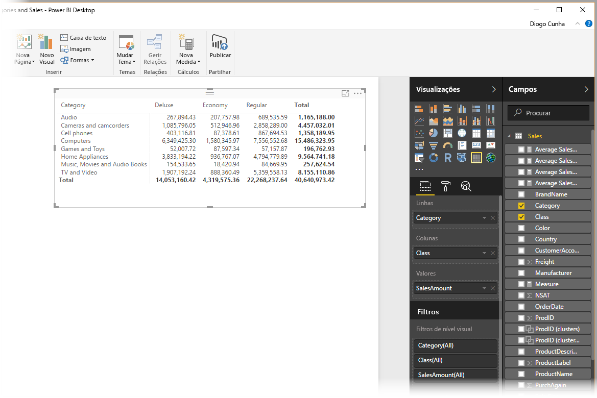

Quando clicamos com o botão direito do rato no campo **Valores** e selecionamos **Medidas rápidas**, podemos selecionar *Média por categoria* como *Cálculo*, *Soma de SalesAmount* como *Valor base* e especificar *SalesAmount* ao arrastar esse campo da caixa *Campos* no painel direito para a secção *Categoria* à esquerda.

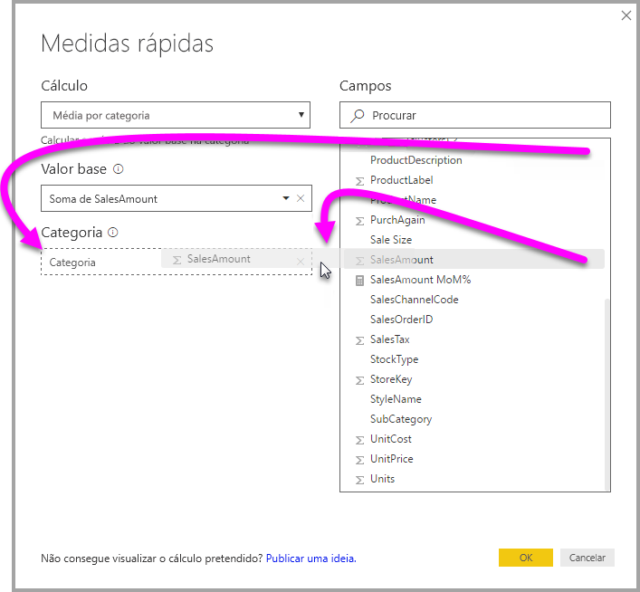

Quando selecionamos **OK**, vemos algo interessante a acontecer, conforme mostrado na imagem seguinte nesta lista:

1. O elemento visual **Matriz** tem agora uma nova coluna que mostra os cálculos (neste caso, *SalesAmount médio no SalesAmount*).
2. Foi criada uma nova **medida** disponível na secção **Campos** e que está realçada (o Power BI coloca uma caixa amarela à volta). Esta medida está disponível para qualquer outro elemento visual no relatório e não apenas para o elemento visual para que foi criada originalmente.
3. A fórmula DAX criada para a **Medida rápida** é apresentada na barra de Fórmulas.

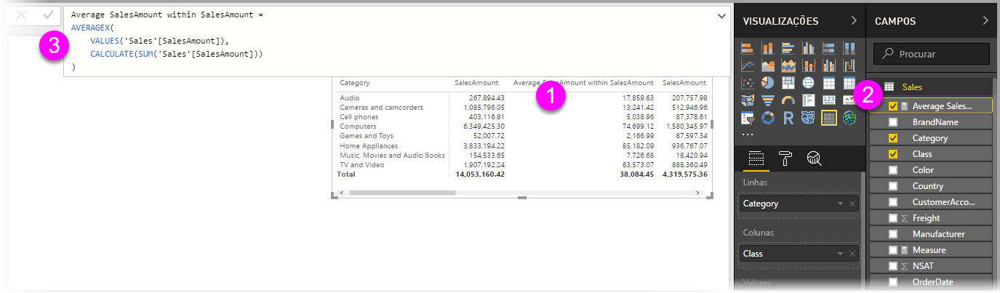

Para começar pelo primeiro item, repare que a **Medida rápida** foi aplicada ao elemento visual. Existe uma nova coluna e valor associado, baseados na **Medida rápida** que foi criada.

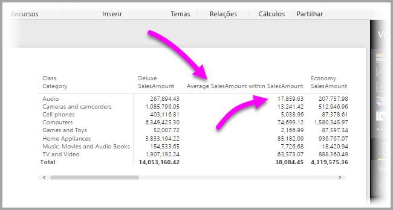

Segundo, a **Medida rápida** aparece na secção **Campos** do modelo de dados e pode ser utilizada tal como qualquer outro campo no modelo, para qualquer outro elemento visual. Na imagem seguinte, foi criado um elemento visual de **gráfico de barras** rápido ao utilizar o novo campo criado pela **Medida rápida**.

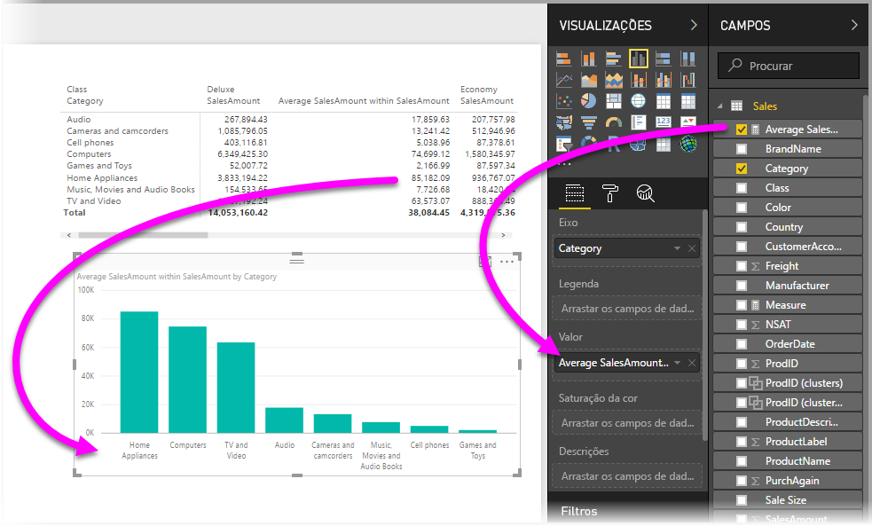

Vamos avançar para a secção seguinte para abordar o terceiro item, as fórmulas DAX.

## Saber mais sobre o DAX e como utilizar Medidas rápidas
Outra grande vantagem da funcionalidade **Medidas rápidas** é mostrar-lhe diretamente a fórmula DAX criada para implementar a medida. Na imagem seguinte, selecionámos a medida criada pela **Medida rápida** (agora na secção **Campos**, pelo que basta clicar na mesma). Ao fazê-lo, é apresentada a **Barra de fórmulas** com a fórmula DAX criada pelo Power BI para implementar a medida.

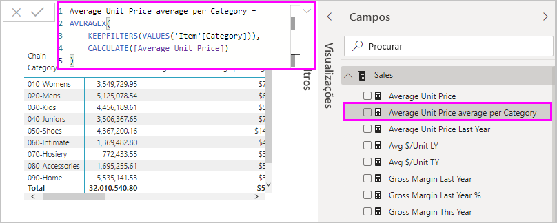

Isto é ótimo por si só, uma vez que lhe mostra a fórmula baseada na medida. Mas mais importante que tudo é, provavelmente, deixar utilizar **Medidas rápidas** para ver como devem ser criadas as fórmulas DAX subjacentes.

Imagine que precisa de fazer um cálculo ao longo dos anos, mas não tem bem a certeza de como estruturar a fórmula DAX (ou não tem ideia nenhuma por onde começar!). Em vez de bater com a cabeça na secretária, pode criar uma **Medida rápida** através do cálculo **Alteração ao longo dos anos** e ver o que acontece. Como tal, crie a **Medida rápida** e veja como aparece no elemento visual, veja como funciona a fórmula DAX e, em seguida, faça as alterações diretamente no DAX ou crie outra medida, até os cálculos cumprirem os seus requisitos ou expectativas.

É como ter um professor rápido que responde de imediato às suas perguntas em alguns cliques. Pode sempre eliminar as medidas do modelo se não gostar delas, basta clicar com o botão direito do rato na medida e selecionar **Eliminar**.

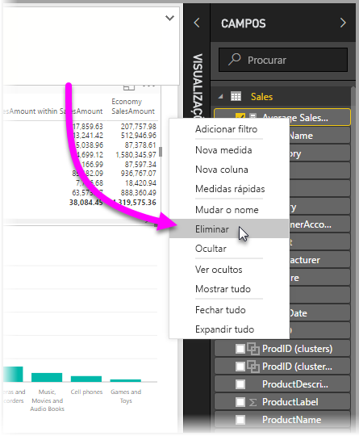

Quando tiver a medida ideal, pode mudar-lhe o nome através do mesmo menu de contexto.

## Limitações e considerações
Existem algumas limitações e considerações a ter em conta.

* As **Medidas rápidas** apenas estão disponíveis se puder modificar o modelo, o que não é o caso quando está a utilizar o DirectQuery ou a maioria das ligações em direto (as ligações em direto do SSAS são suportadas, conforme explicado anteriormente).
* A medida adicionada à secção **Campos** pode ser utilizada em qualquer elemento visual no relatório.
* Pode sempre ver o DAX associado a uma **Medida rápida** ao selecionar a medida criada na secção **Campos** e ao observar a fórmula na **Barra de fórmulas**.

> [!WARNING]
> Atualmente, as Medidas rápidas *apenas* geram instruções DAX com vírgulas como separadores de argumentos. Se a sua versão do **Power BI Desktop** estiver localizada num idioma que utilize a vírgula como separador decimal, as medidas rápidas não funcionarão corretamente.
> 
> 

### Análise de tempo e Medidas rápidas
A partir da atualização de outubro de 2017 do **Power BI Desktop**, pode utilizar as suas próprias tabelas de datas personalizadas com **Medidas rápidas** de análise de tempo. Se o seu modelo de dados tiver uma tabela de datas personalizada, pode utilizar a coluna de data principal na tabela para medidas rápidas de análise de tempo. *Tem* de assegurar que, quando o modelo foi criado, a coluna de data principal na tabela foi marcada como Tabela de datas, conforme descrito [neste artigo](https://docs.microsoft.com/sql/analysis-services/tabular-models/specify-mark-as-date-table-for-use-with-time-intelligence-ssas-tabular).

### Informações adicionais e exemplos
Fornecemos exemplos e orientação para cada um dos cálculos de **Medidas rápidas**, por isso, volte a consultar esta secção em breve para obter atualizações sobre o artigo em foco.

Tem uma ideia para uma **Medida rápida** que ainda não tenha sido dada? Ótimo! Consulte [esta página](https://go.microsoft.com/fwlink/?linkid=842906) e envie as suas ideias (e a fórmula DAX) da **Medida rápida** que gostaria de ver no **Power BI Desktop** e analisaremos a adição da mesma à lista de **Medidas rápidas** fornecida numa futura versão.

