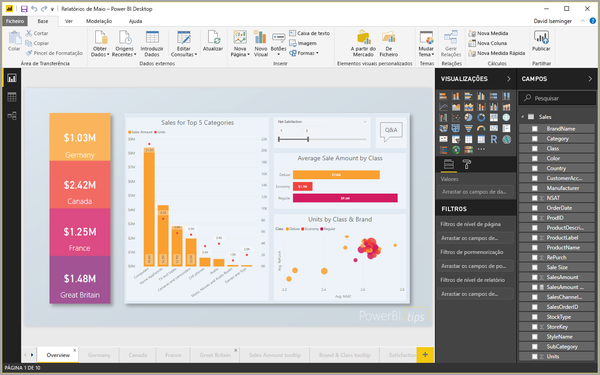

# Início Rápido: ligar a dados no Power BI Desktop

Neste manual de início rápido, liga-se a dados com o **Power BI Desktop**, que é o primeiro passo na criação de modelos de dados e na criação de relatórios.

Se não estiver inscrito no Power BI, [inscreva-se para uma avaliação gratuita](https://app.powerbi.com/signupredirect?pbi_source=web) antes de começar.

## Pré-requisitos

Para concluir os passos neste artigo, precisa do seguinte:
* Transfira e instale o **Power BI Desktop**, que é uma aplicação gratuita que é executada num computador local. Pode [transferir **o Power BI Desktop**](https://powerbi.microsoft.com/desktop) diretamente ou pode obtê-lo a partir [da **Microsoft Store**](http://aka.ms/pbidesktopstore).
* [Transfira este livro do Excel de exemplo](http://go.microsoft.com/fwlink/?LinkID=521962)e crie uma pasta denominada *C:\PBID-qs*, onde pode armazenar o ficheiro do Excel. Os passos subsequentes neste manual de início rápido partem do princípio de que esta é a localização do ficheiro para o livro do Excel transferido.

## Iniciar o Power BI Desktop

Depois de instalar o **Power BI Desktop**, inicie a aplicação para que seja executada no computador local. É-lhe apresentada uma tela em branco, que é onde cria elementos visuais e relatórios de dados aos quais se liga. 

## Ligar-se a dados

O **Power BI Desktop** permite ligar-se a vários tipos diferentes de dados. Pode ligar-se a origens de dados básicas, tais como um ficheiro do Microsoft Excel, e pode ligar-se a serviços online que contêm todos os tipos de dados, como Salesforce, Microsoft Dynamics, Azure Blob Storage e muitos mais. 

Para se ligar a dados, no friso **Base**, selecione **Obter Dados**.

A janela **Obter Dados** é apresentada, onde pode optar entre as várias origens de dados diferentes às quais o **Power BI Desktop** pode ligar-se. Neste manual de início rápido, utilizamos o livro do Excel que transferiu, descrito na secção *Pré-requisitos* no princípio deste artigo. 

Uma vez que se trata de um ficheiro do Excel, seleciona-se **Excel** na janela **Obter Dados** e, em seguida, seleciona-se o botão **Ligar**.

É-nos pedido que se forneça a localização do ficheiro do Excel ao qual nos queremos ligar. O ficheiro transferido denomina-se *Exemplo Financeiro*, pelo que devemos selecionar esse ficheiro e, em seguida, selecionar **Abrir**.

O **Power BI Desktop** carrega, em seguida, o livro, lê o conteúdo e mostra-lhe os dados disponíveis no ficheiro com a janela **Navegador**, onde pode escolher os dados que pretende carregar para o Power BI Desktop. Deve selecionar as tabelas ao assinalar as caixas de verificação ao lado de cada tabela que pretende importar. Neste caso, vamos importar ambas as tabelas disponíveis.

Assim que tiver selecionado as opções, selecione **Carregar** para importar os dados para o Power BI Desktop.

## Ver dados no painel Campos

Assim que tiver carregado as tabelas, o painel **Campos** mostra-lhe os dados. Pode expandir cada tabela ao selecionar o triângulo junto do nome. Na imagem seguinte, a tabela *finanças* é expandida e mostra cada um dos campos. 

E já está! Ligou-se aos dados no **Power BI Desktop**, carregou esses dados e, agora, pode ver todos os campos disponíveis nessas tabelas.

## Próximos passos
Existem vários os tipos de tarefas que pode fazer com o **Power BI Desktop** quando se tenha ligado aos dados, tais como criar elementos visuais e relatórios. Observe o recurso seguinte para seguir no caminho certo:

* [Guia de Introdução do Power BI Desktop](desktop-getting-started.md)

