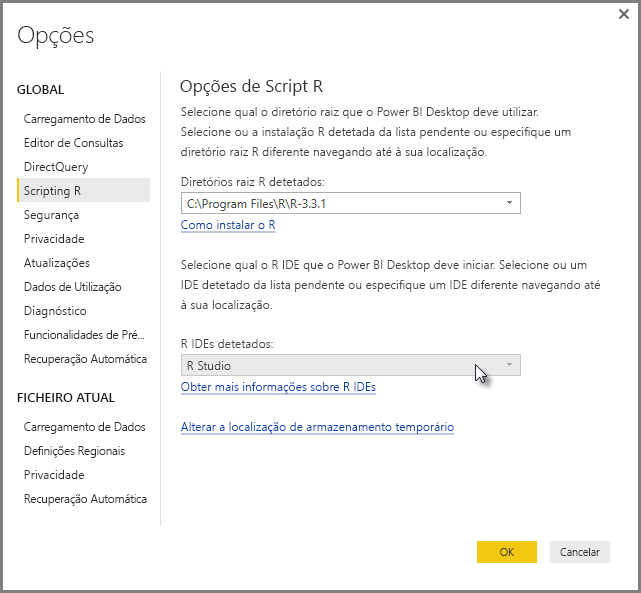
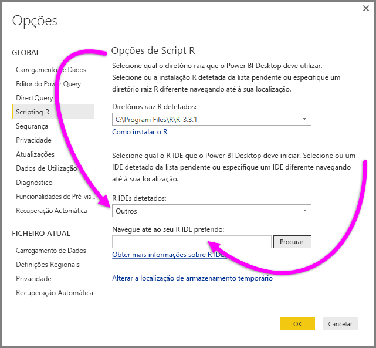
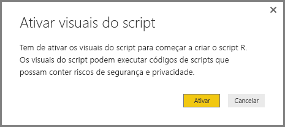
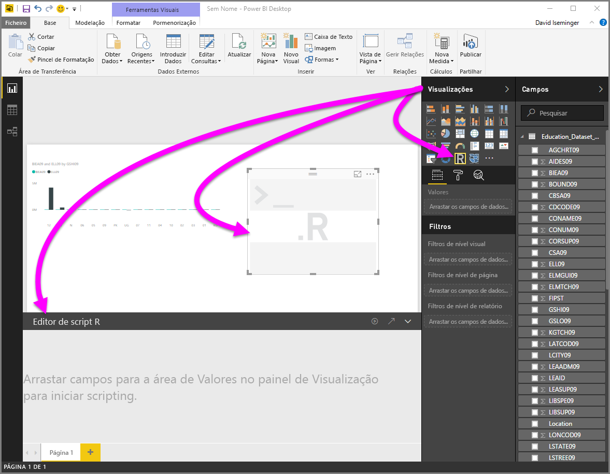
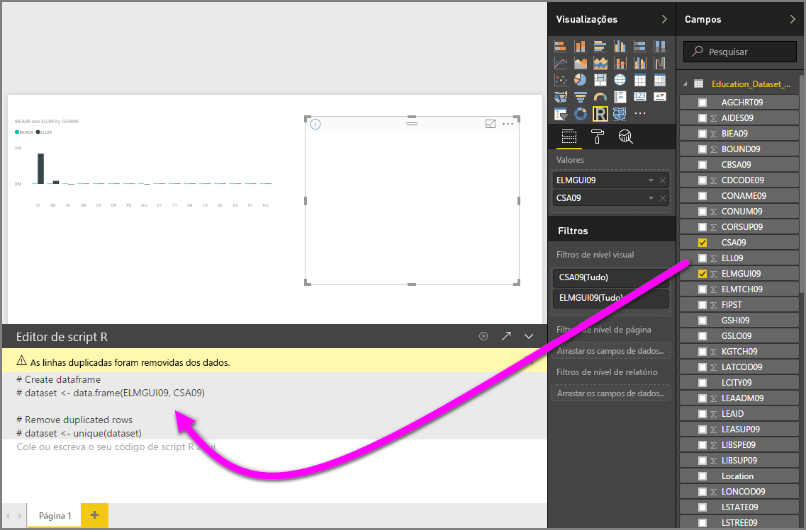
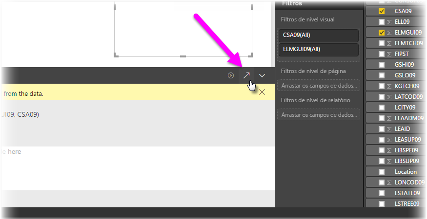
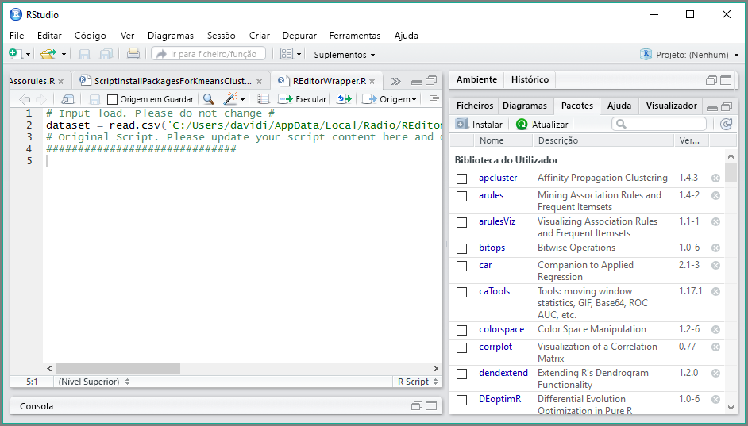

# Utilizar um IDE R externo com o Power BI
Com o **Power BI Desktop**, pode utilizar o IDE R externo (Integrated Development Environment, Ambiente de Desenvolvimento Integrado) para criar e refinar os scripts R e utilizar esses scripts no Power BI.

## Ativar um IDE R externo
Anteriormente, era necessário utilizar o editor de scripts R no **Power BI Desktop** para criar e executar scripts R. Com esta versão, pode iniciar o IDE R externo a partir do **Power BI Desktop** e os dados são automaticamente importados e apresentados no IDE R. A partir daí, pode modificar o script nesse IDE R externo e colá-lo novamente no **Power BI Desktop** para criar elementos visuais e relatórios do Power BI.

A partir da versão de setembro de 2016 do **Power BI Desktop** (versão 2.39.4526.362), pode especificar que IDE R quer utilizar e iniciá-lo automaticamente a partir do **Power BI Desktop**.

### Requisitos
Para utilizar esta funcionalidade, tem de instalar um **IDE R** no seu computador local. O **Power BI Desktop** não inclui, implementa ou instala o mecanismo do R, pelo que é necessário instalar separadamente o **R** no seu computador local. Pode escolher o IDE R a utilizar com as seguintes opções:

* Pode instalar o seu IDE R favorito, muitos dos quais estão disponíveis gratuitamente, tal como o [Revolution Open (página de transferência)](https://mran.revolutionanalytics.com/download/) e o [CRAN Repository](https://cran.r-project.org/bin/windows/base/).
* O **Power BI Desktop** também suporta os editores [R Studio](https://www.rstudio.com/) e **Visual Studio 2015** com o [*R Tools for Visual Studio* ](https://beta.visualstudio.com/vs/rtvs/).
* Também pode instalar um IDE R diferente e fazer com que o **Power BI Desktop** inicie esse **IDE R** ao efetuar um dos seguintes procedimentos:
  
  * Pode associar ficheiros **.R** ao IDE externo que quer que o **Power BI Desktop** inicie.
  * Pode especificar o .exe que o **Power BI Desktop** deve iniciar ao selecionar *Outros* na secção **Opções de Script R** na caixa de diálogo **Opções**. Pode apresentar a caixa de diálogo **Ppções** ao aceder a **Ficheiro > Opções e definições > Opções**.
    
    

Se tiver vários IDEs R instalados, pode especificar o que será iniciado ao selecioná-lo no menu pendente *IDEs R Detetados* na caixa de diálogo **Opções**.

Por predefinição, o **Power BI Desktop** iniciará o **R Studio** como IDE R externo se estiver instalado no computador local; se o **R Studio** não estiver instalado e tiver o **Visual Studio 2015** com o **R Tools for Visual Studio**, será esse o iniciado. Se nenhum desses IDEs R estiver instalado, é iniciada a aplicação associada aos ficheiros **.R**.

Se não existir nenhuma associação de ficheiros **.R**, é possível especificar um caminho para um IDE personalizado na secção *Navegue até ao seu IDE R preferido* da caixa de diálogo **Opções**. Também pode iniciar um IDE R diferente ao selecionar o ícone de engrenagem **Definições** junto ao ícone de seta **Iniciar IDE R**, no **Power BI Desktop**.

## Iniciar um IDE R a partir do Power BI Desktop
Para iniciar um IDE R a partir do **Power BI Desktop**, siga os passos seguintes:

1. Carregue os dados para o **Power BI Desktop**.
2. Selecione alguns campos no painel **Campos** com que quer trabalhar. Se ainda não tiver ativado os elementos visuais do script, ser-lhe-á pedido que o faça.
   
   
3. Quando os elementos visuais do script estiverem ativados, pode selecionar um elemento visual R no painel **Visualizações**, o qual cria um elemento visual R em branco que está pronto para apresentar os resultados do script. Também é apresentado o painel **Editor de scripts R**.
   
   
4. Agora, pode selecionar os campos que quer utilizar no script R. Quando selecionar um campo, o campo **Editor de scripts R** cria automaticamente o código de script com base no campo ou campos que selecionar. Pode criar (ou colar) o script R diretamente no painel **Editor de script R** ou pode deixá-lo em branco.
   
   
   
   > [!NOTE]
   > O tipo de agregação predefinido para elementos visuais do R é *não resumir*.
   > 
   > 
5. Agora, pode iniciar o IDE R diretamente a partir do **Power BI Desktop**. Selecione o botão **Iniciar IDE R** no lado direito da barra de título do **Editor de scripts R**, conforme mostrado abaixo.
   
   
6. O IDE R especificado é iniciado pelo Power BI Desktop, conforme mostrado na imagem seguinte (nesta imagem, o **RStudio** é o IDE R predefinido).
   
   
   
   > [!NOTE]
   > O **Power BI Desktop** adiciona as primeiras três linhas do script para poder importar os dados a partir do **Power BI Desktop**, depois de executar o script.
   > 
   > 
7. Qualquer script que tenha criado no painel **Editor de scripts R** do **Power BI Desktop** aparece a partir da linha 4 no IDE R. Neste momento, pode criar o script R no IDE R. Assim que o script R estiver concluído no IDE R, tem de copiar e colá-lo novamente no painel **Editor de scripts R** no **Power BI Desktop**, *excluindo* as primeiras três linhas do script geradas automaticamente pelo **Power BI Desktop**. Não copie as primeiras três linhas de script novamente para o **Power BI Desktop**; estas linhas só foram utilizadas para importar os dados para o IDE R a partir do **Power BI Desktop**.

### Limitações conhecidas
Iniciar um IDE R diretamente a partir do Power BI Desktop tem algumas limitações:

* A exportação automática do script do IDE R para o **Power BI Desktop** não é suportada.
* O editor **R Client** (RGui.exe) não é suportado, porque o próprio editor não suporta a abertura de ficheiros.

## Passos seguintes
Veja as seguintes informações adicionais sobre a linguagem R no Power BI.

* [Executar Scripts R no Power BI Desktop](desktop-r-scripts.md)
* [Criar elementos visuais do Power BI através da linguagem R](desktop-r-visuals.md)

