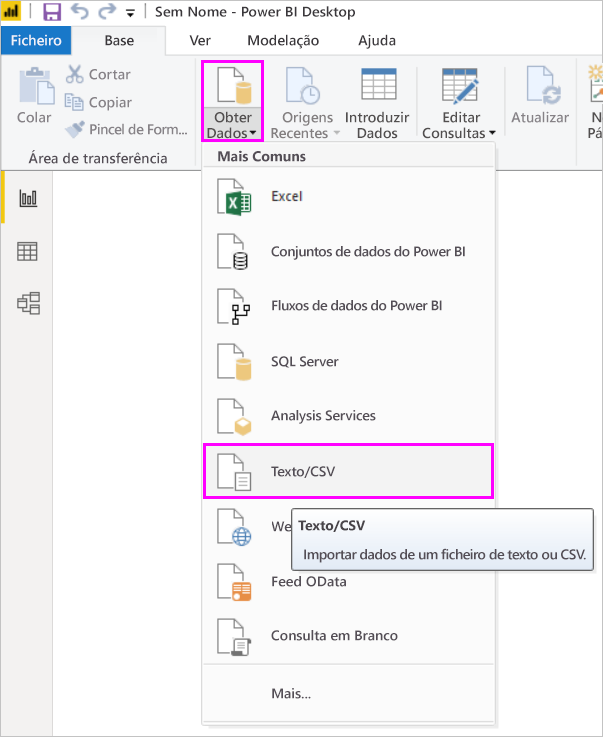
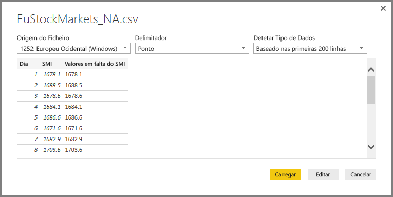
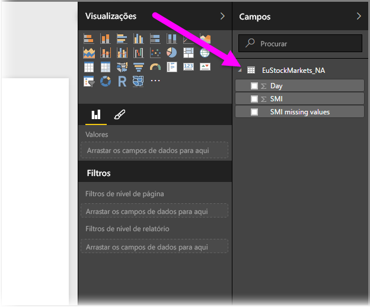
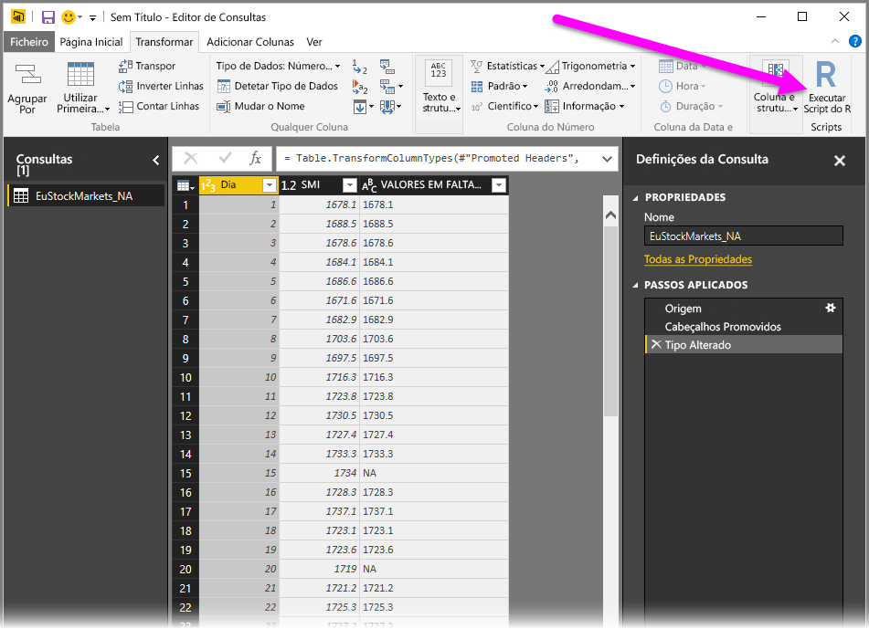
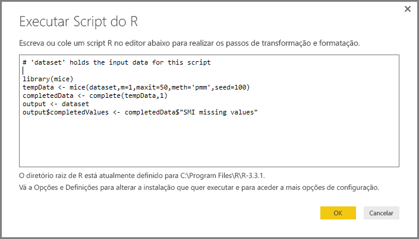
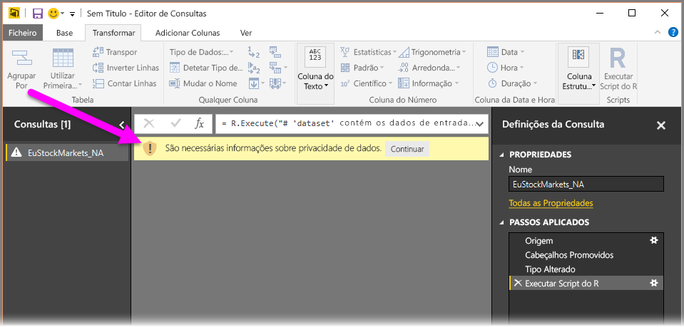
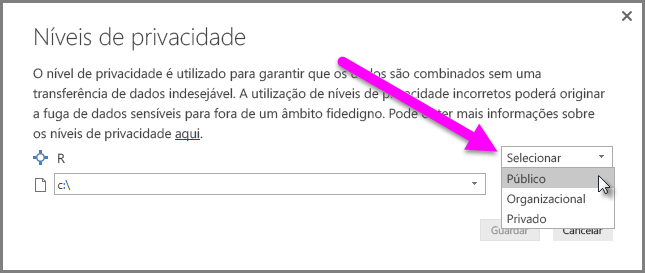
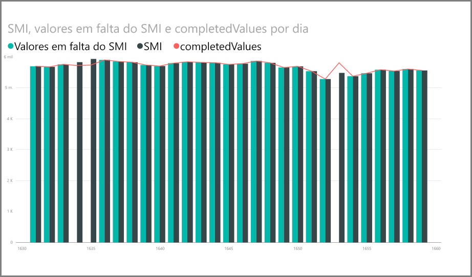
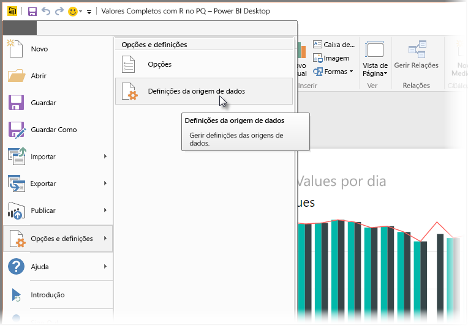
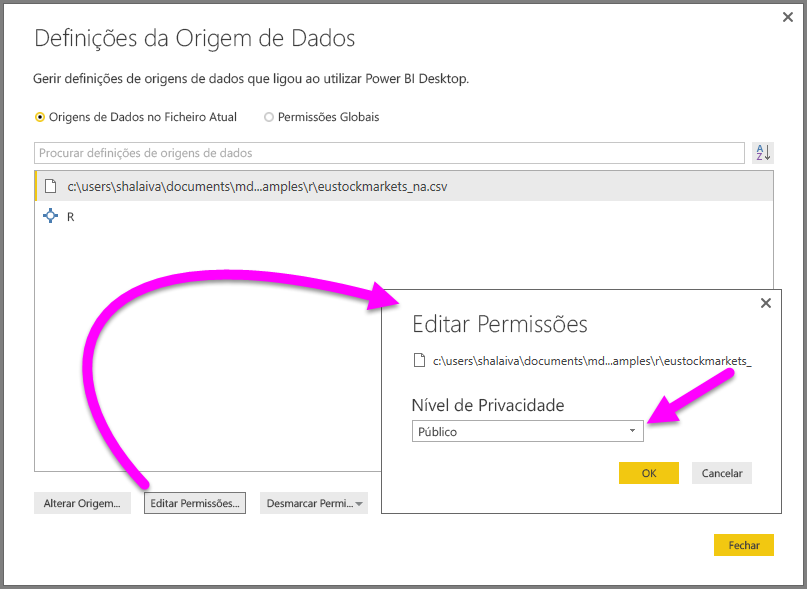

# Utilizar o R no Editor de Consultas
Pode utilizar o **R**, uma linguagem de programação amplamente utilizada por estatísticos, cientistas de dados e analistas de dados no **Editor de Consultas** do Power BI Desktop. Esta integração do R no **Editor de Consultas** permite-lhe efetuar a limpeza dos dados e efetuar a formatação e análise de dados avançadas em conjuntos de dados, incluindo a conclusão de dados em falta, predições e clustering, apenas para mencionar alguns exemplos. O **R** é uma poderosa linguagem e pode ser utilizada no **Editor de Consultas** para preparar o seu modelo de dados e criar relatórios.

## Instalar o R
Para utilizar o **R** no **Editor de Consultas** do Power BI Desktop, tem de instalar o **R** no seu computador local. Pode transferir e instalar o **R** gratuitamente a partir de várias localizações, incluindo a [página de transferência do Revolution Open](https://mran.revolutionanalytics.com/download/) e o [Repositório CRAN](https://cran.r-project.org/bin/windows/base/).

## Utilizar o R no Editor de Consultas
Para mostrar como utilizar o **R** no **Editor de Consultas**, veja este exemplo de um conjunto de dados da bolsa de valores, com base num ficheiro .CSV que pode [transferir a partir daqui](http://download.microsoft.com/download/F/8/A/F8AA9DC9-8545-4AAE-9305-27AD1D01DC03/EuStockMarkets_NA.csv) e acompanhar. Os passos para este exemplo são os seguintes:

1. Primeiro, carregue os dados para o **Power BI Desktop**. Neste exemplo, carregue o ficheiro *EuStockMarkets_NA.csv* e selecione **Obter Dados > CSV** a partir do friso **Base** no **Power BI Desktop**.
   
   
2. Selecione o ficheiro e a opção **Abrir**. O CSV é apresentado na caixa de diálogo **Ficheiro CSV**.
   
   
3. Após o carregamento dos dados, estes são apresentados no painel **Campos** no Power BI Desktop.
   
   
4. Abra o **Editor de Consultas** ao selecionar **Editar Consultas** no separador **Base** no **Power BI Desktop**.
   
   
5. No separador **Transformar**, selecione **Executar Script R** e é apresentado o editor **Executar Script R** (mostrado no passo seguinte). Tenha em atenção que as linhas 15 e 20 têm dados em falta, tal como outras linhas que não consegue ver na imagem seguinte. Os passos abaixo mostram como o R pode (e irá) preencher as linhas por si.
   
   
6. Neste exemplo, introduza o seguinte código de script:
   
       library(mice)
       tempData <- mice(dataset,m=1,maxit=50,meth='pmm',seed=100)
       completedData <- complete(tempData,1)
       output <- dataset
       output$completedValues <- completedData$"SMI missing values"
   
   > [!NOTE]
   > Terá de ter a biblioteca *mice* instalada no seu ambiente de R para o código de script anterior funcionar corretamente. Para instalar a biblioteca mice, execute o seguinte comando na instalação do R: |      > install.packages('mice')
   > 
   > 
   
   Quando colocado na caixa de diálogo **Executar Script R**, o código assemelha-se ao seguinte:
   
   
7. Após selecionar **OK**, o **Editor de Consultas** apresenta um aviso sobre a privacidade dos dados.
   
   
8. Para os scripts R funcionarem corretamente no serviço Power BI, todas as origens de dados têm de estar definidas como *públicas*. Para obter mais informações sobre as definições de privacidade e as respetivas implicações, veja [Níveis de Privacidade](desktop-privacy-levels.md).
   
   
   
   Repare na nova coluna no painel **Campos** com o nome *completedValues*. Tenha em atenção que existem alguns elementos de dados em falta, tal como nas linhas 15 e 18. Veja como o R processa isto na secção seguinte.
   

Com apenas cinco linhas de script R, o **Editor de Consultas** preencheu os valores em falta com um modelo preditivo.

## Criar elementos visuais a partir de dados de scripts R
Agora, podemos criar um elemento visual para ver como o código de script R utilizou a biblioteca *mice* para preencher os valores em falta, conforme mostrado na imagem seguinte:

Depois desse elemento visual estar preenchido e quaisquer outros elementos visuais que possa querer criar através do **Power BI Desktop**, pode guardar o ficheiro do **Power BI Desktop** (guardado como um ficheiro .pbix) e utilizar o modelo de dados, incluindo os scripts R que fazem parte do mesmo, no serviço Power BI.

> [!NOTE]
> Quer ver um ficheiro .pbix preenchido com estes passos? Está com sorte; pode transferir o ficheiro do **Power BI Desktop** preenchido utilizado nestes exemplos [aqui](http://download.microsoft.com/download/F/8/A/F8AA9DC9-8545-4AAE-9305-27AD1D01DC03/Complete Values with R in PQ.pbix).
> 
> 

Depois de carregar o ficheiro .pbix para o serviço Power BI, são necessários mais alguns passos para ativar a atualização dos dados e dos elementos visuais no serviço (os dados precisam de aceder ao R para os elementos visuais serem atualizados). Os passos adicionais são os seguintes:

* **Ativar a atualização agendada do conjunto de dados** – para ativar a atualização agendada do livro que contém o conjunto de dados com scripts R, veja [Configurar a atualização agendada](refresh-scheduled-refresh.md), que também inclui informações sobre o **Gateway Pessoal**.
* **Instalar o Gateway pessoal** -– precisa de um **Gateway Pessoal** instalado no computador onde está localizado o ficheiro e onde está instalado o R; o serviço Power BI tem de aceder a esse livro e compor novamente todos os elementos visuais atualizados. Pode obter mais informações sobre como [instalar e configurar o Gateway Pessoal](personal-gateway.md).

## Limitações
Existem algumas limitações a consultas que incluem scripts R criados no **Editor de Consultas**:

* Todas as definições da origem de dados de R têm de ser *públicas* e todos os outros passos numa consulta criada no **Editor de Consultas** também têm de ser públicos. Para aceder às definições da origem de dados, no **Power BI Desktop** selecione **Ficheiro > Opções e definições > Definições da origem de dados**.
  
  
  
  Na caixa de diálogo **Definições da Origem de Dados**, selecione as origens de dados e, em seguida, selecione **Editar Permissões...** e certifique-se de que o **Nível de Privacidade** está definido como *Público*.
  
      
* Para ativar a atualização agendada dos elementos visuais de R ou do conjunto de dados, tem de ativar a **Atualização agendada** e ter um **Gateway Pessoal** instalado no computador que aloja o livro e a instalação do R. Para obter mais informações sobre ambos, consulte a secção anterior neste artigo, que fornece ligações para saber mais sobre cada um deles.

Existem todos os tipos de coisas que pode fazer com o R e consultas personalizadas, por isso, explore e formate os dados apenas da forma como quer que apareçam.

